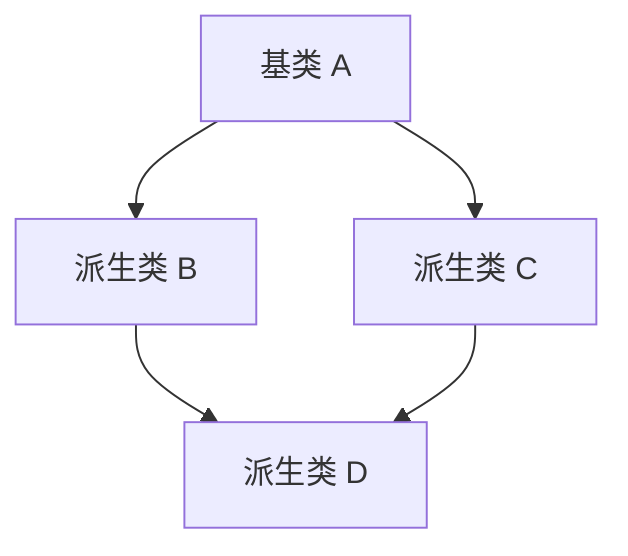

# C++ 继承中的构造函数

在C++面向对象编程中，继承是一个强大的特性，它允许我们创建基于现有类的新类。当我们使用继承时，构造函数的行为有其特殊规则，理解这些规则对于正确设计和实现继承层次结构至关重要。

## 构造函数的调用顺序

在继承关系中，当创建一个派生类对象时，构造函数的调用遵循一个固定的顺序：

1. 首先调用基类的构造函数
2. 然后调用成员对象的构造函数（按声明顺序）
3. 最后执行派生类构造函数的函数体

这个顺序是不可变的，确保在构建对象时从"内到外"地初始化所有内容。

```cpp
#include <iostream>
using namespace std;

class Base {
public:
    Base() {
        cout << "Base构造函数被调用" << endl;
    }
};

class Derived : public Base {
public:
    Derived() {
        cout << "Derived构造函数被调用" << endl;
    }
};

int main() {
    Derived d;
    return 0;
}
```

**输出：**
```
Base构造函数被调用
Derived构造函数被调用
```

## 基类构造函数的参数传递

如果基类的构造函数需要参数，派生类必须通过初始化列表将这些参数传递给基类构造函数。

```cpp
#include <iostream>
#include <string>
using namespace std;

class Person {
protected:
    string name;
    int age;
public:
    Person(const string& n, int a) : name(n), age(a) {
        cout << "Person构造函数被调用" << endl;
    }
    
    void display() const {
        cout << "姓名: " << name << ", 年龄: " << age << endl;
    }
};

class Student : public Person {
private:
    string studentId;
public:
    // 通过初始化列表将参数传递给基类构造函数
    Student(const string& n, int a, const string& id) 
        : Person(n, a), studentId(id) {
        cout << "Student构造函数被调用" << endl;
    }
    
    void display() const {
        Person::display();  // 调用基类的display方法
        cout << "学号: " << studentId << endl;
    }
};

int main() {
    Student s("张三", 20, "2023001");
    s.display();
    return 0;
}
```

**输出：**
```
Person构造函数被调用
Student构造函数被调用
姓名: 张三, 年龄: 20
学号: 2023001
```

:::note
如果不在派生类的初始化列表中显式调用基类构造函数，编译器会尝试调用基类的默认构造函数。如果基类没有默认构造函数，则会导致编译错误。
:::

## 多重继承中的构造函数调用顺序

在多重继承中，基类构造函数的调用顺序由派生类继承基类的顺序决定，而不是由派生类构造函数初始化列表中基类构造函数的顺序决定。

```cpp
#include <iostream>
using namespace std;

class Base1 {
public:
    Base1() {
        cout << "Base1构造函数被调用" << endl;
    }
};

class Base2 {
public:
    Base2() {
        cout << "Base2构造函数被调用" << endl;
    }
};

// 继承顺序是Base1, Base2
class Derived : public Base1, public Base2 {
public:
    Derived() {
        cout << "Derived构造函数被调用" << endl;
    }
};

int main() {
    Derived d;
    return 0;
}
```

**输出：**
```
Base1构造函数被调用
Base2构造函数被调用
Derived构造函数被调用
```

## 虚继承中的构造函数

在虚继承中，虚基类的构造函数总是在非虚基类之前被调用，无论它们在继承列表中的顺序如何。这确保了共享的基类只被初始化一次。



```cpp
#include <iostream>
using namespace std;

class A {
public:
    A() {
        cout << "A构造函数被调用" << endl;
    }
};

class B : virtual public A {  // 虚继承
public:
    B() {
        cout << "B构造函数被调用" << endl;
    }
};

class C : virtual public A {  // 虚继承
public:
    C() {
        cout << "C构造函数被调用" << endl;
    }
};

class D : public B, public C {
public:
    D() {
        cout << "D构造函数被调用" << endl;
    }
};

int main() {
    D d;  // 创建D类对象
    return 0;
}
```

**输出：**
```
A构造函数被调用  // A只被调用一次
B构造函数被调用
C构造函数被调用
D构造函数被调用
```

## 派生类中的显式调用构造函数

在C++11及以后的版本中，可以使用`using`声明来继承基类的构造函数。

```cpp
#include <iostream>
#include <string>
using namespace std;

class Base {
protected:
    int value;
public:
    Base() : value(0) {}
    Base(int v) : value(v) {
        cout << "Base(int)构造函数被调用，value = " << value << endl;
    }
};

class Derived : public Base {
public:
    // 继承Base类的所有构造函数
    using Base::Base;
    
    // 添加自己的构造函数
    Derived(int v, int extra) : Base(v) {
        cout << "Derived(int, int)构造函数被调用" << endl;
    }
    
    void display() {
        cout << "value = " << value << endl;
    }
};

int main() {
    Derived d1;          // 调用继承的默认构造函数
    Derived d2(42);      // 调用继承的Base(int)构造函数
    Derived d3(10, 20);  // 调用Derived的自定义构造函数
    
    d2.display();
    
    return 0;
}
```

**输出：**
```
Base(int)构造函数被调用，value = 42
Base(int)构造函数被调用，value = 10
Derived(int, int)构造函数被调用
value = 42
```

:::tip
使用`using Base::Base`继承构造函数可以减少样板代码，但要注意，这样继承的构造函数不会初始化派生类的成员变量。
:::

## 实际应用案例

让我们通过一个图形编辑器的例子来展示继承中构造函数的实际应用：

```cpp
#include <iostream>
#include <string>
#include <vector>
using namespace std;

// 基类：图形
class Shape {
protected:
    int x, y;  // 位置坐标
    string color;
public:
    Shape(int posX, int posY, const string& c) 
        : x(posX), y(posY), color(c) {
        cout << "创建了一个形状" << endl;
    }
    
    virtual void draw() const {
        cout << "绘制一个" << color << "形状，位置:(" << x << "," << y << ")" << endl;
    }
    
    virtual ~Shape() {
        cout << "销毁了一个形状" << endl;
    }
};

// 派生类：圆形
class Circle : public Shape {
private:
    int radius;
public:
    Circle(int posX, int posY, const string& c, int r) 
        : Shape(posX, posY, c), radius(r) {
        cout << "创建了一个圆形" << endl;
    }
    
    void draw() const override {
        cout << "绘制一个" << color << "圆形，位置:(" << x << "," << y 
             << ")，半径:" << radius << endl;
    }
    
    ~Circle() {
        cout << "销毁了一个圆形" << endl;
    }
};

// 派生类：矩形
class Rectangle : public Shape {
private:
    int width, height;
public:
    Rectangle(int posX, int posY, const string& c, int w, int h) 
        : Shape(posX, posY, c), width(w), height(h) {
        cout << "创建了一个矩形" << endl;
    }
    
    void draw() const override {
        cout << "绘制一个" << color << "矩形，位置:(" << x << "," << y 
             << ")，宽:" << width << "，高:" << height << endl;
    }
    
    ~Rectangle() {
        cout << "销毁了一个矩形" << endl;
    }
};

// 图形编辑器类
class GraphicEditor {
private:
    vector<Shape*> shapes;
public:
    void addShape(Shape* shape) {
        shapes.push_back(shape);
    }
    
    void drawAll() const {
        cout << "\n--- 绘制所有图形 ---" << endl;
        for (const auto& shape : shapes) {
            shape->draw();
        }
        cout << "--------------------\n" << endl;
    }
    
    ~GraphicEditor() {
        for (auto& shape : shapes) {
            delete shape;
        }
        shapes.clear();
    }
};

int main() {
    GraphicEditor editor;
    
    editor.addShape(new Circle(100, 100, "红色", 50));
    editor.addShape(new Rectangle(200, 200, "蓝色", 80, 40));
    
    editor.drawAll();
    
    return 0;
}
```

**输出：**
```
创建了一个形状
创建了一个圆形
创建了一个形状
创建了一个矩形

--- 绘制所有图形 ---
绘制一个红色圆形，位置:(100,100)，半径:50
绘制一个蓝色矩形，位置:(200,200)，宽:80，高:40
--------------------

销毁了一个矩形
销毁了一个形状
销毁了一个圆形
销毁了一个形状
```

在这个例子中，我们看到了一个典型的多态应用场景。每个形状对象创建时，都会先调用`Shape`基类的构造函数，再调用各自的构造函数，确保了对象的正确初始化。

## 总结

在C++继承中，构造函数遵循以下关键原则：

1. **调用顺序**：基类构造函数 → 成员对象构造函数 → 派生类构造函数
2. **参数传递**：派生类必须通过初始化列表将参数传递给基类构造函数
3. **多重继承**：基类构造函数的调用顺序由继承声明顺序决定
4. **虚继承**：虚基类构造函数先于非虚基类构造函数被调用
5. **继承构造函数**：使用`using Base::Base`可以继承基类的构造函数

理解这些规则对编写可靠、健壮的C++代码至关重要，特别是在设计复杂的类层次结构时。

## 练习

1. 创建一个`Vehicle`基类和`Car`、`Motorcycle`派生类，实现构造函数，并观察调用顺序。
2. 设计一个虚继承的层次结构，如`Animal`被`Mammal`和`WingedCreature`虚继承，然后创建`Bat`类多重继承自这两个类。
3. 使用构造函数继承特性，为基类设计多个构造函数，然后在派生类中使用`using`来继承它们。

:::caution
记住，在继承层次中删除对象时，应该使用虚析构函数，以确保正确调用派生类的析构函数，避免内存泄漏。
:::

## 延伸阅读

- C++中的复制构造函数和赋值运算符在继承层次中的行为
- 移动语义与继承
- 构造函数中的异常处理
- 委托构造函数与继承构造函数的结合使用

掌握C++继承中构造函数的工作原理将帮助你更好地理解和应用面向对象编程范式，创建更加灵活、可维护的代码。