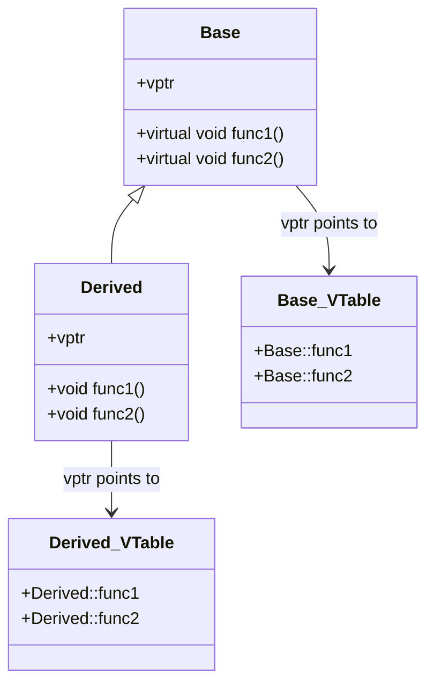

# C++ 多态

## 什么是多态？

多态(Polymorphism)是面向对象编程的核心概念之一，字面意思是"多种形态"。在C++中，多态允许我们使用基类指针或引用来调用派生类的函数，从而在运行时决定具体执行哪个派生类的行为。

多态提供了接口重用的能力，使我们能够编写更加灵活和可扩展的代码。

:::note
多态是面向对象编程的三大特性之一，另外两个是封装和继承。多态建立在继承的基础之上。
:::

## 多态的类型

在C++中，多态主要分为两种类型：

1. **编译时多态（静态多态）**：通过函数重载和运算符重载实现
2. **运行时多态（动态多态）**：通过虚函数和继承实现

本文将主要关注运行时多态，因为这是C++面向对象编程中更为核心的多态概念。

## 运行时多态的实现

### 虚函数

要实现运行时多态，我们需要使用**虚函数**。在基类中声明的虚函数可以在派生类中被重写（覆盖），当通过基类指针或引用调用这个函数时，会根据指针指向的对象类型来决定调用哪个版本的函数。

使用`virtual`关键字来声明虚函数：

```cpp
class Base {
public:
    virtual void display() {
        std::cout << "Base class display function" << std::endl;
    }
};

class Derived : public Base {
public:
    void display() override {
        std::cout << "Derived class display function" << std::endl;
    }
};

int main() {
    Base* ptr;
    Derived derivedObj;
    ptr = &derivedObj;
    
    // 虽然ptr是Base类型的指针，但它指向Derived对象
    // 所以这里会调用Derived类的display函数
    ptr->display();  // 输出: Derived class display function
    
    return 0;
}
```

输出结果：
```
Derived class display function
```

### override关键字

C++11引入了`override`关键字，它可以帮助我们明确标记出哪些函数是重写基类的虚函数，这样编译器可以帮我们检查是否正确重写：

```cpp
class Base {
public:
    virtual void show() {
        std::cout << "Base::show()" << std::endl;
    }
};

class Derived : public Base {
public:
    // 使用override明确表示这是重写基类的虚函数
    void show() override {
        std::cout << "Derived::show()" << std::endl;
    }
    
    // 如果函数名拼写错误或参数不匹配，使用override会导致编译错误
    // void showw() override {} // 编译错误：找不到要重写的虚函数
};
```

### 虚析构函数

当通过基类指针删除派生类对象时，如果基类的析构函数不是虚函数，则只会调用基类的析构函数，而不会调用派生类的析构函数，这可能导致内存泄漏。

因此，当类可能作为基类时，应当将其析构函数声明为虚函数：

```cpp
class Base {
public:
    Base() {
        std::cout << "Base constructor" << std::endl;
    }
    
    virtual ~Base() {
        std::cout << "Base destructor" << std::endl;
    }
};

class Derived : public Base {
public:
    Derived() {
        std::cout << "Derived constructor" << std::endl;
    }
    
    ~Derived() override {
        std::cout << "Derived destructor" << std::endl;
    }
};

int main() {
    Base* ptr = new Derived();
    delete ptr;  // 会正确调用Derived和Base的析构函数
    
    return 0;
}
```

输出结果：
```
Base constructor
Derived constructor
Derived destructor
Base destructor
```

## 纯虚函数和抽象类

### 纯虚函数

**纯虚函数**是一个在基类中声明但没有实现的虚函数，语法是在函数声明后加上`= 0`：

```cpp
virtual return_type function_name(parameters) = 0;
```

### 抽象类

包含至少一个纯虚函数的类被称为**抽象类**。抽象类的特点：

1. 不能直接实例化对象
2. 派生类必须实现所有纯虚函数，否则它也是抽象类
3. 可以用来定义接口

```cpp
class Shape {  // 抽象基类
public:
    virtual double area() = 0;  // 纯虚函数
    virtual double perimeter() = 0;  // 纯虚函数
    
    virtual ~Shape() {}
};

class Circle : public Shape {
private:
    double radius;
public:
    Circle(double r) : radius(r) {}
    
    double area() override {
        return 3.14 * radius * radius;
    }
    
    double perimeter() override {
        return 2 * 3.14 * radius;
    }
};

class Rectangle : public Shape {
private:
    double width, height;
public:
    Rectangle(double w, double h) : width(w), height(h) {}
    
    double area() override {
        return width * height;
    }
    
    double perimeter() override {
        return 2 * (width + height);
    }
};

int main() {
    // Shape shape;  // 错误：不能创建抽象类的对象
    
    Shape* shapes[2];
    shapes[0] = new Circle(5.0);
    shapes[1] = new Rectangle(4.0, 6.0);
    
    for (int i = 0; i < 2; i++) {
        std::cout << "Area: " << shapes[i]->area() << std::endl;
        std::cout << "Perimeter: " << shapes[i]->perimeter() << std::endl;
    }
    
    // 释放内存
    for (int i = 0; i < 2; i++) {
        delete shapes[i];
    }
    
    return 0;
}
```

输出结果：
```
Area: 78.5
Perimeter: 31.4
Area: 24
Perimeter: 20
```

## 虚函数表与动态绑定

### 虚函数表

C++通过虚函数表(vtable)实现动态绑定。每个包含虚函数的类都有一个虚函数表，表中存储了该类虚函数的地址。每个类对象中都包含一个指向该类虚函数表的指针(vptr)。



### 动态绑定过程

1. 当定义一个包含虚函数的类对象时，编译器会为对象添加一个隐藏成员（vptr）
2. vptr指向该类的虚函数表
3. 当通过基类指针或引用调用虚函数时，程序会：
   - 查找对象的vptr
   - 通过vptr找到虚函数表
   - 调用表中对应的函数

## 多态的实际应用场景

### 1. 图形用户界面（GUI）库

在GUI库中，可能有一个基础的`Widget`类，派生出`Button`、`Checkbox`、`Slider`等具体控件类。每个控件类都有自己的绘制方法：

```cpp
class Widget {
public:
    virtual void draw() = 0;
    virtual void handleEvent(Event e) = 0;
};

class Button : public Widget {
public:
    void draw() override {
        // 绘制按钮
    }
    
    void handleEvent(Event e) override {
        // 处理按钮事件
    }
};

class Checkbox : public Widget {
    // 类似实现
};

// 使用场景
void updateUI(std::vector<Widget*> widgets) {
    for (Widget* w : widgets) {
        w->draw();  // 多态调用，每个控件绘制自己
    }
}
```

### 2. 游戏开发

在游戏中，可能有多种不同的游戏角色，每种角色都有自己的行为：

```cpp
class GameCharacter {
public:
    virtual void update() = 0;
    virtual void render() = 0;
    virtual void collideWith(GameCharacter* other) = 0;
};

class Player : public GameCharacter {
    // Player特有实现
};

class Enemy : public GameCharacter {
    // Enemy特有实现
};

// 游戏主循环
void gameLoop(std::vector<GameCharacter*> characters) {
    for (auto& character : characters) {
        character->update();  // 更新每个角色
        character->render();  // 绘制每个角色
    }
}
```

### 3. 插件系统

多态可以用来实现可扩展的插件系统：

```cpp
class Plugin {
public:
    virtual void initialize() = 0;
    virtual void shutdown() = 0;
    virtual std::string getName() = 0;
};

// 第三方可以创建自己的插件
class MyCustomPlugin : public Plugin {
public:
    void initialize() override {
        std::cout << "初始化自定义插件" << std::endl;
    }
    
    void shutdown() override {
        std::cout << "关闭自定义插件" << std::endl;
    }
    
    std::string getName() override {
        return "MyCustomPlugin";
    }
};

// 应用程序加载插件
void loadPlugins(std::vector<Plugin*> plugins) {
    for (auto& plugin : plugins) {
        std::cout << "Loading plugin: " << plugin->getName() << std::endl;
        plugin->initialize();
    }
}
```

## 多态使用中的注意事项

### 1. 性能考虑

虚函数调用比普通函数调用稍慢，因为需要在运行时查找虚函数表。在对性能极为敏感的场景下需要考虑这一点。

### 2. 对象切片问题

当派生类对象赋值给基类对象（而不是基类指针或引用）时，会发生对象切片，派生类特有的部分会被"切掉"：

```cpp
class Base {
public:
    virtual void show() { std::cout << "Base" << std::endl; }
};

class Derived : public Base {
public:
    void show() override { std::cout << "Derived" << std::endl; }
    void derivedOnly() { std::cout << "Derived only function" << std::endl; }
};

int main() {
    Derived d;
    Base b = d;  // 对象切片！
    
    b.show();  // 输出: "Base"，不是"Derived"
    // b.derivedOnly();  // 错误：Base类没有这个函数
}
```

### 3. 正确使用override关键字

为了避免意外的错误，建议总是使用`override`关键字来明确指出重写的虚函数。

:::caution
不要忘记在基类中使用`virtual`关键字！如果基类函数不是虚函数，派生类的同名函数只是隐藏基类函数，而不是重写。
:::

## 总结

C++中的多态是面向对象编程的核心特性之一，通过虚函数机制实现。多态主要有以下几个关键点：

1. **虚函数**：使用`virtual`关键字声明，使函数可以在派生类中被重写
2. **纯虚函数**：在基类中声明但不实现的函数，形式为`virtual return_type function_name() = 0;`
3. **抽象类**：包含至少一个纯虚函数的类，不能直接实例化
4. **动态绑定**：通过虚函数表实现，在运行时决定调用哪个函数
5. **虚析构函数**：确保正确释放派生类资源

多态使我们能够：
- 编写更加灵活和可扩展的代码
- 实现"依赖于接口而非实现"的设计原则
- 支持运行时决策，增强程序的灵活性

## 练习题

1. 创建一个`Animal`抽象基类，包含一个纯虚函数`makeSound()`，然后创建几个派生类如`Dog`、`Cat`和`Cow`，分别实现`makeSound()`方法。
 
2. 实现一个简单的形状层次结构，`Shape`是抽象基类，`Circle`、`Rectangle`和`Triangle`是派生类。每个类都应该能够计算面积和周长。

3. 为什么在包含虚函数的类中析构函数应该是虚函数？尝试写一个例子来说明这一点。

## 进一步学习资源

1. 《C++ Primer》- Stanley B. Lippman，第15章深入讨论了面向对象编程和多态
2. 《Effective C++》- Scott Meyers，条款34-36专门讨论继承和多态的最佳实践
3. C++ Reference - [虚函数](https://en.cppreference.com/w/cpp/language/virtual)
4. C++ Reference - [纯虚函数](https://en.cppreference.com/w/cpp/language/abstract_class)

通过掌握多态，你将能够编写更加灵活、可扩展和易于维护的C++程序，这是成为高级C++程序员的重要一步。