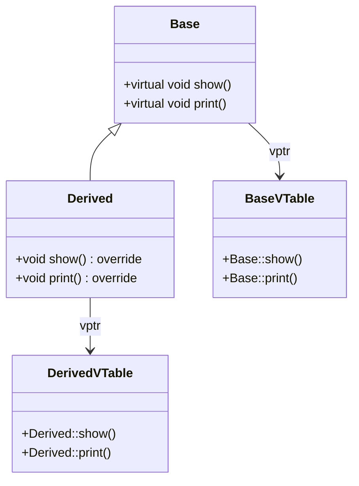

# C++ 虚函数

## 引言

在C++面向对象编程中，虚函数是实现**多态性**的核心机制之一。多态性允许我们通过基类指针或引用调用派生类中的函数，这为代码的灵活性和可扩展性提供了强大支持。本文将详细介绍C++虚函数的概念、工作原理、使用方法以及实际应用场景，帮助你全面理解这一重要特性。

## 什么是虚函数？

**虚函数**是在基类中声明并在派生类中重新定义的成员函数，它使用`virtual`关键字标记。当通过基类指针或引用调用虚函数时，程序会根据指针或引用指向的实际对象类型来决定调用哪个版本的函数，而不是根据指针或引用的声明类型。

:::note
虚函数是实现C++运行时多态（动态绑定）的基础，它允许程序在运行时而非编译时确定要调用的函数版本。
:::

## 虚函数的基本语法

要声明一个虚函数，只需在基类的函数声明前加上`virtual`关键字：

```cpp
class Base {
public:
    virtual void show() {
        cout << "Base class show function" << endl;
    }
};

class Derived : public Base {
public:
    void show() override {
        cout << "Derived class show function" << endl;
    }
};
```

在C++11及以后的版本中，我们可以使用`override`关键字来明确表示我们正在重写基类的虚函数，这有助于避免拼写错误和其他常见问题。

## 虚函数的工作原理

虚函数的实现依赖于**虚函数表（vtable）**机制：

1. 每个包含虚函数的类都有一个虚函数表
2. 每个此类的对象都包含一个指向该虚函数表的指针（vptr）
3. 当通过基类指针调用虚函数时，程序会查找对象的虚函数表，并调用表中相应的函数



## 完整的虚函数示例

让我们通过一个完整的例子来理解虚函数的行为：

```cpp
#include <iostream>
using namespace std;

// 基类
class Shape {
public:
    virtual void draw() {
        cout << "绘制形状" << endl;
    }
    
    // 虚析构函数（稍后解释）
    virtual ~Shape() {
        cout << "销毁 Shape" << endl;
    }
};

// 派生类 Circle
class Circle : public Shape {
public:
    void draw() override {
        cout << "绘制圆形" << endl;
    }
    
    ~Circle() override {
        cout << "销毁 Circle" << endl;
    }
};

// 派生类 Rectangle
class Rectangle : public Shape {
public:
    void draw() override {
        cout << "绘制矩形" << endl;
    }
    
    ~Rectangle() override {
        cout << "销毁 Rectangle" << endl;
    }
};

int main() {
    Shape* shapes[3];
    shapes[0] = new Shape();
    shapes[1] = new Circle();
    shapes[2] = new Rectangle();
    
    // 多态调用
    for(int i = 0; i < 3; i++) {
        shapes[i]->draw();
    }
    
    // 释放内存
    for(int i = 0; i < 3; i++) {
        delete shapes[i];
    }
    
    return 0;
}
```

**输出结果：**
```
绘制形状
绘制圆形
绘制矩形
销毁 Shape
销毁 Circle
销毁 Shape
销毁 Rectangle
销毁 Shape
```

在这个例子中，尽管我们通过`Shape*`指针调用`draw()`函数，但根据指针实际指向的对象类型，程序会调用相应类的`draw()`函数。这就是多态性的体现。

## 虚函数的关键特性

### 1. 虚析构函数

当我们通过基类指针删除派生类对象时，如果基类的析构函数不是虚函数，只会调用基类的析构函数，而不会调用派生类的析构函数，这可能导致内存泄漏。

```cpp
class Base {
public:
    virtual ~Base() {
        cout << "Base 析构函数" << endl;
    }
};

class Derived : public Base {
private:
    int* data;
public:
    Derived() {
        data = new int[10];
    }
    
    ~Derived() override {
        delete[] data;
        cout << "Derived 析构函数" << endl;
    }
};
```

:::warning
如果你的类设计用作基类，几乎总是应该将析构函数声明为虚函数，以确保正确释放派生类资源。
:::

### 2. 纯虚函数和抽象类

**纯虚函数**是没有实现的虚函数，使用`= 0`语法声明：

```cpp
class AbstractShape {
public:
    // 纯虚函数
    virtual void draw() = 0;
    
    virtual ~AbstractShape() {}
};
```

包含至少一个纯虚函数的类称为**抽象类**。抽象类不能被实例化，只能作为接口供其他类继承。派生类必须实现所有纯虚函数，否则它也是抽象类。

### 3. 虚函数表和动态绑定

当程序执行虚函数调用时，会执行以下步骤：

1. 查找对象的vptr（虚函数表指针）
2. 通过vptr访问类的虚函数表
3. 调用表中对应位置的函数

这个过程称为**动态绑定**或**后期绑定**。

## 虚函数的实际应用场景

### 1. 图形用户界面框架

在GUI库中，常常有一个基本的`Widget`类，派生出按钮、文本框等组件，每个组件都需要以自己的方式绘制和处理事件：

```cpp
class Widget {
public:
    virtual void draw() = 0;
    virtual void handleEvent(Event e) = 0;
};

class Button : public Widget {
public:
    void draw() override {
        // 绘制按钮
    }
    
    void handleEvent(Event e) override {
        // 处理按钮事件
    }
};
```

### 2. 游戏开发中的实体系统

游戏中的各种对象（玩家、敌人、物品等）可以共享基本行为，但具有独特的实现：

```cpp
class GameObject {
public:
    virtual void update(float deltaTime) = 0;
    virtual void render() = 0;
    virtual void collide(GameObject* other) = 0;
};

class Player : public GameObject {
    // 玩家特有的实现...
};

class Enemy : public GameObject {
    // 敌人特有的实现...
};
```

### 3. 插件系统

虚函数可以用来实现可扩展的插件架构：

```cpp
class Plugin {
public:
    virtual void initialize() = 0;
    virtual void shutdown() = 0;
    virtual string getName() = 0;
};

// 应用程序可以加载多个插件并通过统一接口调用它们
```

## 虚函数的注意事项与最佳实践

### 1. 性能考虑

虚函数调用比普通函数调用稍慢，因为需要额外的查表操作。但在大多数场景下，这种性能差异可以忽略不计。只有在极度追求性能的情况下才需要考虑这一因素。

### 2. 构造函数中的虚函数调用

在构造函数中调用虚函数时，只会调用当前类或基类的版本，而不是派生类的版本，因为对象尚未完全构造。

```cpp
class Base {
public:
    Base() {
        initialize(); // 只会调用Base::initialize()
    }
    
    virtual void initialize() {
        cout << "Base initialize" << endl;
    }
};

class Derived : public Base {
public:
    void initialize() override {
        cout << "Derived initialize" << endl; 
    }
};
```

:::caution
避免在构造函数和析构函数中调用虚函数，这可能导致意外的行为。
:::

### 3. final关键字

C++11引入了`final`关键字，可以防止虚函数被进一步重写：

```cpp
class Base {
public:
    virtual void foo() {}
};

class Derived : public Base {
public:
    void foo() override final {}
};

class Further : public Derived {
public:
    // 错误：foo 被标记为 final
    void foo() override {}
};
```

## 总结

虚函数是C++面向对象编程中实现多态性的核心机制，它允许我们：

1. 通过基类指针或引用调用派生类的函数
2. 在运行时而非编译时确定调用哪个函数
3. 设计灵活、可扩展的类层次结构
4. 使用抽象类和纯虚函数定义接口

掌握虚函数是迈向高级C++编程的重要一步，它能帮助你设计出更加灵活、可维护的代码结构。

## 练习与深入学习

1. **实现一个简单的形状计算系统**：创建一个抽象基类`Shape`，包含纯虚函数`getArea()`和`getPerimeter()`，然后实现`Circle`、`Rectangle`和`Triangle`等派生类。

2. **探索虚继承**：研究C++中的虚继承如何解决菱形继承问题，以及它与虚函数的关系。

3. **优化虚函数调用**：了解编译器对虚函数调用的优化技术，如去虚化（devirtualization）。

4. **理解`std::function`和虚函数的区别**：探索现代C++中基于函数对象的多态性实现与基于虚函数的实现各有什么优缺点。

### 其他资源

- [C++ 核心准则](https://isocpp.github.io/CppCoreGuidelines/CppCoreGuidelines)中关于类层次结构设计的部分
- Scott Meyers的《Effective C++》中关于虚函数的条款
- Herb Sutter的《Exceptional C++》系列

通过深入理解虚函数，你将能够设计出更加优雅、灵活的面向对象系统，这是C++编程中的一项重要技能。