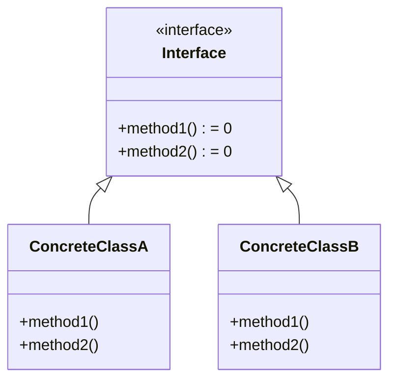

# C++ 纯虚函数

## 什么是纯虚函数？

在C++面向对象编程中，**纯虚函数**（Pure Virtual Function）是一种特殊的虚函数，它在基类中只有声明而没有定义，要求派生类必须提供该函数的实现。纯虚函数使用特殊语法声明，在函数声明的结尾添加 `= 0`。

```cpp
virtual 返回类型 函数名(参数列表) = 0;
```

:::note
当一个类包含纯虚函数时，这个类被称为**抽象类**（Abstract Class）。抽象类不能被实例化，只能作为其他类的基类。
:::

## 纯虚函数的基本语法

下面是一个包含纯虚函数的简单示例：

```cpp
class Shape {
public:
    // 纯虚函数 - 计算面积
    virtual double calculateArea() = 0;
    
    // 纯虚函数 - 计算周长
    virtual double calculatePerimeter() = 0;
    
    // 普通虚函数
    virtual void display() {
        std::cout << "这是一个形状" << std::endl;
    }
    
    // 普通析构函数声明为虚函数是个好习惯
    virtual ~Shape() {}
};
```

## 纯虚函数与抽象类

### 抽象类的特性

1. 包含至少一个纯虚函数的类是抽象类
2. 抽象类不能被实例化（不能创建对象）
3. 可以创建指向抽象类的指针和引用
4. 派生类必须实现所有纯虚函数，否则派生类也是抽象类

```cpp
// 错误：不能创建抽象类的对象
Shape shape; // 编译错误

// 正确：可以创建抽象类的指针
Shape* shapePtr; // 有效
```

## 实现抽象类的派生类

让我们创建两个从`Shape`派生的具体类：

```cpp
class Circle : public Shape {
private:
    double radius;
    
public:
    Circle(double r) : radius(r) {}
    
    // 实现纯虚函数
    double calculateArea() override {
        return 3.14159 * radius * radius;
    }
    
    double calculatePerimeter() override {
        return 2 * 3.14159 * radius;
    }
    
    // 可以选择重写普通虚函数
    void display() override {
        std::cout << "这是一个半径为 " << radius << " 的圆" << std::endl;
    }
};

class Rectangle : public Shape {
private:
    double width;
    double height;
    
public:
    Rectangle(double w, double h) : width(w), height(h) {}
    
    double calculateArea() override {
        return width * height;
    }
    
    double calculatePerimeter() override {
        return 2 * (width + height);
    }
    
    void display() override {
        std::cout << "这是一个 " << width << "x" << height << " 的矩形" << std::endl;
    }
};
```

## 完整示例

下面是一个完整的示例程序，展示纯虚函数的使用：

```cpp
#include <iostream>
#include <vector>

class Shape {
public:
    virtual double calculateArea() = 0;
    virtual double calculatePerimeter() = 0;
    virtual void display() {
        std::cout << "这是一个形状" << std::endl;
    }
    virtual ~Shape() {}
};

class Circle : public Shape {
private:
    double radius;
    
public:
    Circle(double r) : radius(r) {}
    
    double calculateArea() override {
        return 3.14159 * radius * radius;
    }
    
    double calculatePerimeter() override {
        return 2 * 3.14159 * radius;
    }
    
    void display() override {
        std::cout << "这是一个半径为 " << radius << " 的圆" << std::endl;
    }
};

class Rectangle : public Shape {
private:
    double width;
    double height;
    
public:
    Rectangle(double w, double h) : width(w), height(h) {}
    
    double calculateArea() override {
        return width * height;
    }
    
    double calculatePerimeter() override {
        return 2 * (width + height);
    }
    
    void display() override {
        std::cout << "这是一个 " << width << "x" << height << " 的矩形" << std::endl;
    }
};

int main() {
    // 创建派生类对象
    Circle circle(5.0);
    Rectangle rectangle(4.0, 6.0);
    
    // 使用基类指针数组存储不同类型的对象
    std::vector<Shape*> shapes;
    shapes.push_back(&circle);
    shapes.push_back(&rectangle);
    
    // 通过基类指针调用虚函数（多态性）
    for (const auto& shape : shapes) {
        shape->display();
        std::cout << "面积: " << shape->calculateArea() << std::endl;
        std::cout << "周长: " << shape->calculatePerimeter() << std::endl;
        std::cout << "------------------------" << std::endl;
    }
    
    return 0;
}
```

**输出结果：**

```
这是一个半径为 5 的圆
面积: 78.5397
周长: 31.4159
------------------------
这是一个 4x6 的矩形
面积: 24
周长: 20
------------------------
```

## 纯虚函数的特点

### 1. 接口定义功能

纯虚函数定义了一个接口，指定了派生类必须实现的功能，但不提供实现细节。

### 2. 强制实现

纯虚函数强制派生类必须提供实现，否则派生类也会变成抽象类。

### 3. 多态性

通过基类指针或引用调用纯虚函数时，会动态绑定到派生类的实现，实现多态行为。

### 4. 与普通虚函数的区别

- 纯虚函数在基类中没有定义（只有声明，使用`= 0`）
- 普通虚函数在基类中有默认实现
- 包含纯虚函数的类是抽象类，不能实例化

## 为什么需要纯虚函数？

1. **接口定义**：定义一组必须实现的函数接口
2. **代码复用**：抽象出公共接口，派生类提供特定实现
3. **确保实现**：强制派生类提供必要的功能实现
4. **类型安全**：在编译时检查是否实现了所有必要的函数

## 纯虚函数的高级特性

### 纯虚函数可以有实现

尽管不常见，但C++允许为纯虚函数提供定义（实现）。这种情况下，派生类仍然需要重写该函数，但可以通过作用域解析运算符调用基类的实现：

```cpp
class Base {
public:
    virtual void pureFunction() = 0; // 纯虚函数
};

// 为纯虚函数提供实现
void Base::pureFunction() {
    std::cout << "Base类中纯虚函数的实现" << std::endl;
}

class Derived : public Base {
public:
    void pureFunction() override {
        // 可以调用基类的纯虚函数实现
        Base::pureFunction();
        std::cout << "Derived类中的额外实现" << std::endl;
    }
};
```

### 抽象类与接口

在C++中，接口通常通过只包含纯虚函数的抽象类来实现。这种设计模式在面向对象编程中非常常见，特别是在需要定义对象行为标准的场景中。



## 纯虚函数的实际应用场景

### 1. 插件系统设计

纯虚函数可以用于定义插件接口，使第三方开发者能够实现插件而无需了解主程序的内部工作原理。

```cpp
// 插件接口
class Plugin {
public:
    virtual void initialize() = 0;
    virtual void execute() = 0;
    virtual void cleanup() = 0;
    virtual ~Plugin() {}
};

// 主程序加载并使用插件
class Application {
private:
    std::vector<Plugin*> plugins;
    
public:
    void loadPlugin(Plugin* plugin) {
        plugin->initialize();
        plugins.push_back(plugin);
    }
    
    void runPlugins() {
        for (auto plugin : plugins) {
            plugin->execute();
        }
    }
    
    ~Application() {
        for (auto plugin : plugins) {
            plugin->cleanup();
        }
    }
};
```

### 2. 图形用户界面框架

GUI框架通常使用纯虚函数来定义窗口部件的接口：

```cpp
class Widget {
public:
    virtual void draw() = 0;
    virtual void handleEvent(Event& event) = 0;
    virtual ~Widget() {}
};

class Button : public Widget {
public:
    void draw() override {
        // 绘制按钮
    }
    
    void handleEvent(Event& event) override {
        // 处理按钮事件
    }
};
```

### 3. 设计模式实现

许多设计模式，如工厂模式、策略模式、观察者模式等，都广泛使用纯虚函数：

```cpp
// 策略模式示例
class SortStrategy {
public:
    virtual void sort(std::vector<int>& data) = 0;
    virtual ~SortStrategy() {}
};

class QuickSort : public SortStrategy {
public:
    void sort(std::vector<int>& data) override {
        std::cout << "使用快速排序算法" << std::endl;
        // 实现快速排序
    }
};

class MergeSort : public SortStrategy {
public:
    void sort(std::vector<int>& data) override {
        std::cout << "使用归并排序算法" << std::endl;
        // 实现归并排序
    }
};

class Sorter {
private:
    SortStrategy* strategy;
    
public:
    Sorter(SortStrategy* s) : strategy(s) {}
    
    void setStrategy(SortStrategy* s) {
        strategy = s;
    }
    
    void sortData(std::vector<int>& data) {
        strategy->sort(data);
    }
};
```

## 纯虚函数与虚析构函数

当使用多态时，基类应该始终包含一个虚析构函数，即使它不是纯虚的：

```cpp
class Base {
public:
    virtual void pureFunc() = 0;
    
    // 虚析构函数确保正确释放派生类资源
    virtual ~Base() {
        std::cout << "Base析构函数" << std::endl;
    }
};
```

:::warning
如果基类没有虚析构函数，通过基类指针删除派生类对象可能导致派生类析构函数不被调用，造成资源泄漏。
:::

## 总结

纯虚函数是C++面向对象编程中的强大工具，它们：

1. 通过 `= 0` 语法定义，声明一个没有实现的函数
2. 使包含它们的类成为抽象类，不能被实例化
3. 强制派生类提供实现，否则派生类也是抽象类
4. 用于定义接口和实现多态行为
5. 适用于需要统一接口但允许不同实现的场景

纯虚函数是实现"接口继承"的主要机制，使C++支持基于接口的编程范式，提高代码的可扩展性、可维护性和灵活性。

## 练习

1. 创建一个`Vehicle`抽象类，包含`start()`、`stop()`和`getMaxSpeed()`纯虚函数，然后实现`Car`和`Bicycle`两个派生类。
2. 实现一个简单的图形编辑器，使用抽象类`Shape`定义接口，然后创建`Circle`、`Rectangle`和`Triangle`派生类。
3. 设计一个简单的游戏角色系统，使用抽象类定义角色行为，并实现不同类型的角色。

## 附加资源

- 《C++ Primer》- 学习更多关于C++虚函数和多态的内容
- 《Effective C++》Item 34: Differentiate between inheritance of interface and inheritance of implementation
- C++标准文档中关于抽象类和纯虚函数的部分

掌握纯虚函数是迈向高级C++面向对象编程的重要一步，它将帮助你设计更灵活、更强大的软件系统。