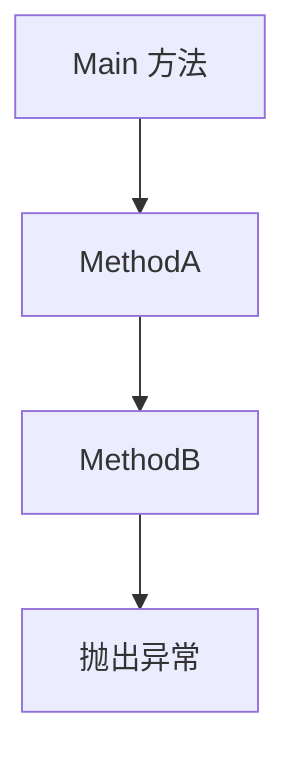

## 介绍

在 C# 编程中，异常处理是确保程序在遇到错误时能够优雅地恢复或退出的重要机制。异常传播是指当异常发生时，异常如何在调用堆栈中向上传递，直到被捕获或导致程序崩溃。理解异常传播的机制对于编写健壮的代码至关重要。

## 异常传播的基本概念

当代码中发生异常时，C# 运行时会在当前方法中查找能够处理该异常的 `try-catch` 块。如果当前方法中没有合适的 `catch` 块，异常会传播到调用当前方法的方法中，继续查找 `catch` 块。这个过程会一直持续，直到找到合适的 `catch` 块或到达调用堆栈的顶部（此时程序会崩溃）。

### 代码示例

以下是一个简单的示例，展示了异常如何在方法之间传播：

```csharp
using System;

class Program
{
    static void Main()
    {
        try
        {
            MethodA();
        }
        catch (Exception ex)
        {
            Console.WriteLine("异常在 Main 方法中被捕获: " + ex.Message);
        }
    }

    static void MethodA()
    {
        MethodB();
    }

    static void MethodB()
    {
        throw new Exception("这是一个异常！");
    }
}
```

**输出：**
```
异常在 Main 方法中被捕获: 这是一个异常！
```

在这个示例中，`MethodB` 抛出了一个异常，但由于 `MethodB` 中没有 `catch` 块，异常会传播到 `MethodA`。同样，`MethodA` 也没有 `catch` 块，因此异常继续传播到 `Main` 方法，最终在 `Main` 方法中被捕获。

## 异常传播的详细过程

为了更好地理解异常传播，我们可以将调用堆栈可视化。以下是一个调用堆栈的示意图：



1. **抛出异常**：在 `MethodB` 中，异常被抛出。
2. **查找 `catch` 块**：`MethodB` 中没有 `catch` 块，因此异常传播到 `MethodA`。
3. **继续查找**：`MethodA` 中也没有 `catch` 块，异常继续传播到 `Main` 方法。
4. **捕获异常**：`Main` 方法中有 `catch` 块，异常在此被捕获并处理。

## 实际应用场景

在实际开发中，异常传播机制可以帮助我们更好地管理错误处理逻辑。例如，在一个多层架构的应用程序中，底层的服务方法可能会抛出异常，而上层的控制器方法可以捕获并处理这些异常，以便向用户显示友好的错误信息。

### 示例：多层架构中的异常处理

```csharp
using System;

class Program
{
    static void Main()
    {
        try
        {
            ControllerMethod();
        }
        catch (Exception ex)
        {
            Console.WriteLine("控制器捕获到异常: " + ex.Message);
        }
    }

    static void ControllerMethod()
    {
        try
        {
            ServiceMethod();
        }
        catch (Exception ex)
        {
            Console.WriteLine("服务层捕获到异常: " + ex.Message);
            throw; // 重新抛出异常
        }
    }

    static void ServiceMethod()
    {
        throw new Exception("服务层发生错误！");
    }
}
```

**输出：**
```
服务层捕获到异常: 服务层发生错误！
控制器捕获到异常: 服务层发生错误！
```

在这个示例中，`ServiceMethod` 抛出的异常首先被 `ControllerMethod` 捕获并处理，然后重新抛出，最终在 `Main` 方法中被捕获。这种模式允许我们在不同的层次上处理异常，同时保留异常的原始信息。

## 总结

异常传播是 C# 异常处理机制的核心部分。通过理解异常如何在调用堆栈中传播，我们可以更好地设计和调试我们的代码，确保程序在遇到错误时能够优雅地处理。

## 附加资源与练习

- **练习**：尝试修改上面的代码示例，使得 `ServiceMethod` 中的异常在 `ControllerMethod` 中被捕获并处理，但不再传播到 `Main` 方法。
- **进一步学习**：阅读 [C# 异常处理官方文档](https://learn.microsoft.com/en-us/dotnet/csharp/programming-guide/exceptions/) 以深入了解异常处理的最佳实践。

:::tip
记住，良好的异常处理不仅可以提高代码的健壮性，还能改善用户体验。确保在适当的地方捕获和处理异常，同时避免过度捕获异常，以免掩盖潜在的问题。
:::