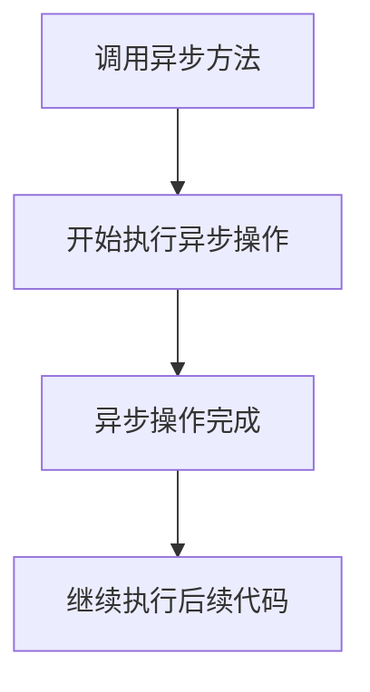

## 介绍

在现代应用程序开发中，异步编程是一个非常重要的概念。它允许我们在执行长时间运行的操作（如网络请求、文件读写等）时，不会阻塞主线程，从而提高应用程序的响应能力和性能。C# 提供了强大的异步编程支持，主要通过 `async` 和 `await` 关键字来实现。

## 什么是异步方法？

异步方法是一种特殊的方法，它允许你在执行长时间运行的操作时，不会阻塞调用线程。在 C# 中，异步方法通常使用 `async` 关键字来声明，并使用 `await` 关键字来等待异步操作的完成。

### 基本语法

```csharp
public async Task MyAsyncMethod()
{
    // 异步操作
    await Task.Delay(1000); // 模拟一个异步操作
    Console.WriteLine("异步操作完成");
}
```

在上面的代码中，`MyAsyncMethod` 是一个异步方法，它使用 `await` 关键字来等待一个异步操作（`Task.Delay(1000)`）的完成。`Task.Delay(1000)` 模拟了一个耗时 1 秒的操作。

## 异步方法的执行流程

为了更好地理解异步方法的执行流程，我们可以通过以下图表来展示：



1. 当调用异步方法时，方法会立即返回一个 `Task` 对象，表示异步操作的进行中状态。
2. 在异步操作完成之前，调用线程不会被阻塞，可以继续执行其他任务。
3. 当异步操作完成后，方法会从 `await` 关键字处继续执行后续代码。

## 实际案例：异步文件读取

让我们通过一个实际的例子来展示异步方法的应用场景。假设我们需要从一个大型文件中读取数据，为了避免阻塞主线程，我们可以使用异步方法来读取文件。

```csharp
public async Task<string> ReadFileAsync(string filePath)
{
    using (StreamReader reader = new StreamReader(filePath))
    {
        return await reader.ReadToEndAsync();
    }
}
```

在这个例子中，`ReadFileAsync` 方法使用 `StreamReader` 异步读取文件内容。`ReadToEndAsync` 是一个异步方法，它会返回文件的全部内容。

### 调用异步方法

```csharp
public async Task Main()
{
    string filePath = "example.txt";
    string content = await ReadFileAsync(filePath);
    Console.WriteLine(content);
}
```

在 `Main` 方法中，我们使用 `await` 关键字来等待 `ReadFileAsync` 方法的完成，并输出文件内容。

## 注意事项

:::caution
在使用异步方法时，需要注意以下几点：
1. 异步方法必须返回 `Task` 或 `Task<TResult>` 类型。
2. `await` 关键字只能在 `async` 方法中使用。
3. 异步方法不会自动并行执行，如果需要并行执行多个异步操作，可以使用 `Task.WhenAll` 或 `Task.WhenAny`。
:::

## 总结

异步方法是 C# 中处理长时间运行操作的重要工具。通过使用 `async` 和 `await` 关键字，我们可以编写出高效且响应迅速的应用程序。在实际开发中，异步方法常用于网络请求、文件读写、数据库操作等场景。

## 附加资源

- [C# 异步编程官方文档](https://learn.microsoft.com/zh-cn/dotnet/csharp/programming-guide/concepts/async/)
- [`Task` 和 `Task<TResult>` 类](https://learn.microsoft.com/zh-cn/dotnet/api/system.threading.tasks.task?view=net-7.0)

## 练习

1. 编写一个异步方法，模拟一个耗时 2 秒的操作，并在操作完成后输出 "操作完成"。
2. 修改上面的文件读取示例，使其能够同时读取多个文件，并在所有文件读取完成后输出内容。

通过以上内容，你应该对 C# 中的异步方法有了初步的了解。继续练习和探索，你将能够更好地掌握异步编程的技巧。