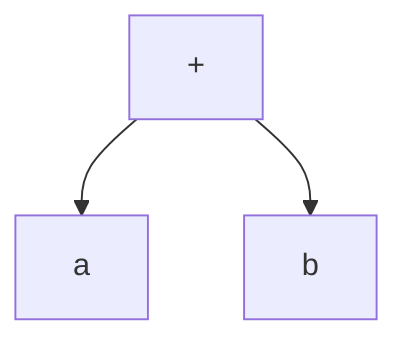

## 介绍

在C#中，表达式树（Expression Trees）是一种将代码表示为数据结构的方式。它们允许你将代码逻辑表示为树形结构，从而可以在运行时动态生成、修改和执行代码。表达式树是LINQ查询、动态代码生成和反射等高级功能的核心。

表达式树的核心类是 `System.Linq.Expressions.Expression`，它表示一个表达式节点。通过组合这些节点，你可以构建复杂的表达式树，并将其编译为可执行的委托。

## 表达式树的基本概念

表达式树由多个节点组成，每个节点代表一个操作或值。例如，一个简单的加法表达式 `a + b` 可以表示为以下树结构：



在这个树中，`+` 是根节点，`a` 和 `b` 是叶子节点。

### 表达式树的类型

表达式树中的节点可以是以下几种类型：

- **常量表达式**：表示一个常量值，例如 `5` 或 `"Hello"`。
- **参数表达式**：表示一个参数，例如方法中的参数 `x`。
- **二元表达式**：表示一个二元操作，例如 `a + b` 或 `x > y`。
- **方法调用表达式**：表示一个方法调用，例如 `Math.Sqrt(x)`。
- **成员访问表达式**：表示访问对象的成员，例如 `person.Name`。

## 创建表达式树

让我们从一个简单的例子开始，创建一个表示 `a + b` 的表达式树。

```csharp
using System;
using System.Linq.Expressions;

class Program
{
    static void Main()
    {
        // 定义参数表达式
        ParameterExpression a = Expression.Parameter(typeof(int), "a");
        ParameterExpression b = Expression.Parameter(typeof(int), "b");

        // 创建加法表达式
        BinaryExpression add = Expression.Add(a, b);

        // 创建Lambda表达式
        Expression<Func<int, int, int>> lambda = Expression.Lambda<Func<int, int, int>>(add, a, b);

        // 编译表达式树为委托
        Func<int, int, int> compiledLambda = lambda.Compile();

        // 执行委托
        int result = compiledLambda(3, 5);
        Console.WriteLine(result); // 输出: 8
    }
}
```

在这个例子中，我们首先定义了两个参数表达式 `a` 和 `b`，然后创建了一个加法表达式 `add`。接着，我们将这个表达式包装在一个Lambda表达式中，并将其编译为可执行的委托。最后，我们调用这个委托并输出结果。

## 表达式树的实际应用

表达式树在C#中有许多实际应用场景，特别是在需要动态生成代码的情况下。以下是一些常见的应用场景：

### 1. LINQ查询

LINQ查询是表达式树的一个典型应用。当你编写一个LINQ查询时，编译器会将其转换为表达式树，然后在运行时将其转换为SQL查询或其他形式的查询。

```csharp
var query = from p in people
            where p.Age > 18
            select p.Name;
```

在这个例子中，`where p.Age > 18` 和 `select p.Name` 都会被转换为表达式树。

### 2. 动态代码生成

表达式树可以用于动态生成代码。例如，你可以根据用户输入动态生成一个数学表达式并执行它。

```csharp
using System;
using System.Linq.Expressions;

class Program
{
    static void Main()
    {
        // 定义参数表达式
        ParameterExpression x = Expression.Parameter(typeof(double), "x");

        // 创建表达式树：x * x + 2 * x + 1
        BinaryExpression expression = Expression.Add(
            Expression.Add(
                Expression.Multiply(x, x),
                Expression.Multiply(Expression.Constant(2.0), x)
            ),
            Expression.Constant(1.0)
        );

        // 创建Lambda表达式
        Expression<Func<double, double>> lambda = Expression.Lambda<Func<double, double>>(expression, x);

        // 编译表达式树为委托
        Func<double, double> compiledLambda = lambda.Compile();

        // 执行委托
        double result = compiledLambda(3.0);
        Console.WriteLine(result); // 输出: 16
    }
}
```

在这个例子中，我们动态生成了一个二次多项式 `x * x + 2 * x + 1`，并将其编译为可执行的委托。

### 3. 反射与动态调用

表达式树还可以与反射结合使用，以动态调用方法或访问属性。例如，你可以使用表达式树来动态调用一个对象的方法。

```csharp
using System;
using System.Linq.Expressions;
using System.Reflection;

class Program
{
    static void Main()
    {
        // 获取方法信息
        MethodInfo method = typeof(Math).GetMethod("Sqrt", new[] { typeof(double) });

        // 定义参数表达式
        ParameterExpression x = Expression.Parameter(typeof(double), "x");

        // 创建方法调用表达式
        MethodCallExpression call = Expression.Call(null, method, x);

        // 创建Lambda表达式
        Expression<Func<double, double>> lambda = Expression.Lambda<Func<double, double>>(call, x);

        // 编译表达式树为委托
        Func<double, double> compiledLambda = lambda.Compile();

        // 执行委托
        double result = compiledLambda(16.0);
        Console.WriteLine(result); // 输出: 4
    }
}
```

在这个例子中，我们使用反射获取了 `Math.Sqrt` 方法的信息，并使用表达式树动态调用了该方法。

## 总结

表达式树是C#中一个强大的工具，它允许你在运行时动态生成、修改和执行代码。通过表达式树，你可以实现诸如LINQ查询、动态代码生成和反射调用等高级功能。

:::tip
表达式树的学习曲线可能较陡，但一旦掌握，它将为你打开许多新的编程可能性。建议多动手实践，尝试构建和调试表达式树，以加深理解。
:::

## 附加资源与练习

- **练习1**：尝试创建一个表达式树，表示 `(a + b) * (a - b)`，并编译执行它。
- **练习2**：使用表达式树动态调用一个对象的方法，并传递参数。
- **附加资源**：
  - [MSDN文档：表达式树](https://learn.microsoft.com/en-us/dotnet/csharp/programming-guide/concepts/expression-trees/)
  - [C#表达式树教程](https://www.tutorialsteacher.com/linq/expression-tree)

通过不断练习和探索，你将能够熟练掌握C#表达式树，并在实际项目中灵活运用它。