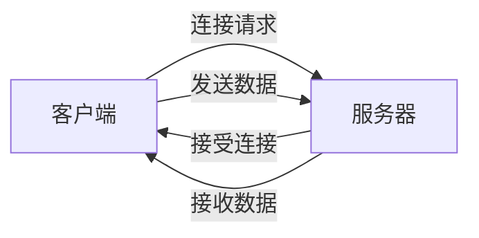

## 介绍

TCP（传输控制协议）是一种面向连接的、可靠的、基于字节流的传输层通信协议。它是互联网协议套件中最核心的协议之一，广泛应用于网络通信中。在 C# 中，`System.Net.Sockets` 命名空间提供了丰富的类和方法来实现 TCP 编程。

在本教程中，我们将学习如何使用 C# 创建一个简单的 TCP 客户端和服务器，并通过它们进行通信。我们将逐步讲解如何建立连接、发送和接收数据，以及如何处理异常。

## TCP 编程基础

### TCP 客户端与服务器模型

在 TCP 通信中，通常有一个服务器和一个或多个客户端。服务器负责监听来自客户端的连接请求，而客户端则主动发起连接请求。一旦连接建立，客户端和服务器之间就可以进行双向通信。



### 创建 TCP 服务器

在 C# 中，`TcpListener` 类用于创建 TCP 服务器。以下是一个简单的 TCP 服务器示例：

```csharp
using System;
using System.Net;
using System.Net.Sockets;
using System.Text;

class TcpServer
{
    static void Main()
    {
        // 设置服务器IP地址和端口
        IPAddress ipAddress = IPAddress.Parse("127.0.0.1");
        int port = 8080;

        // 创建TcpListener对象
        TcpListener listener = new TcpListener(ipAddress, port);

        // 开始监听
        listener.Start();
        Console.WriteLine("服务器已启动，等待客户端连接...");

        // 接受客户端连接
        TcpClient client = listener.AcceptTcpClient();
        Console.WriteLine("客户端已连接！");

        // 获取网络流
        NetworkStream stream = client.GetStream();

        // 读取客户端发送的数据
        byte[] buffer = new byte[1024];
        int bytesRead = stream.Read(buffer, 0, buffer.Length);
        string data = Encoding.UTF8.GetString(buffer, 0, bytesRead);
        Console.WriteLine("收到客户端消息: " + data);

        // 向客户端发送响应
        string response = "Hello, Client!";
        byte[] responseData = Encoding.UTF8.GetBytes(response);
        stream.Write(responseData, 0, responseData.Length);
        Console.WriteLine("已向客户端发送响应");

        // 关闭连接
        client.Close();
        listener.Stop();
    }
}
```

### 创建 TCP 客户端

`TcpClient` 类用于创建 TCP 客户端。以下是一个简单的 TCP 客户端示例：

```csharp
using System;
using System.Net.Sockets;
using System.Text;

class TcpClientExample
{
    static void Main()
    {
        // 设置服务器IP地址和端口
        string serverIp = "127.0.0.1";
        int port = 8080;

        // 创建TcpClient对象并连接到服务器
        TcpClient client = new TcpClient(serverIp, port);
        Console.WriteLine("已连接到服务器");

        // 获取网络流
        NetworkStream stream = client.GetStream();

        // 向服务器发送数据
        string message = "Hello, Server!";
        byte[] data = Encoding.UTF8.GetBytes(message);
        stream.Write(data, 0, data.Length);
        Console.WriteLine("已向服务器发送消息: " + message);

        // 读取服务器响应
        byte[] buffer = new byte[1024];
        int bytesRead = stream.Read(buffer, 0, buffer.Length);
        string response = Encoding.UTF8.GetString(buffer, 0, bytesRead);
        Console.WriteLine("收到服务器响应: " + response);

        // 关闭连接
        client.Close();
    }
}
```

### 运行示例

1. 首先运行服务器程序，它将等待客户端连接。
2. 然后运行客户端程序，它将连接到服务器并发送消息。
3. 服务器接收到消息后，会向客户端发送响应。

:::note
确保服务器和客户端在同一台机器上运行，或者将 `127.0.0.1` 替换为服务器的实际 IP 地址。
:::

## 实际应用场景

TCP 编程在许多实际应用中都非常重要，例如：

- **聊天应用程序**：客户端和服务器之间通过 TCP 连接进行实时消息传递。
- **文件传输**：通过 TCP 连接传输文件，确保数据的完整性和可靠性。
- **远程控制**：通过 TCP 连接发送控制命令，实现远程设备的控制。

## 总结

在本教程中，我们学习了如何使用 C# 进行 TCP 编程。我们创建了一个简单的 TCP 服务器和客户端，并通过它们进行了基本的通信。TCP 编程是网络编程的基础，掌握它将为你开发更复杂的网络应用程序打下坚实的基础。

## 附加资源与练习

- **练习**：尝试扩展上述示例，使其支持多个客户端连接，并实现一个简单的聊天室。
- **资源**：
  - [C# 官方文档 - TcpListener](https://docs.microsoft.com/en-us/dotnet/api/system.net.sockets.tcplistener)
  - [C# 官方文档 - TcpClient](https://docs.microsoft.com/en-us/dotnet/api/system.net.sockets.tcpclient)
  - [TCP/IP 协议详解](https://en.wikipedia.org/wiki/Transmission_Control_Protocol)

通过不断练习和探索，你将能够更深入地理解 TCP 编程，并将其应用到实际项目中。