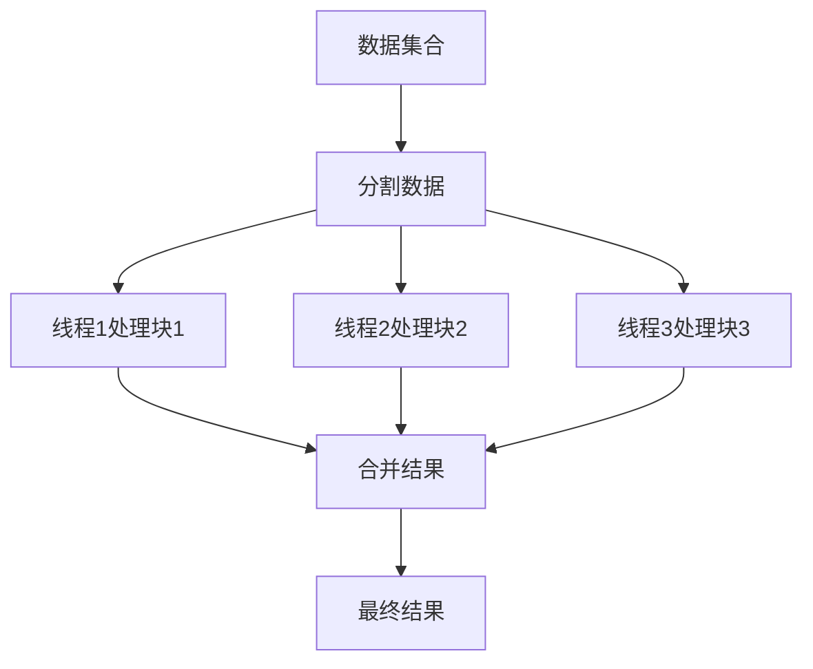

## 介绍

在C#中，LINQ（Language Integrated Query）是一种强大的工具，用于查询和操作数据集合。然而，当处理大量数据时，单线程的LINQ可能会导致性能瓶颈。为了解决这个问题，C#提供了并行LINQ（PLINQ），它允许我们利用多核处理器的优势，将查询操作并行化，从而加速数据处理。

PLINQ是LINQ的并行版本，它通过将数据分割成多个部分，并在多个线程上同时处理这些部分，来提高查询的性能。PLINQ的使用方式与LINQ非常相似，只需在LINQ查询前加上 `.AsParallel()` 即可。

## 基本用法

让我们从一个简单的例子开始，了解如何使用PLINQ。

```csharp
using System;
using System.Linq;

class Program
{
    static void Main()
    {
        var numbers = Enumerable.Range(1, 1000000);

        // 使用PLINQ并行计算每个数字的平方
        var squares = numbers.AsParallel()
                             .Select(n => n * n)
                             .ToList();

        Console.WriteLine($"计算了 {squares.Count} 个平方数。");
    }
}
```

在这个例子中，我们生成了一个包含100万个数字的集合，并使用PLINQ并行计算每个数字的平方。`.AsParallel()` 方法将集合分割成多个部分，并在多个线程上同时执行 `Select` 操作。

### 输出
```
计算了 1000000 个平方数。
```

## 并行化的工作原理

PLINQ通过将数据分割成多个块，并在多个线程上同时处理这些块来实现并行化。每个线程处理一个数据块，最后将结果合并。这种方式可以显著提高处理大量数据时的性能。



## 实际应用场景

### 场景1：大数据集的处理

假设你有一个包含数百万条记录的数据集，你需要对每条记录进行复杂的计算。使用PLINQ可以显著减少处理时间。

```csharp
var data = Enumerable.Range(1, 10000000);

var results = data.AsParallel()
                  .Select(record => ComplexCalculation(record))
                  .ToList();
```

### 场景2：并行过滤

如果你需要从一个大数据集中过滤出符合条件的记录，PLINQ可以帮助你快速完成。

```csharp
var filteredData = data.AsParallel()
                       .Where(record => record > 5000000)
                       .ToList();
```

## 注意事项

:::caution
虽然PLINQ可以提高性能，但并不是所有情况下都适合使用。以下是一些需要注意的地方：
- **小数据集**：对于小数据集，PLINQ的开销可能会超过其带来的性能提升。
- **线程安全**：确保你的操作是线程安全的，避免在并行操作中修改共享状态。
- **顺序敏感操作**：如果操作的顺序很重要，PLINQ可能会导致结果顺序不一致。可以使用 `.AsOrdered()` 来保持顺序。
:::

## 总结

PLINQ是C#中一个强大的工具，可以帮助我们利用多核处理器的优势，加速数据处理。通过简单的 `.AsParallel()` 调用，我们可以将LINQ查询并行化，从而显著提高性能。然而，在使用PLINQ时，需要注意数据集的大小、线程安全和操作顺序等问题。

## 附加资源与练习

- **练习1**：尝试在一个包含1000万个数字的集合上使用PLINQ进行并行求和，并比较与单线程LINQ的性能差异。
- **练习2**：使用PLINQ对一个包含复杂对象的集合进行并行过滤，并输出符合条件的对象。

:::tip
如果你对PLINQ的更多高级用法感兴趣，可以查阅微软官方文档，了解更多关于并行化选项和性能调优的内容。
:::