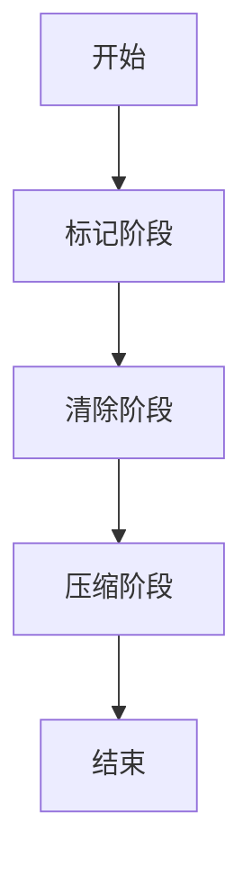

# C# 内存管理

在 C# 编程中，内存管理是一个至关重要的主题。理解内存管理不仅可以帮助你编写更高效的代码，还能避免常见的内存泄漏和性能问题。本文将带你深入了解 C# 中的内存管理机制，包括垃圾回收、堆栈与堆的区别，以及如何优化内存使用。

## 什么是内存管理？

内存管理是指在程序运行过程中，如何分配、使用和释放内存资源。C# 是一种托管语言，这意味着它依赖于 .NET 运行时环境来自动管理内存。尽管如此，了解内存管理的底层机制仍然非常重要，尤其是在处理大型应用程序或性能敏感的场景时。

## 堆栈与堆

在 C# 中，内存主要分为两个部分：**堆栈（Stack）** 和 **堆（Heap）**。

- **堆栈**：用于存储值类型（如 `int`、`float`、`struct` 等）和方法的调用栈。堆栈内存的分配和释放是自动的，遵循“后进先出”的原则。
- **堆**：用于存储引用类型（如 `class`、`string`、`array` 等）。堆内存的分配和释放由垃圾回收器（Garbage Collector, GC）管理。

```csharp
int number = 10; // 值类型，存储在堆栈上
string name = "C#"; // 引用类型，存储在堆上
```

## 垃圾回收（Garbage Collection, GC）

C# 使用垃圾回收器来自动管理堆内存。垃圾回收器会定期检查不再使用的对象，并释放它们占用的内存。这样可以避免手动管理内存的复杂性，但也可能导致性能开销。

:::tip
垃圾回收器的主要目标是减少内存泄漏和悬空指针问题。
:::

### 垃圾回收的工作原理

1. **标记阶段**：垃圾回收器会遍历所有对象，标记那些仍然被引用的对象。
2. **清除阶段**：垃圾回收器会释放那些未被标记的对象所占用的内存。
3. **压缩阶段**（可选）：垃圾回收器可能会移动对象，以减少内存碎片。



## 实际案例：内存泄漏

尽管 C# 有垃圾回收机制，但内存泄漏仍然可能发生。最常见的原因是意外地保留了不再需要的对象引用。

```csharp
class Program
{
    static List<string> _cache = new List<string>();

    static void Main(string[] args)
    {
        for (int i = 0; i < 1000000; i++)
        {
            _cache.Add(new string('x', 10000));
        }
    }
}
```

在这个例子中，`_cache` 列表会不断增长，即使这些字符串不再需要，它们也不会被垃圾回收器释放，从而导致内存泄漏。

:::caution
避免内存泄漏的关键是确保不再需要的对象引用被及时释放。
:::

## 优化内存使用

为了优化内存使用，你可以采取以下措施：

1. **使用 `IDisposable` 接口**：对于需要显式释放资源的对象（如文件句柄、数据库连接等），实现 `IDisposable` 接口，并在 `using` 语句中使用它们。

    ```csharp
    using (var file = new StreamReader("file.txt"))
    {
        // 使用文件
    }
    ```

2. **避免不必要的对象创建**：在循环中创建大量临时对象会导致频繁的垃圾回收，影响性能。

    ```csharp
    for (int i = 0; i < 1000000; i++)
    {
        var temp = new object(); // 避免在循环中创建不必要的对象
    }
    ```

3. **使用 `StringBuilder` 代替字符串拼接**：频繁的字符串拼接会产生大量临时字符串对象，使用 `StringBuilder` 可以减少内存开销。

    ```csharp
    var sb = new StringBuilder();
    for (int i = 0; i < 100; i++)
    {
        sb.Append(i.ToString());
    }
    string result = sb.ToString();
    ```

## 总结

C# 的内存管理机制使得开发者可以专注于业务逻辑，而不必过多担心内存分配和释放的问题。然而，理解堆栈与堆的区别、垃圾回收的工作原理以及如何避免内存泄漏，仍然是编写高效、稳定应用程序的关键。

## 附加资源

- [.NET 垃圾回收机制官方文档](https://learn.microsoft.com/en-us/dotnet/standard/garbage-collection/)
- [C# 内存管理最佳实践](https://learn.microsoft.com/en-us/dotnet/standard/memory-and-spans/)
- [深入理解 C# 中的堆栈与堆](https://www.c-sharpcorner.com/article/stack-vs-heap-memory-in-c-sharp/)

## 练习

1. 编写一个程序，模拟内存泄漏的场景，并尝试修复它。
2. 使用 `StringBuilder` 优化一个频繁进行字符串拼接的程序。
3. 研究 `IDisposable` 接口，并实现一个自定义的 `Disposable` 类。

通过以上内容的学习和练习，你将能够更好地掌握 C# 中的内存管理机制，并编写出更高效、更稳定的代码。