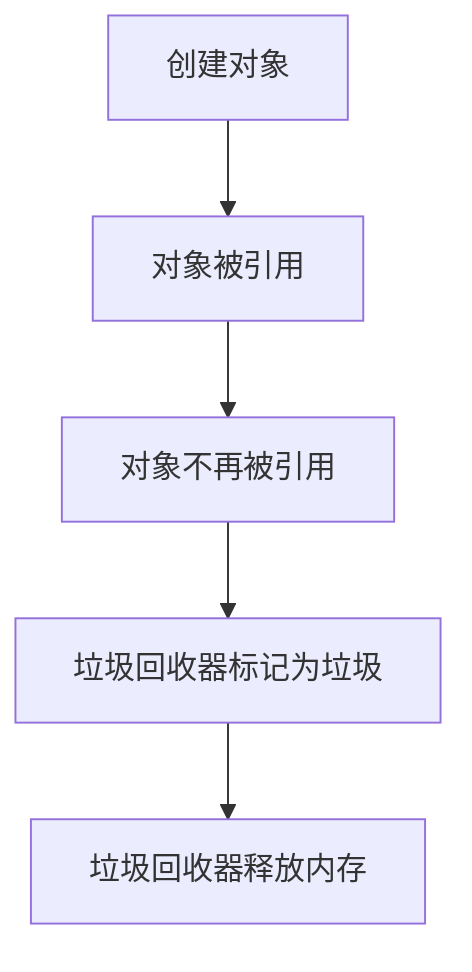

# C# 垃圾回收

在C#编程中，垃圾回收（Garbage Collection, GC）是一个自动内存管理机制，它帮助开发者避免手动管理内存的复杂性。通过垃圾回收，C#运行时环境会自动释放不再使用的对象所占用的内存，从而减少内存泄漏的风险。

## 什么是垃圾回收？

垃圾回收是.NET运行时环境的一部分，它负责自动管理应用程序的内存。当一个对象不再被引用时，垃圾回收器会将其标记为“垃圾”，并在适当的时候释放其占用的内存。这个过程是自动的，开发者通常不需要手动干预。

### 垃圾回收的工作原理

垃圾回收器通过跟踪对象的引用关系来确定哪些对象是“可达的”（即仍然被引用的），哪些是“不可达的”（即不再被引用的）。不可达的对象被认为是垃圾，垃圾回收器会在适当的时候释放这些对象占用的内存。



## 垃圾回收的步骤

1. **标记阶段**：垃圾回收器遍历所有对象，标记那些仍然被引用的对象。
2. **清除阶段**：垃圾回收器释放那些未被标记的对象所占用的内存。
3. **压缩阶段**（可选）：垃圾回收器可能会移动内存中的对象，以减少内存碎片。

## 代码示例

以下是一个简单的C#代码示例，展示了垃圾回收的基本概念：

```csharp
using System;

class Program
{
    static void Main()
    {
        // 创建一个对象
        var obj = new MyClass();

        // 对象不再被引用
        obj = null;

        // 强制进行垃圾回收（仅用于演示，通常不需要手动调用）
        GC.Collect();

        Console.WriteLine("垃圾回收已完成。");
    }
}

class MyClass
{
    // 析构函数，用于演示对象被回收
    ~MyClass()
    {
        Console.WriteLine("MyClass对象已被回收。");
    }
}
```

**输出：**
```
MyClass对象已被回收。
垃圾回收已完成。
```

:::note
在实际开发中，通常不需要手动调用 `GC.Collect()`，因为垃圾回收器会自动管理内存。手动调用可能会影响性能。
:::

## 实际应用场景

垃圾回收在以下场景中尤为重要：

1. **长时间运行的应用程序**：如Web服务器或后台服务，这些应用程序需要长时间运行，垃圾回收可以帮助避免内存泄漏。
2. **内存密集型应用程序**：如图像处理或科学计算应用程序，这些应用程序需要处理大量数据，垃圾回收可以帮助管理内存使用。
3. **多线程应用程序**：在多线程环境中，垃圾回收可以确保线程安全地管理内存。

## 总结

C#的垃圾回收机制是一个强大的工具，它帮助开发者自动管理内存，减少内存泄漏的风险。虽然垃圾回收是自动的，但了解其工作原理和如何优化内存使用仍然非常重要。

## 附加资源

- [.NET垃圾回收文档](https://docs.microsoft.com/en-us/dotnet/standard/garbage-collection/)
- [C#内存管理最佳实践](https://docs.microsoft.com/en-us/dotnet/standard/memory-best-practices)

## 练习

1. 编写一个C#程序，创建多个对象并观察垃圾回收的行为。
2. 研究如何通过调整垃圾回收器的设置来优化应用程序性能。

:::tip
尝试使用 `GC.GetTotalMemory` 方法来监控应用程序的内存使用情况。
:::