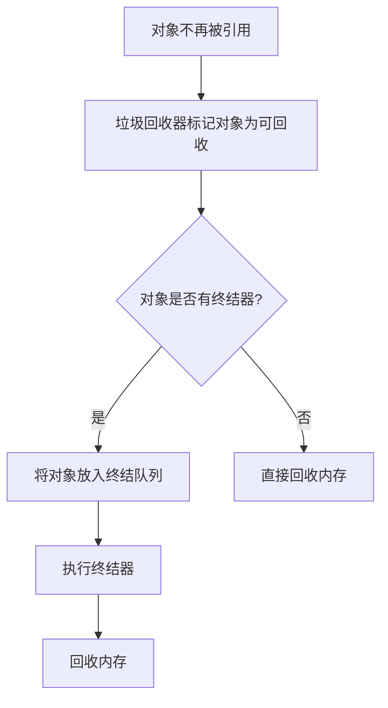

## 介绍

在C#中，终结器（Finalizer）和析构函数（Destructor）是用于管理对象生命周期的重要机制。它们的主要作用是确保在对象被销毁时，能够正确地释放非托管资源（如文件句柄、数据库连接等）。C#的垃圾回收器（Garbage Collector, GC）会自动管理托管资源的内存，但对于非托管资源，我们需要手动进行清理。

:::note
C#中的析构函数实际上是一种特殊的终结器，它使用 `~ClassName` 语法定义。
:::

## 终结器与析构函数的基本概念

### 什么是终结器？

终结器是C#中用于在对象被垃圾回收之前执行清理操作的特殊方法。它由垃圾回收器调用，无法手动调用。终结器的定义方式如下：

```csharp
class MyClass
{
    ~MyClass()
    {
        // 清理非托管资源
    }
}
```

### 什么是析构函数？

在C#中，析构函数是终结器的一种语法糖。它使用 `~ClassName` 语法定义，实际上会被编译器转换为终结器。例如：

```csharp
class MyClass
{
    ~MyClass()
    {
        // 清理非托管资源
    }
}
```

:::caution
析构函数（终结器）的执行时间是不确定的，因为它依赖于垃圾回收器的调度。因此，不应该依赖析构函数来释放关键资源。
:::

## 终结器的工作原理

当对象不再被引用时，垃圾回收器会将其标记为可回收。在垃圾回收过程中，如果对象定义了终结器，垃圾回收器会将其放入终结队列（Finalization Queue）。随后，终结器会在一个单独的线程中执行，释放非托管资源。最后，对象的内存会被回收。



## 代码示例

以下是一个简单的示例，展示了如何在C#中使用终结器来释放非托管资源：

```csharp
using System;

class ResourceHolder
{
    private IntPtr handle; // 假设这是一个非托管资源

    public ResourceHolder()
    {
        handle = IntPtr.Zero; // 初始化资源
        Console.WriteLine("Resource acquired.");
    }

    ~ResourceHolder()
    {
        // 释放非托管资源
        if (handle != IntPtr.Zero)
        {
            // 假设这里调用了一个释放资源的函数
            Console.WriteLine("Resource released.");
        }
    }
}

class Program
{
    static void Main()
    {
        ResourceHolder holder = new ResourceHolder();
        holder = null; // 使对象不再被引用

        // 强制垃圾回收（仅用于演示，实际开发中不建议频繁调用）
        GC.Collect();
        GC.WaitForPendingFinalizers();

        Console.WriteLine("End of program.");
    }
}
```

**输出：**
```
Resource acquired.
Resource released.
End of program.
```

:::tip
在实际开发中，尽量避免手动调用 `GC.Collect()`，因为垃圾回收器的调度是高度优化的，频繁调用可能会影响性能。
:::

## 实际应用场景

终结器通常用于以下场景：
1. **释放非托管资源**：如文件句柄、数据库连接、网络套接字等。
2. **日志记录**：在对象销毁时记录日志，用于调试或审计。
3. **资源清理**：确保在对象销毁时释放所有占用的资源，避免内存泄漏。

### 示例：文件句柄的释放

```csharp
using System;
using System.IO;

class FileHandler
{
    private FileStream fileStream;

    public FileHandler(string filePath)
    {
        fileStream = new FileStream(filePath, FileMode.Open);
        Console.WriteLine("File opened.");
    }

    ~FileHandler()
    {
        if (fileStream != null)
        {
            fileStream.Close();
            Console.WriteLine("File closed.");
        }
    }
}

class Program
{
    static void Main()
    {
        FileHandler handler = new FileHandler("example.txt");
        handler = null;

        GC.Collect();
        GC.WaitForPendingFinalizers();

        Console.WriteLine("End of program.");
    }
}
```

**输出：**
```
File opened.
File closed.
End of program.
```

## 总结

终结器和析构函数是C#中用于管理对象生命周期的重要工具，特别是在处理非托管资源时。虽然它们提供了自动清理资源的机制，但由于其执行时间的不确定性，建议使用 `IDisposable` 接口和 `using` 语句来显式管理资源。

:::warning
终结器的执行可能会延迟，因此对于需要立即释放的资源，应优先使用 `IDisposable` 接口。
:::

## 附加资源与练习

### 附加资源
- [C# 文档：Finalizers](https://learn.microsoft.com/en-us/dotnet/csharp/programming-guide/classes-and-structs/finalizers)
- [C# 文档：IDisposable 接口](https://learn.microsoft.com/en-us/dotnet/api/system.idisposable)

### 练习
1. 修改上面的 `FileHandler` 类，使其实现 `IDisposable` 接口，并使用 `using` 语句来管理文件资源。
2. 创建一个类，模拟数据库连接的管理，并在终结器中释放连接。
3. 研究 `GC.SuppressFinalize` 方法的作用，并在你的代码中使用它来优化性能。

通过以上内容，你应该对C#中的终结器和析构函数有了更深入的理解。继续练习并探索更多高级主题，以提升你的编程技能！