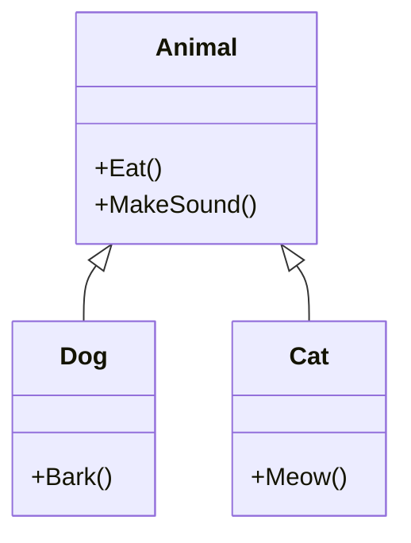

## 介绍

在面向对象编程（OOP）中，**继承**是一个核心概念，它允许一个类（子类）基于另一个类（父类）来创建。通过继承，子类可以复用父类的属性和方法，同时还可以扩展或修改这些功能。继承是代码复用和层次化设计的重要工具。

在 C# 中，继承通过 `:` 符号实现。子类继承父类的所有公共（`public`）和受保护（`protected`）成员，但不能继承私有（`private`）成员。

## 基本语法

以下是 C# 中继承的基本语法：

```csharp
class ParentClass
{
    public void ParentMethod()
    {
        Console.WriteLine("这是父类的方法");
    }
}

class ChildClass : ParentClass
{
    public void ChildMethod()
    {
        Console.WriteLine("这是子类的方法");
    }
}
```

在这个例子中，`ChildClass` 继承了 `ParentClass`，因此它可以访问 `ParentMethod` 方法。

## 继承的实际应用

### 1. 代码复用

继承的主要目的是代码复用。通过继承，子类可以直接使用父类的功能，而不需要重新编写相同的代码。

```csharp
class Animal
{
    public void Eat()
    {
        Console.WriteLine("动物在吃东西");
    }
}

class Dog : Animal
{
    public void Bark()
    {
        Console.WriteLine("狗在汪汪叫");
    }
}

class Program
{
    static void Main(string[] args)
    {
        Dog dog = new Dog();
        dog.Eat();  // 继承自 Animal 类
        dog.Bark(); // Dog 类自己的方法
    }
}
```

**输出：**
```
动物在吃东西
狗在汪汪叫
```

### 2. 扩展功能

子类不仅可以复用父类的功能，还可以扩展或修改这些功能。例如，子类可以重写父类的方法。

```csharp
class Animal
{
    public virtual void MakeSound()
    {
        Console.WriteLine("动物发出声音");
    }
}

class Dog : Animal
{
    public override void MakeSound()
    {
        Console.WriteLine("狗在汪汪叫");
    }
}

class Program
{
    static void Main(string[] args)
    {
        Animal myDog = new Dog();
        myDog.MakeSound();  // 调用的是 Dog 类的 MakeSound 方法
    }
}
```

**输出：**
```
狗在汪汪叫
```

:::note
**注意：** 在 C# 中，使用 `virtual` 关键字标记的方法可以在子类中被重写（`override`）。如果父类的方法没有标记为 `virtual`，则子类不能重写该方法。
:::

### 3. 多级继承

C# 支持多级继承，即一个类可以继承自另一个类，而后者又可以继承自另一个类。

```csharp
class Grandparent
{
    public void GrandparentMethod()
    {
        Console.WriteLine("这是祖父类的方法");
    }
}

class Parent : Grandparent
{
    public void ParentMethod()
    {
        Console.WriteLine("这是父类的方法");
    }
}

class Child : Parent
{
    public void ChildMethod()
    {
        Console.WriteLine("这是子类的方法");
    }
}

class Program
{
    static void Main(string[] args)
    {
        Child child = new Child();
        child.GrandparentMethod(); // 继承自 Grandparent 类
        child.ParentMethod();      // 继承自 Parent 类
        child.ChildMethod();       // Child 类自己的方法
    }
}
```

**输出：**
```
这是祖父类的方法
这是父类的方法
这是子类的方法
```

:::caution
**注意：** C# 不支持多重继承，即一个类不能同时继承多个类。如果需要实现类似的功能，可以使用接口（`interface`）。
:::

## 继承的层次结构

为了更好地理解继承的层次结构，我们可以使用 Mermaid 图表来展示类之间的关系。



在这个图表中，`Dog` 和 `Cat` 类都继承自 `Animal` 类，因此它们可以复用 `Animal` 类的方法。

## 实际案例：游戏开发中的继承

假设我们正在开发一个简单的游戏，游戏中有多种类型的角色，如战士、法师和弓箭手。这些角色都有一些共同的属性和行为，例如生命值（`Health`）和攻击（`Attack`）方法。我们可以使用继承来实现这些角色的共性。

```csharp
class Character
{
    public int Health { get; set; }

    public Character(int health)
    {
        Health = health;
    }

    public virtual void Attack()
    {
        Console.WriteLine("角色发动攻击");
    }
}

class Warrior : Character
{
    public Warrior(int health) : base(health) { }

    public override void Attack()
    {
        Console.WriteLine("战士使用剑攻击");
    }
}

class Mage : Character
{
    public Mage(int health) : base(health) { }

    public override void Attack()
    {
        Console.WriteLine("法师使用魔法攻击");
    }
}

class Program
{
    static void Main(string[] args)
    {
        Warrior warrior = new Warrior(100);
        Mage mage = new Mage(80);

        warrior.Attack(); // 战士使用剑攻击
        mage.Attack();    // 法师使用魔法攻击
    }
}
```

**输出：**
```
战士使用剑攻击
法师使用魔法攻击
```

在这个例子中，`Warrior` 和 `Mage` 类都继承自 `Character` 类，因此它们可以复用 `Health` 属性和 `Attack` 方法。同时，它们还可以根据自己的特性重写 `Attack` 方法。

## 总结

继承是 C# 面向对象编程中的一个重要概念，它允许子类复用父类的功能，并在此基础上进行扩展或修改。通过继承，我们可以实现代码的复用和层次化设计，从而提高代码的可维护性和可扩展性。

:::tip
**提示：** 在实际开发中，合理使用继承可以大大减少代码的重复，但也要注意避免过度使用继承，以免导致类层次结构过于复杂。
:::

## 附加资源与练习

1. **练习：** 创建一个 `Vehicle` 类，并从中派生出 `Car` 和 `Bicycle` 类。为每个子类添加独特的方法，并测试它们的继承关系。
2. **进一步学习：** 了解 C# 中的接口（`interface`）和抽象类（`abstract class`），它们是如何与继承结合使用的。

通过不断练习和探索，你将更好地掌握 C# 中的继承概念，并能够在实际项目中灵活运用。