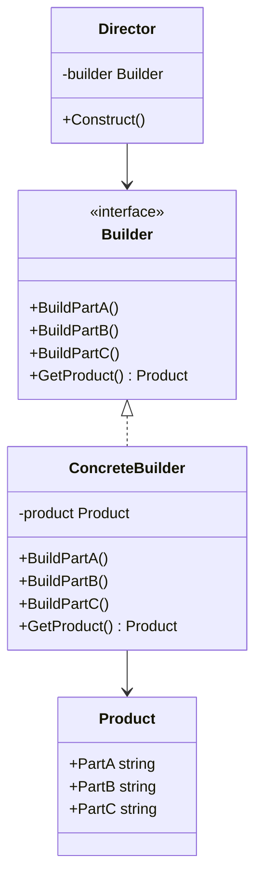

# Go 生成器模式

## 介绍

生成器模式（Builder Pattern）是一种创建型设计模式，它允许你逐步构建复杂对象。与直接实例化对象不同，生成器模式通过将对象的构建过程分解为多个步骤，使得对象的创建更加灵活和可控。在Go语言中，生成器模式通常用于构建具有多个可选参数或复杂配置的对象。

生成器模式的核心思想是将对象的构建过程与对象的表示分离。通过这种方式，你可以使用相同的构建过程来创建不同的对象表示。

## 生成器模式的结构

生成器模式通常包含以下几个角色：

1. **产品（Product）**：最终要构建的复杂对象。
2. **生成器（Builder）**：定义构建产品的接口，通常包含多个方法来设置产品的各个部分。
3. **具体生成器（Concrete Builder）**：实现生成器接口，负责实际构建产品的各个部分。
4. **指挥者（Director）**：负责控制构建过程，通常包含一个构建方法，该方法调用生成器的各个方法来逐步构建产品。



## 代码示例

让我们通过一个简单的例子来理解生成器模式。假设我们要构建一个复杂的`House`对象，该对象包含多个部分，如`Foundation`、`Walls`和`Roof`。

### 1. 定义产品

首先，我们定义`House`结构体，它表示最终要构建的产品。

```go
type House struct {
    Foundation string
    Walls      string
    Roof       string
}
```

### 2. 定义生成器接口

接下来，我们定义生成器接口`HouseBuilder`，它包含构建`House`各个部分的方法。

```go
type HouseBuilder interface {
    BuildFoundation()
    BuildWalls()
    BuildRoof()
    GetHouse() House
}
```

### 3. 实现具体生成器

然后，我们实现具体的生成器`ConcreteHouseBuilder`，它负责实际构建`House`的各个部分。

```go
type ConcreteHouseBuilder struct {
    house House
}

func (b *ConcreteHouseBuilder) BuildFoundation() {
    b.house.Foundation = "Concrete Foundation"
}

func (b *ConcreteHouseBuilder) BuildWalls() {
    b.house.Walls = "Brick Walls"
}

func (b *ConcreteHouseBuilder) BuildRoof() {
    b.house.Roof = "Tile Roof"
}

func (b *ConcreteHouseBuilder) GetHouse() House {
    return b.house
}
```

### 4. 定义指挥者

最后，我们定义指挥者`Director`，它负责控制构建过程。

```go
type Director struct {
    builder HouseBuilder
}

func (d *Director) Construct() {
    d.builder.BuildFoundation()
    d.builder.BuildWalls()
    d.builder.BuildRoof()
}
```

### 5. 使用生成器模式

现在，我们可以使用生成器模式来构建一个`House`对象。

```go
func main() {
    builder := &ConcreteHouseBuilder{}
    director := &Director{builder: builder}

    director.Construct()
    house := builder.GetHouse()

    fmt.Printf("House built with %s, %s, and %s\n", house.Foundation, house.Walls, house.Roof)
}
```

输出结果：

```
House built with Concrete Foundation, Brick Walls, and Tile Roof
```

## 实际应用场景

生成器模式在以下场景中非常有用：

1. **复杂对象的构建**：当对象的构建过程非常复杂，包含多个步骤或可选参数时，生成器模式可以帮助你将构建过程分解为多个简单的步骤。
2. **不同表示的对象**：如果你需要构建具有不同表示的对象，生成器模式允许你使用相同的构建过程来创建不同的对象表示。
3. **避免构造函数参数过多**：当对象的构造函数需要传递大量参数时，生成器模式可以帮助你避免构造函数参数过多的问题。

## 总结

生成器模式是一种非常有用的设计模式，它允许你逐步构建复杂对象，并将对象的构建过程与对象的表示分离。通过使用生成器模式，你可以使代码更加灵活、可维护，并且更容易扩展。

在实际开发中，生成器模式常用于构建复杂的配置对象、UI组件、文档结构等。通过掌握生成器模式，你可以更好地应对复杂对象的构建需求。

## 附加资源与练习

- **练习**：尝试实现一个生成器模式来构建一个`Car`对象，该对象包含`Engine`、`Wheels`和`Body`等部分。
- **进一步阅读**：阅读Go语言中的其他创建型设计模式，如工厂模式、单例模式等，了解它们与生成器模式的区别与联系。

:::tip
生成器模式非常适合用于构建具有多个可选参数或复杂配置的对象。通过将构建过程分解为多个步骤，你可以使代码更加清晰和易于维护。
:::