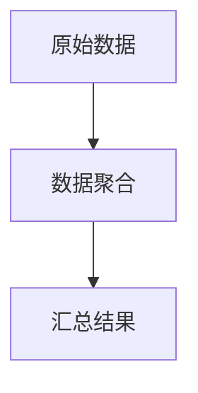

# Go 数据聚合

数据聚合是数据处理中的一个重要概念，它指的是将多个数据项组合成一个或多个汇总结果的过程。在Go语言中，数据聚合通常用于统计、分析和简化数据。本文将介绍如何在Go中实现数据聚合，并通过实际案例帮助你理解其应用。

## 什么是数据聚合？

数据聚合是将多个数据项合并为一个汇总结果的过程。常见的聚合操作包括求和、平均值、最大值、最小值等。这些操作可以帮助我们从大量数据中提取有用的信息。

例如，假设我们有一组销售数据，我们可以通过聚合操作计算出总销售额、平均销售额、最高销售额等。

## 基本聚合操作

在Go中，我们可以使用循环和条件语句来实现基本的聚合操作。以下是一个简单的示例，展示了如何计算一组整数的总和、平均值、最大值和最小值。

```go
package main

import (
    "fmt"
    "math"
)

func main() {
    numbers := []int{10, 20, 30, 40, 50}

    sum := 0
    max := math.MinInt64
    min := math.MaxInt64

    for _, num := range numbers {
        sum += num
        if num > max {
            max = num
        }
        if num < min {
            min = num
        }
    }

    average := float64(sum) / float64(len(numbers))

    fmt.Printf("Sum: %d\n", sum)
    fmt.Printf("Average: %.2f\n", average)
    fmt.Printf("Max: %d\n", max)
    fmt.Printf("Min: %d\n", min)
}
```

**输入：**
```go
numbers := []int{10, 20, 30, 40, 50}
```

**输出：**
```
Sum: 150
Average: 30.00
Max: 50
Min: 10
```

:::tip
在实际开发中，你可以将聚合操作封装成函数，以便在多个地方重复使用。
:::

## 实际案例：销售数据分析

假设我们有一组销售数据，每条记录包含产品名称和销售额。我们的目标是计算每个产品的总销售额。

```go
package main

import (
    "fmt"
)

type Sale struct {
    Product string
    Amount  float64
}

func main() {
    sales := []Sale{
        {"Product A", 100.0},
        {"Product B", 200.0},
        {"Product A", 150.0},
        {"Product C", 300.0},
        {"Product B", 250.0},
    }

    productSales := make(map[string]float64)

    for _, sale := range sales {
        productSales[sale.Product] += sale.Amount
    }

    for product, total := range productSales {
        fmt.Printf("%s: %.2f\n", product, total)
    }
}
```

**输入：**
```go
sales := []Sale{
    {"Product A", 100.0},
    {"Product B", 200.0},
    {"Product A", 150.0},
    {"Product C", 300.0},
    {"Product B", 250.0},
}
```

**输出：**
```
Product A: 250.00
Product B: 450.00
Product C: 300.00
```

:::note
在这个例子中，我们使用了 `map` 来存储每个产品的总销售额。`map` 是Go中用于存储键值对的数据结构，非常适合用于数据聚合。
:::

## 使用 `mermaid` 绘制数据流图

以下是一个简单的数据流图，展示了数据聚合的过程。



## 总结

数据聚合是数据处理中的一个重要概念，它可以帮助我们从大量数据中提取有用的信息。在Go语言中，我们可以使用循环、条件语句和 `map` 等数据结构来实现数据聚合。通过实际案例，我们展示了如何计算一组整数的总和、平均值、最大值和最小值，以及如何计算每个产品的总销售额。

## 附加资源与练习

- **练习1**：编写一个Go程序，计算一组浮点数的标准差。
- **练习2**：扩展销售数据分析案例，计算每个产品的平均销售额。
- **附加资源**：阅读Go官方文档中关于 `map` 和 `slice` 的部分，了解更多关于数据结构的细节。

通过不断练习和探索，你将能够熟练掌握Go中的数据聚合技术，并将其应用到实际项目中。