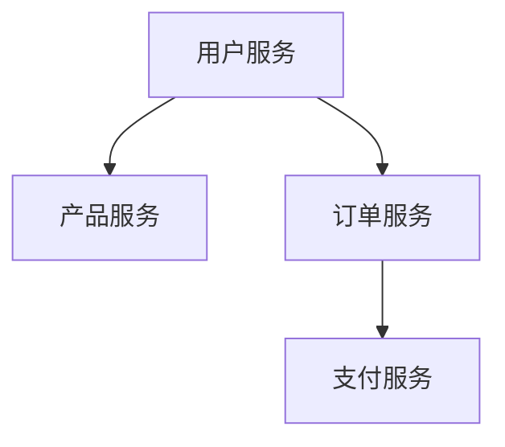

# Go 微服务

## 介绍

微服务架构是一种将应用程序拆分为多个小型、独立服务的软件开发方法。每个服务都运行在自己的进程中，并通过轻量级的通信机制（通常是 HTTP 或 gRPC）与其他服务进行交互。Go 语言因其高性能、简洁的语法和强大的并发支持，成为构建微服务的理想选择。

在本教程中，我们将逐步介绍如何使用 Go 构建微服务，并通过实际案例展示其应用场景。

## 微服务的基本概念

### 什么是微服务？

微服务是一种架构风格，它将应用程序拆分为多个小型、独立的服务。每个服务都专注于完成特定的业务功能，并且可以独立开发、部署和扩展。微服务之间通过 API 进行通信，通常使用 RESTful API 或 gRPC。

### 微服务的优势

- **模块化**：每个服务都是独立的，可以单独开发、测试和部署。
- **可扩展性**：可以根据需求单独扩展某个服务，而不需要扩展整个应用程序。
- **技术多样性**：不同的服务可以使用不同的技术栈，选择最适合的工具和语言。
- **容错性**：一个服务的故障不会影响整个系统的运行。

## 使用 Go 构建微服务

### 1. 创建一个简单的 HTTP 服务

首先，我们从一个简单的 HTTP 服务开始。这个服务将提供一个 `/hello` 端点，返回一个简单的 JSON 响应。

```go
package main

import (
    "encoding/json"
    "net/http"
)

func helloHandler(w http.ResponseWriter, r *http.Request) {
    response := map[string]string{"message": "Hello, World!"}
    w.Header().Set("Content-Type", "application/json")
    json.NewEncoder(w).Encode(response)
}

func main() {
    http.HandleFunc("/hello", helloHandler)
    http.ListenAndServe(":8080", nil)
}
```

运行这个程序后，访问 `http://localhost:8080/hello`，你将看到以下输出：

```json
{
    "message": "Hello, World!"
}
```

### 2. 使用 gRPC 构建微服务

gRPC 是一个高性能的 RPC 框架，适合构建微服务。下面是一个简单的 gRPC 服务示例。

首先，定义一个 `.proto` 文件：

```proto
syntax = "proto3";

package helloworld;

service Greeter {
    rpc SayHello (HelloRequest) returns (HelloReply) {}
}

message HelloRequest {
    string name = 1;
}

message HelloReply {
    string message = 1;
}
```

然后，使用 `protoc` 生成 Go 代码：

```bash
protoc --go_out=. --go-grpc_out=. helloworld.proto
```

接下来，实现 gRPC 服务：

```go
package main

import (
    "context"
    "log"
    "net"

    "google.golang.org/grpc"
    pb "path/to/your/proto/package"
)

type server struct {
    pb.UnimplementedGreeterServer
}

func (s *server) SayHello(ctx context.Context, in *pb.HelloRequest) (*pb.HelloReply, error) {
    return &pb.HelloReply{Message: "Hello " + in.GetName()}, nil
}

func main() {
    lis, err := net.Listen("tcp", ":50051")
    if err != nil {
        log.Fatalf("failed to listen: %v", err)
    }
    s := grpc.NewServer()
    pb.RegisterGreeterServer(s, &server{})
    if err := s.Serve(lis); err != nil {
        log.Fatalf("failed to serve: %v", err)
    }
}
```

客户端代码：

```go
package main

import (
    "context"
    "log"
    "time"

    "google.golang.org/grpc"
    pb "path/to/your/proto/package"
)

func main() {
    conn, err := grpc.Dial("localhost:50051", grpc.WithInsecure(), grpc.WithBlock())
    if err != nil {
        log.Fatalf("did not connect: %v", err)
    }
    defer conn.Close()
    c := pb.NewGreeterClient(conn)

    ctx, cancel := context.WithTimeout(context.Background(), time.Second)
    defer cancel()
    r, err := c.SayHello(ctx, &pb.HelloRequest{Name: "World"})
    if err != nil {
        log.Fatalf("could not greet: %v", err)
    }
    log.Printf("Greeting: %s", r.GetMessage())
}
```

运行服务端和客户端后，客户端将输出：

```
Greeting: Hello World
```

### 3. 微服务之间的通信

在微服务架构中，服务之间通常通过 HTTP 或 gRPC 进行通信。以下是一个使用 HTTP 进行服务间通信的示例。

假设我们有两个服务：`Service A` 和 `Service B`。`Service A` 需要调用 `Service B` 的 `/data` 端点来获取数据。

```go
package main

import (
    "encoding/json"
    "net/http"
    "io/ioutil"
    "log"
)

func fetchDataFromServiceB() (string, error) {
    resp, err := http.Get("http://localhost:8081/data")
    if err != nil {
        return "", err
    }
    defer resp.Body.Close()

    body, err := ioutil.ReadAll(resp.Body)
    if err != nil {
        return "", err
    }

    var result map[string]string
    json.Unmarshal(body, &result)
    return result["data"], nil
}

func dataHandler(w http.ResponseWriter, r *http.Request) {
    data, err := fetchDataFromServiceB()
    if err != nil {
        http.Error(w, err.Error(), http.StatusInternalServerError)
        return
    }
    response := map[string]string{"data": data}
    w.Header().Set("Content-Type", "application/json")
    json.NewEncoder(w).Encode(response)
}

func main() {
    http.HandleFunc("/data", dataHandler)
    http.ListenAndServe(":8080", nil)
}
```

`Service B` 的实现：

```go
package main

import (
    "encoding/json"
    "net/http"
)

func dataHandler(w http.ResponseWriter, r *http.Request) {
    response := map[string]string{"data": "Some data from Service B"}
    w.Header().Set("Content-Type", "application/json")
    json.NewEncoder(w).Encode(response)
}

func main() {
    http.HandleFunc("/data", dataHandler)
    http.ListenAndServe(":8081", nil)
}
```

运行这两个服务后，访问 `http://localhost:8080/data`，你将看到 `Service A` 从 `Service B` 获取的数据：

```json
{
    "data": "Some data from Service B"
}
```

## 实际案例：电子商务平台的微服务架构

假设我们正在构建一个电子商务平台，该平台由以下几个微服务组成：

1. **用户服务**：负责用户注册、登录和身份验证。
2. **产品服务**：管理产品信息，包括产品列表、详情和库存。
3. **订单服务**：处理订单的创建、支付和状态更新。
4. **支付服务**：处理支付请求并与第三方支付网关集成。



在这个架构中，每个服务都可以独立开发、部署和扩展。例如，当用户下单时，订单服务会调用支付服务来处理支付请求，而支付服务则与第三方支付网关进行通信。

## 总结

通过本教程，我们了解了如何使用 Go 构建微服务。我们从简单的 HTTP 服务开始，逐步介绍了 gRPC 的使用以及微服务之间的通信。最后，我们通过一个电子商务平台的案例展示了微服务架构的实际应用。

微服务架构为现代应用程序提供了高度的灵活性和可扩展性，但也带来了复杂性。因此，在设计微服务时，需要仔细考虑服务的边界、通信机制以及如何管理服务的生命周期。

## 附加资源

- [Go 官方文档](https://golang.org/doc/)
- [gRPC 官方文档](https://grpc.io/docs/)
- [微服务架构设计模式](https://microservices.io/)

## 练习

1. 扩展本教程中的 HTTP 服务，添加更多的端点，例如 `/health` 和 `/info`。
2. 尝试使用 gRPC 构建一个更复杂的服务，例如一个简单的聊天应用。
3. 研究如何在实际项目中使用服务发现和负载均衡来管理微服务。

希望本教程能帮助你更好地理解和使用 Go 构建微服务。Happy coding!