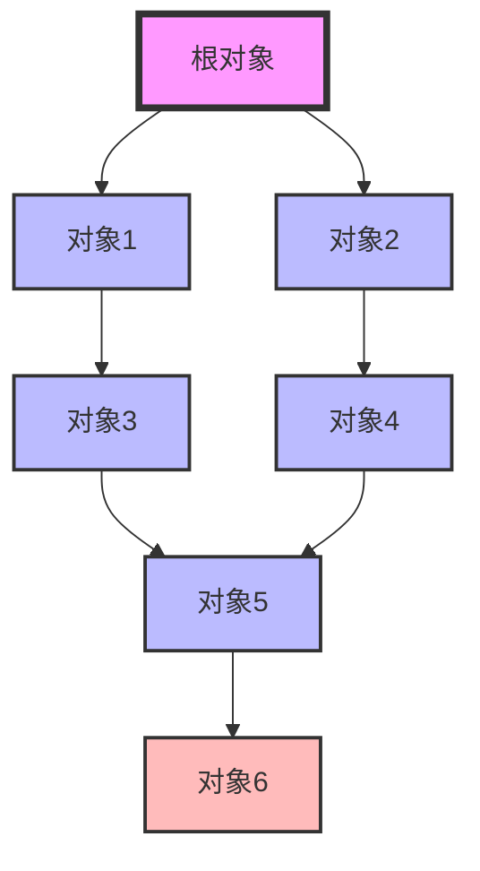

# Go 垃圾回收详解

Go语言以其高效的垃圾回收（Garbage Collection, GC）机制而闻名。垃圾回收是自动管理内存的一种方式，它帮助开发者避免手动管理内存的复杂性，减少内存泄漏的风险。本文将详细介绍Go语言中的垃圾回收机制，帮助你理解其工作原理、优化策略以及实际应用场景。

## 什么是垃圾回收？

垃圾回收是一种自动内存管理机制，用于回收不再使用的内存。在Go语言中，垃圾回收器会定期扫描程序的内存，找出不再被引用的对象，并释放它们占用的内存。这样可以避免内存泄漏，并确保程序的内存使用效率。

## Go 垃圾回收的工作原理

Go语言的垃圾回收器采用了**三色标记清除算法**（Tri-color Mark and Sweep）。该算法通过标记和清除两个阶段来回收内存。

### 三色标记清除算法

1. **标记阶段**：垃圾回收器从根对象（如全局变量、栈上的变量等）开始，遍历所有可达对象，并将其标记为“存活”。
2. **清除阶段**：垃圾回收器遍历整个堆，回收未被标记的对象（即“垃圾”），并将其内存释放。



在上图中，`对象6`没有被任何根对象引用，因此它将被标记为“垃圾”并在清除阶段被回收。

### 并发垃圾回收

Go的垃圾回收器是**并发**的，这意味着它可以在程序运行的同时进行垃圾回收。为了减少对程序性能的影响，Go的垃圾回收器采用了**写屏障**（Write Barrier）技术，确保在并发标记阶段不会遗漏任何对象。

## Go 垃圾回收的优化策略

Go语言的垃圾回收器经过多次优化，以下是一些关键的优化策略：

1. **分代回收**：Go的垃圾回收器采用了分代回收策略，将对象分为年轻代和老年代。年轻代的对象生命周期较短，回收频率较高；老年代的对象生命周期较长，回收频率较低。
2. **并发标记**：Go的垃圾回收器在标记阶段是并发的，减少了程序停顿时间。
3. **写屏障**：写屏障技术确保在并发标记阶段不会遗漏任何对象，提高了垃圾回收的准确性。

## 实际应用场景

### 案例1：内存泄漏检测

假设你有一个长时间运行的服务，随着时间的推移，内存使用量不断增加。通过分析垃圾回收日志，你可以发现内存泄漏的原因。

```go
package main

import (
    "fmt"
    "time"
)

func main() {
    var m map[int]string
    m = make(map[int]string)

    for i := 0; i < 1000000; i++ {
        m[i] = "value"
        if i%100000 == 0 {
            fmt.Println("Allocated", i, "elements")
        }
        time.Sleep(10 * time.Millisecond)
    }
}
```

在这个例子中，`map`会不断增长，最终可能导致内存泄漏。通过监控垃圾回收的行为，你可以及时发现并修复这个问题。

### 案例2：性能优化

在高性能要求的应用中，垃圾回收的停顿时间可能会影响程序的响应速度。通过调整垃圾回收的参数，如`GOGC`环境变量，可以优化垃圾回收的行为。

```bash
GOGC=50 go run main.go
```

`GOGC`环境变量控制垃圾回收的触发阈值。默认值为100，表示当堆内存增长到原来的100%时触发垃圾回收。将其设置为50可以减少堆内存的增长速度，从而减少垃圾回收的频率。

## 总结

Go语言的垃圾回收机制是其高效内存管理的关键。通过三色标记清除算法、并发标记和写屏障技术，Go的垃圾回收器能够在保证程序性能的同时，自动管理内存。理解垃圾回收的工作原理和优化策略，有助于你编写更高效、更稳定的Go程序。

## 附加资源

- [Go垃圾回收器官方文档](https://golang.org/doc/gc)
- [Go语言内存管理](https://golang.org/doc/effective_go#memory)
- [Go垃圾回收器源码分析](https://github.com/golang/go/blob/master/src/runtime/mgc.go)

## 练习

1. 编写一个Go程序，模拟内存泄漏，并使用`pprof`工具分析内存使用情况。
2. 调整`GOGC`环境变量，观察垃圾回收行为的变化，并记录其对程序性能的影响。
