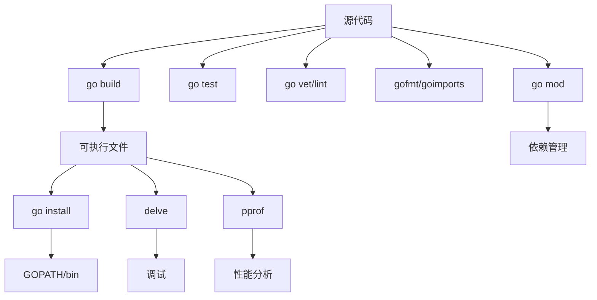

# Go 开发工具链

## 介绍

Go开发工具链是一系列用于开发、测试和部署Go应用程序的工具集合。作为一门现代编程语言，Go提供了强大而简洁的工具链，帮助开发者从项目初始化到最终部署的整个生命周期。掌握这些工具不仅能提高开发效率，还能帮助��编写更加健壮和高性能的Go代码。

本文将介绍Go工具链的核心组件，并通过实例展示如何在日常开发中使用这些工具。无论你是刚开始学习Go，还是想更深入了解Go的开发工具，本指南都将为你提供全面的参考。

## Go 工具链的核心组件

Go的工具链主要由以下核心组件组成：

1. **go** - 主命令行工具
2. **gofmt/goimports** - 代码格式化工具
3. **go build/install** - 编译工具
4. **go test** - 测试框架
5. **go mod** - 依赖管理
6. **go vet/lint** - 代码分析工具
7. **delve** - 调试工具
8. **pprof** - 性能分析工具

让我们逐一了解这些工具的功能和使用方法。

## 安装Go开发环境

在开始使用Go工具链之前，需要先安装Go开发环境。

:::tip
访问[Go官方下载页面](https://golang.org/dl/)获取最新版本的Go安装包。
:::

安装完成后，通过以下命令验证安装：

```bash
go version
```

输出示例：

```
go version go1.18.3 darwin/amd64
```

确保设置了`GOPATH`和`GOROOT`环境变量��

```bash
# 在Linux/Mac中设置
export GOROOT=/usr/local/go  # Go 安装目录
export GOPATH=$HOME/go       # 工作区目录
export PATH=$PATH:$GOROOT/bin:$GOPATH/bin
```

## go命令行工具

`go`命令是Go工具链的核心，它包含多个子命令，用于执行各种开发任务。

```bash
go help
```

常用的子命令包括：

- `go run` - 编译并运行Go程序
- `go build` - 编译Go程序
- `go install` - 编译并安装Go程序
- `go test` - 运行测试
- `go mod` - 依赖管理
- `go fmt` - 格式化代码
- `go get` - 下载并安装包和依赖

## 项目初始化与模块管理

### 创建新项目

使用Go模块初始化新项目：

```bash
mkdir myproject
cd myproject
go mod init github.com/yourusername/myproject
```

这将创建一个`go.mod`文件，定义项目的模块路径和依赖关系。

### 管理依赖

添加依赖：

```bash
go get github.com/gin-gonic/gin
```

输出示例：
```
go: downloading github.com/gin-gonic/gin v1.7.7
go: downloading github.com/json-iterator/go v1.1.12
go: downloading github.com/golang/protobuf v1.5.0
go: downloading github.com/modern-go/concurrent v0.0.0-20180306012644-bacd9c7ef1dd
```

更新依赖：

```bash
go get -u github.com/gin-gonic/gin
```

查看依赖图：

```bash
go mod graph
```

整理依赖：

```bash
go mod tidy
```

## 代码格式化

Go社区非常注重代码风格的一致性，提供了内置的代码格式化工具。

### gofmt

`gofmt`是Go的标准代码格式化工具：

```bash
gofmt -w main.go  # 格式化并覆盖原文件
```

### goimports

`goimports`在`gofmt`基础上增加了对导入语句的管理：

```bash
go install golang.org/x/tools/cmd/goimports@latest
goimports -w main.go
```

代码示例：

```go
package main

import (
    "fmt"
    "time"
)

func main() {
    fmt.Println("当前时间：", time.Now())
}
```

格式化后：

```go
package main

import (
	"fmt"
	"time"
)

func main() {
	fmt.Println("当前时间：", time.Now())
}
```

## 编译与构建

### go build

编译当前包：

```bash
go build
```

编译指定文件：

```bash
go build main.go
```

交叉编译（为其他操作系统/架构构建）：

```bash
GOOS=linux GOARCH=amd64 go build
```

输出示例：
```
生成可执行文件 myproject (Linux下是myproject, Windows下是myproject.exe)
```

### go install

编译并安装到`GOPATH/bin`：

```bash
go install
```

## 测试框架

Go内置了强大的测试框架，使用`go test`命令运行测试。

### 编写测试

创建以`_test.go`结尾的文件，包含以`Test`开头的函数：

```go
// math.go
package math

func Add(a, b int) int {
    return a + b
}
```

```go
// math_test.go
package math

import "testing"

func TestAdd(t *testing.T) {
    sum := Add(2, 3)
    expected := 5
    if sum != expected {
        t.Errorf("Add(2, 3) = %d; 期望 %d", sum, expected)
    }
}
```

### 运行测试

```bash
go test
```

输出示例：
```
PASS
ok      github.com/yourusername/myproject/math     0.002s
```

带覆盖率报告：

```bash
go test -cover
```

输出示例：
```
PASS
coverage: 100.0% of statements
ok      github.com/yourusername/myproject/math     0.002s
```

## 代码质量工具

### go vet

`go vet`检查代码中的常见错误：

```bash
go vet ./...
```

示例问题检测：

```go
func main() {
    fmt.Printf("%d") // 缺少参数
}
```

输出示例：
```
./main.go:6:14: Printf format %d has no args
```

### golint

`golint`检查代码风格问题：

```bash
go install golang.org/x/lint/golint@latest
golint ./...
```

示例检测：

```go
func add(a int, b int) int { // 导出函数应当有注释
    return a + b
}
```

输出示例：
```
main.go:5:1: exported function Add should have comment or be unexported
```

## 性能分析

Go提供了内置的性能分析工具`pprof`。

### CPU分析

```go
package main

import (
    "os"
    "runtime/pprof"
    "time"
)

func fibonacci(n int) int {
    if n <= 1 {
        return n
    }
    return fibonacci(n-1) + fibonacci(n-2)
}

func main() {
    // 创建CPU性能分析文件
    f, _ := os.Create("cpu.pprof")
    defer f.Close()
    pprof.StartCPUProfile(f)
    defer pprof.StopCPUProfile()
    
    // 计算斐波那契数列
    start := time.Now()
    result := fibonacci(40)
    elapsed := time.Since(start)
    
    println("斐波那契(40) =", result)
    println("耗时:", elapsed.String())
}
```

运行程序：

```bash
go run main.go
```

分析结果：

```bash
go tool pprof cpu.pprof
```

输出示例：
```
Type: cpu
Time: Mar 12, 2025 at 10:15am (CST)
Duration: 5.10s, Total samples = 4.92s (96.41%)
Entering interactive mode (type "help" for commands, "o" for options)
(pprof) top
Showing nodes accounting for 4.92s, 100% of 4.92s total
      flat  flat%   sum%        cum   cum%
     4.92s   100%   100%      4.92s   100%  main.fibonacci
         0     0%   100%      4.92s   100%  main.main
         0     0%   100%      4.92s   100%  runtime.main
```

### 内存分析

```go
package main

import (
    "os"
    "runtime/pprof"
)

func allocateMemory() []byte {
    return make([]byte, 50000000)
}

func main() {
    // 分配内存
    data := allocateMemory()
    _ = data

    // 创建内存分析文件
    f, _ := os.Create("mem.pprof")
    defer f.Close()
    pprof.WriteHeapProfile(f)
}
```

分析结果：

```bash
go tool pprof mem.pprof
```

## 调试工具 - Delve

Delve是专为Go语言设计的调试器。

安装Delve：

```bash
go install github.com/go-delve/delve/cmd/dlv@latest
```

启动调试：

```bash
dlv debug main.go
```

常用调试命令：

```
(dlv) break main.go:15        # 在指定行设置断点
(dlv) continue                # 继续执行到下一个断点
(dlv) next                    # 单步执行
(dlv) step                    # 步入函数
(dlv) print myVariable        # 打印变量值
(dlv) locals                  # 查看所有局部变量
(dlv) exit                    # 退出调试
```

## 实际应用案例

让我们通过一个实际案例展示如何使用Go工具链构建、测试和优化一个简单的Web服务。

### 项目结构

```
mywebservice/
  ├── go.mod
  ├── go.sum
  ├── main.go
  ├── handlers/
  │   ├── user.go
  │   └── user_test.go
  └── models/
      └── user.go
```

### 主程序代码

```go
// main.go
package main

import (
	"log"
	"net/http"

	"github.com/yourusername/mywebservice/handlers"
)

func main() {
	http.HandleFunc("/users", handlers.GetUsers)
	log.Println("服务启动在 :8080 端口")
	log.Fatal(http.ListenAndServe(":8080", nil))
}
```

### 处理器和测试

```go
// handlers/user.go
package handlers

import (
	"encoding/json"
	"net/http"

	"github.com/yourusername/mywebservice/models"
)

func GetUsers(w http.ResponseWriter, r *http.Request) {
	users := []models.User{
		{ID: 1, Name: "张三", Email: "zhangsan@example.com"},
		{ID: 2, Name: "李四", Email: "lisi@example.com"},
	}

	w.Header().Set("Content-Type", "application/json")
	json.NewEncoder(w).Encode(users)
}
```

```go
// handlers/user_test.go
package handlers

import (
	"encoding/json"
	"net/http"
	"net/http/httptest"
	"testing"

	"github.com/yourusername/mywebservice/models"
)

func TestGetUsers(t *testing.T) {
	req, err := http.NewRequest("GET", "/users", nil)
	if err != nil {
		t.Fatal(err)
	}

	rr := httptest.NewRecorder()
	handler := http.HandlerFunc(GetUsers)
	handler.ServeHTTP(rr, req)

	if status := rr.Code; status != http.StatusOK {
		t.Errorf("处理器返回了错误的状态码: got %v want %v",
			status, http.StatusOK)
	}

	var users []models.User
	if err := json.NewDecoder(rr.Body).Decode(&users); err != nil {
		t.Errorf("无法解析响应体: %v", err)
	}

	if len(users) != 2 {
		t.Errorf("期望得到2个用户, 实际得到 %d 个", len(users))
	}
}
```

### 模型定义

```go
// models/user.go
package models

type User struct {
	ID    int    `json:"id"`
	Name  string `json:"name"`
	Email string `json:"email"`
}
```

### 项目开发流程

1. **初始化项目**

```bash
mkdir mywebservice
cd mywebservice
go mod init github.com/yourusername/mywebservice
```

2. **编写代码和测试**

创建上述文件结构和代码。

3. **格式化代码**

```bash
gofmt -w .
```

4. **运行测试**

```bash
go test ./...
```

5. **检查代码质量**

```bash
go vet ./...
golint ./...
```

6. **构建应用**

```bash
go build -o mywebservice
```

7. **运行应用**

```bash
./mywebservice
```

8. **性能分析**（如需要）

```bash
go tool pprof http://localhost:8080/debug/pprof/profile
```

## Go 工具链图示

下面是Go工具链各组件之间关系的简化图示：



## 总结

Go开发工具链是一套精心设计的工具集，覆盖了从开发、测试到部署的整个软件开发生命周期。通过掌握这些工具，你可以：

- 高效管理Go项目和依赖
- 保持一致的代码风格
- 发现潜在的代码问题
- 有效测试你的应用
- 优化应用性能
- 调试复杂问题

作为Go初学者，建议先熟悉基本命令如`go build`、`go test`和`go fmt`，随着经验的增长，逐步探索更高级的工具如`pprof`和`delve`。

## 练习

1. 创建一个简单的Go应用，使用`go mod`初始化项目并添加一个外部依赖。
2. 为你的应用编写至少3个单元测试，并使用`go test`运行它们。
3. 使用`pprof`分析你的应用，找出可能的性能瓶颈。
4. 尝试使用`delve`调试你的应用，设置断点并检查变量值。

## 附加资源

:::tip
以下资源可以帮助你进一步了解Go工具链：

- [Go命令文档](https://golang.org/cmd/go/)
- [Go模块教程](https://golang.org/doc/modules/gomod-ref)
- [使用pprof进行性能分析](https://golang.org/doc/diagnostics)
- [Delve调试器文档](https://github.com/go-delve/delve)
:::

掌握Go工具链将使你的Go开发之旅更加高效和愉快。通过持续实践和探索，你将能够充分利用这些工具提高代码质量和开发效率。

祝你在Go编程之旅中取得成功！