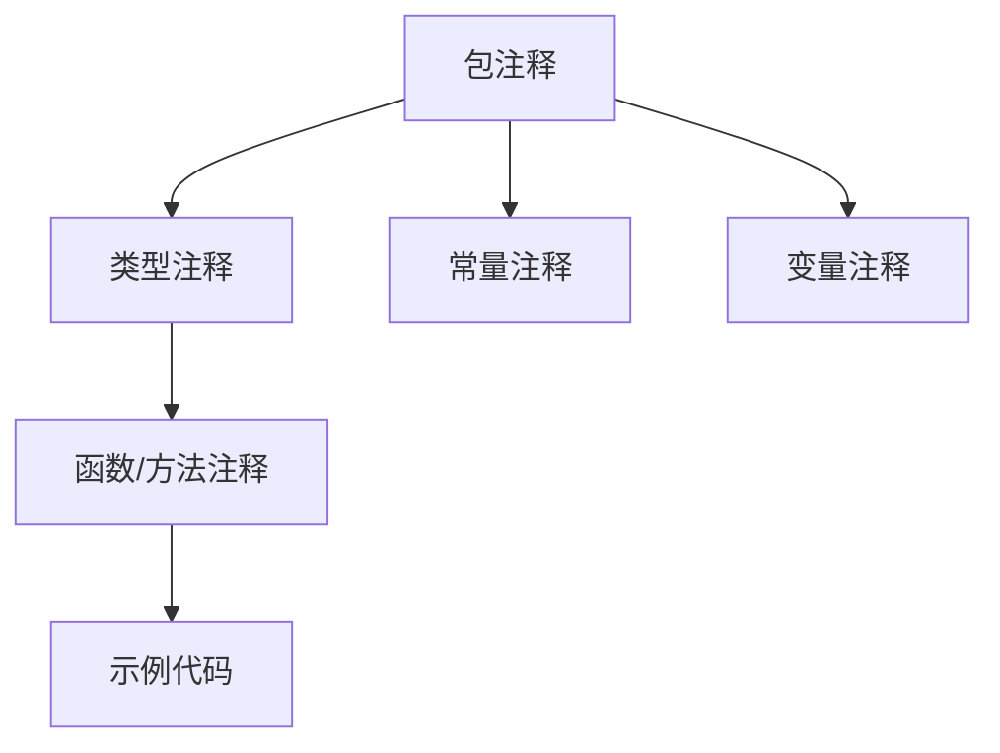

# Go 文档编写

## 介绍

文档是任何优秀软件项目的关键组成部分，对于Go项目来说尤为重要。Go语言以其简洁性和可读性而闻名，而优质的文档则进一步增强了这些特性。本文将介绍Go语言文档编写的各个方面，包括如何编写有效的注释、使用godoc工具生成文档，以及文档编写的最佳实践。无论你是刚开始学习Go，还是想提升自己的代码质量，掌握文档编写都将使你的项目更加专业和易于维护。

## Go 文档的基础知识

### Go 的文档哲学

Go语言的设计者认为，文档应该：

1. 简洁明了
2. 与代码紧密结合
3. 便于生成和访问
4. 标准化

在Go中，文档主要通过代码注释来实现，并使用内置的`godoc`工具自动生成。这种方法使得文档始终与代码保持同步，避免了文档过时的问题。

## 代码注释最佳实践

### 包注释

每个Go包都应该有一个包注释，位于package声明之前。包注释应该简要描述包的功能和使用方法。

```go
// Package stringutil 包含用于处理字符串的实用函数。
// 它提供了反转、截取和格式化等功能。
package stringutil
```

:::tip
包注释应放在单独的文件中（通常是`doc.go`），特别是当包较大或注释较长时。
:::

### 函数和方法注释

每个导出的函数和方法（首字母大写）都应该有注释。注释应以函数/方法名开始，简要说明其功能。

```go
// Reverse 返回将其参数字符串反转后的结果。
func Reverse(s string) string {
    // 实现代码
}
```

### 类型注释

对于结构体、接口等自定义类型，应提供清晰的注释说明其用途和行为。

```go
// User 表示系统中的用户实体。
// 它包含用户的基本信息以及身份验证相关字段。
type User struct {
    ID        int
    Username  string
    Email     string
    CreatedAt time.Time
}
```

### 示例代码

Go的文档系统支持可执行的示例代码，这些示例会在运行`go test`时被执行，确保示例始终有效。

```go
func ExampleReverse() {
    fmt.Println(Reverse("Hello, world!"))
    // Output: !dlrow ,olleH
}
```

## 使用godoc工具

### 安装和基本使用

从Go 1.13开始，`godoc`不再包含在标准Go安装中，需要单独安装：

```bash
go install golang.org/x/tools/cmd/godoc@latest
```

启动godoc服务器：

```bash
godoc -http=:6060
```

现在你可以在浏览器中访问`http://localhost:6060`查看本地Go包的文档。

### 查看特定包的文档

要查看特定包的文档，可以使用以下命令：

```bash
godoc fmt Println
```

这将显示`fmt`包中`Println`函数的文档。

## 文档格式化技巧

### Markdown支持

Go文档支持有限的Markdown语法，包括：

- 段落：空行分隔
- 代码块：缩进一个制表符或四个空格
- 链接：`[文本](URL)`

### 常见格式示例

```go
/*
Package calculator 提供基本的数学计算功能。

它支持以下操作：
  - 加法
  - 减法
  - 乘法
  - 除法

使用示例:

    result := calculator.Add(5, 3)
    fmt.Println(result) // 输出: 8
*/
package calculator
```

## 实际应用案例

### 案例1：标准库文档分析

以`net/http`包为例，让我们看看其文档结构：

```go
// Package http provides HTTP client and server implementations.
//
// Get, Head, Post, and PostForm make HTTP (or HTTPS) requests:
//
//	resp, err := http.Get("http://example.com/")
//	...
//	resp, err := http.Post("http://example.com/upload", "image/jpeg", &buf)
//	...
//	resp, err := http.PostForm("http://example.com/form",
//		url.Values{"key": {"Value"}, "id": {"123"}})
//
// The client must close the response body when finished with it:
//
//	resp, err := http.Get("http://example.com/")
//	if err != nil {
//		// handle error
//	}
//	defer resp.Body.Close()
//	body, err := io.ReadAll(resp.Body)
//	// ...
//
// For control over HTTP client headers, redirect policy, and other
// settings, create a Client:
//
//	client := &http.Client{
//		CheckRedirect: redirectPolicyFunc,
//	}
//	resp, err := client.Get("http://example.com")
//	// ...
//
// For control over proxies, TLS configuration, keep-alives,
// compression, and other settings, create a Transport:
//
//	tr := &http.Transport{
//		MaxIdleConns:       10,
//		IdleConnTimeout:    30 * time.Second,
//		DisableCompression: true,
//	}
//	client := &http.Client{Transport: tr}
//	resp, err := client.Get("https://example.com")
//
// ...
package http
```

标准库的文档展示了：
- 清晰的包描述
- 丰富的代码示例
- 常见用例的展示
- 重要注意事项的强调

### 案例2：项目文档实践

以下是一个真实项目中的文档示例：

```go
// Package config 提供应用程序配置管理功能。
//
// 配置加载顺序：
//  1. 默认配置
//  2. 配置文件 (config.yaml)
//  3. 环境变量 (APP_*)
//  4. 命令行参数
//
// 使用示例:
//
//  cfg, err := config.Load("config.yaml")
//  if err != nil {
//      log.Fatalf("加载配置失败: %v", err)
//  }
//  
//  dbConn := database.Connect(cfg.Database.DSN)
package config

// Config 表示应用程序的完整配置结构。
type Config struct {
    // Server 包含HTTP服务器相关配置。
    Server ServerConfig `yaml:"server" json:"server"`
    
    // Database 包含数据库连接相关配置。
    Database DatabaseConfig `yaml:"database" json:"database"`
    
    // LogLevel 定义应用程序的日志级别。
    // 可选值: "debug", "info", "warn", "error"
    LogLevel string `yaml:"log_level" json:"log_level"`
}
```

## Go 文档最佳实践

### 1. 保持文档更新

确保在修改代码时同步更新相关文档。过时的文档比没有文档更糟糕，因为它会误导开发者。

### 2. 文档要简洁

Go的设计哲学强调简洁性，文档也应遵循这一原则。避免冗长的描述，专注于功能和用法。

### 3. 使用完整句子

注释应该使用完整的句子，以大写字母开头，以句号结尾。这提高了可读性和专业性。

### 4. 包含示例

示例代码是文档的重要组成部分。一个好的示例胜过千言万语。使用`Example`函数提供可执行的示例。

:::caution
确保示例代码是可运行的，并且展示了函数的典型用法。
:::

### 5. 文档组织结构

遵循以下组织结构：



### 6. 避免显而易见的注释

不要写像这样的注释：

```go
// i是循环计数器
for i := 0; i < 10; i++ {
    // ...
}
```

相反，专注于解释"为什么"而不是"什么"。

## 使用第三方工具

除了标准的`godoc`，还有其他工具可以帮助改进Go文档：

### pkgsite

`pkgsite`是Go团队开发的新一代文档工具，提供更现代的UI和功能。

安装：

```bash
go install golang.org/x/pkgsite/cmd/pkgsite@latest
```

使用：

```bash
pkgsite -http=:8080
```

### Go Doc.org

[GoDoc.org](https://godoc.org)是一个在线服务，提供所有公共Go包的文档。只需将你的包发布到GitHub，它就会自动为你生成文档。

## 总结

编写优质的Go文档是良好编程实践的重要组成部分。通过遵循本文介绍的最佳实践，你可以：

- 提高代码的可维护性
- 帮助其他开发者理解和使用你的代码
- 为自己未来维护代码提供参考
- 展示你的专业水平

记住，好的文档不仅仅是为了别人，也是为了未来的你。当你几个月后回来查看自己的代码时，你会感谢当初写下的清晰文档。

## 练习与资源

### 练习

1. 为一个现有的Go函数添加符合标准的文档注释
2. 创建一个包含示例代码的文档
3. 使用godoc查看标准库中你最常用的包的文档，分析其结构

### 进一步学习资源

- [Effective Go - 文档章节](https://golang.org/doc/effective_go.html#commentary)
- [Go Doc注释](https://go.dev/blog/godoc)
- [标准库源代码](https://cs.opensource.google/go/go/+/master:src/) - 学习文档的最佳资源