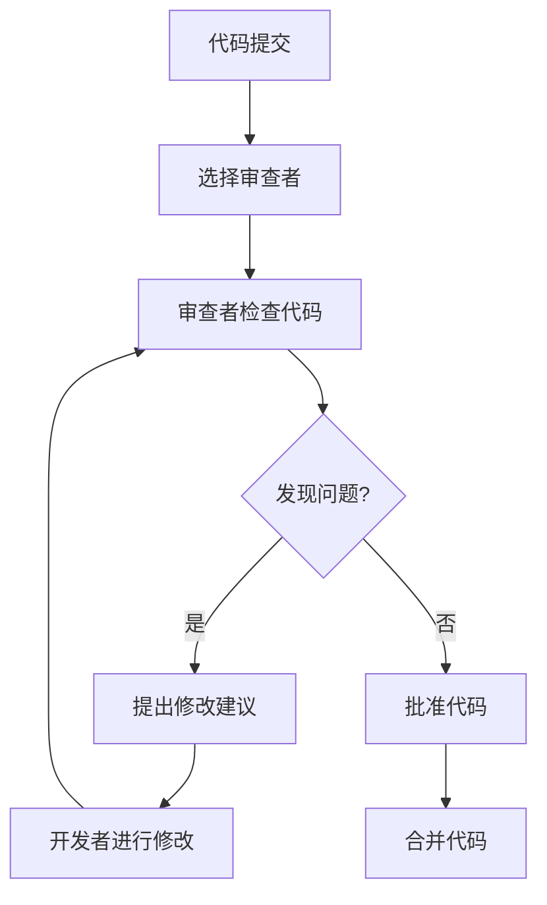

# Go 代码审查

## 什么是代码审查？

代码审查是软件开发过程中的一个关键环节，它是指开发者相互检查彼此的代码，以提高代码质量、减少错误并确保代码一致性的过程。在Go语言开发中，代码审查尤为重要，因为Go社区高度重视代码的可读性、简洁性和性能。

:::tip
良好的代码审查不仅能提高代码质量，还能促进团队成员之间的知识共享和技能提升！
:::

## Go 代码审查的目标

Go代码审查的主要目标包括：

1. **确保代码质量** - 检查代码是否符合Go的最佳实践和风格指南
2. **发现潜在的bug和安全问题** - 在代码部署到生产环境前及早发现问题
3. **知识共享** - 让团队成员了解彼此的工作并学习新技术
4. **保持代码一致性** - 确保整个代码库遵循相同的风格和模式
5. **提高代码性能** - 识别并改进可能的性能瓶颈

## Go 代码审查的基本流程



### 1. 提交代码

首先，开发者完成一项功能或修复后，将代码提交到版本控制系统（如Git）并创建一个拉取请求（Pull Request）。

### 2. 选择审查者

选择一位或多位熟悉该代码区域的团队成员作为审查者。

### 3. 审查代码

审查者检查代码，查找潜在问题并提供反馈。

### 4. 讨论和修改

基于审查者的反馈，原开发者进行必要的修改并回应评论。

### 5. 批准和合并

一旦所有问题都得到解决，审查者批准代码，然后代码可以被合并到主分支。

## Go 代码审查的重点领域

### 代码风格和格式

Go语言非常注重统一的代码风格。在审查中应检查：

- 代码是否通过`gofmt`或`goimports`格式化
- 命名约定是否符合Go规范（如使用驼峰命名法）
- 包名是否简洁、有意义
- 注释是否充分且有用

:::note
在Go中，命名约定很重要：短变量名对于局部变量，描述性名称对于导出的函数和类型。
:::

**示例：命名约定**

```go
// 不好的命名
func returnUserData(u string) (string, error) {
    // ...
}

// 好的命名
func GetUserProfile(username string) (Profile, error) {
    // ...
}
```

### 错误处理

Go的错误处理是显式的，代码审查应关注：

- 是否所有错误都得到了适当处理
- 错误信息是否有意义且一致
- 是否避免了过度嵌套的错误处理

**示例：错误处理**

```go
// 不好的错误处理
func ReadConfig() {
    data, err := ioutil.ReadFile("config.json")
    if err == nil {
        var config Config
        err = json.Unmarshal(data, &config)
        if err == nil {
            // 使用config...
        }
    }
}

// 好的错误处理
func ReadConfig() (*Config, error) {
    data, err := ioutil.ReadFile("config.json")
    if err != nil {
        return nil, fmt.Errorf("读取配置文件: %w", err)
    }
    
    var config Config
    if err := json.Unmarshal(data, &config); err != nil {
        return nil, fmt.Errorf("解析配置文件: %w", err)
    }
    
    return &config, nil
}
```

### 并发安全性

Go的goroutines和channels使并发编程变得简单，但也带来了新的挑战：

- 检查潜在的竞态条件
- 确保共享资源的适当同步
- 验证channel的使用是否正确
- 检查是否有goroutine泄露

**示例：并发安全**

```go
// 不安全的并发代码
var counter int

func increment() {
    counter++  // 可能导致竞态条件
}

// 安全的并发代码
var (
    counter int
    mu      sync.Mutex
)

func increment() {
    mu.Lock()
    counter++
    mu.Unlock()
}
```

### 性能考虑

Go代码审查应关注可能的性能问题：

- 是否有不必要的内存分配
- 是否有效地使用了切片和映射
- IO操作是否高效
- 是否存在昂贵的循环或操作

**示例：性能优化**

```go
// 性能较差的代码
func FindUser(users []User, id int) *User {
    for _, u := range users {
        if u.ID == id {
            return &u  // 返回循环变量的地址可能导致问题
        }
    }
    return nil
}

// 更好的性能代码
func FindUser(users []User, id int) *User {
    for i := range users {
        if users[i].ID == id {
            return &users[i]
        }
    }
    return nil
}
```

### 测试覆盖率

代码审查应评估测试的质量和覆盖率：

- 是否所有新功能都有单元测试
- 测试是否覆盖了边缘情况
- 测试是否可读且有意义
- 是否使用了表驱动测试等Go测试模式

**示例：表驱动测试**

```go
func TestCalculate(t *testing.T) {
    testCases := []struct {
        name     string
        input    int
        expected int
    }{
        {"零值", 0, 0},
        {"正数", 5, 10},
        {"负数", -5, -10},
    }
    
    for _, tc := range testCases {
        t.Run(tc.name, func(t *testing.T) {
            result := Calculate(tc.input)
            if result != tc.expected {
                t.Errorf("Calculate(%d) = %d; 期望值 %d", tc.input, result, tc.expected)
            }
        })
    }
}
```

## 代码审查工具

以下是一些有助于Go代码审查的工具：

1. **golint** - 检查代码风格问题
2. **go vet** - 发现代码中的可疑构造
3. **staticcheck** - 高级静态分析工具
4. **errcheck** - 确保错误得到适当处理
5. **gosec** - 安全性检查工具
6. **CodeReviewComments** - Go项目的代码审查指南

**使用这些工具的示例：**

```bash
# 运行基本的代码格式化
$ gofmt -s -w .

# 运行静态检查
$ go vet ./...
$ staticcheck ./...

# 检查错误处理
$ errcheck ./...

# 安全性检查
$ gosec ./...
```

## 真实案例：代码审查解决的问题

### 案例1：修复资源泄露

**原始代码：**

```go
func readData(filename string) ([]byte, error) {
    file, err := os.Open(filename)
    if err != nil {
        return nil, err
    }
    
    return ioutil.ReadAll(file)
}
```

**问题：** 文件没有关闭，导致资源泄露。

**修复后的代码：**

```go
func readData(filename string) ([]byte, error) {
    file, err := os.Open(filename)
    if err != nil {
        return nil, err
    }
    defer file.Close()
    
    return ioutil.ReadAll(file)
}
```

### 案例2：修复并发问题

**原始代码：**

```go
type Counter struct {
    Value int
}

func (c *Counter) Increment() {
    c.Value++
}

func (c *Counter) Get() int {
    return c.Value
}
```

**问题：** 在并发环境中使用会导致竞态条件。

**修复后的代码：**

```go
type Counter struct {
    mu    sync.Mutex
    value int
}

func (c *Counter) Increment() {
    c.mu.Lock()
    defer c.mu.Unlock()
    c.value++
}

func (c *Counter) Get() int {
    c.mu.Lock()
    defer c.mu.Unlock()
    return c.value
}
```

## 有效代码审查的技巧

1. **保持尊重和专业**：代码审查是关于代码，而不是人。提供建设性的反馈而不是批评。

2. **小批量审查**：每次审查的代码量应该适中，避免一次审查太多代码导致疲劳。

3. **使用清单**：创建一个代码审查清单，确保每次审查都涵盖所有关键点。

4. **解释为什么**：不仅指出问题，还要解释为什么这是个问题以及如何改进。

5. **自动化**：尽可能使用自动化工具来处理机械性的检查，让人类审查者专注于更复杂的问题。

:::caution
代码审查不应该成为瓶颈！保持审查的及时性，避免延迟反馈。
:::

## 总结

代码审查是Go开发过程中不可或缺的一部分，它有助于提高代码质量、发现潜在问题、促进知识共享，并确保代码库的一致性。通过关注代码风格、错误处理、并发安全性、性能和测试覆盖率等关键领域，并结合适当的工具和技巧，团队可以建立高效且有价值的代码审查流程。

记住，最好的代码审查既是技术活动，也是团队协作活动——它不仅仅是关于代码，也是关于人和沟通。

## 附加资源

- [Go代码审查评论](https://github.com/golang/go/wiki/CodeReviewComments) - Go团队的代码审查指南
- [Effective Go](https://golang.org/doc/effective_go) - 编写清晰、地道的Go代码的指南
- [Go语言规范](https://golang.org/ref/spec) - Go语言的官方规范

## 练习

1. 审查一个开源Go项目的拉取请求，记录你发现的问题和改进建议。
2. 与同事进行结对编程和代码审查，讨论不同的解决方案。
3. 为你的团队创建一个自定义的Go代码审查清单，包含最常见的问题和最佳实践。
4. 设置自动化工具（如golint、go vet和staticcheck）并在一个项目中运行它们，分析结果。