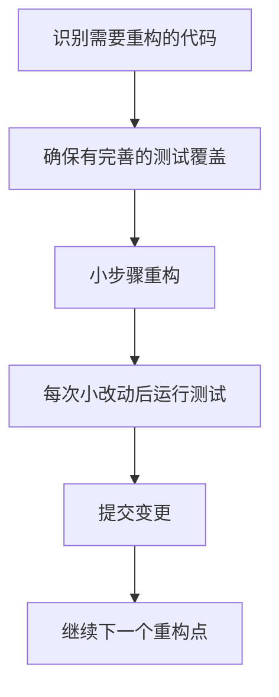

# Go 重构技巧

## 什么是重构？

重构是在不改变代码外部行为的前提下，改善代码内部结构的过程。这意味着重构后的代码功能保持不变，但代码变得更清晰、更简洁、更易于理解和维护。

对于 Go 程序员来说，掌握重构技巧可以显著提高代码质量和开发效率。

:::tip
重构应该是渐进式的小步骤，而不是大型的代码重写。这样可以降低引入新错误的风险。
:::

## 为什么需要重构？

- **改善代码可读性**：让代码更容易被其他开发者（包括未来的你）理解
- **降低技术债务**：避免代码随时间恶化
- **增强可维护性**：使未来的功能添加和错误修复更容易
- **提高性能**：有时重构可以帮助识别并解决性能瓶颈

## 常见的 Go 重构技巧

### 1. 提取函数

当你发现一段代码做了过多的事情时，可以考虑将其分解为多个独立的函数。

**重构前：**

```go
func ProcessOrder(order Order) error {
    // 验证订单
    if order.ID == "" {
        return errors.New("订单ID不能为空")
    }
    if order.Amount <= 0 {
        return errors.New("订单金额必须大于0")
    }
    if order.CustomerID == "" {
        return errors.New("客户ID不能为空")
    }
    
    // 处理支付
    payment := Payment{
        OrderID: order.ID,
        Amount: order.Amount,
        Method: order.PaymentMethod,
    }
    
    err := payment.Process()
    if err != nil {
        return fmt.Errorf("处理支付失败: %w", err)
    }
    
    // 发送通知
    notification := Notification{
        Type: "OrderProcessed",
        RecipientID: order.CustomerID,
        Content: fmt.Sprintf("您的订单 %s 已处理", order.ID),
    }
    
    err = notification.Send()
    if err != nil {
        return fmt.Errorf("发送通知失败: %w", err)
    }
    
    return nil
}
```

**重构后：**

```go
func ProcessOrder(order Order) error {
    if err := validateOrder(order); err != nil {
        return err
    }
    
    if err := processPayment(order); err != nil {
        return err
    }
    
    if err := sendOrderNotification(order); err != nil {
        return err
    }
    
    return nil
}

func validateOrder(order Order) error {
    if order.ID == "" {
        return errors.New("订单ID不能为空")
    }
    if order.Amount <= 0 {
        return errors.New("订单金额必须大于0")
    }
    if order.CustomerID == "" {
        return errors.New("客户ID不能为空")
    }
    return nil
}

func processPayment(order Order) error {
    payment := Payment{
        OrderID: order.ID,
        Amount: order.Amount,
        Method: order.PaymentMethod,
    }
    
    err := payment.Process()
    if err != nil {
        return fmt.Errorf("处理支付失败: %w", err)
    }
    return nil
}

func sendOrderNotification(order Order) error {
    notification := Notification{
        Type: "OrderProcessed",
        RecipientID: order.CustomerID,
        Content: fmt.Sprintf("您的订单 %s 已处理", order.ID),
    }
    
    err := notification.Send()
    if err != nil {
        return fmt.Errorf("发送通知失败: %w", err)
    }
    return nil
}
```

:::note
提取函数使代码更具可读性，每个函数都有明确的单一职责。这也使测试变得更容易，因为你可以分别测试每个功能。
:::

### 2. ���入接口

Go 的接口是隐式实现的，这使得我们可以轻松引入抽象来提高代码的灵活性。

**重构前：**

```go
type FileStorage struct {}

func (fs *FileStorage) Save(data []byte, path string) error {
    return ioutil.WriteFile(path, data, 0644)
}

func (fs *FileStorage) Load(path string) ([]byte, error) {
    return ioutil.ReadFile(path)
}

func SaveUserData(user User, storage *FileStorage) error {
    data, err := json.Marshal(user)
    if err != nil {
        return err
    }
    
    path := fmt.Sprintf("users/%s.json", user.ID)
    return storage.Save(data, path)
}
```

**重构后：**

```go
type Storage interface {
    Save(data []byte, path string) error
    Load(path string) ([]byte, error)
}

type FileStorage struct {}

func (fs *FileStorage) Save(data []byte, path string) error {
    return ioutil.WriteFile(path, data, 0644)
}

func (fs *FileStorage) Load(path string) ([]byte, error) {
    return ioutil.ReadFile(path)
}

// 现在可以使用任何实现Storage接口的类型
func SaveUserData(user User, storage Storage) error {
    data, err := json.Marshal(user)
    if err != nil {
        return err
    }
    
    path := fmt.Sprintf("users/%s.json", user.ID)
    return storage.Save(data, path)
}
```

通过引入接口，我们可以轻松添加新的存储实现（如 S3Storage、DatabaseStorage 等），而不需要修改 SaveUserData 函数。

### 3. 简化条件表达式

复杂的条件判断可能会让代码难以理解。重构可以简化这些表达式。

**重构前：**

```go
func DetermineShippingCost(product Product, destination string, isPremiumUser bool) float64 {
    var cost float64
    
    if destination == "国内" {
        if product.Weight < 1.0 {
            cost = 10.0
        } else if product.Weight >= 1.0 && product.Weight < 5.0 {
            cost = 15.0
        } else if product.Weight >= 5.0 && product.Weight < 10.0 {
            cost = 20.0
        } else {
            cost = 30.0
        }
    } else {
        if product.Weight < 1.0 {
            cost = 20.0
        } else if product.Weight >= 1.0 && product.Weight < 5.0 {
            cost = 30.0
        } else if product.Weight >= 5.0 && product.Weight < 10.0 {
            cost = 50.0
        } else {
            cost = 80.0
        }
    }
    
    if isPremiumUser {
        cost = cost * 0.9
    }
    
    return cost
}
```

**重构后：**

```go
func DetermineShippingCost(product Product, destination string, isPremiumUser bool) float64 {
    cost := calculateBasicShippingCost(product.Weight, destination)
    
    if isPremiumUser {
        return applyPremiumDiscount(cost)
    }
    
    return cost
}

func calculateBasicShippingCost(weight float64, destination string) float64 {
    if destination == "国内" {
        return getDomesticShippingCost(weight)
    }
    return getInternationalShippingCost(weight)
}

func getDomesticShippingCost(weight float64) float64 {
    switch {
    case weight < 1.0:
        return 10.0
    case weight < 5.0:
        return 15.0
    case weight < 10.0:
        return 20.0
    default:
        return 30.0
    }
}

func getInternationalShippingCost(weight float64) float64 {
    switch {
    case weight < 1.0:
        return 20.0
    case weight < 5.0:
        return 30.0
    case weight < 10.0:
        return 50.0
    default:
        return 80.0
    }
}

func applyPremiumDiscount(cost float64) float64 {
    return cost * 0.9
}
```

:::caution
注意到我们使用 `switch` 语句替代了连续的 `if-else` 判断，并且删除了多余的条件检查（例如 `weight >= 1.0 && weight < 5.0` 简化为 `weight < 5.0`）。
:::

### 4. 合并重复代码

DRY (Don't Repeat Yourself) 是编程的重要原则。识别并合并重复代码可以减少维护成本。

**重构前：**

```go
func ValidateUserRegistration(user User) []string {
    var errors []string
    
    if len(user.Username) < 3 {
        errors = append(errors, "用户名至少需要3个字符")
    }
    
    if len(user.Password) < 8 {
        errors = append(errors, "密码至少需要8个字符")
    }
    
    if !strings.Contains(user.Email, "@") {
        errors = append(errors, "邮箱格式不正确")
    }
    
    return errors
}

func ValidateUserProfile(profile UserProfile) []string {
    var errors []string
    
    if len(profile.Username) < 3 {
        errors = append(errors, "用户名至少需要3个字符")
    }
    
    if !strings.Contains(profile.Email, "@") {
        errors = append(errors, "邮箱格式不正确")
    }
    
    if len(profile.Bio) > 200 {
        errors = append(errors, "个人简介不能超过200个字符")
    }
    
    return errors
}
```

**重构后：**

```go
func ValidateUsername(username string) (string, bool) {
    if len(username) < 3 {
        return "用户名至少需要3个字符", false
    }
    return "", true
}

func ValidateEmail(email string) (string, bool) {
    if !strings.Contains(email, "@") {
        return "邮箱格式不正确", false
    }
    return "", true
}

func ValidateUserRegistration(user User) []string {
    var errors []string
    
    if err, ok := ValidateUsername(user.Username); !ok {
        errors = append(errors, err)
    }
    
    if len(user.Password) < 8 {
        errors = append(errors, "密码至少需要8个字符")
    }
    
    if err, ok := ValidateEmail(user.Email); !ok {
        errors = append(errors, err)
    }
    
    return errors
}

func ValidateUserProfile(profile UserProfile) []string {
    var errors []string
    
    if err, ok := ValidateUsername(profile.Username); !ok {
        errors = append(errors, err)
    }
    
    if err, ok := ValidateEmail(profile.Email); !ok {
        errors = append(errors, err)
    }
    
    if len(profile.Bio) > 200 {
        errors = append(errors, "个人简介不能超过200个字符")
    }
    
    return errors
}
```

### 5. 使用结构体方法替代独立函数

当函数主要操作某个特定类型的数据时，将其转换为该类型的方法可以提高代码的组织性。

**重构前：**

```go
type Rectangle struct {
    Width  float64
    Height float64
}

func CalculateArea(r Rectangle) float64 {
    return r.Width * r.Height
}

func CalculatePerimeter(r Rectangle) float64 {
    return 2 * (r.Width + r.Height)
}

func main() {
    rect := Rectangle{Width: 10, Height: 5}
    area := CalculateArea(rect)
    perimeter := CalculatePerimeter(rect)
    fmt.Printf("面积: %.2f, 周长: %.2f
", area, perimeter)
}
```

**重构后：**

```go
type Rectangle struct {
    Width  float64
    Height float64
}

func (r Rectangle) Area() float64 {
    return r.Width * r.Height
}

func (r Rectangle) Perimeter() float64 {
    return 2 * (r.Width + r.Height)
}

func main() {
    rect := Rectangle{Width: 10, Height: 5}
    area := rect.Area()
    perimeter := rect.Perimeter()
    fmt.Printf("面积: %.2f, 周长: %.2f
", area, perimeter)
}
```

:::tip
Go 的方法可以定义在值接收者或指针接收者上。当你需要修改结构体内容时，使用指针接收者 `(r *Rectangle)`；当只是读取数据时，使用值接收者 `(r Rectangle)`。
:::

## 重构流程和最佳实践

### 重构的步骤

以下是进行有效重构的一般步骤：



### 重构的最佳实践

1. **保持测试覆盖率**：重构前确保有充分的测试，这样可以验证重构没有改变代码行为。

2. **小步前进**：每次只进行小的重构，并立即测试。

3. **重构和功能开发分离**：尽量不要在添加新功能的同时进行重构。

4. **使用工具辅助**：利用 IDE 和静态分析工具（如 golangci-lint）帮助发现和修复问题。

5. **遵循 Go 的惯用模式**：重构时遵循 Go 语言的最佳实践和设计理念。

### 使用 IDE 辅助重构

现代的 IDE（如 GoLand、VS Code）提供了丰富的重构工具。常用的重构操作包括：

- 重命名变量、函数和结构体
- 提取函数
- 内联函数
- 移动代码到新的包

:::note
例如在 VS Code 中，可以使用 `F2` 键进行重命名，或使用右键菜单中的 "Extract Method" 来提取函数。
:::

## 实际案例：重构 API 处理器

让我们通过一个实际案例来展示重构的过程。以下是一个简单的 HTTP 处理器重构：

**重构前：**

```go
func UserHandler(w http.ResponseWriter, r *http.Request) {
    if r.Method == "GET" {
        // 获取用户ID
        userID := r.URL.Query().Get("id")
        if userID == "" {
            http.Error(w, "缺少用户ID", http.StatusBadRequest)
            return
        }
        
        // 从数据库获取用户
        db, err := sql.Open("mysql", "user:password@/dbname")
        if err != nil {
            http.Error(w, "数据库连接失败", http.StatusInternalServerError)
            return
        }
        defer db.Close()
        
        var user User
        err = db.QueryRow("SELECT id, name, email FROM users WHERE id = ?", userID).Scan(&user.ID, &user.Name, &user.Email)
        if err != nil {
            if err == sql.ErrNoRows {
                http.Error(w, "用户不存在", http.StatusNotFound)
            } else {
                http.Error(w, "数据库查询失败", http.StatusInternalServerError)
            }
            return
        }
        
        // 返回用户数据
        w.Header().Set("Content-Type", "application/json")
        json.NewEncoder(w).Encode(user)
        
    } else if r.Method == "POST" {
        // 解析请求体
        var user User
        err := json.NewDecoder(r.Body).Decode(&user)
        if err != nil {
            http.Error(w, "无效的请求数据", http.StatusBadRequest)
            return
        }
        
        // 验证用户数据
        if user.Name == "" {
            http.Error(w, "姓名不能为空", http.StatusBadRequest)
            return
        }
        if user.Email == "" || !strings.Contains(user.Email, "@") {
            http.Error(w, "邮箱格式不正确", http.StatusBadRequest)
            return
        }
        
        // 保存到数据库
        db, err := sql.Open("mysql", "user:password@/dbname")
        if err != nil {
            http.Error(w, "数据库连接失败", http.StatusInternalServerError)
            return
        }
        defer db.Close()
        
        result, err := db.Exec("INSERT INTO users (name, email) VALUES (?, ?)", user.Name, user.Email)
        if err != nil {
            http.Error(w, "保存用户失败", http.StatusInternalServerError)
            return
        }
        
        id, _ := result.LastInsertId()
        user.ID = strconv.Itoa(int(id))
        
        // 返回创建的用户
        w.Header().Set("Content-Type", "application/json")
        w.WriteHeader(http.StatusCreated)
        json.NewEncoder(w).Encode(user)
        
    } else {
        http.Error(w, "方法不支持", http.StatusMethodNotAllowed)
    }
}
```

**重构后：**

```go
type UserHandler struct {
    DB *sql.DB
}

func NewUserHandler(db *sql.DB) *UserHandler {
    return &UserHandler{DB: db}
}

func (h *UserHandler) ServeHTTP(w http.ResponseWriter, r *http.Request) {
    switch r.Method {
    case http.MethodGet:
        h.GetUser(w, r)
    case http.MethodPost:
        h.CreateUser(w, r)
    default:
        http.Error(w, "方法不支持", http.StatusMethodNotAllowed)
    }
}

func (h *UserHandler) GetUser(w http.ResponseWriter, r *http.Request) {
    userID := r.URL.Query().Get("id")
    if userID == "" {
        http.Error(w, "缺少用户ID", http.StatusBadRequest)
        return
    }
    
    user, err := h.findUserByID(userID)
    if err != nil {
        if err == sql.ErrNoRows {
            http.Error(w, "用户不存在", http.StatusNotFound)
        } else {
            http.Error(w, "数据库查询失败", http.StatusInternalServerError)
        }
        return
    }
    
    respondWithJSON(w, http.StatusOK, user)
}

func (h *UserHandler) CreateUser(w http.ResponseWriter, r *http.Request) {
    var user User
    if err := json.NewDecoder(r.Body).Decode(&user); err != nil {
        http.Error(w, "无效的请求数据", http.StatusBadRequest)
        return
    }
    
    if err := validateUser(user); err != nil {
        http.Error(w, err.Error(), http.StatusBadRequest)
        return
    }
    
    id, err := h.saveUser(user)
    if err != nil {
        http.Error(w, "保存用户失败", http.StatusInternalServerError)
        return
    }
    
    user.ID = id
    respondWithJSON(w, http.StatusCreated, user)
}

func (h *UserHandler) findUserByID(id string) (User, error) {
    var user User
    err := h.DB.QueryRow("SELECT id, name, email FROM users WHERE id = ?", id).
        Scan(&user.ID, &user.Name, &user.Email)
    return user, err
}

func (h *UserHandler) saveUser(user User) (string, error) {
    result, err := h.DB.Exec("INSERT INTO users (name, email) VALUES (?, ?)",
        user.Name, user.Email)
    if err != nil {
        return "", err
    }
    
    id, _ := result.LastInsertId()
    return strconv.Itoa(int(id)), nil
}

func validateUser(user User) error {
    if user.Name == "" {
        return errors.New("姓名不能为空")
    }
    if user.Email == "" || !strings.Contains(user.Email, "@") {
        return errors.New("邮箱格式不正确")
    }
    return nil
}

func respondWithJSON(w http.ResponseWriter, status int, data interface{}) {
    w.Header().Set("Content-Type", "application/json")
    w.WriteHeader(status)
    json.NewEncoder(w).Encode(data)
}
```

:::note
重构后的代码将数据库连接作为依赖注入，分离了不同的职责（验证、数据库操作、HTTP 响应等），更容易测试和维护。
:::

## 总结

重构是提高代码质量的重要实践。在 Go 中，良好的重构实践可以帮助你编写更清晰、更易于维护的代码。本文介绍了几种常见的重构技巧：

1. 提取函数以改善代码组织
2. 引入接口增强灵活性
3. 简化条件表达式提高可读性
4. 合并重复代码遵循 DRY 原则
5. 使用结构体方法改善对象设计

记住，重构应该是渐进的过程，每一步都应该保持代码功能不变。通过小步骤重构并结合测试，你可以持续改进代码质量而不引入新的问题。

## 进一步学习资源

- **书籍**：《重构：改善既有代码的设计》by Martin Fowler
- **在线文档**：Go 官方文档中的 [Effective Go](https://golang.org/doc/effective_go)
- **练习**：选择一个小型项目，尝试应用本文中的重构技巧
- **工具**：熟练使用如 golangci-lint 等静态分析工具来辅助发现潜在的重构点

## 练习

1. 找一个有大量 `if-else` 语句的函数，尝试使用 `switch` 或提取辅助函数来简化它。
2. 识别你代码中的重复模式，并将其提取成通用函数或方法。
3. 尝试将一些单独的函数转换为接收者方法，观察代码可读性的变化。
4. 在现有代码中引入一个接口，使其更容易进行单元测试。