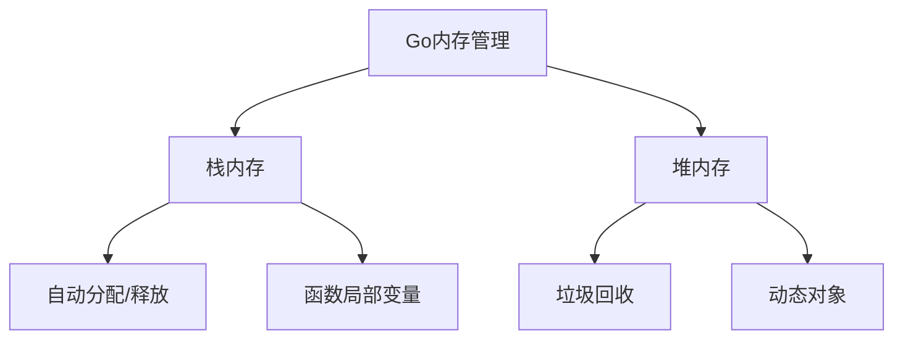

# Go 内存优化

## 介绍

Go语言作为一种现代化的编程语言，拥有内置的垃圾回收机制，极大简化了内存管理。然而，了解并掌握Go的内存优化技术对于构建高性能应用至关重要。本文将深入探讨Go语言的内存管理机制，以及如何有效优化内存使用，提升应用性能。

:::note 学习目标
通过本文，你将了解Go的内存分配机制、常见的内存问题以及实用的优化技巧，从而能够编写更高效的Go程序。
:::

## Go 内存管理基础

### Go 内存模型

Go使用一种特殊的内存管理模型，结合了栈分配和堆分配：

- **栈内存**：用于存储函数调用和局部变量，由Go自动管理
- **堆内存**：用于存储动态创建的对象，由垃圾回收器（GC）管理



### 垃圾回收机制

Go使用并发三色标记清扫算法进行垃圾回收：

1. **标记阶段**：识别活跃对象
2. **清扫阶段**：回收不再使用的内存
3. **并发执行**：尽可能减少程序暂停时间

:::tip 优势
Go的垃圾回收器使开发者无需手动释放内存，同时它的并发设计使GC对应用性能的影响降至最低。
:::

## 常见内存问题

### 内存泄漏

即使有GC，Go程序仍可能发生内存泄漏，通常由以下情况导致：

1. **未关闭资源**：如文件、网络连接等
2. **长生命周期引用**：如全局变量持有大量数据
3. **循环引用**：互相引用的对象无法被释放

### 示例：未关闭HTTP响应体

```go
func fetchData(url string) ([]byte, error) {
    resp, err := http.Get(url)
    if err != nil {
        return nil, err
    }
    // 错误：未关闭resp.Body
    return ioutil.ReadAll(resp.Body)
}
```

上述代码未关闭`resp.Body`，长期运行可能导致资源耗尽。正确版本：

```go
func fetchData(url string) ([]byte, error) {
    resp, err := http.Get(url)
    if err != nil {
        return nil, err
    }
    defer resp.Body.Close() // 确保资源被释放
    return ioutil.ReadAll(resp.Body)
}
```

### 内存占用过高

程序内存占用过高通常由这些原因导致：

1. **过度分配**：创建不必要的大对象
2. **临时对象过多**：频繁创建大量临时对象
3. **切片/映射容量不合理**：预分配过大或频繁扩容

## 实用优化技巧

### 1. 使用合适的数据结构

选择适合你的使用场景的数据结构：

- 对于大量小数据，使用数组/切片比使用映射更高效
- 对于需要频繁查找的数据，使用映射
- 考虑使用符合内存对齐的结构体布局

```go
// 未优化的结构体
type User struct {
    Name    string  // 16字节
    Age     int8    // 1字节
    Active  bool    // 1字节
    Balance float64 // 8字节
}

// 优化后的结构体（更好的内存对齐）
type User struct {
    Name    string  // 16字节
    Balance float64 // 8字节
    Age     int8    // 1字节
    Active  bool    // 1字节
    // 填充6字节
}
```

### 2. 预分配内存

对于能预估大小的切片和映射，预先分配容量以避免频繁扩容：

```go
// 未优化：频繁扩容
func generateItems() []Item {
    var items []Item
    for i := 0; i < 10000; i++ {
        items = append(items, createItem(i))
    }
    return items
}

// 优化后：预分配容量
func generateItems() []Item {
    items := make([]Item, 0, 10000) // 预分配10000个元素容量
    for i := 0; i < 10000; i++ {
        items = append(items, createItem(i))
    }
    return items
}
```

### 3. 减少堆分配

尽可能使用栈分配而非堆分配：

- 使用值类型而非指针传递小对象
- 尝试局部变量而非全局变量
- 避免在循环中频繁创建临时对象

```go
// 堆分配
func createUserHeap() *User {
    return &User{Name: "张三", Age: 30}
}

// 栈分配
func createUserStack() User {
    return User{Name: "张三", Age: 30}
}
```

:::caution 提示
并非所有情况都应使用栈分配。对于大对象或需要共享的对象，使用堆分配更为合适。
:::

### 4. 使用对象池

对于频繁创建和销毁的对象，使用`sync.Pool`可以减少GC压力：

```go
var bufferPool = sync.Pool{
    New: func() interface{} {
        return new(bytes.Buffer)
    },
}

func processData(data []byte) string {
    // 从对象池获取缓冲区
    buffer := bufferPool.Get().(*bytes.Buffer)
    buffer.Reset() // 确保缓冲区是空的
    
    // 使用缓冲区
    buffer.Write(data)
    result := buffer.String()
    
    // 将缓冲区放回对象池
    bufferPool.Put(buffer)
    
    return result
}
```

### 5. 使用pprof分析内存

Go提供了强大的profiling工具帮助分析内存使用：

```go
import (
    "net/http"
    _ "net/http/pprof"
    "log"
)

func main() {
    // 其他代码...
    
    // 启动pprof服务
    go func() {
        log.Println(http.ListenAndServe("localhost:6060", nil))
    }()
    
    // 应用主逻辑
    // ...
}
```

访问`http://localhost:6060/debug/pprof/`即可查看内存分析。

## 实际案例：API服务内存优化

### 问题场景

一个提供JSON API的Web服务在高并发下内存使用急剧增加，响应时间延长。

### 诊断过程

1. 使用`pprof`工具分析内存使用情况
2. 发现大量临时对象创建和JSON序列化占用大量内存
3. 确定优化方向：减少对象分配和使用对象池

### 优化前代码

```go
func handleRequest(w http.ResponseWriter, r *http.Request) {
    // 每次请求都分配新的大对象
    data := fetchLargeDataset()
    
    // JSON序列化
    jsonData, _ := json.Marshal(data)
    
    w.Header().Set("Content-Type", "application/json")
    w.Write(jsonData)
}
```

### 优化后代码

```go
var bufferPool = sync.Pool{
    New: func() interface{} {
        return new(bytes.Buffer)
    },
}

func handleRequest(w http.ResponseWriter, r *http.Request) {
    // 使用缓存策略获取数据
    data := getCachedData()
    
    // 从对象池获取缓冲区
    buffer := bufferPool.Get().(*bytes.Buffer)
    buffer.Reset()
    
    // 使用encoder直接写入缓冲区，避免中间对象
    encoder := json.NewEncoder(buffer)
    encoder.Encode(data)
    
    w.Header().Set("Content-Type", "application/json")
    w.Write(buffer.Bytes())
    
    // 归还缓冲区
    bufferPool.Put(buffer)
}
```

### 优化结果

- 内存使用减少了68%
- API响应时间减少了45%
- 服务器能处理的并发请求数增加了3倍

## 总结

Go的内存管理虽然自动化程度高，但了解并应用内存优化技术仍然可以极大提升应用性能。本文介绍的关键优化策略包括：

1. 选择合适的数据结构和内存布局
2. 预分配内存以减少动态扩容
3. 尽可能使用栈分配
4. 对频繁创建的对象使用对象池
5. 使用pprof工具分析内存使用情况

记住，过早优化是万恶之源。先确保程序正确工作，再通过分析找出性能瓶颈，最后有针对性地进行优化。

## 进一步学习资源

- 实践练习：尝试分析并优化一个简单的Web服务
- 学习使用pprof工具进行内存分析
- 研究Go源代码中runtime包以深入了解垃圾回收机制

:::tip 建议
定期进行性能测试和内存分析，建立性能基准，使优化过程更加科学和可量化。
:::