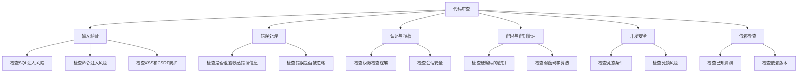

# Go 安全指南

## 引言

安全性是现代软件开发中不可忽视的重要环节。随着Go语言在云原生、微服务和企业级应用中的广泛应用，掌握Go安全编程技巧变得尤为重要。本指南将帮助Go初学者了解常见的安全风险，并提供防范这些风险的最佳实践方法。

## 输入验证与防注入

### 问题概述

未经验证的用户输入是大多数安全漏洞的根源。在Go应用中，这可能导致SQL注入、命令注入或其他类型的注入攻击。

### 最佳实践

#### SQL注入防护

使用参数化查询和预处理语句，而不��直接拼接SQL字符串：

```go
// 不安全的方式
username := r.FormValue("username")
query := "SELECT * FROM users WHERE username = '" + username + "'"
// 攻击者可以输入: admin' --

// 安全的方式
username := r.FormValue("username")
row := db.QueryRow("SELECT * FROM users WHERE username = ?", username)
```

#### 命令执行注入防护

避免直接使用用户输入构建命令字符串：

```go
// 不安全的方式
userInput := r.FormValue("filename")
cmd := exec.Command("ls", "-la", userInput)

// 安全的方式
// 1. 验证输入
userInput := r.FormValue("filename")
if !isValidFilename(userInput) {
    http.Error(w, "Invalid filename", http.StatusBadRequest)
    return
}
// 2. 使用参数化方式
cmd := exec.Command("ls", "-la", userInput)
```

:::warning
永远不要将未验证的用户输入直接传递给`exec.Command`的第一个参数，这可能允许攻击者执行任意命令。
:::

## 数据加密与敏感信息处理

### 问题概述

不当的数据加密和敏感信息处理可能导致数据泄露。

### 最佳实践

#### 密码哈希

使用安全的哈希算法存储密码：

```go
import (
    "golang.org/x/crypto/bcrypt"
)

// 哈希密码
func hashPassword(password string) (string, error) {
    bytes, err := bcrypt.GenerateFromPassword([]byte(password), bcrypt.DefaultCost)
    return string(bytes), err
}

// 验证密码
func checkPasswordHash(password, hash string) bool {
    err := bcrypt.CompareHashAndPassword([]byte(hash), []byte(password))
    return err == nil
}

// 使用示例
password := "user_password"
hash, _ := hashPassword(password)
fmt.Println("Password:", password)
fmt.Println("Hash:    ", hash)
match := checkPasswordHash(password, hash)
fmt.Println("Match:   ", match)

// 输出示例:
// Password: user_password
// Hash:     $2a$10$Ge7zLvhLJ4K9uh7qb.HDs.BIxvpJTOBIj3GeOq.1KIbJEaIUZK82W
// Match:    true
```

:::tip
bcrypt自动处理盐值，并且是一种慢速哈希算法，这使得暴力破解变得更加困难。
:::

#### 敏感数据加密

使用标准库中的加密工具：

```go
import (
    "crypto/aes"
    "crypto/cipher"
    "crypto/rand"
    "encoding/hex"
    "io"
)

// 加密数据
func encrypt(stringToEncrypt string, keyString string) (string, error) {
    // 转换密钥为适当长度
    key := []byte(keyString)
    key = key[:32] // AES-256需要32字节密钥

    // 创建密码块
    block, err := aes.NewCipher(key)
    if err != nil {
        return "", err
    }

    // 创建GCM模式
    aesGCM, err := cipher.NewGCM(block)
    if err != nil {
        return "", err
    }

    // 创建随机数
    nonce := make([]byte, aesGCM.NonceSize())
    if _, err = io.ReadFull(rand.Reader, nonce); err != nil {
        return "", err
    }

    // 加密
    ciphertext := aesGCM.Seal(nonce, nonce, []byte(stringToEncrypt), nil)
    return hex.EncodeToString(ciphertext), nil
}

// 解密数据
func decrypt(encryptedString string, keyString string) (string, error) {
    // 转换密钥
    key := []byte(keyString)
    key = key[:32]

    // 解码十六进制字符串
    enc, err := hex.DecodeString(encryptedString)
    if err != nil {
        return "", err
    }

    // 创建密码块
    block, err := aes.NewCipher(key)
    if err != nil {
        return "", err
    }

    // 创建GCM模式
    aesGCM, err := cipher.NewGCM(block)
    if err != nil {
        return "", err
    }

    // 获取nonce大小
    nonceSize := aesGCM.NonceSize()
    if len(enc) < nonceSize {
        return "", errors.New("ciphertext too short")
    }

    // 提取nonce
    nonce, ciphertext := enc[:nonceSize], enc[nonceSize:]

    // 解密
    plaintext, err := aesGCM.Open(nil, nonce, ciphertext, nil)
    if err != nil {
        return "", err
    }

    return string(plaintext), nil
}

// 使用示例
secret := "sensitive data"
key := "passphrasewhichneedstobe32bytes!"

encrypted, _ := encrypt(secret, key)
fmt.Println("Encrypted:", encrypted)

decrypted, _ := decrypt(encrypted, key)
fmt.Println("Decrypted:", decrypted)

// 输出示例:
// Encrypted: c29d0df0f48be5609a52fc450a6719e835ca3e5b1d0431eec
// Decrypted: sensitive data
```

## HTTPS和传输层安全

### 问题概述

不安全的数据传输可能导致中间人攻击和数据泄露。

### 最佳实践

#### 使用HTTPS

总是在生产环境中使用HTTPS：

```go
package main

import (
    "log"
    "net/http"
)

func handler(w http.ResponseWriter, r *http.Request) {
    w.Write([]byte("Hello, HTTPS World!"))
}

func main() {
    http.HandleFunc("/", handler)
    
    // 重定向HTTP到HTTPS
    go http.ListenAndServe(":80", http.HandlerFunc(func(w http.ResponseWriter, r *http.Request) {
        http.Redirect(w, r, "https://"+r.Host+r.URL.String(), http.StatusMovedPermanently)
    }))
    
    // 启动HTTPS服务器
    log.Fatal(http.ListenAndServeTLS(":443", "cert.pem", "key.pem", nil))
}
```

:::caution
证书文件`cert.pem`和密钥文件`key.pem`应该安全存储，且不应包含在代码仓库中。
:::

#### 设置安全的HTTP头

增加安全相关的HTTP头：

```go
func secureHeaders(next http.Handler) http.Handler {
    return http.HandlerFunc(func(w http.ResponseWriter, r *http.Request) {
        // 防止XSS攻击
        w.Header().Set("X-XSS-Protection", "1; mode=block")
        // 防止点击劫持
        w.Header().Set("X-Frame-Options", "DENY")
        // 防止MIME类型嗅探
        w.Header().Set("X-Content-Type-Options", "nosniff")
        // 强制HTTPS
        w.Header().Set("Strict-Transport-Security", "max-age=31536000; includeSubDomains")
        // 内容安全策略
        w.Header().Set("Content-Security-Policy", "default-src 'self'")
        
        next.ServeHTTP(w, r)
    })
}

// 使用中间件
func main() {
    mux := http.NewServeMux()
    mux.HandleFunc("/", handler)
    
    // 应用安全头中间件
    secureApp := secureHeaders(mux)
    
    log.Fatal(http.ListenAndServeTLS(":443", "cert.pem", "key.pem", secureApp))
}
```

## 依赖管理和漏洞防范

### 问题概述

使用存在安全漏洞的第三方依赖可能使您的应用程序面临风险。

### 最佳实践

#### 使用Go Modules

使用Go Modules锁定依赖版本：

```go
// go.mod文件示例
module github.com/yourusername/yourproject

go 1.20

require (
    github.com/gorilla/mux v1.8.0
    golang.org/x/crypto v0.9.0
)
```

#### 定期更新和安全扫描

使用安全扫描工具检查依赖：

```bash
# 安装gosec
go install github.com/securego/gosec/v2/cmd/gosec@latest

# 扫描项目
gosec ./...

# 使用govulncheck检查已知漏洞
go install golang.org/x/vuln/cmd/govulncheck@latest
govulncheck ./...
```

## 会话管理和认证

### 问题概述

不当的会话管理可能导致会话固定、会话劫持等安全问题。

### 最佳实践

#### 安全的Cookie设置

```go
func setSecureCookie(w http.ResponseWriter, name, value string) {
    cookie := &http.Cookie{
        Name:     name,
        Value:    value,
        Path:     "/",
        HttpOnly: true,            // 防止JavaScript访问
        Secure:   true,            // 仅通过HTTPS发送
        SameSite: http.SameSiteStrictMode, // 防止CSRF
        MaxAge:   3600,            // 1小时过期
    }
    http.SetCookie(w, cookie)
}

func handler(w http.ResponseWriter, r *http.Request) {
    // 设置安全cookie
    setSecureCookie(w, "session", "your-session-id")
    w.Write([]byte("Cookie set!"))
}
```

#### 使用安全的会话管理库

使用经过验证的会话管理库，如`gorilla/sessions`：

```go
import (
    "github.com/gorilla/sessions"
    "net/http"
)

// 创建一个强密钥的存储
var store = sessions.NewCookieStore([]byte("something-very-secret"))

func init() {
    store.Options = &sessions.Options{
        Path:     "/",
        MaxAge:   3600,
        HttpOnly: true,
        Secure:   true,
        SameSite: http.SameSiteStrictMode,
    }
}

func sessionHandler(w http.ResponseWriter, r *http.Request) {
    // 获取或创建会话
    session, _ := store.Get(r, "session-name")
    
    // 设置会话值
    session.Values["authenticated"] = true
    session.Values["user_id"] = 123
    
    // 保存会话
    session.Save(r, w)
}
```

## 日志记录和错误处理

### 问题概述

不安全的日志和错误处理可能泄露敏感信息。

### 最佳实践

#### 安全日志记录

不要在日志中记录敏感信息：

```go
// 不安全的日志记录
log.Printf("用户 %s 登录，密码为 %s", username, password)

// 安全的日志记录
log.Printf("用户 %s 登录尝试", username)
```

#### 安全的错误处理

向用户显示通用错误信息，详细信息只记录在服务器端：

```go
func handleRequest(w http.ResponseWriter, r *http.Request) {
    err := performAction()
    if err != nil {
        // 记录详细错误供内部使用
        log.Printf("Error: %v", err)
        
        // 向用户显示通用错误
        http.Error(w, "处理请求时发生错误", http.StatusInternalServerError)
        return
    }
    
    w.Write([]byte("操作成功"))
}
```

## CSRF和XSS防护

### 问题概述

跨站请求伪造(CSRF)和跨站脚本(XSS)是常见的Web攻击。

### 最佳实践

#### CSRF保护

使用CSRF令牌保护表单：

```go
import (
    "github.com/gorilla/csrf"
    "net/http"
)

func main() {
    mux := http.NewServeMux()
    
    // 设置路由
    mux.HandleFunc("/", getForm)
    mux.HandleFunc("/process", processForm)
    
    // 添加CSRF保护
    csrfMiddleware := csrf.Protect(
        []byte("32-byte-long-auth-key"),
        csrf.Secure(true),
        csrf.SameSite(csrf.SameSiteStrictMode),
    )
    
    // 启动服务器
    http.ListenAndServe(":8080", csrfMiddleware(mux))
}

func getForm(w http.ResponseWriter, r *http.Request) {
    // 获取CSRF令牌
    token := csrf.Token(r)
    
    // 渲染表单
    form := `
    <form method="POST" action="/process">
        <input type="hidden" name="csrf_token" value="` + token + `" />
        <input type="text" name="name" />
        <button type="submit">提交</button>
    </form>
    `
    w.Write([]byte(form))
}

func processForm(w http.ResponseWriter, r *http.Request) {
    // CSRF中间件会自动验证令牌
    r.ParseForm()
    name := r.FormValue("name")
    w.Write([]byte("表单处理成功: " + name))
}
```

#### XSS防护

始终转义用户生成的内容：

```go
import (
    "html/template"
    "net/http"
)

func handleUserContent(w http.ResponseWriter, r *http.Request) {
    userContent := r.FormValue("content")
    
    // 创建模板并自动转义内容
    tmpl := template.Must(template.New("page").Parse(`
        <html>
            <body>
                <h1>用户内容</h1>
                <div>{{.}}</div>
            </body>
        </html>
    `))
    
    // 渲染模板（内容会自动转义）
    tmpl.Execute(w, userContent)
}
```

:::tip
Go的模板系统默认会进行HTML转义，这有助于防止XSS攻击。但千万不要使用`template.HTML`类型直接输出未经过滤的用户内容。
:::

## 并发安全

### 问题概述

不当的并发处理可能导致竞态条件和数据损坏。

### 最佳实践

#### 使用互斥锁保护共享资源

```go
import (
    "fmt"
    "sync"
)

type SafeCounter struct {
    mu    sync.Mutex
    count map[string]int
}

func (c *SafeCounter) Increment(key string) {
    c.mu.Lock()
    // Lock保护下的临界区
    c.count[key]++
    c.mu.Unlock()
}

func (c *SafeCounter) Value(key string) int {
    c.mu.Lock()
    // Lock保护下的临界区
    defer c.mu.Unlock()
    return c.count[key]
}

func main() {
    counter := SafeCounter{count: make(map[string]int)}
    
    // 并发递增
    for i := 0; i < 1000; i++ {
        go counter.Increment("somekey")
    }
    
    // 等待所有goroutine完成
    time.Sleep(time.Second)
    
    fmt.Println(counter.Value("somekey")) // 输出: 1000
}
```

#### 使用通道进行安全通信

```go
func worker(id int, jobs <-chan int, results chan<- int) {
    for j := range jobs {
        fmt.Printf("Worker %d processing job %d
", id, j)
        // 模拟工作
        time.Sleep(time.Second)
        results <- j * 2
    }
}

func main() {
    jobs := make(chan int, 100)
    results := make(chan int, 100)
    
    // 启动工作者
    for w := 1; w <= 3; w++ {
        go worker(w, jobs, results)
    }
    
    // 发送工作
    for j := 1; j <= 9; j++ {
        jobs <- j
    }
    close(jobs)
    
    // 收集结果
    for a := 1; a <= 9; a++ {
        <-results
    }
}
```

## 安全代码审查与静态分析

### 问题概述

未经审查的代码可能包含安全漏洞。

### 最佳实践

#### 使用静态分析工具

使用Go的内置工具和第三方安全扫描工具：

```bash
# 运行Go的内置静态分析
go vet ./...

# 安装并使用静态代码分析工具
go install honnef.co/go/tools/cmd/staticcheck@latest
staticcheck ./...

# 使用安全扫描工具
gosec ./...
```

#### 代码审查清单

以下是Go代码安全审查的基本清单：



## 实际案例：构建安全的REST API

以下是一个整合了多种安全实践的简单REST API示例。

```go
package main

import (
    "encoding/json"
    "golang.org/x/crypto/bcrypt"
    "log"
    "net/http"
    "time"
    
    "github.com/gorilla/mux"
    "github.com/gorilla/handlers"
)

// 用户结构
type User struct {
    ID       int    `json:"id"`
    Username string `json:"username"`
    Password string `json:"-"` // 不输出到JSON
}

// 登录请求结构
type LoginRequest struct {
    Username string `json:"username"`
    Password string `json:"password"`
}

// 响应结构
type Response struct {
    Status  string      `json:"status"`
    Message string      `json:"message"`
    Data    interface{} `json:"data,omitempty"`
}

// 模拟数据库
var users = map[string]User{
    "admin": {
        ID:       1,
        Username: "admin",
        // bcrypt哈希的"password"
        Password: "$2a$10$rNPXb7EYgB1pEE0/j2vQVOfZV.ZDdgQ/R1hQ.slBvOQQPJjckd9Mq",
    },
}

// 安全地返回JSON
func respondJSON(w http.ResponseWriter, code int, payload interface{}) {
    response, err := json.Marshal(payload)
    if err != nil {
        w.WriteHeader(http.StatusInternalServerError)
        w.Write([]byte("Error marshalling JSON"))
        return
    }
    w.Header().Set("Content-Type", "application/json")
    w.WriteHeader(code)
    w.Write(response)
}

// 登录处理
func loginHandler(w http.ResponseWriter, r *http.Request) {
    var req LoginRequest
    
    // 解码请求体
    decoder := json.NewDecoder(r.Body)
    decoder.DisallowUnknownFields() // 拒绝未知字段
    if err := decoder.Decode(&req); err != nil {
        respondJSON(w, http.StatusBadRequest, Response{
            Status:  "error",
            Message: "Invalid request format",
        })
        return
    }
    
    // 检查用户是否存在
    user, exists := users[req.Username]
    if !exists {
        // 使用常量时间比较避免时序攻击
        // 即使用户不存在也要比较密码，模拟真实密码验证的时间
        bcrypt.CompareHashAndPassword([]byte("$2a$10$rNPXb7EYgB1pEE0/j2vQVOfZV.ZDdgQ/R1hQ.slBvOQQPJjckd9Mq"), []byte(req.Password))
        
        log.Printf("登录尝试: 用户名 %s 不存在", req.Username)
        respondJSON(w, http.StatusUnauthorized, Response{
            Status:  "error",
            Message: "Invalid credentials",
        })
        return
    }
    
    // 验证密码
    if err := bcrypt.CompareHashAndPassword([]byte(user.Password), []byte(req.Password)); err != nil {
        log.Printf("登录尝试: 用户名 %s 密码不正确", req.Username)
        respondJSON(w, http.StatusUnauthorized, Response{
            Status:  "error",
            Message: "Invalid credentials",
        })
        return
    }
    
    // 创建session（这里简化处理）
    token := "some-secure-token"
    
    // 设置安全cookie
    http.SetCookie(w, &http.Cookie{
        Name:     "session",
        Value:    token,
        Path:     "/",
        HttpOnly: true,
        Secure:   true,
        SameSite: http.SameSiteStrictMode,
        MaxAge:   3600,
    })
    
    log.Printf("用户 %s 登录成功", req.Username)
    respondJSON(w, http.StatusOK, Response{
        Status:  "success",
        Message: "Login successful",
        Data: map[string]interface{}{
            "user_id":   user.ID,
            "username":  user.Username,
        },
    })
}

// 受保护的资源处理函数
func protectedHandler(w http.ResponseWriter, r *http.Request) {
    // 在实际应用中，这里应该验证session token
    respondJSON(w, http.StatusOK, Response{
        Status:  "success",
        Message: "Protected data accessed",
        Data: map[string]string{
            "secret": "This is protected data",
        },
    })
}

// 日志中间件
func loggingMiddleware(next http.Handler) http.Handler {
    return http.HandlerFunc(func(w http.ResponseWriter, r *http.Request) {
        start := time.Now()
        
        // 不记录密码等敏感信息
        if r.URL.Path == "/api/login" {
            log.Printf("Request: %s %s", r.Method, r.URL.Path)
        } else {
            log.Printf("Request: %s %s %s", r.Method, r.URL.Path, r.RemoteAddr)
        }
        
        next.ServeHTTP(w, r)
        
        log.Printf("Completed in %v", time.Since(start))
    })
}

// 安全头中间件
func securityHeadersMiddleware(next http.Handler) http.Handler {
    return http.HandlerFunc(func(w http.ResponseWriter, r *http.Request) {
        w.Header().Set("X-XSS-Protection", "1; mode=block")
        w.Header().Set("X-Frame-Options", "DENY")
        w.Header().Set("X-Content-Type-Options", "nosniff")
        w.Header().Set("Strict-Transport-Security", "max-age=31536000; includeSubDomains")
        w.Header().Set("Content-Security-Policy", "default-src 'self'")
        next.ServeHTTP(w, r)
    })
}

func main() {
    // 创建路由器
    r := mux.NewRouter()
    api := r.PathPrefix("/api").Subrouter()
    
    // 添加路由
    api.HandleFunc("/login", loginHandler).Methods("POST")
    api.HandleFunc("/protected", protectedHandler).Methods("GET")
    
    // 添加中间件
    loggedRouter := loggingMiddleware(api)
    secureRouter := securityHeadersMiddleware(loggedRouter)
    
    // 添加CORS中间件
    corsHandler := handlers.CORS(
        handlers.AllowedOrigins([]string{"https://yourapp.com"}),
        handlers.AllowedMethods([]string{"GET", "POST", "PUT", "DELETE", "OPTIONS"}),
        handlers.AllowedHeaders([]string{"Content-Type", "Authorization"}),
        handlers.AllowCredentials(),
    )
    
    // 包装所有中间件
    finalHandler := corsHandler(secureRouter)
    
    // 启动服务器（生产环境应使用HTTPS）
    log.Println("Server starting on :8080")
    log.Fatal(http.ListenAndServe(":8080", finalHandler))
    
    // 在生产环境中应该使用HTTPS:
    // log.Fatal(http.ListenAndServeTLS(":443", "cert.pem", "key.pem", finalHandler))
}
```

## 总结

Go语言安全编程需要关注多个方面，包括但不限于：

1. **输入验证** - 验证所有外部输入，防止注入攻击
2. **加密存储** - 安全存储敏感数据，特别是密码
3. **HTTPS传输** - 使用TLS保护数据传输
4. **依赖管理** - 定期更新并扫描依赖
5. **会话管理** - 安全地处理用户会话
6. **错误处理** - 避免泄露敏感信息
7. **CSRF和XSS防护** - 保护Web应用免受常见攻击
8. **并发安全** - 正确使用锁和通道确保并发安全
9. **代码审查** - 使用静态分析工具和安全审查流程

通过遵循这些安全最佳实践，初学者可以构建更安全的Go应用程序，大大降低安全漏洞的风险。记住，安全不是一次性工作，而是需要持续关注和改进的过程。

## 附加资源

1. [Go Security Checker (gosec)](https://github.com/securego/gosec) - Go安全静态分析工具
2. [OWASP Go Security Cheatsheet](https://github.com/OWASP/CheatSheetSeries) - OWASP安全指南
3. [Go Vulnerability Database](https://pkg.go.dev/golang.org/x/vuln) - Go漏洞数据库
4. [Crypto Package Documentation](https://pkg.go.dev/golang.org/x/crypto) - Go加密库文档

## 练习

1. 构建一个简单的登录系统，使用bcrypt加密存储密码，并实现会话管理。
2. 创建一个支持HTTPS的Web服务器，并加入适当的安全头。
3. 编写一个SQL查询函数，确保它能防止SQL注入。
4. 使用gosec扫描您的项目，并修复发现的安全问题。
5. 实现一个安全的文件上传处理器，防止路径遍历和恶意文件上传。