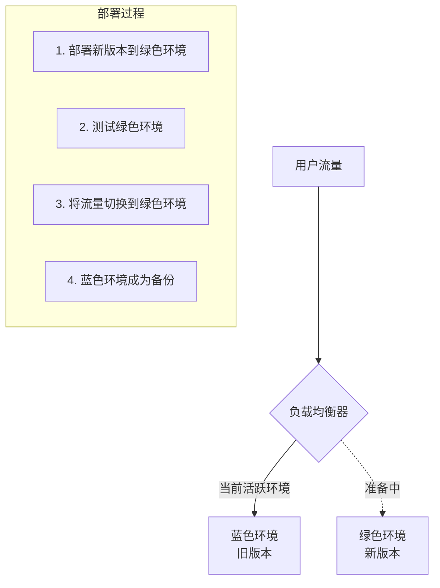
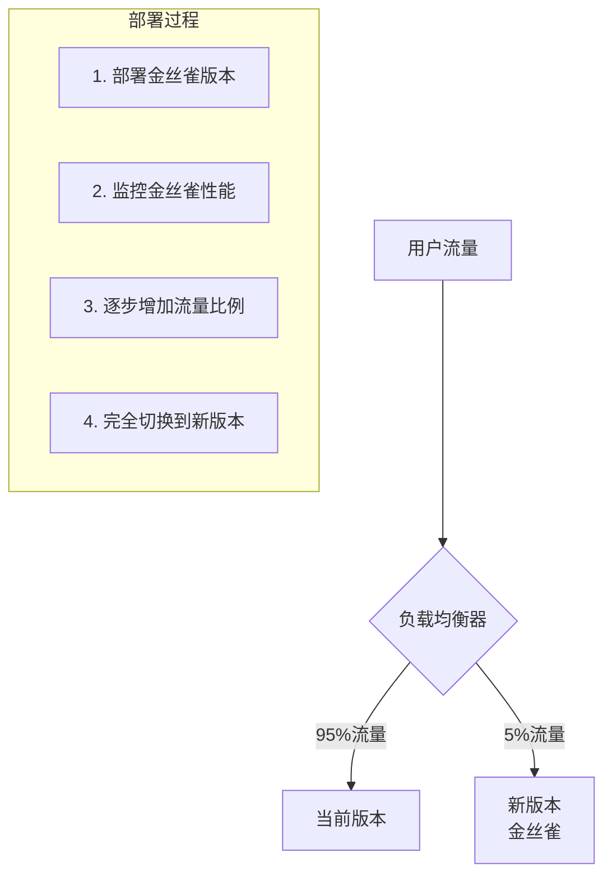
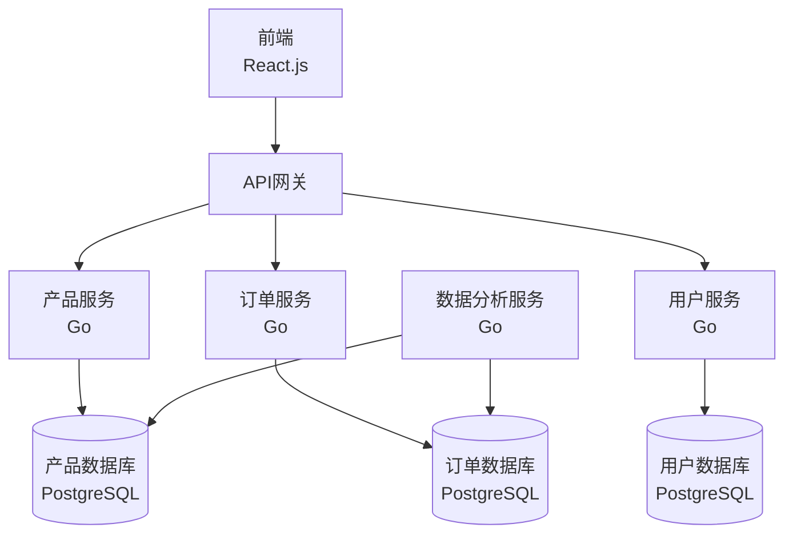

# Go 部署策略

## 介绍

将 Go 应用程序从开发环境迁移到生产环境是软件开发生命周期中的关键步骤。部署策略不仅关系到应用程序的可用性和性能，还会影响开发团队的工作效率和产品的迭代速度。本文将探讨 Go 应用程序的各种部署策略，从简单的二进制文件部署到容器化和云原生解决方案，帮助 Go 初学者理解如何选择适合自己项目的部署方式。

## Go 部署的独特优势

Go 语言在部署方面具有显著优势：

:::note Go 部署优势
- **单一二进制文件** - Go 编译成独立的二进制文件，不需要额外的运行时依赖
- **跨平台编译** - 可以在一个平台上为其他目标平台构建应用
- **低内存占用** - Go 应用通常比其他语言开发的同类应用占用更少的资源
- **快速启动时间** - Go 应用启动迅速，有利于动态扩展和快速部署
:::

让我们深入探讨各种部署策略。

## 1. 基本二进制部署

最简单的部署方式是直接编译 Go 程序并将二进制文件复制到服务器上。

### 编译过程

```bash
# 在本地开发机器上
GOOS=linux GOARCH=amd64 go build -o myapp main.go

# 将二进制文件传输到服务器
scp myapp user@server:/path/to/deployment/
```

### 在服务器上运行

```bash
# 在服务器上
chmod +x myapp
./myapp
```

这种方法简单直接，适合个人项目或小型应用程序。

:::tip 创建系统服务
在生产环境中，你通常会希望将 Go 应用程序设置为系统服务，以确保它在系统重启后自动启动，并能够记录输出。

以下是使用 systemd 创建服务的示例配置：

```bash
# /etc/systemd/system/myapp.service
[Unit]
Description=My Go Application
After=network.target

[Service]
Type=simple
User=appuser
WorkingDirectory=/path/to/app
ExecStart=/path/to/app/myapp
Restart=on-failure
RestartSec=10

[Install]
WantedBy=multi-user.target
```
:::

## 2. 使用 Docker 容器化部署

容器化已成为现代应用部署的主流方式，Go 应用程序非常适合容器化部署。

### 创建 Dockerfile

```dockerfile
# 使用多阶段构建减小镜像大小
FROM golang:1.20-alpine AS builder

WORKDIR /app
COPY go.mod go.sum ./
RUN go mod download

COPY . .
RUN CGO_ENABLED=0 GOOS=linux go build -a -installsuffix cgo -o myapp .

# 第二阶段：使用轻量级的基础镜像
FROM alpine:latest

WORKDIR /root/
COPY --from=builder /app/myapp .
COPY --from=builder /app/config ./config

# 运行应用
CMD ["./myapp"]
```

### 构建和运行容器

```bash
# 构建 Docker 镜像
docker build -t myapp:latest .

# 运行容器
docker run -d -p 8080:8080 --name myapp myapp:latest
```

容器化部署的优势在于环境一致性和隔离性，使部署过程更加可靠。

## 3. 使用 Docker Compose 管理多容器应用

对于需要多个服务协同工作的应用程序，可以使用 Docker Compose。

### docker-compose.yml 示例

```yaml
version: '3'

services:
  app:
    build: .
    ports:
      - "8080:8080"
    depends_on:
      - db
    environment:
      - DB_HOST=db
      - DB_PORT=5432
      - DB_USER=postgres
      - DB_PASSWORD=secret
      - DB_NAME=myapp

  db:
    image: postgres:13
    volumes:
      - postgres_data:/var/lib/postgresql/data
    environment:
      - POSTGRES_PASSWORD=secret
      - POSTGRES_DB=myapp

volumes:
  postgres_data:
```

### 启动服务

```bash
docker-compose up -d
```

## 4. Kubernetes 部署

对于需要高可用性和可扩展性的大型应用，Kubernetes 是一个强大的选择。

### 部署清单示例 (deployment.yaml)

```yaml
apiVersion: apps/v1
kind: Deployment
metadata:
  name: myapp
spec:
  replicas: 3
  selector:
    matchLabels:
      app: myapp
  template:
    metadata:
      labels:
        app: myapp
    spec:
      containers:
      - name: myapp
        image: myapp:latest
        ports:
        - containerPort: 8080
        resources:
          limits:
            cpu: "0.5"
            memory: "512Mi"
          requests:
            cpu: "0.2"
            memory: "256Mi"
        env:
        - name: DB_HOST
          value: postgres-service
        - name: DB_PORT
          value: "5432"
```

### 服务定义 (service.yaml)

```yaml
apiVersion: v1
kind: Service
metadata:
  name: myapp-service
spec:
  selector:
    app: myapp
  ports:
  - port: 80
    targetPort: 8080
  type: LoadBalancer
```

### 应用部署

```bash
kubectl apply -f deployment.yaml
kubectl apply -f service.yaml
```

## 5. 持续集成/持续部署 (CI/CD)

自动化部署流程可以提高效率并减少人为错误。下面是使用 GitHub Actions 的简单 CI/CD 配置示例。

### GitHub Actions 工作流程 (.github/workflows/deploy.yml)

```yaml
name: Build and Deploy

on:
  push:
    branches: [ main ]

jobs:
  build:
    runs-on: ubuntu-latest
    steps:
    - uses: actions/checkout@v3

    - name: Set up Go
      uses: actions/setup-go@v3
      with:
        go-version: 1.20

    - name: Build
      run: go build -v ./...

    - name: Test
      run: go test -v ./...

    - name: Build Docker image
      run: docker build -t myapp:latest .

    - name: Push to Registry
      uses: docker/login-action@v2
      with:
        registry: ghcr.io
        username: ${{ github.actor }}
        password: ${{ secrets.GITHUB_TOKEN }}
        
    - name: Push image
      run: |
        docker tag myapp:latest ghcr.io/${{ github.repository }}/myapp:latest
        docker push ghcr.io/${{ github.repository }}/myapp:latest
```

## 6. 蓝绿部署和金丝雀发布

为了最小化部署风险，可以采用高级部署策略。

### 蓝绿部署

蓝绿部署涉及维护两个相同但独立的生产环境（蓝色和绿色）。一个环境处理所有实时流量，而另一个则准备接收新版本的应用程序。



### 金丝雀发布

金丝雀发布是一种逐步将新版本引入生产环境的方法，最初只将少量流量引导到新版本，然后逐渐增加。



## 7. Serverless 部署

无服务器架构允许开发者专注于代码而不是基础设施管理。Go 应用程序可以部署为 AWS Lambda、Google Cloud Functions 或 Azure Functions 等无服务器环境中的函数。

### AWS Lambda 函数示例

```go
package main

import (
	"context"
	"encoding/json"
	"github.com/aws/aws-lambda-go/events"
	"github.com/aws/aws-lambda-go/lambda"
)

// 处理请求的函数
func handleRequest(ctx context.Context, request events.APIGatewayProxyRequest) (events.APIGatewayProxyResponse, error) {
	// 处理请求逻辑
	responseBody, _ := json.Marshal(map[string]string{
		"message": "Hello from Go Lambda Function!",
	})

	return events.APIGatewayProxyResponse{
		StatusCode: 200,
		Headers: map[string]string{
			"Content-Type": "application/json",
		},
		Body: string(responseBody),
	}, nil
}

func main() {
	// 启动 Lambda 处理程序
	lambda.Start(handleRequest)
}
```

### 部署 Lambda 函数

```bash
# 安装 AWS SAM CLI
# 创建部署包
GOOS=linux GOARCH=amd64 go build -o main main.go
zip function.zip main

# 使用 AWS CLI 部署
aws lambda create-function \
  --function-name my-go-function \
  --runtime go1.x \
  --role arn:aws:iam::123456789012:role/lambda-role \
  --handler main \
  --zip-file fileb://function.zip
```

## 实际案例：电子商务应用部署架构

让我们探讨一个真实的案例，展示如何为一个中等规模的电子商务应用程序选择和实现部署策略。

### 应用架构



### 部署策略选择

对于这个应用程序，我们选择了基于 Kubernetes 的部署策略，包括以下组件：

1. **Docker 容器化** - 将所有 Go 微服务打包为容器
2. **Kubernetes 编排** - 管理容器的部署、扩展和更新
3. **Helm 图表** - 管理 Kubernetes 应用程序
4. **GitLab CI/CD** - 自动化构建和部署流程
5. **Prometheus 和 Grafana** - 监控和报警

### 实施流程

1. **基础设施准备**：
   - 使用 Terraform 配置云基础设施
   - 设置 Kubernetes 集群
   - 配置网络和安全策略

2. **CI/CD 流水线**：
   - 开发人员将代码推送到 GitLab
   - CI/CD 流水线自动构建和测试代码
   - 成功后，构建 Docker 镜像并推送到镜像仓库
   - 使用 Helm 更新 Kubernetes 部署

3. **部署策略**：
   - 对关键服务采用蓝绿部署
   - 使用 Istio 服务网格实现细粒度流量控制
   - 为每个环境（开发、测试、生产）维护单独的 Kubernetes 命名空间

4. **监控和警报**：
   - 使用 Prometheus 收集指标
   - 使用 Grafana 可视化监控数据
   - 配置警报规则，在出现异常时通知团队

### 结果

该部署策略带来了以下好处：

- **可靠性提高** - 系统宕机时间减少了 90%
- **部署速度加快** - 从代码提交到生产部署的时间从数小时减少到不到 30 分钟
- **资源利用率提高** - 通过自动扩展，降低了 40% 的云基础设施成本
- **开发团队满意度提高** - 开发人员可以专注于编写代码，而不是管理部署

## 总结

选择正��的部署策略对于 Go 应用程序的成功至关重要。从简单的二进制部署到复杂的 Kubernetes 编排，每种方法都有其优缺点。考虑以下因素来选择适合你的策略：

- 应用程序的规模和复杂性
- 团队的技术能力和经验
- 可用的基础设施和预算
- 对可靠性、可扩展性和部署速度的要求

随着应用程序的发展，部署策略也可能需要演变。从简单的解决方案开始，随着需求的增长逐步采用更复杂的策略，是一种务实的方法。

## 练习与资源

### 练习

1. 创���一个简单的 Go Web 服务，并使用基本二进制部署方法将其部署到 Linux 服务器。
2. 将同一个应用程序容器化，并使用 Docker 部署。
3. 设计一个简单的 CI/CD 流水线，自动测试和部署你的 Go 应用程序。
4. 探索如何为 Go 应用程序实现蓝绿部署或金丝雀发布。

### 推荐资源

- [官方 Go 文档](https://golang.org/doc/)
- [Docker 文档](https://docs.docker.com/)
- [Kubernetes 文档](https://kubernetes.io/docs/home/)
- [Go 微服务设计模式](https://www.oreilly.com/library/view/go-microservices/9781786463708/)
- [Go 实战](https://www.manning.com/books/go-in-action)
- [Cloud Native Go](https://www.oreilly.com/library/view/cloud-native-go/9781492076322/)