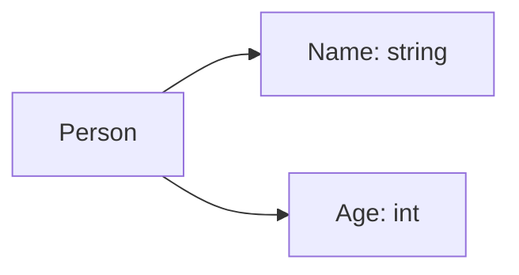

# Go 结构体

在Go语言中，**结构体（Struct）**是一种用户定义的数据类型，用于将多个不同类型的字段组合在一起。结构体是Go语言面向对象编程的基础，它允许你将相关的数据封装到一个单一的实体中，从而更好地组织和管理代码。

## 什么是结构体？

结构体是一种复合数据类型，它由一组字段（Field）组成，每个字段都有自己的类型和名称。通过结构体，你可以将不同类型的数据组合在一起，形成一个更复杂的数据结构。

### 定义结构体

在Go中，使用 `type` 关键字和 `struct` 关键字来定义结构体。以下是一个简单的结构体定义示例：

```go
type Person struct {
    Name string
    Age  int
}
```

在这个例子中，我们定义了一个名为 `Person` 的结构体，它有两个字段：`Name`（类型为 `string`）和 `Age`（类型为 `int`）。

### 创建结构体实例

定义结构体后，你可以创建该结构体的实例。以下是创建 `Person` 结构体实例的几种方式：

```go
// 方式1：使用字段名初始化
p1 := Person{
    Name: "Alice",
    Age:  30,
}

// 方式2：按顺序初始化（不推荐，容易出错）
p2 := Person{"Bob", 25}

// 方式3：先声明，后赋值
var p3 Person
p3.Name = "Charlie"
p3.Age = 28
```

### 访问结构体字段

你可以使用点号（`.`）来访问结构体中的字段：

```go
fmt.Println(p1.Name) // 输出: Alice
fmt.Println(p2.Age)  // 输出: 25
```

## 结构体的实际应用

结构体在Go语言中非常常用，尤其是在需要组织和管理复杂数据时。以下是一些常见的应用场景：

### 1. 表示实体对象

结构体非常适合用于表示现实世界中的实体对象。例如，你可以使用结构体来表示一个用户：

```go
type User struct {
    ID       int
    Username string
    Email    string
    Password string
}
```

### 2. 组合数据

结构体可以用于将多个相关的数据组合在一起。例如，你可以使用结构体来表示一个订单：

```go
type Order struct {
    ID          int
    ProductName string
    Quantity    int
    Price       float64
}
```

### 3. 嵌套结构体

结构体可以嵌套在其他结构体中，从而构建更复杂的数据结构。例如，你可以定义一个 `Address` 结构体，并将其嵌套在 `User` 结构体中：

```go
type Address struct {
    City    string
    State   string
    Country string
}

type User struct {
    ID       int
    Username string
    Email    string
    Address  Address
}
```

### 4. 方法绑定

在Go语言中，你可以为结构体定义方法。方法是一种特殊的函数，它与特定的结构体类型相关联。以下是一个简单的例子：

```go
func (p Person) Greet() string {
    return "Hello, my name is " + p.Name
}

p := Person{Name: "Alice", Age: 30}
fmt.Println(p.Greet()) // 输出: Hello, my name is Alice
```

## 结构体的内存布局

理解结构体的内存布局对于优化性能和避免潜在的错误非常重要。在Go中，结构体的字段是按照定义的顺序在内存中排列的。以下是一个简单的内存布局示意图：



在这个例子中，`Person` 结构体的内存布局是连续的，`Name` 字段在前，`Age` 字段在后。

## 总结

结构体是Go语言中非常重要的数据结构，它允许你将多个不同类型的字段组合在一起，从而更好地组织和管理数据。通过结构体，你可以表示实体对象、组合数据、嵌套结构体以及为结构体定义方法。

:::tip
**提示**：在实际开发中，尽量使用结构体来组织相关的数据，这样可以提高代码的可读性和可维护性。
:::

## 附加资源与练习

- **练习1**：定义一个 `Book` 结构体，包含 `Title`、`Author` 和 `Pages` 字段，并创建一个实例。
- **练习2**：为 `Book` 结构体定义一个方法 `Summary`，返回书籍的简要信息。
- **附加资源**：阅读Go官方文档中关于结构体的部分，了解更多高级用法和最佳实践。

通过不断练习和探索，你将能够熟练地使用结构体来构建复杂的Go程序。祝你学习愉快！