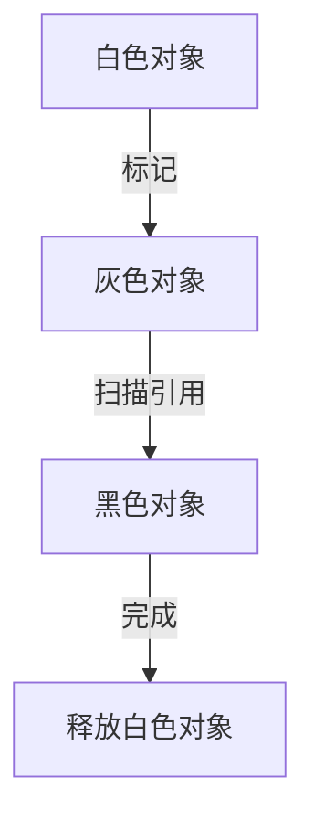

# Go 垃圾回收

Go语言以其高效的垃圾回收（Garbage Collection, GC）机制而闻名。垃圾回收是自动管理内存的一种方式，它帮助开发者避免手动分配和释放内存的复杂性，同时减少内存泄漏的风险。本文将详细介绍Go语言中的垃圾回收机制，帮助初学者理解其工作原理、优化技巧以及实际应用场景。

## 什么是垃圾回收？

垃圾回收是一种自动内存管理机制，用于识别和释放不再使用的内存。在Go语言中，垃圾回收器会定期扫描程序的内存，找出不再被引用的对象，并释放它们占用的内存空间。这样，开发者无需手动管理内存，从而可以专注于业务逻辑的实现。

:::note
Go语言的垃圾回收器是基于**标记-清除（Mark-and-Sweep）**算法的，同时结合了**并发（Concurrent）**和**并行（Parallel）**的特性，以提高性能。
:::

## Go 垃圾回收的工作原理

Go的垃圾回收器主要分为以下几个阶段：

1. **标记阶段（Mark Phase）**：垃圾回收器会从根对象（如全局变量、栈上的变量等）开始，遍历所有可达的对象，并标记它们为“存活”。
2. **清除阶段（Sweep Phase）**：垃圾回收器会扫描整个堆内存，释放未被标记的对象所占用的内存。

:::tip
Go的垃圾回收器是**并发**的，这意味着它可以在程序运行的同时进行垃圾回收，而不会完全阻塞程序的执行。
:::

### 并发垃圾回收

Go的垃圾回收器采用了**三色标记法**来实现并发垃圾回收。三色标记法将对象分为三种颜色：

- **白色**：未被访问的对象，可能是垃圾。
- **灰色**：已被访问但还未扫描其引用的对象。
- **黑色**：已被访问且其引用已被扫描的对象。



通过这种方式，垃圾回收器可以在程序运行的同时逐步完成标记和清除工作。

## 代码示例

以下是一个简单的Go程序，展示了垃圾回收的基本行为：

```go
package main

import (
    "fmt"
    "runtime"
    "time"
)

func main() {
    var m runtime.MemStats
    runtime.ReadMemStats(&m)
    fmt.Printf("初始内存占用: %d KB\n", m.Alloc/1024)

    // 分配大量内存
    var data []int
    for i := 0; i < 1000000; i++ {
        data = append(data, i)
    }

    runtime.ReadMemStats(&m)
    fmt.Printf("分配后内存占用: %d KB\n", m.Alloc/1024)

    // 释放内存
    data = nil
    runtime.GC() // 手动触发垃圾回收

    time.Sleep(time.Second) // 等待垃圾回收完成
    runtime.ReadMemStats(&m)
    fmt.Printf("垃圾回收后内存占用: %d KB\n", m.Alloc/1024)
}
```

**输出示例：**
```
初始内存占用: 64 KB
分配后内存占用: 4096 KB
垃圾回收后内存占用: 128 KB
```

在这个示例中，我们手动调用了 `runtime.GC()` 来触发垃圾回收。可以看到，垃圾回收后内存占用显著减少。

## 实际应用场景

### 1. 高并发服务

在高并发服务中，内存分配和释放非常频繁。Go的并发垃圾回收机制可以有效地减少垃圾回收对服务性能的影响，确保服务的高可用性。

### 2. 长时间运行的程序

对于长时间运行的程序，内存泄漏是一个常见问题。Go的垃圾回收器可以自动释放不再使用的内存，避免内存泄漏。

:::caution
虽然Go的垃圾回收器非常高效，但在某些极端情况下（如内存分配过于频繁），仍然可能导致性能下降。此时，可以通过调整垃圾回收器的参数来优化性能。
:::

## 总结

Go语言的垃圾回收机制是其内存管理的核心部分。通过自动管理内存，Go语言极大地简化了开发者的工作，同时提供了高效的并发垃圾回收能力。理解垃圾回收的工作原理和优化技巧，对于编写高性能的Go程序至关重要。

## 附加资源与练习

- **官方文档**：[Go垃圾回收器](https://golang.org/doc/gc-guide)
- **练习**：尝试编写一个程序，观察不同内存分配模式对垃圾回收的影响。
- **进一步阅读**：了解Go语言的内存分配器（Memory Allocator）如何与垃圾回收器协同工作。

通过本文的学习，你应该对Go语言的垃圾回收机制有了初步的了解。继续深入学习，你将能够更好地掌握Go语言的内存管理技巧，编写出更高效的程序。