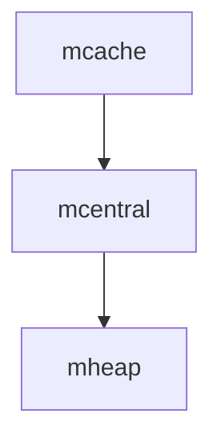

# Go 内存分配器

Go语言以其高效的并发性能和简洁的语法而闻名，而内存管理是Go语言高效运行的关键之一。本文将深入探讨Go语言中的内存分配器，帮助你理解其工作原理、分配策略以及在实际开发中的应用。

## 什么是内存分配器？

内存分配器是Go运行时系统的一部分，负责管理程序运行时的内存分配和回收。Go的内存分配器采用了多种优化策略，以确保高效的内存使用和快速的分配速度。

### 内存分配的基本概念

在Go中，内存分配器主要处理以下任务：

1. **分配内存**：为变量、对象等分配所需的内存空间。
2. **回收内存**：通过垃圾回收机制（GC）自动回收不再使用的内存。

Go的内存分配器采用了**分代分配**和**局部性分配**的策略，以减少内存碎片和提高分配效率。

## Go 内存分配器的工作原理

### 内存分配的基本单位

Go的内存分配器将内存划分为多个**大小类（size class）**，每个大小类对应一组固定大小的内存块。这种设计可以减少内存碎片，并提高分配效率。

```go
// 示例：Go中的内存分配
package main

import "fmt"

func main() {
    // 分配一个整数
    var a *int = new(int)
    *a = 42
    fmt.Println(*a) // 输出: 42
}
```

在上面的代码中，`new(int)` 会分配一个整数的内存空间，并返回其指针。

### 内存分配器的结构

Go的内存分配器主要由以下几个部分组成：

1. **mcache**：每个线程（P）都有一个本地缓存（mcache），用于快速分配小对象。
2. **mcentral**：中央缓存（mcentral）用于管理多个线程共享的内存块。
3. **mheap**：全局堆（mheap）负责管理所有的内存分配和回收。



### 分配策略

Go的内存分配器采用了**分层分配**的策略：

1. **小对象分配**：小对象（通常小于32KB）直接从mcache中分配，避免了锁竞争，提高了分配速度。
2. **大对象分配**：大对象直接从mheap中分配，绕过mcache和mcentral。

:::tip
小对象的分配速度非常快，因为mcache是线程本地的，不需要加锁。
:::

## 实际应用场景

### 高性能并发编程

在高并发场景下，Go的内存分配器能够有效地减少锁竞争，提高内存分配的速度。例如，在Web服务器中，每个请求可能需要分配大量的临时对象，Go的内存分配器能够高效地处理这些请求。

```go
// 示例：高并发下的内存分配
package main

import (
    "fmt"
    "sync"
)

func main() {
    var wg sync.WaitGroup
    for i := 0; i < 1000; i++ {
        wg.Add(1)
        go func(i int) {
            defer wg.Done()
            data := make([]byte, 1024) // 分配1KB的内存
            fmt.Printf("Goroutine %d allocated memory\n", i)
        }(i)
    }
    wg.Wait()
}
```

在上面的代码中，我们启动了1000个goroutine，每个goroutine分配1KB的内存。由于Go的内存分配器的高效性，这种高并发的内存分配不会导致性能瓶颈。

### 减少内存碎片

Go的内存分配器通过大小类和分层分配的策略，有效地减少了内存碎片。这对于长时间运行的服务尤为重要，因为内存碎片会导致内存使用效率下降，甚至引发内存不足的问题。

## 总结

Go的内存分配器是Go语言高效运行的关键组件之一。它通过分层分配、大小类和本地缓存等策略，实现了高效的内存分配和回收。理解Go的内存分配器不仅有助于编写高效的Go程序，还能帮助你在高并发场景下优化内存使用。

### 附加资源

- [Go语言官方文档](https://golang.org/doc/)
- [Go内存模型](https://golang.org/ref/mem)
- [Go垃圾回收机制](https://blog.golang.org/ismmkeynote)

### 练习

1. 编写一个Go程序，分配大量小对象，并观察内存使用情况。
2. 修改程序，分配大对象，比较两者的性能差异。
3. 研究Go的垃圾回收机制，了解如何手动触发GC。

通过以上练习，你将更深入地理解Go内存分配器的工作原理和实际应用。