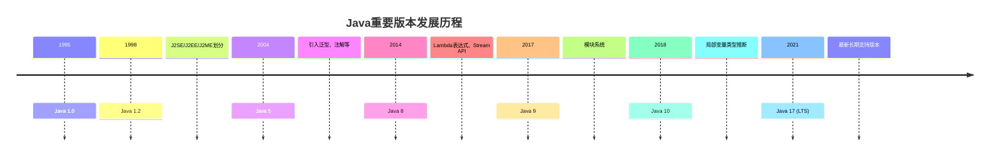

# Java 简介

<div style={{
    "width": "20%",
    "margin": "0 auto",
    "text-align": "center"
}}>
    
</div>


Java是世界上最流行的编程语言之一，被广泛应用于企业级应用、移动应用、Web应用等多个领域。作为一门面向对象的编程语言，Java以其"一次编写，到处运行"的特性而闻名于世。无论你是计算机科学专业的学生，还是希望转行到IT行业的人士，Java都是一个值得学习的语言。

## Java 的历史与发展

Java语言由James Gosling及其团队于1990年代初在Sun Microsystems公司开发（现已被Oracle收购）。最初被称为Oak，是为了嵌入式系统而设计的。后来，随着互联网的兴起，Java被重新定位为一种适用于网络编程的语言，并于1995年正式发布。

Java的版本演进：



## Java 的特点

Java语言之所以能够成为最受欢迎的编程语言之一，主要得益于以下特点：

### 1. 平台无关性

Java代码编译成字节码后可以在任何安装了Java虚拟机(JVM)的平台上运行，不需要重新编译。这就是著名的"Write Once, Run Anywhere"（一次编写，到处运行）。

### 2. 面向对象

Java是一种纯面向对象的语言，除了基本数据类型外，Java中的一切都是对象。面向对象编程有助于创建模块化程序，提高代码的重用性。

### 3. 简单性

相比C++，Java移除了指针、运算符重载等复杂特性，使语言更简单、更容易学习。

### 4. 健壮性

Java的强类型检查和自动内存管理（垃圾回收）机制使程序更加健壮，减少了内存泄漏和指针错误等常见问题。

### 5. 安全性

Java提供了安全管理器、类加载器和沙箱机制等多层安全架构。

### 6. 多线程支持

Java内置了对多线程的支持，便于开发高性能的并发应用。

:::tip
Java的安全特性和平台无关性使其特别适合在网络环境中使用，这也是早期Java被称为"互联网编程语言"的原因。
:::

## Java 的三大版本

Java平台主要分为三个版本：

1. **Java SE (Standard Edition)**: 标准版，提供了Java的核心功能，适用于桌面和简单的服务器应用程序开发。

2. **Java EE (Enterprise Edition)**: 企业版，在SE的基础上增加了用于开发企业级应用的API和规范，如Servlet、JSP、EJB等。

3. **Java ME (Micro Edition)**: 微型版，为资源受限的设备（如手机、PDA）提供API。

## Java 开发环境搭建

要开始Java编程，首先需要搭建Java开发环境：

### 1. 安装JDK (Java Development Kit)

JDK包含了Java运行环境(JRE)和开发工具。可以从Oracle官网下载最新的JDK：[Oracle JDK](https://www.oracle.com/java/technologies/downloads/)。

### 2. 配置环境变量

安装完JDK后，需要配置环境变量：

- **JAVA_HOME**: 指向JDK安装目录
- **PATH**: 添加`%JAVA_HOME%\bin`使Java命令可在任何目录下运行

### 3. 验证安装

打开命令行，输入：

```bash
java -version
javac -version
```

如果显示版本信息，说明Java环境已经成功配置。

### 4. 选择IDE (集成开发环境)

推荐的Java IDE有：
- **IntelliJ IDEA**: 功能强大，被认为是最好的Java IDE
- **Eclipse**: 开源且广泛使用
- **NetBeans**: Oracle官方支持的IDE

## 第一个Java程序

让我们创建一个传统的"Hello World"程序：

1. 用文本编辑器创建一个名为`HelloWorld.java`的文件：

```java
public class HelloWorld {
    public static void main(String[] args) {
        System.out.println("Hello, World!");
    }
}
```

2. 在命令行中编译并运行：

```bash
javac HelloWorld.java
java HelloWorld
```

输出结果：
```
Hello, World!
```

### 代码解析：

- `public class HelloWorld`: 声明一个公共类，类名必须与文件名相同
- `public static void main(String[] args)`: 主方法，程序的入口点
- `System.out.println("Hello, World!")`: 向控制台输出文本

## Java 程序的编译和运行过程


1. 首先，使用`javac`编译器将Java源代码编译成字节码
2. 然后，Java虚拟机(JVM)解释执行字节码

这种"编译+解释"的双重处理方式，使得Java既有编译语言的性能优势，又有解释语言的平台无关性。

## Java 在现实世界中的应用

Java的应用范围极其广泛：

### 1. 企业级应用

银行、金融、保险等领域的大型系统常用Java开发。例如，很多银行的核心业务系统都是用Java编写的。

### 2. 移动应用开发

Android应用开发主要使用Java（现在也可以使用Kotlin）。

### 3. Web应用

使用Spring、Struts、Hibernate等框架进行Web开发。

### 4. 大数据处理

Hadoop、Spark等大数据处理框架大部分是用Java编写的。

### 5. 科学计算

许多科学计算和数据分析工具也选择Java作为平台。

:::note 实际案例
**案例：网上银行系统**

Java EE常被用来开发网上银行系统。这类应用需要高安全性、可靠性和可扩展性，Java的企业特性恰好满足这些需求。例如，Java的事务管理可以确保银行转账的原子性，安全框架可以保护用户信息不被非法访问。
:::

## Java 学习路线图

作为初学者，你可以按照以下路线学习Java：

1. **Java基础**: 语法、数据类型、控制流、面向对象编程概念
2. **Java核心类库**: 集合框架、I/O、异常处理、多线程
3. **Java高级特性**: 泛型、注解、Lambda表达式、Stream API
4. **Java Web开发**: Servlet、JSP、Spring框架
5. **数据库编程**: JDBC、Hibernate、MyBatis
6. **项目实践**: 综合运用所学知识开发实际项目

## 总结

Java作为一门成熟且广泛应用的编程语言，具有平台无关性、面向对象、简单性、健壮性等特点。它适用于各种规模的应用程序开发，从移动应用到企业级系统。通过本文的介绍，你已经了解了Java的基本概念、特点以及如何搭建Java开发环境并运行第一个Java程序。

在接下来的学习中，我们将深入探讨Java的语法、数据类型、控制结构以及面向对象编程的概念。Java的学习道路虽然漫长，但每一步都会让你更接近成为一名专业的Java开发者。

## 练习

1. 搭建Java开发环境，并运行本文中的Hello World程序。
2. 修改Hello World程序，让它打印出你的名字和当前日期。
3. 研究Java的不同版本(如Java 8、Java 11、Java 17等)之间的主要区别。
4. 寻找并安装一个你喜欢的Java IDE，熟悉其基本功能。

## 进一步阅读资源

- 《Java编程思想》(Thinking in Java) - Bruce Eckel
- 《Effective Java》- Joshua Bloch
- [Oracle Java Documentation](https://docs.oracle.com/en/java/)
- [Java Tutorials](https://docs.oracle.com/javase/tutorial/)

祝你在Java学习之旅中取得成功！