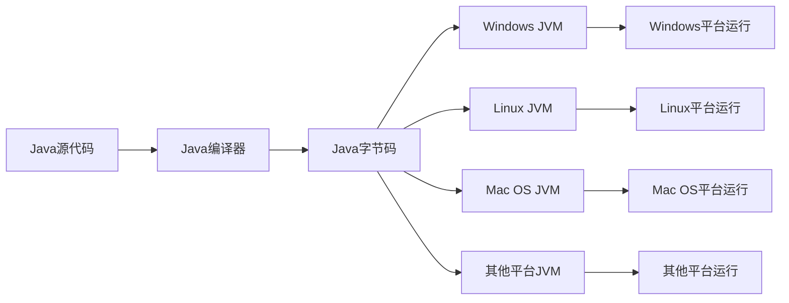

# Java 历史

## 引言

Java是当今世界上最流行的编程语言之一，被广泛应用于企业级应用、Web开发、移动应用和嵌入式系统等领域。要真正理解Java的设计理念和特性，了解其发展历史是非常重要的。本文将带你回顾Java语言从诞生到现在的发展历程，帮助你更深入地理解这门强大的编程语言。

## Java 的诞生

Java语言诞生于上世纪90年代初，是由Sun Microsystems公司（现已被Oracle收购）的工程师James Gosling（詹姆斯·高斯林）及其团队开发的。

:::note 历史趣闻
Java最初的项目代号为"Oak"（橡树），据说是因为Gosling办公室外有一棵橡树。后来因为"Oak"这个名称已经被注册，团队在咖啡馆头脑风暴时，决定以他们喜爱的咖啡名称"Java"命名这门新语言。
:::

### Java 的初衷

Java语言的创建初衷是为了满足当时新兴的消费电子产品（如机顶盒、PDA等）对软件的需求。Gosling团队希望创建一种：

1. **平台无关**的语言，能够在不同设备上运行
2. **安全可靠**的语言，减少常见编程错误
3. **面向对象**的语言，便于开发复杂应用
4. **语法友好**的语言，让程序员易于上手

### "一次编写，到处运行"的理念

Java最著名的口号是"Write Once, Run Anywhere"（一次编写，到处运行），这体现了Java平台独立性的核心价值。



## Java 重要版本的发展历程

### Java 1.0 (1996)

1995年，Sun公司正式发布Java语言，并在1996年1月发布了Java 1.0版本。这个版本奠定了Java的基础特性：

- Java虚拟机（JVM）
- 基本的Java类库
- Applet技术（允许浏览器执行Java小程序）

### Java 1.1 (1997)

增加了重要功能：

- Java内部类
- JavaBeans组件模型
- JDBC（Java数据库连接）
- RMI（远程方法调用）

### J2SE 1.2 (1998)

Sun将Java分为三个版本：
- J2SE（标准版）
- J2EE（企业版）
- J2ME（微型版）

J2SE 1.2引入了:
- Swing图形界面库
- JIT（即时编译器）
- 集合框架（Collections Framework）

### J2SE 1.3 (2000)和J2SE 1.4 (2002)

这些版本对Java进行了大量性能优化和功能增强：

- HotSpot JVM
- 正则表达式
- 异常链
- XML处理
- 断言（Assertions）

### J2SE 5.0 (2004)

这是Java语法的一次重大更新：

- 泛型（Generics）
- 注解（Annotations）
- 枚举类型（Enumerations）
- 自动装箱/拆箱（Autoboxing/Unboxing）
- 增强for循环（Enhanced for-loop）
- 可变参数（Varargs）
- 静态导入（Static import）

### Java SE 6 (2006)

Sun将名称从J2SE改为Java SE：

- 脚本语言支持
- JDBC 4.0
- Java编译器API

### Java SE 7 (2011)

Oracle收购Sun后发布的第一个Java版本：

- try-with-resources语句
- 字符串switch语句
- 二进制字面值
- 下划线数字字面值
- 钻石操作符（`<>`）改进泛型实例化

### Java SE 8 (2014)

这是Java语言的另一次重大更新：

- Lambda表达式
- 函数式接口
- 流API（Stream API）
- 新的日期和时间API
- 接口默认方法
- Optional类

**示例代码：Java 8 Lambda表达式**

```java
// Java 8之前
List<String> names = Arrays.asList("Alice", "Bob", "Charlie");
Collections.sort(names, new Comparator<String>() {
    @Override
    public int compare(String a, String b) {
        return a.compareTo(b);
    }
});

// Java 8使用Lambda
List<String> names = Arrays.asList("Alice", "Bob", "Charlie");
Collections.sort(names, (a, b) -> a.compareTo(b));

// 或更简洁
names.sort(Comparator.naturalOrder());
```

### Java SE 9 (2017)

- 模块系统（Project Jigsaw）
- JShell（交互式Java REPL）
- 改进的Process API
- 集合工厂方法

### Java SE 10 (2018)开始的半年发布周期

从Java 10开始，Oracle改为每半年发布一次Java版本：

- Java 10: 局部变量类型推断（var关键字）
- Java 11 (2018): HTTP客户端API，运行单文件程序
- Java 12-16: 各种预览特性和改进
- Java 17 (2021): 长期支持版本（LTS），密封类（Sealed Classes）
- Java 21 (2023): 最新LTS版本，包含虚拟线程、记录模式等新特性

## Java 在实际应用中的发展

### 服务器端应用

Java成为企业级应用开发的首选语言之一：

- **Spring框架**：简化企业级Java开发
- **Hibernate**：对象关系映射框架
- **大数据生态系统**：Hadoop，Spark等

### 移动开发

- **Android**：谷歌Android系统使用Java作为主要开发语言（后增加Kotlin）
- **跨平台框架**：如Flutter支持Java/Kotlin开发

### Web应用

- **Servlet/JSP**：早期Web开发技术
- **JavaServer Faces (JSF)**：组件化Web框架
- **现代微服务框架**：Spring Boot，Quarkus，Micronaut等

## 案例研究：Java在金融领域的应用

金融行业是Java应用最广泛的领域之一。以一个银行的核心业务系统为例：

### 交易处理系统

```java
// 使用Java处理银行交易的简化代码示例
public class TransactionProcessor {
    public TransactionResult processTransaction(Transaction transaction) {
        // 验证交易
        if (!validateTransaction(transaction)) {
            return new TransactionResult(false, "交易验证失败");
        }
        
        // 检查账户余额
        Account account = accountRepository.findById(transaction.getAccountId());
        if (account.getBalance().compareTo(transaction.getAmount()) < 0) {
            return new TransactionResult(false, "账户余额不足");
        }
        
        // 执行交易
        account.debit(transaction.getAmount());
        accountRepository.save(account);
        
        // 记录交易日志
        transactionLogger.log(transaction);
        
        return new TransactionResult(true, "交易成功处理");
    }
    
    // 其他方法...
}
```

金融机构选择Java的原因：

1. **可靠性和稳定性**：Java的异常处理机制和类型安全特性减少了运行时错误
2. **安全性**：Java的安全管理器和沙箱模型提供了多层安全保障
3. **性能**：现代JVM的JIT编译和垃圾回收机制使Java能处理高吞吐量交易
4. **大型生态系统**：丰富的金融领域相关库和框架
5. **人才市场**：大量熟练的Java开发者可供招聘

## Java 的未来发展趋势

Java继续在几个关键方向发展：

1. **提高开发效率**：项目Amber致力于提高Java开发者的生产力
2. **改进性能**：项目Loom（虚拟线程）和GraalVM改进并发和启动性能
3. **云原生支持**：更好地适应容器化和微服务架构
4. **与其他JVM语言协作**：与Kotlin、Scala等语言更好地互操作

:::tip
Java的发展遵循了"向后兼容性"原则，这意味着旧版本的Java程序通常可以在新版本的JVM上运行，这是Java企业级应用长期稳定的重要保障。
:::

## 总结

Java从1995年诞生至今，已经走过了近30年的历程。它从最初为消费电子设备设计的语言，发展成为企业级应用和Android开发的主流语言。Java成功的关键在于：

1. **平台独立性**："一次编写，到处运行"的理念
2. **不断进化**：语言特性持续更新，但保持向后兼容性
3. **强大的生态系统**：丰富的框架、库和工具
4. **安全可靠**：严格的类型检查和内存管理

无论是作为学习编程的第一语言，还是企业级应用的开发平台，Java都展现了非凡的生命力和适应性，这也是它能在编程语言排行榜上常年保持前列的原因。

## 进阶学习资源

- **官方文档**: [Oracle Java Documentation](https://docs.oracle.com/en/java/)
- **开源项目**: OpenJDK，了解Java的实现细节
- **Java社区**: Java User Groups (JUGs)
- **技术会议**: JavaOne, Devoxx等

## 练习题

1. 研究Java语言名称的由来，写一篇简短的文章。
2. 比较Java 1.0和Java 17的主要特性差异。
3. 选择一个Java版本引入的关键特性（如Java 8的Lambda），写一个简单的程序演示其用法。
4. 思考并讨论：为什么Java能在企业级应用中保持长期流行？
5. 调查你所在行业中Java的应用场景，并总结Java为该行业带来的价值。