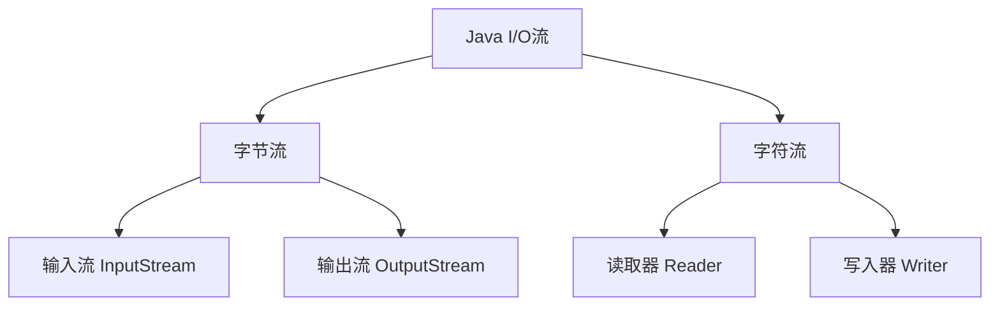

# Java 输入输出

## 概述

在程序开发中，输入输出（I/O）操作是不可或缺的一部分。几乎所有的Java应用程序都需要从某处获取数据（输入），并将处理结果发送到某处（输出）。Java提供了一套全面的API来处理各种类型的输入和输出操作，包括文件读写、网络通信、用户交互等。

本文将介绍Java中输入输出的基础知识，包括控制台输入输出、文件操作以及各种流的使用方法。

## 控制台输入输出

### 标准输出

在Java中，最基本的输出方式是使用`System.out`对象，它代表标准输出流，通常是控制台或命令行窗口。

```java
// 打印文本（不换行）
System.out.print("Hello ");

// 打印文本（自动换行）
System.out.println("World!");

// 格式化输出
System.out.printf("圆周率约等于 %.2f", 3.14159);
```

输出结果：
```
Hello World!
圆周率约等于 3.14
```

### 标准输入

对于从控制台获取输入，Java提供了`Scanner`类，它可以读取各种类型的数据。

```java
import java.util.Scanner;

public class InputExample {
    public static void main(String[] args) {
        // 创建Scanner对象，从标准输入流读取数据
        Scanner scanner = new Scanner(System.in);
        
        // 提示用户输入
        System.out.print("请输入您的姓名: ");
        String name = scanner.nextLine();
        
        System.out.print("请输入您的年龄: ");
        int age = scanner.nextInt();
        
        // 输出读取的数据
        System.out.println("您好，" + name + "！您今年" + age + "岁。");
        
        // 关闭Scanner
        scanner.close();
    }
}
```

假设用户输入：
```
请输入您的姓名: 张三
请输入您的年龄: 25
```

输出结果：
```
您好，张三！您今年25岁。
```

:::caution 注意
使用`Scanner`读取数值后再读取字符串可能会遇到问题，因为`nextInt()`等方法不会消费换行符。解决方法是在读取数值后调用一次`nextLine()`来消费这个换行符。
:::

## Java I/O流概述

Java I/O系统使用流（Stream）的概念来处理输入和输出。流是一个抽象的概念，表示一个连续的数据流。

Java中的I/O流主要分为两类：

1. **字节流（Byte Streams）**：处理原始二进制数据
2. **字符流（Character Streams）**：专门处理字符数据

每类又分为输入流和输出流：



## 字节流

字节流用于处理二进制数据，比如图像、音频、视频等。

### 文件字节流

`FileInputStream`和`FileOutputStream`是用于读取和写入文件的字节流。

```java
import java.io.*;

public class ByteStreamExample {
    public static void main(String[] args) {
        try {
            // 创建文件输出流
            FileOutputStream fos = new FileOutputStream("test.dat");
            
            // 写入一些字节
            byte[] data = {65, 66, 67, 68, 69}; // 对应ASCII码中的ABCDE
            fos.write(data);
            fos.close();
            
            // 创建文件输入流
            FileInputStream fis = new FileInputStream("test.dat");
            
            // 读取字节
            int byteData;
            System.out.print("读取的字节: ");
            while ((byteData = fis.read()) != -1) {
                System.out.print((char)byteData + " "); // 转换为字符输出
            }
            fis.close();
            
        } catch (IOException e) {
            e.printStackTrace();
        }
    }
}
```

输出结果：
```
读取的字节: A B C D E 
```

### 缓冲字节流

为了提高I/O操作的效率，Java提供了缓冲流`BufferedInputStream`和`BufferedOutputStream`。

```java
import java.io.*;

public class BufferedStreamExample {
    public static void main(String[] args) {
        try {
            // 创建带缓冲的输出流
            FileOutputStream fos = new FileOutputStream("buffered.dat");
            BufferedOutputStream bos = new BufferedOutputStream(fos);
            
            // 写入数据
            for (int i = 0; i < 1000; i++) {
                bos.write(i % 256); // 写入0-255循环的值
            }
            bos.close(); // 关闭高级流会自动关闭底层流
            
            // 创建带缓冲的输入流
            FileInputStream fis = new FileInputStream("buffered.dat");
            BufferedInputStream bis = new BufferedInputStream(fis);
            
            // 读取所有字节并计算总和
            int sum = 0;
            int data;
            while ((data = bis.read()) != -1) {
                sum += data;
            }
            bis.close();
            
            System.out.println("读取的1000个字节的总和: " + sum);
            
        } catch (IOException e) {
            e.printStackTrace();
        }
    }
}
```

## 字符流

字符流专门用于处理字符数据，适合用来处理文本文件。

### 文件字符流

`FileReader`和`FileWriter`是用于读取和写入文本文件的字符流。

```java
import java.io.*;

public class CharacterStreamExample {
    public static void main(String[] args) {
        try {
            // 创建文件写入器
            FileWriter writer = new FileWriter("message.txt");
            
            // 写入文本
            writer.write("你好，这是一个示例文本文件！\n");
            writer.write("Java I/O系统很强大！");
            writer.close();
            
            // 创建文件读取器
            FileReader reader = new FileReader("message.txt");
            
            // 读取文本
            int character;
            System.out.println("文件内容:");
            while ((character = reader.read()) != -1) {
                System.out.print((char)character);
            }
            reader.close();
            
        } catch (IOException e) {
            e.printStackTrace();
        }
    }
}
```

输出结果：
```
文件内容:
你好，这是一个示例文本文件！
Java I/O系统很强大！
```

### 缓冲字符流

类似于缓冲字节流，Java也提供了缓冲字符流`BufferedReader`和`BufferedWriter`来提高文本处理效率。

```java
import java.io.*;

public class BufferedCharStreamExample {
    public static void main(String[] args) {
        try {
            // 创建带缓冲的写入器
            BufferedWriter writer = new BufferedWriter(new FileWriter("buffered.txt"));
            
            // 写入多行文本
            writer.write("第一行文本");
            writer.newLine(); // 写入一个平台相关的换行符
            writer.write("第二行文本");
            writer.newLine();
            writer.write("第三行文本");
            writer.close();
            
            // 创建带缓冲的读取器
            BufferedReader reader = new BufferedReader(new FileReader("buffered.txt"));
            
            // 按行读取文本
            String line;
            System.out.println("文件内容(按行读取):");
            while ((line = reader.readLine()) != null) {
                System.out.println(line);
            }
            reader.close();
            
        } catch (IOException e) {
            e.printStackTrace();
        }
    }
}
```

输出结果：
```
文件内容(按行读取):
第一行文本
第二行文本
第三行文本
```

:::tip
`BufferedReader`的`readLine()`方法是一个非常有用的方法，它可以一次读取一整行文本，而不需要我们自己处理换行符。
:::

## 数据流

Java提供了`DataInputStream`和`DataOutputStream`来读写Java原始数据类型。

```java
import java.io.*;

public class DataStreamExample {
    public static void main(String[] args) {
        try {
            // 创建数据输出流
            DataOutputStream dos = new DataOutputStream(
                new FileOutputStream("data.bin"));
            
            // 写入各种数据类型
            dos.writeInt(123);
            dos.writeDouble(3.14159);
            dos.writeBoolean(true);
            dos.writeUTF("Hello, Data Stream!");
            dos.close();
            
            // 创建数据输入流
            DataInputStream dis = new DataInputStream(
                new FileInputStream("data.bin"));
            
            // 读取数据（必须按照写入的顺序读取）
            int intValue = dis.readInt();
            double doubleValue = dis.readDouble();
            boolean booleanValue = dis.readBoolean();
            String stringValue = dis.readUTF();
            dis.close();
            
            // 打印读取的值
            System.out.println("整数值: " + intValue);
            System.out.println("浮点值: " + doubleValue);
            System.out.println("布尔值: " + booleanValue);
            System.out.println("字符串: " + stringValue);
            
        } catch (IOException e) {
            e.printStackTrace();
        }
    }
}
```

输出结果：
```
整数值: 123
浮点值: 3.14159
布尔值: true
字符串: Hello, Data Stream!
```

## 对象序列化

Java允许将对象转换为字节序列（序列化），并可以将这些字节序列恢复为对象（反序列化）。

```java
import java.io.*;

// 定义一个可序列化的类
class Person implements Serializable {
    private static final long serialVersionUID = 1L;
    private String name;
    private int age;
    
    public Person(String name, int age) {
        this.name = name;
        this.age = age;
    }
    
    @Override
    public String toString() {
        return "Person [name=" + name + ", age=" + age + "]";
    }
}

public class SerializationExample {
    public static void main(String[] args) {
        try {
            // 创建Person对象
            Person person = new Person("张三", 25);
            
            // 序列化对象到文件
            ObjectOutputStream oos = new ObjectOutputStream(
                new FileOutputStream("person.dat"));
            oos.writeObject(person);
            oos.close();
            
            // 从文件反序列化对象
            ObjectInputStream ois = new ObjectInputStream(
                new FileInputStream("person.dat"));
            Person deserializedPerson = (Person) ois.readObject();
            ois.close();
            
            // 输出反序列化后的对象
            System.out.println("反序列化后的对象: " + deserializedPerson);
            
        } catch (IOException | ClassNotFoundException e) {
            e.printStackTrace();
        }
    }
}
```

输出结果：
```
反序列化后的对象: Person [name=张三, age=25]
```

:::caution 注意
要使类可序列化，必须实现`Serializable`接口，并且为了版本控制，最好定义`serialVersionUID`字段。
:::

## File类

Java的`File`类代表文件系统中的文件和目录路径。

```java
import java.io.File;
import java.io.IOException;

public class FileExample {
    public static void main(String[] args) {
        // 创建File对象
        File file = new File("example.txt");
        
        try {
            // 创建新文件
            if (file.createNewFile()) {
                System.out.println("文件创建成功: " + file.getName());
            } else {
                System.out.println("文件已存在");
            }
            
            // 显示文件信息
            System.out.println("文件路径: " + file.getAbsolutePath());
            System.out.println("文件大小: " + file.length() + " 字节");
            System.out.println("可读: " + file.canRead());
            System.out.println("可写: " + file.canWrite());
            
            // 创建目录
            File directory = new File("example_dir");
            directory.mkdir();
            
            // 列出目录中的文件
            File dir = new File(".");
            System.out.println("\n当前目录中的文件和目录:");
            String[] fileList = dir.list();
            for (String fileName : fileList) {
                System.out.println(fileName);
            }
            
        } catch (IOException e) {
            e.printStackTrace();
        }
    }
}
```

## 实际案例：简单文件复制程序

下面是一个综合运用Java I/O的实际案例，实现文件复制功能。

```java
import java.io.*;

public class FileCopyExample {
    public static void main(String[] args) {
        // 检查命令行参数
        if (args.length != 2) {
            System.out.println("用法: java FileCopyExample 源文件 目标文件");
            return;
        }
        
        String sourceFile = args[0];
        String destFile = args[1];
        
        // 使用缓冲流复制文件
        try (BufferedInputStream bis = new BufferedInputStream(
                new FileInputStream(sourceFile));
             BufferedOutputStream bos = new BufferedOutputStream(
                new FileOutputStream(destFile))) {
            
            // 创建缓冲区
            byte[] buffer = new byte[8192]; // 8KB缓冲区
            int bytesRead;
            long totalBytes = 0;
            long startTime = System.currentTimeMillis();
            
            // 读写循环
            while ((bytesRead = bis.read(buffer)) != -1) {
                bos.write(buffer, 0, bytesRead);
                totalBytes += bytesRead;
            }
            
            long endTime = System.currentTimeMillis();
            
            // 打印复制信息
            System.out.println("文件复制完成！");
            System.out.println("源文件: " + sourceFile);
            System.out.println("目标文件: " + destFile);
            System.out.println("复制了 " + totalBytes + " 字节");
            System.out.println("耗时: " + (endTime - startTime) + " 毫秒");
            
        } catch (IOException e) {
            System.out.println("复制文件时发生错误: " + e.getMessage());
            e.printStackTrace();
        }
    }
}
```

:::note
上面的代码使用了Java 7引入的try-with-resources语法，它会自动关闭在try括号中创建的资源，不需要显式调用close()方法。
:::

## 总结

本文介绍了Java中的输入输出系统，包括：

1. 控制台的输入与输出
2. 字节流和字符流的基础知识
3. 缓冲流的使用方法
4. 数据流的读写
5. 对象序列化和反序列化
6. File类的使用
7. 一个实际的文件复制程序

Java的I/O系统非常强大和灵活，可以满足各种输入输出需求。从Java 7开始，还引入了NIO.2（New I/O 2），提供了更现代化的文件操作API，如`Path`、`Files`和`DirectoryStream`等，进一步增强了Java的I/O能力。

## 练习

1. 编写一个程序，统计文本文件中的字符数、单词数和行数。
2. 实现一个简单的文本编辑器，可以新建、打开、编辑和保存文本文件。
3. 创建一个序列化和反序列化自定义对象集合的程序。
4. 使用Java I/O编写一个目录树显示程序，打印出指定目录的文件结构。
5. 实现一个程序，可以将一个文本文件中的所有字符转换为大写并保存到新文件中。

## 扩展资源

- Java官方文档中的I/O部分：[Java I/O Tutorial](https://docs.oracle.com/javase/tutorial/essential/io/)
- Java NIO.2的学习资源：[Java NIO.2](https://docs.oracle.com/javase/tutorial/essential/io/fileio.html)
- 更多关于序列化的高级主题：[Java Object Serialization Specification](https://docs.oracle.com/javase/8/docs/platform/serialization/spec/serialTOC.html)

通过这些基础知识和练习，您将能够处理Java中大多数常见的输入输出需求，为构建更复杂的应用程序打下坚实的基础。