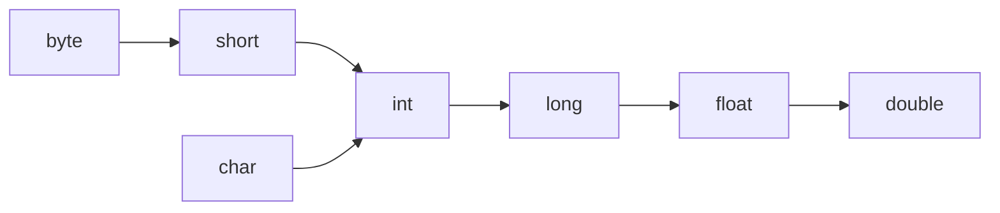

# Java 类型转换

在Java编程中，类型转换是一个基础但非常重要的概念。当我们需要将一个数据类型的值赋给另一种数据类型的变量时，就需要进行类型转换。正确理解和使用类型转换可以帮助我们避免许多常见的编程错误，并编写更加高效的代码。

## 什么是类型转换？

类型转换是将一种数据类型的值转换为另一种数据类型的过程。在Java中，类型转换主要分为两种：

1. **自动类型转换（隐式转换）**：当较小范围的数据类型赋值给较大范围的数据类型时，Java会自动完成转换。
2. **强制类型转换（显式转换）**：当较大范围的数据类型赋值给较小范围的数据类型时，需要手动进行转换。

## 数据类型范围

在了解类型转换之前，我们先来看一下Java中基本数据类型的范围（从小到大）：



除了上述基本类型的转换外，引用类型（如类和接口）也可以进行类型转换，主要涉及到继承和实现关系。

## 自动类型转换（隐式转换）

当较小范围的数据类型赋值给较大范围的数据类型时，Java会自动完成转换，这种转换是安全的，不会导致数据丢失。

### 示例

```java
public class AutoTypeConversion {
    public static void main(String[] args) {
        // byte 转换为 int
        byte byteValue = 10;
        int intValue = byteValue;
        System.out.println("byte值: " + byteValue + ", 转换后的int值: " + intValue);
        
        // char 转换为 int
        char charValue = 'A';
        int intFromChar = charValue;
        System.out.println("char值: " + charValue + ", 转换后的int值: " + intFromChar);
        
        // int 转换为 long
        int intVal = 100;
        long longVal = intVal;
        System.out.println("int值: " + intVal + ", 转换后的long值: " + longVal);
        
        // int 转换为 float
        int intNumber = 123456;
        float floatNumber = intNumber;
        System.out.println("int值: " + intNumber + ", 转换后的float值: " + floatNumber);
    }
}
```

输出：
```
byte值: 10, 转换后的int值: 10
char值: A, 转换后的int值: 65
int值: 100, 转换后的long值: 100
int值: 123456, 转换后的float值: 123456.0
```

:::note
从输出可以看到，自动类型转换并没有改变原始值的大小，只是将其表示在一个更大范围的数据类型中。
:::

## 强制类型转换（显式转换）

当较大范围的数据类型赋值给较小范围的数据类型时，需要手动进行转换，这种转换可能会导致数据丢失或精度降低。

### 语法

```java
目标数据类型 变量名 = (目标数据类型) 要转换的值;
```

### 示例

```java
public class ExplicitTypeConversion {
    public static void main(String[] args) {
        // double 转换为 int
        double doubleValue = 99.99;
        int intValue = (int) doubleValue;
        System.out.println("double值: " + doubleValue + ", 转换后的int值: " + intValue);
        
        // long 转换为 int
        long longValue = 2147483648L; // 超过int最大值
        int intFromLong = (int) longValue;
        System.out.println("long值: " + longValue + ", 转换后的int值: " + intFromLong);
        
        // 字符与数字转换
        int number = 65;
        char character = (char) number;
        System.out.println("int值: " + number + ", 转换后的char值: " + character);
    }
}
```

输出：
```
double值: 99.99, 转换后的int值: 99
long值: 2147483648, 转换后的int值: -2147483648
int值: 65, 转换后的char值: A
```

:::caution
注意，在将`long`值`2147483648L`转换为`int`类型时，由于超出了`int`的范围，导致了数据溢出，结果变为了负数。强制类型转换时需要特别小心这类情况！
:::

## 引用类型转换

引用类型的转换主要涉及到类继承层次结构中的父类和子类之间的转换。

### 向上转型（自动转换）

子类对象可以自动转换为父类类型。

```java
public class AnimalExample {
    public static void main(String[] args) {
        // 子类对象转换为父类引用
        Dog dog = new Dog();
        Animal animal = dog; // 自动向上转型
        animal.eat(); // 调用的是Dog类的eat方法
    }
}

class Animal {
    public void eat() {
        System.out.println("动物在吃东西");
    }
}

class Dog extends Animal {
    @Override
    public void eat() {
        System.out.println("狗在吃骨头");
    }
    
    public void bark() {
        System.out.println("狗在汪汪叫");
    }
}
```

输出：
```
狗在吃骨头
```

### 向下转型（强制转换）

父类对象转换为子类类型需要进行强制类型转换，并且只有当父类引用实际指向子类对象时，才能成功转换。

```java
public class AnimalExample2 {
    public static void main(String[] args) {
        // 向上转型
        Animal animal = new Dog();
        animal.eat();
        
        // 向下转型
        Dog dog = (Dog) animal;
        dog.bark(); // 可以调用子类特有方法
        
        // 错误的向下转型
        try {
            Animal animal2 = new Animal();
            Dog dog2 = (Dog) animal2; // 将抛出ClassCastException异常
            dog2.bark();
        } catch (ClassCastException e) {
            System.out.println("转换失败: " + e.getMessage());
        }
    }
}
```

输出：
```
狗在吃骨头
狗在汪汪叫
转换失败: class Animal cannot be cast to class Dog
```

:::warning
在进行向下转型之前，应当使用`instanceof`运算符检查对象的实际类型，避免类型转换异常。
:::

## 使用instanceof运算符

`instanceof`运算符用于检测对象是否为特定类的实例，可以帮助我们在向下转型之前进行类型检查。

```java
public class InstanceofExample {
    public static void main(String[] args) {
        Animal myAnimal = new Dog();
        
        // 使用instanceof检查
        if (myAnimal instanceof Dog) {
            Dog myDog = (Dog) myAnimal;
            myDog.bark();
        } else {
            System.out.println("无法转换为Dog类型");
        }
        
        Animal anotherAnimal = new Animal();
        if (anotherAnimal instanceof Dog) {
            Dog anotherDog = (Dog) anotherAnimal;
            anotherDog.bark();
        } else {
            System.out.println("无法转换为Dog类型");
        }
    }
}
```

输出：
```
狗在汪汪叫
无法转换为Dog类型
```

## 基本类型与包装类型的转换

Java提供了包装类，可以将基本类型转换为对应的对象。自动装箱和自动拆箱是Java 5之后引入的特性。

### 自动装箱(Autoboxing)

将基本类型自动转换为对应的包装类。

```java
Integer intObject = 100; // 自动装箱，相当于 Integer.valueOf(100)
```

### 自动拆箱(Unboxing)

将包装类自动转换为对应的基本类型。

```java
Integer intObject = new Integer(100);
int intValue = intObject; // 自动拆箱，相当于 intObject.intValue()
```

### 完整示例

```java
public class WrapperExample {
    public static void main(String[] args) {
        // 自动装箱
        Integer intObj = 10;
        Double doubleObj = 10.5;
        
        // 自动拆箱
        int intValue = intObj;
        double doubleValue = doubleObj;
        
        System.out.println("Integer对象: " + intObj + ", int值: " + intValue);
        System.out.println("Double对象: " + doubleObj + ", double值: " + doubleValue);
        
        // 包装类与字符串的转换
        String strValue = "123";
        int parsedInt = Integer.parseInt(strValue);
        Integer integerObj = Integer.valueOf(strValue);
        
        System.out.println("字符串: " + strValue);
        System.out.println("转换为int: " + parsedInt);
        System.out.println("转换为Integer: " + integerObj);
    }
}
```

输出：
```
Integer对象: 10, int值: 10
Double对象: 10.5, double值: 10.5
字符串: 123
转换为int: 123
转换为Integer: 123
```

## 字符串与基本类型的转换

### 字符串转基本类型

每个包装类都提供了对应的解析方法：

```java
public class StringToBasic {
    public static void main(String[] args) {
        // 字符串转换为基本类型
        String strInt = "100";
        String strDouble = "99.99";
        String strBoolean = "true";
        
        int i = Integer.parseInt(strInt);
        double d = Double.parseDouble(strDouble);
        boolean b = Boolean.parseBoolean(strBoolean);
        
        System.out.println("字符串转int: " + i);
        System.out.println("字符串转double: " + d);
        System.out.println("字符串转boolean: " + b);
        
        // 错误的转换会抛出异常
        try {
            int error = Integer.parseInt("abc");
        } catch (NumberFormatException e) {
            System.out.println("转换异常: " + e.getMessage());
        }
    }
}
```

输出：
```
字符串转int: 100
字符串转double: 99.99
字符串转boolean: true
转换异常: For input string: "abc"
```

### 基本类型转字符串

有多种方式可以将基本类型转换为字符串：

```java
public class BasicToString {
    public static void main(String[] args) {
        int i = 100;
        double d = 99.99;
        boolean b = true;
        
        // 方法1: 使用 + 连接
        String str1 = i + "";
        
        // 方法2: 使用String类的valueOf方法
        String str2 = String.valueOf(d);
        
        // 方法3: 使用包装类的toString方法
        String str3 = Boolean.toString(b);
        
        System.out.println("int转字符串: " + str1);
        System.out.println("double转字符串: " + str2);
        System.out.println("boolean转字符串: " + str3);
    }
}
```

输出：
```
int转字符串: 100
double转字符串: 99.99
boolean转字符串: true
```

## 实际应用场景

### 场景1：用户输入处理

当从用户界面接收输入时，通常都是字符串形式，需要转换为对应的数据类型进行处理。

```java
import java.util.Scanner;

public class UserInputExample {
    public static void main(String[] args) {
        Scanner scanner = new Scanner(System.in);
        
        System.out.print("请输入您的年龄: ");
        String input = scanner.nextLine();
        
        try {
            int age = Integer.parseInt(input);
            System.out.println("明年你将会是 " + (age + 1) + " 岁");
        } catch (NumberFormatException e) {
            System.out.println("输入的不是有效的年龄数字!");
        }
        
        scanner.close();
    }
}
```

### 场景2：混合类型运算

在数学计算中，经常会有不同类型数据之间的运算，此时会发生自动类型提升。

```java
public class MixedCalculation {
    public static void main(String[] args) {
        int intValue = 10;
        double doubleValue = 3.5;
        
        // 混合类型计算，int会自动转换为double
        double result = intValue + doubleValue;
        System.out.println("10 + 3.5 = " + result);
        
        // 除法运算
        int a = 10;
        int b = 3;
        double divResult = (double) a / b; // 使用强制类型转换获取精确结果
        System.out.println("10 / 3 = " + divResult);
        
        // 不使用类型转换的除法
        System.out.println("10 / 3 (不转换) = " + (a / b));
    }
}
```

输出：
```
10 + 3.5 = 13.5
10 / 3 = 3.3333333333333335
10 / 3 (不转换) = 3
```

### 场景3：多态应用中的类型转换

在面向对象编程中，多态特性常常需要进行类型转换：

```java
public class PolymorphismExample {
    public static void main(String[] args) {
        // 创建不同形状对象并存储在数组中
        Shape[] shapes = new Shape[3];
        shapes[0] = new Circle();
        shapes[1] = new Rectangle();
        shapes[2] = new Circle();
        
        // 遍历并处理每个形状
        for (Shape shape : shapes) {
            // 所有形状都可以调用draw方法
            shape.draw();
            
            // 特定形状需要类型转换才能调用特有方法
            if (shape instanceof Circle) {
                Circle circle = (Circle) shape;
                circle.displayRadius();
            } else if (shape instanceof Rectangle) {
                Rectangle rectangle = (Rectangle) shape;
                rectangle.displayArea();
            }
            
            System.out.println("-----------------");
        }
    }
}

abstract class Shape {
    abstract void draw();
}

class Circle extends Shape {
    @Override
    void draw() {
        System.out.println("绘制圆形");
    }
    
    void displayRadius() {
        System.out.println("圆的半径是5单位");
    }
}

class Rectangle extends Shape {
    @Override
    void draw() {
        System.out.println("绘制矩形");
    }
    
    void displayArea() {
        System.out.println("矩形的面积是20平方单位");
    }
}
```

输出：
```
绘制圆形
圆的半径是5单位
-----------------
绘制矩形
矩形的面积是20平方单位
-----------------
绘制圆形
圆的半径是5单位
-----------------
```

## 总结

Java类型转换是编程中非常基础且常用的操作。正确理解和使用类型转换可以帮助我们避免许多常见错误：

1. **自动类型转换**：从小范围到大范围的转换，安全无数据丢失
2. **强制类型转换**：从大范围到小范围的转换，可能导致数据丢失或溢出
3. **引用类型转换**：
   - 向上转型（自动）：子类转父类
   - 向下转型（强制）：父类转子类，需要用`instanceof`检查
4. **基本类型与包装类**：通过自动装箱和拆箱机制相互转换
5. **字符串与基本类型**：使用`parse`方法和`valueOf`/`toString`方法相互转换

:::tip
记住一个简单原则：如果转换可能导致数据丢失（如把`double`转为`int`），Java就要求进行强制类型转换；如果不会导致数据丢失（如把`int`转为`double`），则可以进行自动类型转换。
:::

## 练习题

1. 写一个程序，将字符串"3.14159"转换为`double`类型，然后再转换为`int`类型，观察结果。
2. 创建一个父类和两个子类，演示向上转型和向下转型的过程，并使用`instanceof`进行类型检查。
3. 编写代码演示`int`、`Integer`和`String`三者之间的相互转换。
4. 解释为什么下面的代码会产生不同结果：
   ```java
   int a = 10;
   int b = 3;
   double c = a / b;           // 结果是什么？
   double d = (double) a / b;  // 结果是什么？
   ```

## 更多资源

如需更多关于Java类型转换的深入知识，推荐阅读：

- Java API文档中关于包装类的内容
- Java语言规范中的类型转换章节
- 阅读实际项目代码中的类型转换应用

掌握类型转换是成为熟练Java开发者的必要技能，希望这篇文章能帮助你理解这个重要概念！