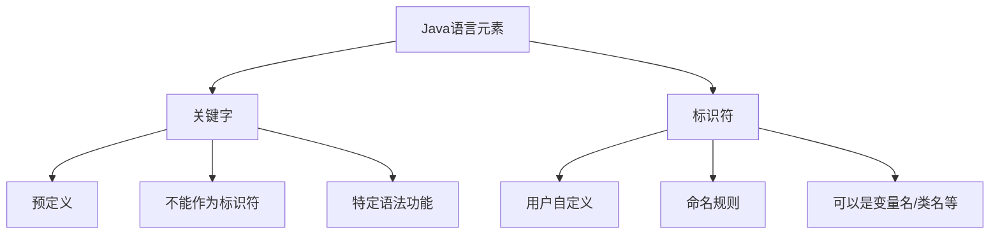

# Java 关键字

## 什么是Java关键字？

Java关键字是Java语言中预先定义并保留的单词，它们有特定的含义和用途。这些关键字不能被用作标识符（如变量名、方法名或类名等）。Java关键字是大小写敏感的，通常以全小写形式出现。

:::tip
Java关键字是语言的基础构建块，理解这些关键字的含义和用法对于掌握Java编程至关重要。
:::

## Java 关键字列表

Java语言目前有51个关键字（Java 17版本）。我们可以将它们分为几个主要类别：

### 1. 数据类型关键字

这些关键字用于定义基本数据类型：
- `byte`：8位整数类型
- `short`：16位整数类型
- `int`：32位整数类型
- `long`：64位整数类型
- `float`：32位浮点数类型
- `double`：64位浮点数类型
- `char`：16位Unicode字符
- `boolean`：布尔值（true/false）
- `void`：表示无返回值

### 2. 流程控制关键字

控制程序执行流程的关键字：
- `if`、`else`：条件判断
- `switch`、`case`、`default`：多分支选择
- `for`、`do`、`while`：循环结构
- `break`：跳出循环或switch语句
- `continue`：跳过本次循环余下部分
- `return`：方法返回

### 3. 修饰符关键字

用于修饰类、方法、变量等的关键字：
- `public`、`private`、`protected`：访问控制
- `static`：静态成员
- `final`：表示不可变（类不能被继承，方法不能被重写，变量不能被修改）
- `abstract`：抽象类或方法
- `synchronized`：线程同步
- `volatile`：变量在多线程之间的可见性
- `transient`：序列化排除字段
- `native`：本地方法（非Java实现）

### 4. 类相关关键字

与类、接口、对象创建相关的关键字：
- `class`：定义类
- `interface`：定义接口
- `enum`：定义枚举类型
- `extends`：继承关系
- `implements`：实现接口
- `this`：引用当前实例
- `super`：引用父类
- `new`：创建对象实例
- `instanceof`：类型检查

### 5. 异常处理关键字

异常处理相关的关键字：
- `try`、`catch`、`finally`：异常捕获和处理
- `throw`：抛出异常
- `throws`：方法可能抛出的异常声明
- `assert`：断言

### 6. 包相关关键字

包管理相关的关键字：
- `package`：声明包
- `import`：导入类或包

### 7. 保留字（未使用）

目前未使用但保留的关键字：
- `goto`、`const`：Java保留但未使用的关键字

### 8. 特殊字面值关键字

- `true`、`false`：布尔字面值
- `null`：空引用

## 关键字详解及示例

让我们详细了解一些常用关键字的用法：

### 数据类型关键字示例

```java
// 基本数据类型示例
byte byteVar = 127;
short shortVar = 32767;
int intVar = 2147483647;
long longVar = 9223372036854775807L; // 注意L后缀
float floatVar = 3.14F; // 注意F后缀
double doubleVar = 3.14159;
char charVar = 'A';
boolean boolVar = true;
```

### 流程控制关键字示例

```java
// if-else示例
int score = 85;
if (score >= 90) {
    System.out.println("优秀");
} else if (score >= 60) {
    System.out.println("及格");
} else {
    System.out.println("不及格");
}

// 输出: 及格

// for循环示例
for (int i = 1; i <= 5; i++) {
    System.out.print(i + " ");
}
// 输出: 1 2 3 4 5

// switch示例
int day = 3;
switch (day) {
    case 1:
        System.out.println("星期一");
        break;
    case 2:
        System.out.println("星期二");
        break;
    case 3:
        System.out.println("星期三");
        break;
    default:
        System.out.println("其他天");
}
// 输出: 星期三
```

### 修饰符关键字示例

```java
public class ModifierExample {
    // public: 公共访问
    public int publicVar = 1;
    
    // private: 仅在类内部访问
    private int privateVar = 2;
    
    // protected: 同包及子类可访问
    protected int protectedVar = 3;
    
    // static: 静态变量，属于类而非实例
    public static int staticVar = 4;
    
    // final: 常量，不可修改
    public final int CONSTANT = 100;
    
    // 静态方法
    public static void staticMethod() {
        System.out.println("这是静态方法");
    }
}
```

### 类相关关键字示例

```java
// 定义一个父类
public class Animal {
    public void makeSound() {
        System.out.println("动物发出声音");
    }
}

// extends关键字：继承父类
public class Dog extends Animal {
    // super关键字：调用父类方法
    @Override
    public void makeSound() {
        super.makeSound();
        System.out.println("狗在汪汪叫");
    }
    
    // this关键字：引用当前实例
    public void showThis() {
        System.out.println("当前对象: " + this);
    }
}

// interface关键字：定义接口
public interface Runnable {
    void run();
}

// implements关键字：实现接口
public class Runner implements Runnable {
    @Override
    public void run() {
        System.out.println("正在跑步");
    }
}
```

### 异常处理关键字示例

```java
public class ExceptionExample {
    public void divideNumbers() {
        try {
            // 可能抛出异常的代码
            int result = 10 / 0;
            System.out.println("结果是: " + result);
        } catch (ArithmeticException e) {
            // 捕获并处理异常
            System.out.println("发生算术异常: " + e.getMessage());
        } finally {
            // 无论是否有异常，总会执行
            System.out.println("计算完成");
        }
    }
    
    // throws关键字：声明方法可能抛出的异常
    public void checkAge(int age) throws IllegalArgumentException {
        if (age < 0) {
            // throw关键字：抛出异常
            throw new IllegalArgumentException("年龄不能为负数");
        }
        System.out.println("年龄合法: " + age);
    }
}

// 运行divideNumbers()的输出:
// 发生算术异常: / by zero
// 计算完成
```

## 关键字使用的实际案例

### 案例1：学生管理系统

以下是一个简单的学生管理系统，它使用了多个Java关键字来构建：

```java
import java.util.ArrayList;
import java.util.List;

// 使用final表示此类不能被继承
public final class StudentManagementSystem {
    private static StudentManagementSystem instance;
    private List<Student> students;
    
    // 私有构造函数 - 单例模式
    private StudentManagementSystem() {
        students = new ArrayList<>();
    }
    
    // 静态方法获取实例
    public static synchronized StudentManagementSystem getInstance() {
        if (instance == null) {
            instance = new StudentManagementSystem();
        }
        return instance;
    }
    
    // 添加学生
    public void addStudent(Student student) {
        try {
            if (student == null) {
                throw new IllegalArgumentException("学生不能为空");
            }
            students.add(student);
            System.out.println("添加学生成功: " + student.getName());
        } catch (Exception e) {
            System.out.println("添加学生失败: " + e.getMessage());
        }
    }
    
    // 显示所有学生
    public void displayAllStudents() {
        if (students.isEmpty()) {
            System.out.println("没有学生信息");
            return;
        }
        
        System.out.println("学生列表:");
        for (Student student : students) {
            System.out.println("姓名: " + student.getName() + 
                               ", 年龄: " + student.getAge() +
                               ", 专业: " + student.getMajor());
        }
    }
}

// Student类
class Student {
    private String name;
    private int age;
    private String major;
    
    public Student(String name, int age, String major) {
        this.name = name;
        this.age = age;
        this.major = major;
    }
    
    // getter方法
    public String getName() { return name; }
    public int getAge() { return age; }
    public String getMajor() { return major; }
}
```

这个案例使用了许多关键字：
- `import`: 导入需要的类
- `public`, `private`: 访问修饰符
- `class`: 定义类
- `static`, `final`: 修饰类和方法
- `new`: 创建对象
- `try`, `catch`, `throw`: 异常处理
- `if`, `for`: 流程控制
- `return`: 返回值
- `this`: 引用当前实例

### 案例2：银行账户交易系统

展示关键字在多线程环境中的应用：

```java
public class BankAccount {
    private double balance;
    private final String accountNumber;
    
    public BankAccount(String accountNumber, double initialBalance) {
        this.accountNumber = accountNumber;
        this.balance = initialBalance;
    }
    
    // synchronized关键字确保多线程安全
    public synchronized void deposit(double amount) {
        if (amount <= 0) {
            throw new IllegalArgumentException("存款金额必须大于0");
        }
        
        double oldBalance = balance;
        balance += amount;
        System.out.println("账户" + accountNumber + 
                           " 存款: " + amount + 
                           " 新余额: " + balance);
    }
    
    public synchronized boolean withdraw(double amount) {
        if (amount <= 0) {
            throw new IllegalArgumentException("取款金额必须大于0");
        }
        
        if (balance < amount) {
            System.out.println("账户" + accountNumber + 
                              " 余额不足，无法取款: " + amount);
            return false;
        }
        
        balance -= amount;
        System.out.println("账户" + accountNumber + 
                           " 取款: " + amount + 
                           " 新余额: " + balance);
        return true;
    }
    
    public double getBalance() {
        return balance;
    }
    
    public String getAccountNumber() {
        return accountNumber;
    }
}

// 实现Runnable接口的交易类
class Transaction implements Runnable {
    private BankAccount account;
    private boolean isDeposit;
    private double amount;
    
    public Transaction(BankAccount account, boolean isDeposit, double amount) {
        this.account = account;
        this.isDeposit = isDeposit;
        this.amount = amount;
    }
    
    @Override
    public void run() {
        try {
            if (isDeposit) {
                account.deposit(amount);
            } else {
                account.withdraw(amount);
            }
            Thread.sleep(100); // 模拟处理时间
        } catch (Exception e) {
            System.out.println("交易错误: " + e.getMessage());
        }
    }
}
```

这个案例展示了关键字在银行系统中的应用：
- `synchronized`: 确保线程安全
- `implements`: 实现接口
- `@Override`: 注解（虽然不是严格的关键字）
- `throw`: 抛出异常
- `if`, `else`: 条件判断
- `this`: 引用当前实例
- `private`, `public`: 访问修饰符
- `final`: 表示账号不可变

## Java 关键字与标识符的区别

要更好地理解关键字，我们需要明白它与标识符的区别：



关键字：
- 由Java语言预先定义
- 有特定的语法功能
- 不能用作标识符
- 全部小写
- 例如：`public`, `class`, `if`

标识符：
- 由用户自定义的名称
- 用于命名变量、方法、类等
- 必须遵循命名规则（字母、数字、$、_开头，且首字符不能是数字）
- 大小写敏感
- 例如：`studentName`, `calculateTotal`, `UserAccount`

## Java 保留字与关键字的区别

除了关键字，Java还有一些保留字：

:::note
Java保留字是指虽然当前Java版本中没有使用，但可能在未来版本中作为关键字使用的单词，如`goto`和`const`。为了代码的前向兼容性，建议不要使用这些保留字作为标识符。
:::

## 总结

Java关键字是Java语言的基础构建块，它们定义了Java程序的结构和行为。掌握这些关键字的含义和用法，对于编写高质量的Java代码至关重要。主要知识点包括：

1. Java关键字是语言预定义的，有特定的功能和用途
2. 关键字不能用作标识符（变量名、方法名等）
3. 关键字是大小写敏感的，通常以小写形式出现
4. Java关键字可分为数据类型、流程控制、修饰符、类相关等多种类别
5. 合理使用关键字可以使代码结构清晰、功能强大

## 练习与挑战

为了巩固所学的Java关键字知识，尝试完成以下练习：

1. 找出并修正以下代码中的关键字误用：
   ```java
   class int {
       public void while() {
           boolean class = true;
           if (class) {
               System.out.println("错误的代码");
           }
       }
   }
   ```

2. 编写一个类，包含至少10个不同的Java关键字，并注释说明每个关键字的用途。

3. 使用关键字`final`、`static`、`public`和`private`实现一个简单的常量类，包含几个常用的数学常量。

## 进一步学习资源

- Java官方文档：[Java Language Keywords](https://docs.oracle.com/javase/tutorial/java/nutsandbolts/_keywords.html)
- 《Java编程思想》—— Bruce Eckel
- 《Effective Java》—— Joshua Bloch

:::tip
理解关键字是掌握Java编程的第一步。随着你不断深入学习，这些关键字的强大功能会逐渐展现出来，帮助你构建复杂而高效的程序。
:::