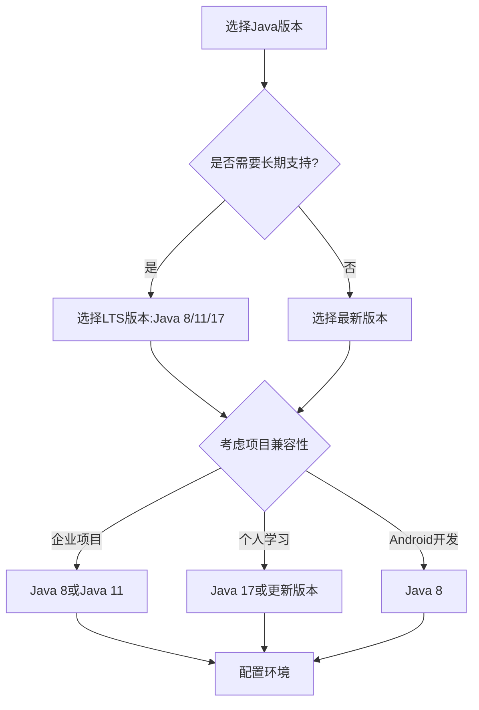

# Java 环境设置

在开始Java编程之前，我们需要先搭建一个合适的开发环境。正确设置Java环境是学习和使用Java的第一步，也是确保你能够顺利编写、编译和运行Java程序的基础。本教程将引导你完成Java环境的设置过程，包括安装JDK（Java Development Kit）、配置环境变量以及选择和设置合适的IDE（集成开发环境）。

## Java 环境简介

Java环境主要包括以下组件：

1. **JDK (Java Development Kit)** - 包含开发Java应用所需的所有工具
   - Java编译器（javac）
   - Java运行时环境（JRE）
   - 调试器和文档等开发工具

2. **JRE (Java Runtime Environment)** - 运行已编译的Java程序所需的环境
   - 包含Java虚拟机（JVM）
   - Java类库和支持文件

3. **IDE (Integrated Development Environment)** - 提供代码编辑、调试等功能的集成开发环境
   - Eclipse
   - IntelliJ IDEA
   - NetBeans
   - Visual Studio Code等

## 安装JDK

### 步骤1：下载JDK

首先，我们需要从Oracle官网或OpenJDK网站下载JDK。

:::tip
对于初学者，建议使用Oracle JDK或AdoptOpenJDK。你可以选择最新的长期支持版本（LTS），如Java 11或Java 17。
:::

### 步骤2：安装JDK

**Windows系统：**

1. 下载.exe或.msi安装文件
2. 双击运行安装程序
3. 按照安装向导的提示完成安装
4. 记住JDK的安装路径，如`C:\Program Files\Java\jdk-17`

**macOS系统：**

1. 下载.dmg或.pkg安装文件
2. 双击打开并按照安装向导操作
3. JDK通常会安装在`/Library/Java/JavaVirtualMachines/`目录下

**Linux系统：**

可以使用包管理器安装：

```bash
# Ubuntu/Debian
sudo apt update
sudo apt install openjdk-17-jdk

# Fedora/RHEL/CentOS
sudo dnf install java-17-openjdk-devel
```

### 步骤3：验证安装

安装完成后，打开命令行（Windows的CMD或PowerShell，macOS/Linux的Terminal）并输入：

```bash
java -version
```

如果安装成功，会显示类似以下的信息：

```
java version "17.0.2" 2022-01-18 LTS
Java(TM) SE Runtime Environment (build 17.0.2+8-LTS-86)
Java HotSpot(TM) 64-Bit Server VM (build 17.0.2+8-LTS-86, mixed mode, sharing)
```

## 配置环境变量

为了能够在任何位置使用Java命令行工具，需要配置环境变量。

### Windows环境变量设置

1. 右键点击"此电脑"或"我的电脑"，选择"属性"
2. 点击"高级系统设置"
3. 在"系统属性"窗口中，点击"环境变量"
4. 在"系统变量"区域，找到并选择"Path"变量，然后点击"编辑"
5. 点击"新建"，添加JDK的bin目录路径，如`C:\Program Files\Java\jdk-17\bin`
6. 点击"确定"保存所有更改
7. 新增JAVA_HOME系统变量
   - 变量名：`JAVA_HOME`
   - 变量值：JDK的安装路径，如`C:\Program Files\Java\jdk-17`

### macOS/Linux环境变量设置

编辑用户配置文件文件（根据你使用的shell不同，可能是`~/.bash_profile`、`~/.bashrc`、`~/.zshrc`等）：

```bash
# 使用文本编辑器打开配置文件
nano ~/.bash_profile

# 添加以下行
export JAVA_HOME=/Library/Java/JavaVirtualMachines/jdk-17.jdk/Contents/Home
export PATH=$JAVA_HOME/bin:$PATH

# 保存并退出
# 使变更生效
source ~/.bash_profile
```

### 验证环境变量配置

配置完成后，重新打开命令行窗口并输入：

```bash
echo %JAVA_HOME%  # Windows
echo $JAVA_HOME   # macOS/Linux

javac -version
```

如果配置正确，会显示JDK的路径和javac的版本信息。

## 选择和设置IDE

虽然可以使用简单的文本编辑器和命令行编译运行Java程序，但使用IDE可以大大提高开发效率。

### 常用Java IDE介绍

1. **Eclipse**
   - 免费开源
   - 功能全面
   - 有丰富的插件生态系统

2. **IntelliJ IDEA**
   - 提供社区版（免费）和旗舰版（付费）
   - 智能代码补全和分析
   - 用户界面友好

3. **NetBeans**
   - 免费开源
   - 自带GUI设计器
   - Oracle官方支持

4. **Visual Studio Code**
   - 轻量级编辑器
   - 安装Java扩展后可用于Java开发
   - 跨平台且高度可定制

### 安装IDE（以IntelliJ IDEA为例）

1. 从官网下载IntelliJ IDEA社区版
2. 运行安装程序并按照向导完成安装
3. 首次启动时，选择UI主题和安装插件
4. 配置JDK：
   - 打开File > Project Structure
   - 在Platform Settings > SDKs中，点击"+"添加JDK
   - 选择JDK安装目录
   - 点击Apply和OK保存设置

## 创建第一个Java程序

让我们使用设置好的环境创建并运行一个简单的Java程序。

### 使用命令行

1. 创建一个名为`HelloWorld.java`的文件：

```java
public class HelloWorld {
    public static void main(String[] args) {
        System.out.println("Hello, Java World!");
    }
}
```

2. 编译程序：

```bash
javac HelloWorld.java
```

3. 运行程序：

```bash
java HelloWorld
```

输出结果：
```
Hello, Java World!
```

### 使用IDE（以IntelliJ IDEA为例）

1. 打开IntelliJ IDEA
2. 点击"Create New Project"
3. 选择"Java"项目，确保选择了正确的JDK
4. 输入项目名称，如"JavaBasics"，点击"Finish"
5. 右键点击src目录，选择New > Java Class
6. 输入类名"HelloWorld"，点击OK
7. 编写代码：

```java
public class HelloWorld {
    public static void main(String[] args) {
        System.out.println("Hello, Java World!");
    }
}
```

8. 右键点击代码编辑区，选择"Run 'HelloWorld.main()'"

IDE控制台将显示输出：
```
Hello, Java World!
```

## 实际应用案例

让我们通过一个简单但实用的例子来巩固对Java环境的理解。

### 案例：创建简单的温度转换程序

这个程序将摄氏温度转换为华氏温度，展示了基本的Java语法和用户交互。

```java
import java.util.Scanner;

public class TemperatureConverter {
    public static void main(String[] args) {
        Scanner scanner = new Scanner(System.in);
        
        System.out.print("请输入摄氏温度: ");
        double celsius = scanner.nextDouble();
        
        // 转换公式: F = C * 9/5 + 32
        double fahrenheit = celsius * 9/5 + 32;
        
        System.out.printf("%.1f°C = %.1f°F\n", celsius, fahrenheit);
        
        scanner.close();
    }
}
```

**编译和运行：**

```bash
javac TemperatureConverter.java
java TemperatureConverter
```

**示例输出：**
```
请输入摄氏温度: 25
25.0°C = 77.0°F
```

这个简单的程序演示了：
1. 导入Java标准库中的类
2. 从用户获取输入
3. 执行计算
4. 格式化输出结果

## Java 环境设置的常见问题

:::caution
初学者可能会遇到一些常见的环境配置问题，下面是一些排障指南。
:::

1. **"'java' 不是内部或外部命令"错误**
   - 原因：环境变量PATH未正确设置
   - 解决：检查并更正PATH环境变量

2. **javac命令无法使用**
   - 原因：可能只安装了JRE而没有安装JDK
   - 解决：安装完整的JDK

3. **版本不一致**
   - 原因：系统中存在多个Java版本
   - 解决：检查JAVA_HOME和PATH设置，确保指向同一版本

4. **IDE找不到JDK**
   - 原因：IDE配置中未指定JDK路径
   - 解决：在IDE设置中手动配置JDK路径

## Java 版本选择建议



## 总结

设置Java环境是开始Java编程之旅的第一步。在本教程中，我们学习了：

1. JDK的安装方法
2. 环境变量的配置
3. IDE的选择和设置
4. 创建并运行第一个Java程序
5. 解决常见的环境配置问题

正确配置Java环境后，你就可以开始专注于学习Java语言本身，而不是被环境问题所困扰。

## 练习

1. 安装JDK并配置环境变量
2. 使用命令行编译并运行HelloWorld程序
3. 安装你选择的IDE并创建一个新Java项目
4. 修改温度转换程序，增加华氏度转摄氏度的功能
5. 尝试创建一个简单的计算器程序，接受用户输入的两个数字和操作符（+、-、*、/），并显示计算结果

## 附加资源

- [Oracle Java 官方文档](https://docs.oracle.com/en/java/)
- [AdoptOpenJDK 下载页面](https://adoptopenjdk.net/)
- [IntelliJ IDEA 教程](https://www.jetbrains.com/idea/guide/)
- [Eclipse 入门指南](https://www.eclipse.org/getting-started/)

现在你已经成功设置了Java开发环境，可以开始你的Java编程之旅了！