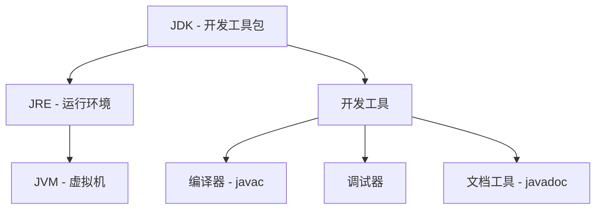

# Java JDK安装

## 什么是JDK？

JDK (Java Development Kit) 是Java开发工具包，它是开发Java应用程序所必需的软件环境。JDK包含了Java运行环境(JRE)，Java编译器，Java工具（如javadoc, jar）以及Java基础的类库。

:::note 关键概念
- **JDK**: Java Development Kit，Java开发工具包
- **JRE**: Java Runtime Environment，Java运行环境
- **JVM**: Java Virtual Machine，Java虚拟机
:::

JDK、JRE和JVM三者的关系可以用以下图示表示：



## JDK版本选择

目前Java有多个版本可供选择，主要分为：

1. **Oracle JDK**：由Oracle公司开发和维护，之前的版本免费，从Java 11开始对商业用途收费。
2. **OpenJDK**：开源版本的JDK实现，功能与Oracle JDK几乎相同，完全免费。
3. **其他JDK实现**：如AdoptOpenJDK, Amazon Corretto, Azul Zulu等。

:::tip 初学者建议
对于初学者来说，推荐使用**OpenJDK**或**AdoptOpenJDK**，这些都是免费且功能完善的JDK实现。
:::

## JDK安装步骤

下面我们将详细介绍在Windows、macOS和Linux系统上安装JDK的步骤。

### Windows系统安装JDK

1. **下载JDK安装包**
   - 前往[AdoptOpenJDK官网](https://adoptopenjdk.net/)
   - 选择最新的LTS(长期支持)版本，如Java 11或Java 17
   - 选择操作系统(Windows)和架构(x64)
   - 下载.msi安装文件

2. **安装JDK**
   - 双击下载的.msi文件
   - 遵循安装向导的指引完成安装
   - 建议保留默认安装路径(通常为`C:\Program Files\AdoptOpenJDK\`)

3. **配置环境变量**
   - 右击"此电脑"，选择"属性"
   - 点击"高级系统设置"
   - 点击"环境变量"按钮
   - 在"系统变量"区域，新建变量`JAVA_HOME`，变量值设为JDK的安装路径(如`C:\Program Files\AdoptOpenJDK\jdk-11.0.11+9`)
   - 编辑系统变量`Path`，添加`%JAVA_HOME%\bin`
   - 点击"确定"保存所有更改

### macOS系统安装JDK

1. **下载JDK安装包**
   - 前往[AdoptOpenJDK官网](https://adoptopenjdk.net/)
   - 选择最新的LTS版本和macOS系统
   - 下载.pkg安装文件

2. **安装JDK**
   - 双击下载的.pkg文件
   - 按照安装向导完成安装
   - JDK通常会安装在`/Library/Java/JavaVirtualMachines/`目录下

3. **配置环境变量**
   - 打开终端
   - 编辑`~/.bash_profile`或`~/.zshrc`文件(取决于你使用的shell)
   - 添加以下内容:

```bash
export JAVA_HOME=$(/usr/libexec/java_home)
export PATH=$JAVA_HOME/bin:$PATH
```

   - 保存并关闭文件
   - 执行`source ~/.bash_profile`或`source ~/.zshrc`使设置生效

### Linux系统安装JDK

1. **使用包管理器安装(Ubuntu/Debian为例)**

```bash
sudo apt update
sudo apt install openjdk-11-jdk
```

2. **配置环境变量**
   - 打开终端
   - 编辑`~/.bashrc`文件
   - 添加以下内容:

```bash
export JAVA_HOME=/usr/lib/jvm/java-11-openjdk-amd64
export PATH=$JAVA_HOME/bin:$PATH
```

   - 保存并关闭文件
   - 执行`source ~/.bashrc`使设置生效

## 验证JDK安装

无论使用哪种操作系统，安装完成后都可以通过以下命令验证JDK是否安装成功:

```bash
java -version
javac -version
```

如果安装成功，将会显示Java的版本信息，例如:

```
openjdk version "11.0.11" 2021-04-20
OpenJDK Runtime Environment AdoptOpenJDK-11.0.11+9 (build 11.0.11+9)
OpenJDK 64-Bit Server VM AdoptOpenJDK-11.0.11+9 (build 11.0.11+9, mixed mode)
```

## 第一个Java程序

现在我们已经安装了JDK，可以创建第一个Java程序了:

1. 创建一个名为`HelloWorld.java`的文件，包含以下内容:

```java
public class HelloWorld {
    public static void main(String[] args) {
        System.out.println("Hello, Java World!");
    }
}
```

2. 使用Java编译器编译程序:

```bash
javac HelloWorld.java
```

此命令会生成一个名为`HelloWorld.class`的文件。

3. 运行编译后的程序:

```bash
java HelloWorld
```

输出结果:
```
Hello, Java World!
```

:::caution 注意事项
- Java是区分大小写的，因此`HelloWorld`和`helloworld`是不同的
- Java文件名必须与公共类名完全相同，包括大小写
- 每条语句必须以分号(;)结尾
:::

## JDK常用工具简介

JDK安装包含了多种开发工具，以下是一些常用工具:

1. **javac**: Java编译器，将Java源代码(.java文件)编译成字节码(.class文件)
2. **java**: Java解释器，用于运行编译后的Java程序
3. **javadoc**: 用于从Java源代码中生成HTML格式的API文档
4. **jar**: 用于创建和管理JAR(Java ARchive)文件，类似于ZIP文件但专为Java设计
5. **jdb**: Java调试器，用于调试Java程序
6. **jconsole**: 图形化工具，用于监控Java应用程序的性能

## JDK版本更新和维护

保持JDK更新是确保安全性和获取新特性的重要步骤。以下是一些关于JDK更新的建议:

1. **关注LTS版本**: 长期支持版本(如Java 8, 11, 17)会获得更长时间的安全更新和Bug修复
2. **定期检查更新**: 访问JDK提供商的官网检查安全更新
3. **多版本共存**: 在某些情况下，可能需要在同一系统上安装多个Java版本，大多数JDK提供了并行安装的能力

## 常见问题解决

### 1. "javac不是内部或外部命令"

这通常意味着环境变量设置不正确。请检查:
- `JAVA_HOME`环境变量是否指向正确的JDK安装目录
- JDK的bin目录是否已添加到`Path`环境变量中
- 重启命令行或终端以使更改生效

### 2. 找不到或无法加载主类

可能原因:
- 当前目录不是Java文件所在目录
- 类名与文件名不匹配
- 包声明与目录结构不一致

### 3. JVM内存不足

可以通过以下方式增加JVM内存:

```bash
java -Xmx512m YourProgram
```

`-Xmx512m`表示最大堆内存为512MB。

## 总结

本文详细介绍了Java JDK的概念、安装步骤以及环境配置。现在你已经成功安装了JDK，并运行了第一个Java程序，这是你Java编程之旅的重要第一步。正确安装和配置JDK是学习Java编程的基础，掌握了这一步骤，你已经为后续的学习做好了准备。

## 练习与资源

### 练习
1. 安装JDK并验证安装结果
2. 创建并运行HelloWorld程序
3. 尝试修改HelloWorld程序，使其输出你的名字和一段自我介绍
4. 探索JDK安装目录，了解其结构和各文件夹的作用

### 扩展资源
- Oracle官方Java教程: [https://docs.oracle.com/javase/tutorial/](https://docs.oracle.com/javase/tutorial/)
- OpenJDK官网: [https://openjdk.java.net/](https://openjdk.java.net/)
- AdoptOpenJDK官网: [https://adoptopenjdk.net/](https://adoptopenjdk.net/)

让我们继续探索Java的精彩世界吧！