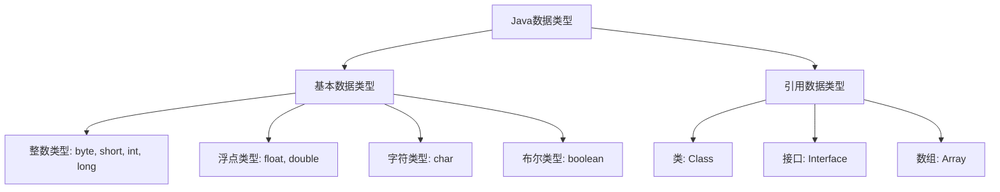

# Java 数据类型

在学习Java编程的道路上，理解数据类型是奠定坚实基础的第一步。数据类型决定了变量可以存储的数据种类、占用的内存空间以及可以对其执行的操作。Java作为一种强类型语言，对数据类型有严格的定义和规范。

## 数据类型概述

Java中的数据类型可以分为两大类：



## 基本数据类型（Primitive Data Types）

基本数据类型是Java语言预定义的数据类型，它们表示了简单的值。

### 1. 整数类型

整数类型用于存储整数值，没有小数部分。

| 数据类型 | 大小 | 范围 | 默认值 |
|---------|------|------|--------|
| byte    | 1字节 | -128 到 127 | 0 |
| short   | 2字节 | -32,768 到 32,767 | 0 |
| int     | 4字节 | -2^31 到 2^31-1 | 0 |
| long    | 8字节 | -2^63 到 2^63-1 | 0L |

```java
byte myByte = 127;
short myShort = 32767;
int myInt = 100000;
long myLong = 9223372036854775807L; // 注意long类型的值需要加上"L"后缀
```

:::tip
选择整数类型时，通常使用int类型，除非需要特别节省内存（使用byte或short）或需要表示超大整数（使用long）。
:::

### 2. 浮点类型

浮点类型用于表示带小数部分的数值。

| 数据类型 | 大小 | 范围 | 默认值 |
|---------|------|------|--------|
| float   | 4字节 | 约±3.40282347E+38F | 0.0F |
| double  | 8字节 | 约±1.79769313486231570E+308 | 0.0D |

```java
float myFloat = 3.14F; // 注意float类型的值需要加上"F"后缀
double myDouble = 3.14159265359;
```

:::caution
浮点数计算可能会有精度问题，不适合用于需要精确计算的场景（如金融计算）。
:::

### 3. 字符类型

字符类型用于存储单个Unicode字符。

| 数据类型 | 大小 | 范围 | 默认值 |
|---------|------|------|--------|
| char    | 2字节 | 0 到 65,535 | '\u0000' |

```java
char myChar = 'A';
char unicodeChar = '\u0041'; // Unicode表示的'A'
```

### 4. 布尔类型

布尔类型用于表示真假值。

| 数据类型 | 大小 | 范围 | 默认值 |
|---------|------|------|--------|
| boolean | 1位 | true或false | false |

```java
boolean isJavaFun = true;
boolean isFishTasty = false;
```

## 引用数据类型（Reference Data Types）

引用数据类型是用于存储对象的内存地址的数据类型，它们不直接包含对象的数据。

### 1. 类（Class）

类是Java中的基本构建块，用于创建对象。

```java
String myString = "Hello, Java!"; // String是Java内置的类
```

### 2. 接口（Interface）

接口定义了一组方法，但不提供实现。

```java
List<String> myList = new ArrayList<>(); // List是接口，ArrayList是实现类
```

### 3. 数组（Array）

数组是用于存储多个相同类型值的数据结构。

```java
int[] myNumbers = {1, 2, 3, 4, 5}; // 整数数组
String[] myFriends = {"Alice", "Bob", "Charlie"}; // 字符串数组
```

## 数据类型转换

在Java中，数据类型之间可以进行转换，分为自动类型转换（隐式转换）和强制类型转换（显式转换）。

### 自动类型转换

当较小的数据类型转换为较大的数据类型时，可以自动进行：

```java
byte myByte = 10;
int myInt = myByte; // byte自动转换为int

char myChar = 'A';
int charInt = myChar; // char自动转换为int，得到ASCII值65
```

转换顺序：`byte` → `short` → `int` → `long` → `float` → `double`

### 强制类型转换

当较大的数据类型转换为较小的数据类型时，需要进行强制类型转换：

```java
double myDouble = 9.78;
int myInt = (int) myDouble; // 强制转换为int，结果为9（小数部分被截断）

System.out.println("Double: " + myDouble);  // 输出: Double: 9.78
System.out.println("Int: " + myInt);        // 输出: Int: 9
```

:::warning
强制类型转换可能导致数据丢失或精度降低，使用时需谨慎。
:::

## 实际应用场景

### 场景1：计算圆的面积

```java
public class CircleArea {
    public static void main(String[] args) {
        // 使用double类型存储圆的半径和面积
        double radius = 5.5;
        double area = Math.PI * radius * radius;
        
        System.out.println("圆的半径是: " + radius);
        System.out.println("圆的面积是: " + area);
    }
}
```

输出：
```
圆的半径是: 5.5
圆的面积是: 95.03317777109125
```

### 场景2：学生信息管理系统

```java
public class StudentInfo {
    public static void main(String[] args) {
        // 使用不同数据类型存储学生信息
        int studentId = 1001;
        String name = "张三";
        char gender = '男';
        double height = 175.5;
        boolean isGraduated = false;
        
        System.out.println("学号: " + studentId);
        System.out.println("姓名: " + name);
        System.out.println("性别: " + gender);
        System.out.println("身高(cm): " + height);
        System.out.println("是否已毕业: " + isGraduated);
    }
}
```

输出：
```
学号: 1001
姓名: 张三
性别: 男
身高(cm): 175.5
是否已毕业: false
```

### 场景3：简单计算器

```java
public class SimpleCalculator {
    public static void main(String[] args) {
        // 使用不同数据类型进行计算
        int a = 10;
        int b = 3;
        
        int sum = a + b;
        int difference = a - b;
        int product = a * b;
        double quotient = (double) a / b;
        int remainder = a % b;
        
        System.out.println(a + " + " + b + " = " + sum);
        System.out.println(a + " - " + b + " = " + difference);
        System.out.println(a + " * " + b + " = " + product);
        System.out.println(a + " / " + b + " = " + quotient);
        System.out.println(a + " % " + b + " = " + remainder);
    }
}
```

输出：
```
10 + 3 = 13
10 - 3 = 7
10 * 3 = 30
10 / 3 = 3.3333333333333335
10 % 3 = 1
```

## 总结

Java的数据类型系统为开发者提供了存储和操作不同种类数据的能力：

1. **基本数据类型**：包括整数类型（byte, short, int, long）、浮点类型（float, double）、字符类型（char）和布尔类型（boolean），它们直接存储值。

2. **引用数据类型**：包括类、接口和数组，它们存储对象的引用（内存地址）。

3. **数据类型转换**：包括自动类型转换（小类型到大类型）和强制类型转换（大类型到小类型）。

理解数据类型是编写高效、无错误代码的基础。选择合适的数据类型可以优化内存使用，提高程序性能，并避免数据异常。

## 练习

1. 声明一个整型变量和一个浮点型变量，并尝试不同的类型转换。
2. 创建一个包含5个元素的整型数组，并计算所有元素的平均值。
3. 编写程序计算BMI指数（体重(kg)/身高(m)²），使用适当的数据类型存储身高、体重和BMI值。
4. 声明一个字符变量，存储一个字符，然后输出它的ASCII值。
5. 编写一个温度转换程序，将摄氏度转换为华氏度（F = C * 9/5 + 32）。

## 扩展阅读

- [Java官方文档 - 原始数据类型](https://docs.oracle.com/javase/tutorial/java/nutsandbolts/datatypes.html)
- [Java中的大数类：BigInteger和BigDecimal](https://docs.oracle.com/javase/8/docs/api/java/math/package-summary.html)
- [Java中的包装类](https://docs.oracle.com/javase/tutorial/java/data/numberclasses.html)

通过扎实掌握Java的数据类型，你将为未来的Java编程之旅奠定坚实的基础。随着学习的深入，你会发现合理使用数据类型对于开发高质量应用程序至关重要。