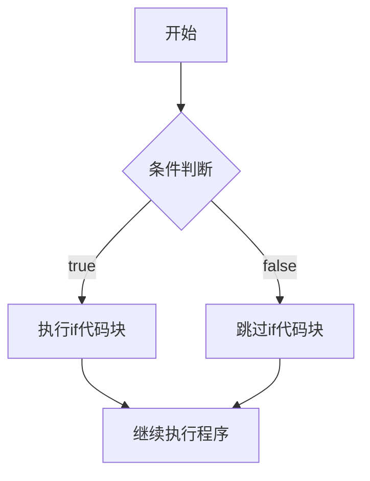
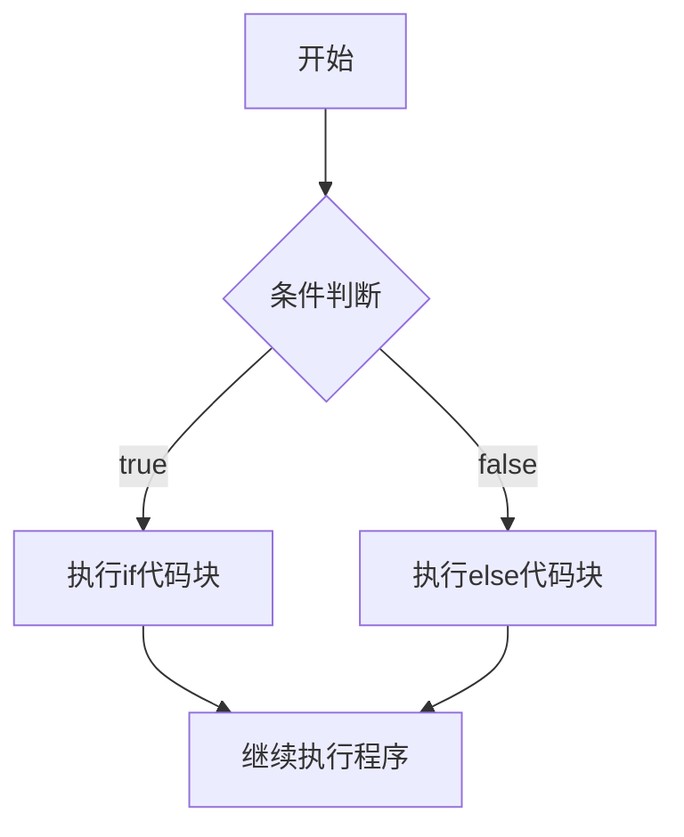
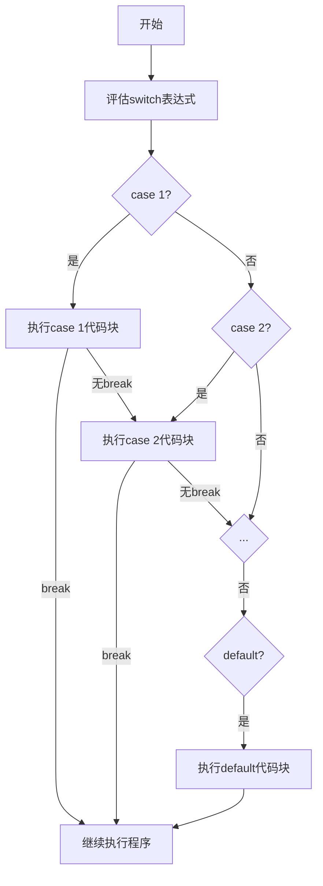

# Java 条件语句

在编程中，我们经常需要根据不同的条件执行不同的代码块。Java提供了多种条件语句，允许程序根据特定条件做出决策。这些语句是控制程序流程的基础，对于编写有逻辑性的程序至关重要。

## 什么是条件语句？

条件语句使程序能够根据条件的真假（布尔值）来执行不同的代码块。Java中主要有以下几种条件语句：

1. `if` 语句
2. `if-else` 语句
3. 嵌套 `if` 语句
4. `switch` 语句

让我们逐一深入了解它们。

## if 语句

`if` 语句是最简单的条件语句，它的基本语法如下：

```java
if (条件) {
    // 如果条件为真，执行此代码块
}
```

当条件评估为 `true` 时，花括号 `{}` 内的代码块会被执行；如果条件为 `false`，则跳过该代码块。

### 示例

```java
public class IfDemo {
    public static void main(String[] args) {
        int age = 20;
        
        if (age >= 18) {
            System.out.println("您已成年，可以投票！");
        }
        
        System.out.println("程序继续执行...");
    }
}
```

**输出：**
```
您已成年，可以投票！
程序继续执行...
```

:::tip
如果 `if` 语句中只有一行代码，可以省略花括号，但为了代码的可读性和一致性，建议始终使用花括号。
:::

## if-else 语句

`if-else` 语句提供了一个替代方案，当条件为 `false` 时执行另一个代码块。其基本语法是：

```java
if (条件) {
    // 如果条件为真，执行此代码块
} else {
    // 如果条件为假，执行此代码块
}
```

### 示例

```java
public class IfElseDemo {
    public static void main(String[] args) {
        int age = 15;
        
        if (age >= 18) {
            System.out.println("您已成年，可以投票！");
        } else {
            System.out.println("您未成年，不能投票！");
        }
    }
}
```

**输出：**
```
您未成年，不能投票！
```

## if-else-if 阶梯

当我们需要检查多个条件时，可以使用 `if-else-if` 阶梯。其基本语法是：

```java
if (条件1) {
    // 如果条件1为真，执行此代码块
} else if (条件2) {
    // 如果条件2为真，执行此代码块
} else if (条件3) {
    // 如果条件3为真，执行此代码块
} else {
    // 如果以上所有条件都为假，执行此代码块
}
```

### 示例

```java
public class IfElseIfDemo {
    public static void main(String[] args) {
        int score = 75;
        
        if (score >= 90) {
            System.out.println("优秀");
        } else if (score >= 80) {
            System.out.println("良好");
        } else if (score >= 70) {
            System.out.println("中等");
        } else if (score >= 60) {
            System.out.println("及格");
        } else {
            System.out.println("不及格");
        }
    }
}
```

**输出：**
```
中等
```

## 嵌套 if 语句

在 `if` 或 `else` 块内部可以包含另一个 `if` 或 `if-else` 语句，这称为嵌套 `if` 语句。

```java
if (条件1) {
    // 外层if代码块
    if (条件2) {
        // 内层if代码块
    }
}
```

### 示例

```java
public class NestedIfDemo {
    public static void main(String[] args) {
        int age = 22;
        boolean hasID = true;
        
        if (age >= 18) {
            System.out.println("您已成年");
            
            if (hasID) {
                System.out.println("您可以购买酒类产品");
            } else {
                System.out.println("无法验证您的身份，不能购买酒类产品");
            }
        } else {
            System.out.println("您未成年，不能购买酒类产品");
        }
    }
}
```

**输出：**
```
您已成年
您可以购买酒类产品
```

:::caution
嵌套的层级越多，代码的可读性就越差。在实际开发中，应尽量避免过多的嵌套。
:::

## switch 语句

当需要根据一个变量的不同值执行不同的操作时，使用 `if-else-if` 可能会导致代码冗长。这时，`switch` 语句是一个更简洁的选择。

```java
switch (表达式) {
    case 值1:
        // 如果表达式等于值1，执行此代码
        break;
    case 值2:
        // 如果表达式等于值2，执行此代码
        break;
    // 更多case...
    default:
        // 如果表达式不等于任何case值，执行此代码
}
```

### 支持的数据类型

`switch` 语句的表达式可以是以下类型：
- `byte`, `short`, `char`, `int`
- 枚举类型 (`Enum`)
- 字符串类型 (`String`) - 自Java 7起
- 包装类 `Byte`, `Short`, `Character`, `Integer`

### 示例

```java
public class SwitchDemo {
    public static void main(String[] args) {
        int day = 4;
        String dayName;
        
        switch (day) {
            case 1:
                dayName = "星期一";
                break;
            case 2:
                dayName = "星期二";
                break;
            case 3:
                dayName = "星期三";
                break;
            case 4:
                dayName = "星期四";
                break;
            case 5:
                dayName = "星期五";
                break;
            case 6:
                dayName = "星期六";
                break;
            case 7:
                dayName = "星期日";
                break;
            default:
                dayName = "无效日期";
        }
        
        System.out.println("今天是 " + dayName);
    }
}
```

**输出：**
```
今天是 星期四
```

:::warning
不要忘记在每个case后面添加`break`语句，否则程序会继续执行下一个case中的代码，这种情况称为"fall through"。
:::

### Java 12+ 的Switch表达式

从Java 12开始，`switch`可以作为表达式使用，并引入了箭头语法(`->`)来简化代码：

```java
public class EnhancedSwitchDemo {
    public static void main(String[] args) {
        int day = 4;
        
        String dayName = switch (day) {
            case 1 -> "星期一";
            case 2 -> "星期二";
            case 3 -> "星期三";
            case 4 -> "星期四";
            case 5 -> "星期五";
            case 6 -> "星期六";
            case 7 -> "星期日";
            default -> "无效日期";
        };
        
        System.out.println("今天是 " + dayName);
    }
}
```

**输出：**
```
今天是 星期四
```

使用这种语法不需要`break`语句，代码更简洁。

## 实际应用案例

### 案例1：简单计算器

```java
import java.util.Scanner;

public class SimpleCalculator {
    public static void main(String[] args) {
        Scanner scanner = new Scanner(System.in);
        
        System.out.print("输入第一个数字: ");
        double num1 = scanner.nextDouble();
        
        System.out.print("输入运算符 (+, -, *, /): ");
        char operator = scanner.next().charAt(0);
        
        System.out.print("输入第二个数字: ");
        double num2 = scanner.nextDouble();
        
        double result;
        
        switch (operator) {
            case '+':
                result = num1 + num2;
                System.out.println(num1 + " + " + num2 + " = " + result);
                break;
            case '-':
                result = num1 - num2;
                System.out.println(num1 + " - " + num2 + " = " + result);
                break;
            case '*':
                result = num1 * num2;
                System.out.println(num1 + " * " + num2 + " = " + result);
                break;
            case '/':
                if (num2 != 0) {
                    result = num1 / num2;
                    System.out.println(num1 + " / " + num2 + " = " + result);
                } else {
                    System.out.println("错误：除数不能为0");
                }
                break;
            default:
                System.out.println("无效的运算符");
        }
        
        scanner.close();
    }
}
```

**输入/输出示例：**
```
输入第一个数字: 10
输入运算符 (+, -, *, /): *
输入第二个数字: 5
10.0 * 5.0 = 50.0
```

### 案例2：根据BMI指数判断体重状态

```java
import java.util.Scanner;

public class BMICalculator {
    public static void main(String[] args) {
        Scanner scanner = new Scanner(System.in);
        
        System.out.print("请输入您的体重(kg): ");
        double weight = scanner.nextDouble();
        
        System.out.print("请输入您的身高(m): ");
        double height = scanner.nextDouble();
        
        double bmi = weight / (height * height);
        
        System.out.printf("您的BMI指数是: %.2f\n", bmi);
        
        if (bmi < 18.5) {
            System.out.println("体重过轻");
        } else if (bmi >= 18.5 && bmi < 24.9) {
            System.out.println("体重正常");
        } else if (bmi >= 24.9 && bmi < 29.9) {
            System.out.println("体重过重");
        } else {
            System.out.println("肥胖");
        }
        
        scanner.close();
    }
}
```

**输入/输出示例：**
```
请输入您的体重(kg): 70
请输入您的身高(m): 1.75
您的BMI指数是: 22.86
体重正常
```

## 条件语句的执行流程

以下流程图展示了不同条件语句的执行流程：



`if-else`语句的执行流程：



`switch`语句的执行流程：



## 总结

条件语句是编程中的基础概念，允许程序根据不同条件执行不同的代码路径：

- `if` 语句用于在条件为真时执行代码块
- `if-else` 语句提供了条件为假时的替代执行路径
- `if-else-if` 阶梯用于检查多个条件
- 嵌套 `if` 语句可用于检查复杂的条件组合
- `switch` 语句适用于基于单个变量值的多路分支

掌握这些条件语句将帮助你编写能够做出决策的智能程序，是成为熟练Java程序员的重要一步。

## 练习

为了巩固所学知识，尝试完成以下练习：

1. 编写一个程序，根据分数（0-100）输出成绩等级（A、B、C、D、F）。
2. 创建一个程序，根据用户输入的年份判断是否为闰年。
3. 实现一个简单的ATM程序，根据用户的选择执行不同的操作（查看余额、存款、取款）。
4. 编写一个程序，使用嵌套if语句检查一个数是否为正数、负数或零，并且是否为偶数或奇数。
5. 使用switch语句创建一个月份转换器，输入月份数字（1-12），输出对应的月份名称和天数。

:::tip 进阶学习
条件语句只是控制流的一部分。继续学习循环语句、跳转语句以及它们的组合使用，将使你能够创建更复杂、更强大的程序。
:::