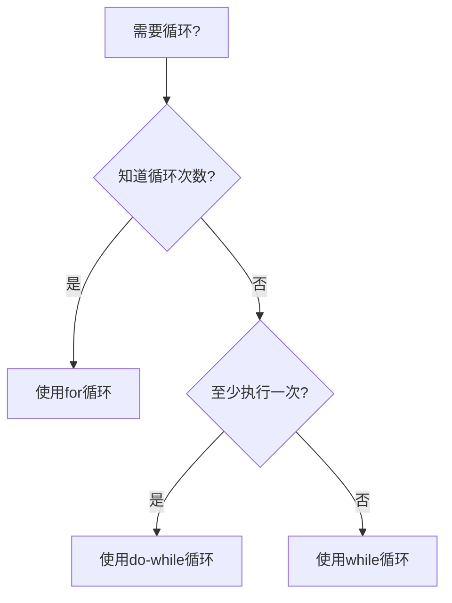

# Java 循环控制

在编程中，循环是一种重要的控制结构，允许我们多次执行同一段代码。Java提供了多种循环控制语句，使我们能够根据不同的需求选择最适合的循环方式。本文将详细介绍Java中的循环控制语句，帮助初学者掌握这一基本且重要的编程概念。

## 循环的基本概念

循环控制结构允许我们重复执行特定的代码块，直到满足某个条件为止。Java提供了三种主要的循环控制语句：

1. `for`循环
2. `while`循环
3. `do-while`循环

此外，Java还提供了两个特殊的控制语句：

- `break`：提前退出循环
- `continue`：跳过当前循环的剩余部分，进入下一次循环

## for循环

`for`循环是Java中最常用的循环类型之一，特别适合于需要执行固定次数的操作。

### 基本语法

```java
for (初始化; 条件; 更新) {
    // 循环体
}
```

执行流程：
1. 执行初始化部分，只执行一次
2. 检查条件是否为真
   - 如果为真，执行循环体
   - 如果为假，退出循环
3. 执行更新部分
4. 返回第2步

### 示例

```java
// 打印1到5的数字
public class ForLoopExample {
    public static void main(String[] args) {
        for (int i = 1; i <= 5; i++) {
            System.out.println("计数: " + i);
        }
    }
}
```

输出：
```
计数: 1
计数: 2
计数: 3
计数: 4
计数: 5
```

### 增强型for循环（for-each）

Java 5引入了增强型for循环，专门用于遍历数组和集合。

```java
// 使用增强型for循环遍历数组
public class EnhancedForLoopExample {
    public static void main(String[] args) {
        int[] numbers = {1, 2, 3, 4, 5};
        
        for (int number : numbers) {
            System.out.println("值: " + number);
        }
    }
}
```

输出：
```
值: 1
值: 2
值: 3
值: 4
值: 5
```

:::tip
增强型for循环简化了代码，但它不提供数组索引，也不允许修改原始数组中的元素。
:::

## while循环

`while`循环在每次执行循环体之前检查条件，如果条件为真，则执行循环体。

### 基本语法

```java
while (条件) {
    // 循环体
}
```

### 示例

```java
// 使用while循环计算阶乘
public class WhileLoopExample {
    public static void main(String[] args) {
        int number = 5;
        int factorial = 1;
        int i = 1;
        
        while (i <= number) {
            factorial *= i;
            i++;
        }
        
        System.out.println(number + "的阶乘是: " + factorial);
    }
}
```

输出：
```
5的阶乘是: 120
```

## do-while循环

`do-while`循环在执行循环体后检查条件，因此循环体至少会执行一次，无论条件是否为真。

### 基本语法

```java
do {
    // 循环体
} while (条件);
```

### 示例

```java
// 使用do-while循环实现菜单
import java.util.Scanner;

public class DoWhileLoopExample {
    public static void main(String[] args) {
        Scanner scanner = new Scanner(System.in);
        int choice;
        
        do {
            System.out.println("\n选择一个选项:");
            System.out.println("1. 打印问候");
            System.out.println("2. 打印当前时间");
            System.out.println("3. 退出");
            System.out.print("输入你的选择: ");
            
            choice = scanner.nextInt();
            
            switch (choice) {
                case 1:
                    System.out.println("你好，欢迎学习Java!");
                    break;
                case 2:
                    System.out.println("当前时间: " + System.currentTimeMillis());
                    break;
                case 3:
                    System.out.println("再见!");
                    break;
                default:
                    System.out.println("无效选择，请重试。");
            }
        } while (choice != 3);
        
        scanner.close();
    }
}
```

输出（根据用户输入而变化）：
```
选择一个选项:
1. 打印问候
2. 打印当前时间
3. 退出
输入你的选择: 1
你好，欢迎学习Java!

选择一个选项:
1. 打印问候
2. 打印当前时间
3. 退出
输入你的选择: 3
再见!
```

## 循环控制语句

### break语句

`break`语句用于立即退出循环，跳过循环体中剩余的语句以及后续的所有迭代。

```java
// 使用break寻找数组中的元素
public class BreakExample {
    public static void main(String[] args) {
        int[] numbers = {10, 20, 30, 40, 50};
        int searchFor = 30;
        
        int i;
        boolean found = false;
        
        for (i = 0; i < numbers.length; i++) {
            if (numbers[i] == searchFor) {
                found = true;
                break;  // 一旦找到，立即退出循环
            }
        }
        
        if (found) {
            System.out.println("找到了值 " + searchFor + " 在索引 " + i);
        } else {
            System.out.println("未找到值 " + searchFor);
        }
    }
}
```

输出：
```
找到了值 30 在索引 2
```

### continue语句

`continue`语句跳过当前迭代中的剩余代码，直接进入下一次迭代。

```java
// 使用continue打印奇数
public class ContinueExample {
    public static void main(String[] args) {
        for (int i = 1; i <= 10; i++) {
            // 如果是偶数，跳过当前迭代
            if (i % 2 == 0) {
                continue;
            }
            System.out.println("奇数: " + i);
        }
    }
}
```

输出：
```
奇数: 1
奇数: 3
奇数: 5
奇数: 7
奇数: 9
```

## 嵌套循环

循环可以嵌套在另一个循环内部，这称为嵌套循环。

```java
// 使用嵌套循环打印乘法表
public class NestedLoopExample {
    public static void main(String[] args) {
        for (int i = 1; i <= 5; i++) {
            for (int j = 1; j <= i; j++) {
                System.out.print(j + " ");
            }
            System.out.println();  // 换行
        }
    }
}
```

输出：
```
1 
1 2 
1 2 3 
1 2 3 4 
1 2 3 4 5 
```

## 实际应用案例

### 案例1：计算复利

```java
// 使用循环计算复利
public class CompoundInterestCalculator {
    public static void main(String[] args) {
        double principal = 10000; // 本金
        double rate = 0.05;       // 年利率
        int years = 10;           // 投资年数
        
        System.out.println("年份\t本金");
        
        for (int year = 1; year <= years; year++) {
            principal *= (1 + rate);  // 应用复利公式
            System.out.printf("%d\t%.2f%n", year, principal);
        }
    }
}
```

输出：
```
年份	本金
1	10500.00
2	11025.00
3	11576.25
4	12155.06
5	12762.82
6	13400.96
7	14071.00
8	14774.55
9	15513.28
10	16288.95
```

### 案例2：查找素数

```java
// 使用循环查找给定范围内的所有素数
public class PrimeFinder {
    public static void main(String[] args) {
        int start = 1;
        int end = 50;
        
        System.out.println("在" + start + "和" + end + "之间的素数:");
        
        for (int i = start; i <= end; i++) {
            boolean isPrime = true;
            
            if (i <= 1) {
                isPrime = false;
            } else {
                // 检查从2到sqrt(i)的所有数字
                for (int j = 2; j <= Math.sqrt(i); j++) {
                    if (i % j == 0) {
                        isPrime = false;
                        break;
                    }
                }
            }
            
            if (isPrime) {
                System.out.print(i + " ");
            }
        }
    }
}
```

输出：
```
在1和50之间的素数:
2 3 5 7 11 13 17 19 23 29 31 37 41 43 47
```

## 循环选择指南

不同循环适用于不同的场景：



## 总结

Java提供了三种主要的循环控制结构：`for`、`while`和`do-while`，以及特殊的控制语句`break`和`continue`：

1. `for`循环：适合执行已知次数的循环
2. `while`循环：适合在条件满足时继续循环
3. `do-while`循环：类似于`while`循环，但至少执行一次
4. `break`：提前退出循环
5. `continue`：跳过当前迭代的剩余部分

:::note
选择合适的循环类型可以使你的代码更加清晰、高效。
:::

## 练习

为了巩固所学知识，尝试完成以下练习：

1. 编写一个程序，使用`for`循环计算1到100之间所有偶数的和。
2. 使用`while`循环创建一个简单的猜数游戏，让用户猜一个1到100之间的随机数。
3. 使用嵌套`for`循环打印一个10x10的乘法表。
4. 编写一个程序，使用`do-while`循环要求用户输入一个正整数。
5. 使用`for`循环和`break`语句查找100到200之间的第一个能被7整除的数。

## 额外资源

- [Oracle Java文档 - 循环语句](https://docs.oracle.com/javase/tutorial/java/nutsandbolts/loops.html)
- [Java编程思想](https://www.amazon.com/Thinking-Java-4th-Bruce-Eckel/dp/0131872486)

祝你编程愉快！