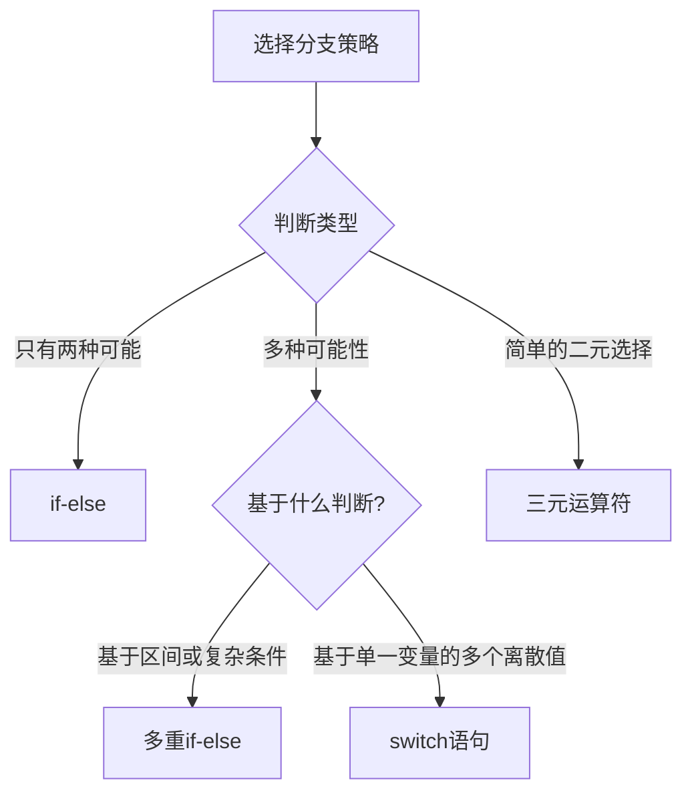

# Java 分支策略

在编程中，我们经常需要根据不同的条件执行不同的代码。Java提供了多种分支控制结构，帮助我们实现这种逻辑判断。本文将详细介绍Java中的分支策略，包括if语句、switch语句以及它们的各种变体和使用场景。

## 什么是分支策略？

分支策略是指程序根据条件选择不同执行路径的能力。可以将其想象为一个路口，根据不同的交通信号，车辆选择不同的道路前进。在Java中，主要有以下分支结构：

- if语句（单分支、双分支、多分支）
- switch语句
- 三元运算符（条件表达式）

## if语句

if语句是最基本和常用的分支结构，它根据条件的真假来决定是否执行特定的代码块。

### 单分支if语句

最简单的if语句包含一个条件和一个代码块。当条件为true时，执行代码块；当条件为false时，跳过代码块。

```java
if (条件) {
    // 当条件为true时执行的代码
}
```

**示例：**

```java
public class SingleIfDemo {
    public static void main(String[] args) {
        int age = 18;
        
        if (age >= 18) {
            System.out.println("您已成年，可以投票！");
        }
        
        System.out.println("程序继续执行...");
    }
}
```

**输出：**
```
您已成年，可以投票！
程序继续执行...
```

### if-else语句（双分支）

if-else语句提供了两个分支，当条件为true时执行if部分，否则执行else部分。

```java
if (条件) {
    // 当条件为true时执行的代码
} else {
    // 当条件为false时执行的代码
}
```

**示例：**

```java
public class IfElseDemo {
    public static void main(String[] args) {
        int number = 7;
        
        if (number % 2 == 0) {
            System.out.println(number + " 是偶数");
        } else {
            System.out.println(number + " 是奇数");
        }
    }
}
```

**输出：**
```
7 是奇数
```

### if-else if-else语句（多分支）

当我们需要测试多个条件时，可以使用if-else if-else结构。

```java
if (条件1) {
    // 当条件1为true时执行的代码
} else if (条件2) {
    // 当条件1为false且条件2为true时执行的代码
} else if (条件3) {
    // 当条件1和条件2为false且条件3为true时执行的代码
} else {
    // 当所有条件都为false时执行的代码
}
```

**示例：**

```java
public class MultiIfDemo {
    public static void main(String[] args) {
        int score = 85;
        
        if (score >= 90) {
            System.out.println("优秀");
        } else if (score >= 80) {
            System.out.println("良好");
        } else if (score >= 60) {
            System.out.println("及格");
        } else {
            System.out.println("不及格");
        }
    }
}
```

**输出：**
```
良好
```

:::note
在多分支结构中，条件是按顺序测试的。一旦某个条件为true，将执行对应的代码块，然后跳出整个if-else if-else结构。
:::

### 嵌套if语句

if语句可以嵌套在另一个if或else语句中，创建更复杂的条件逻辑。

```java
public class NestedIfDemo {
    public static void main(String[] args) {
        int age = 25;
        boolean hasLicense = true;
        
        if (age >= 18) {
            System.out.println("您已成年");
            
            if (hasLicense) {
                System.out.println("您可以驾驶汽车");
            } else {
                System.out.println("您需要考取驾照才能驾驶汽车");
            }
        } else {
            System.out.println("您未成年，不能驾驶汽车");
        }
    }
}
```

**输出：**
```
您已成年
您可以驾驶汽车
```

:::caution
过多的嵌套会导致代码难以阅读和维护。如果嵌套层次过多，应考虑重构代码或使用其他控制结构。
:::

## switch语句

当需要根据一个变量的不同值执行不同操作时，switch语句通常比多个if-else语句更清晰和高效。

```java
switch (表达式) {
    case 值1:
        // 当表达式等于值1时执行的代码
        break;
    case 值2:
        // 当表达式等于值2时执行的代码
        break;
    // 更多case...
    default:
        // 当表达式不匹配任何case值时执行的代码
}
```

**支持的表达式类型：**
- byte, short, char, int（基本数据类型）
- 枚举类型（Enum）
- String类型（Java 7及以上版本）
- Byte, Short, Character, Integer（包装类）

### 基本使用

```java
public class BasicSwitchDemo {
    public static void main(String[] args) {
        int day = 4;
        
        switch (day) {
            case 1:
                System.out.println("星期一");
                break;
            case 2:
                System.out.println("星期二");
                break;
            case 3:
                System.out.println("星期三");
                break;
            case 4:
                System.out.println("星期四");
                break;
            case 5:
                System.out.println("星期五");
                break;
            case 6:
                System.out.println("星期六");
                break;
            case 7:
                System.out.println("星期日");
                break;
            default:
                System.out.println("无效的日期");
        }
    }
}
```

**输出：**
```
星期四
```

### 不使用break的情况

如果省略break语句，执行将会"贯穿"（fall through）到下一个case，直到遇到break或者switch结束。

```java
public class SwitchFallThroughDemo {
    public static void main(String[] args) {
        int month = 8;
        
        System.out.print(month + "月是");
        
        switch (month) {
            case 12:
            case 1:
            case 2:
                System.out.println("冬季");
                break;
            case 3:
            case 4:
            case 5:
                System.out.println("春季");
                break;
            case 6:
            case 7:
            case 8:
                System.out.println("夏季");
                break;
            case 9:
            case 10:
            case 11:
                System.out.println("秋季");
                break;
            default:
                System.out.println("无效的月份");
        }
    }
}
```

**输出：**
```
8月是夏季
```

### 使用String类型

Java 7及以上版本支持在switch语句中使用String类型。

```java
public class StringSwitchDemo {
    public static void main(String[] args) {
        String fruit = "apple";
        
        switch (fruit.toLowerCase()) {
            case "apple":
                System.out.println("苹果是红色或绿色的");
                break;
            case "banana":
                System.out.println("香蕉是黄色的");
                break;
            case "cherry":
                System.out.println("樱桃是红色的");
                break;
            default:
                System.out.println("未知水果");
        }
    }
}
```

**输出：**
```
苹果是红色或绿色的
```

### 枚举类型的switch

使用枚举类型可以让代码更加类型安全和可读。

```java
public class EnumSwitchDemo {
    enum Day { MONDAY, TUESDAY, WEDNESDAY, THURSDAY, FRIDAY, SATURDAY, SUNDAY }
    
    public static void main(String[] args) {
        Day today = Day.WEDNESDAY;
        
        switch (today) {
            case MONDAY:
                System.out.println("星期一工作开始");
                break;
            case TUESDAY:
            case WEDNESDAY:
            case THURSDAY:
                System.out.println("工作日");
                break;
            case FRIDAY:
                System.out.println("星期五，即将周末");
                break;
            case SATURDAY:
            case SUNDAY:
                System.out.println("周末放松");
                break;
        }
    }
}
```

**输出：**
```
工作日
```

## 三元运算符

三元运算符提供了一种简洁的方式来表示简单的条件判断。格式为：`条件 ? 表达式1 : 表达式2`。如果条件为true，则计算并返回表达式1的值；否则，计算并返回表达式2的值。

```java
public class TernaryOperatorDemo {
    public static void main(String[] args) {
        int a = 10;
        int b = 15;
        
        // 使用三元运算符找出较大的数
        int max = (a > b) ? a : b;
        System.out.println("较大的数是: " + max);
        
        // 等价的if-else语句
        int maxIfElse;
        if (a > b) {
            maxIfElse = a;
        } else {
            maxIfElse = b;
        }
        System.out.println("通过if-else找到的较大数是: " + maxIfElse);
    }
}
```

**输出：**
```
较大的数是: 15
通过if-else找到的较大数是: 15
```

:::tip
三元运算符适用于简单的条件判断，可以让代码更简洁。但对于复杂的条件逻辑，使用if-else语句会更清晰。
:::

## 实际应用案例

以下是一些分支策略的实际应用案例：

### 案例1：用户登录验证

```java
public class LoginValidation {
    public static void main(String[] args) {
        String username = "admin";
        String password = "password123";
        boolean rememberMe = true;
        
        if (username == null || username.isEmpty()) {
            System.out.println("错误：用户名不能为空");
        } else if (password == null || password.length() < 8) {
            System.out.println("错误：密码不能为空且长度至少为8位");
        } else {
            System.out.println("验证通过！");
            
            if (rememberMe) {
                System.out.println("系统将记住您的登录状态");
            } else {
                System.out.println("登录状态将在会话结束后清除");
            }
        }
    }
}
```

**输出：**
```
验证通过！
系统将记住您的登录状态
```

### 案例2：简单计算器

```java
public class SimpleCalculator {
    public static void main(String[] args) {
        double num1 = 10.0;
        double num2 = 5.0;
        char operator = '/';
        double result;
        
        switch (operator) {
            case '+':
                result = num1 + num2;
                System.out.println(num1 + " + " + num2 + " = " + result);
                break;
            case '-':
                result = num1 - num2;
                System.out.println(num1 + " - " + num2 + " = " + result);
                break;
            case '*':
                result = num1 * num2;
                System.out.println(num1 + " * " + num2 + " = " + result);
                break;
            case '/':
                if (num2 != 0) {
                    result = num1 / num2;
                    System.out.println(num1 + " / " + num2 + " = " + result);
                } else {
                    System.out.println("错误：不能除以零");
                }
                break;
            default:
                System.out.println("不支持的操作符");
        }
    }
}
```

**输出：**
```
10.0 / 5.0 = 2.0
```

### 案例3：成绩评级系统

```java
public class GradingSystem {
    public static void main(String[] args) {
        int[] scores = {78, 95, 68, 87, 61, 59};
        
        for (int score : scores) {
            char grade;
            
            if (score >= 90) {
                grade = 'A';
            } else if (score >= 80) {
                grade = 'B';
            } else if (score >= 70) {
                grade = 'C';
            } else if (score >= 60) {
                grade = 'D';
            } else {
                grade = 'F';
            }
            
            System.out.println("分数: " + score + ", 等级: " + grade + 
                (grade == 'F' ? " (不及格)" : " (及格)"));
        }
    }
}
```

**输出：**
```
分数: 78, 等级: C (及格)
分数: 95, 等级: A (及格)
分数: 68, 等级: D (及格)
分数: 87, 等级: B (及格)
分数: 61, 等级: D (及格)
分数: 59, 等级: F (不及格)
```

## 分支策略选择原则

在实际编程中，我们需要根据具体情况选择合适的分支策略：



**选择原则：**

1. **使用if语句**：
   - 当条件是区间判断时（例如：x > 10 && x < 20）
   - 当需要进行复杂的布尔逻辑判断时
   - 当处理的是非等值比较时

2. **使用switch语句**：
   - 当基于单个变量的多个可能值进行判断时
   - 当所有的条件判断都是等值比较时
   - 当需要处理的情况较多时

3. **使用三元运算符**：
   - 当条件非常简单，且只有两种可能结果时
   - 当需要在一行代码中完成条件判断和赋值时

## 总结

Java中的分支策略是程序控制流中不可或缺的一部分。通过本文，我们详细介绍了：

- **if语句**：单分支、双分支、多分支和嵌套if语句
- **switch语句**：基本使用、不同数据类型的switch以及break的作用
- **三元运算符**：简洁的条件表达式

掌握这些分支控制结构，能够帮助你编写出更灵活、更高效的Java程序。记住，好的代码不仅仅是功能正确，还应该具有可读性和可维护性。选择合适的分支结构能帮助你实现这一目标。

## 练习题

1. 编写一个程序，根据用户输入的温度（摄氏度）给出相应的建议：
   - `温度 < 0`：非常冷，注意保暖
   - `0 <= 温度 < 15`：冷，需要外套
   - `15 <= 温度 < 25`：舒适，适合外出
   - `温度 >= 25`：热，注意防暑

2. 使用switch语句编写一个简单的菜单程序，根据用户输入的选项（1-4）显示不同的操作说明。

3. 使用嵌套if语句编写一个程序，判断一个年份是否为闰年（能被4整除但不能被100整除，或者能被400整除）。

4. 使用三元运算符编写一个程序，找出三个数中的最大值。

## 进一步学习的资源

- Java官方教程中关于控制流的部分
- 《Java核心技术》第3章：Java的基本程序设计结构
- Oracle的Java教程：条件语句
- 在线编程平台如LeetCode或HackerRank上练习条件判断相关的编程题

通过不断实践和应用，您将能够熟练掌握Java的分支策略，编写出更加高效和灵活的程序。