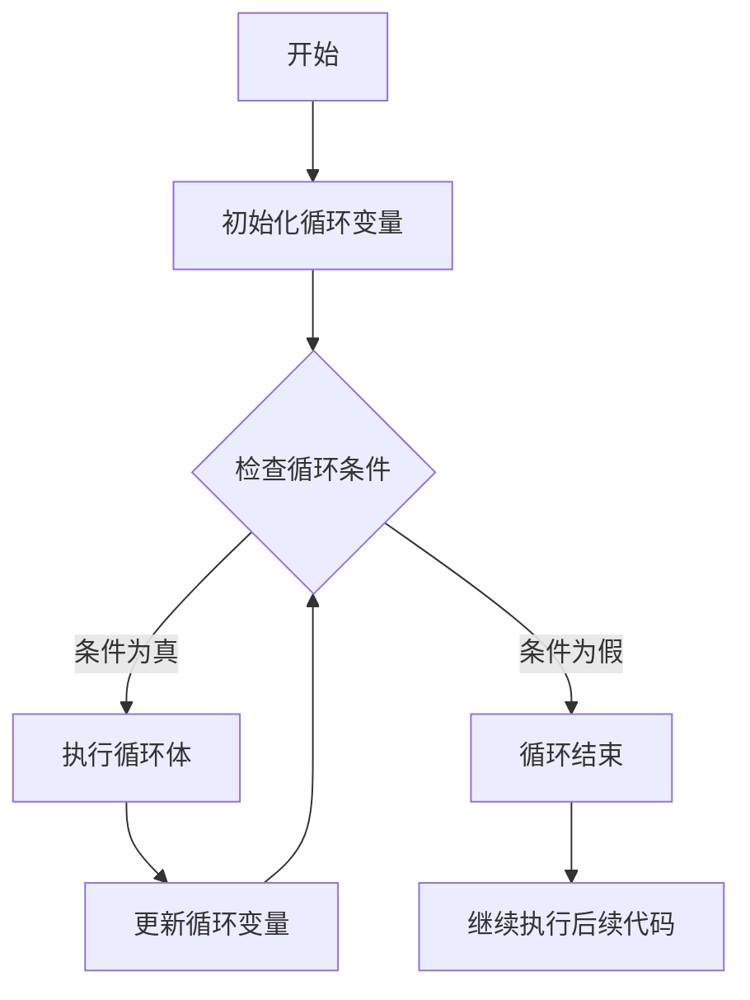

# Java 循环

循环是编程中最重要的控制结构之一，它允许我们反复执行特定的代码块，直到满足特定条件。在Java中，循环结构使我们能够高效地处理重复任务，如遍历数组、处理集合数据或执行特定次数的操作。

## 循环的基本概念

循环通常由以下几个部分组成：
1. 初始化条件 - 设置循环开始的初始状态
2. 循环条件 - 决定循环是否继续执行
3. 循环体 - 每次循环迭代时执行的代码
4. 迭代语句 - 在每次循环后更新循环变量

Java提供了多种循环结构，包括：
- `for`循环
- `while`循环
- `do-while`循环
- 增强`for`循环（又称"for-each"循环）

## for循环

`for`循环是最常用的循环结构，特别适合当你事先知道循环次数时使用。

### 基本语法

```java
for (初始化语句; 循环条件; 迭代语句) {
    // 循环体
}
```

### 示例

```java
public class ForLoopExample {
    public static void main(String[] args) {
        // 打印1到5的数字
        for (int i = 1; i <= 5; i++) {
            System.out.println("数字: " + i);
        }
    }
}
```

**输出：**
```
数字: 1
数字: 2
数字: 3
数字: 4
数字: 5
```

### for循环的执行流程

1. 首先执行初始化语句 `int i = 1`
2. 判断循环条件 `i <= 5` 是否为true
3. 如果条件为true，则执行循环体中的代码
4. 执行迭代语句 `i++`
5. 回到第2步，重复直到条件为false

:::tip
for循环中的初始化语句只执行一次，而循环条件和迭代语句在每次循环时都会执行。
:::

## while循环

`while`循环适用于当你不确定需要循环多少次，但知道循环的终止条件时。

### 基本语法

```java
while (循环条件) {
    // 循环体
}
```

### 示例

```java
public class WhileLoopExample {
    public static void main(String[] args) {
        int i = 1;
        while (i <= 5) {
            System.out.println("数字: " + i);
            i++;
        }
    }
}
```

**输出：**
```
数字: 1
数字: 2
数字: 3
数字: 4
数字: 5
```

### while循环的执行流程

1. 检查循环条件是否为true
2. 如果条件为true，则执行循环体
3. 返回到第1步，重复直到条件为false

:::caution
一定要确保while循环中有更新循环变量的语句，否则可能会导致无限循环。
:::

## do-while循环

`do-while`循环与`while`循环类似，但不同之处在于它会先执行一次循环体，然后再检查条件。

### 基本语法

```java
do {
    // 循环体
} while (循环条件);
```

### 示例

```java
public class DoWhileLoopExample {
    public static void main(String[] args) {
        int i = 1;
        do {
            System.out.println("数字: " + i);
            i++;
        } while (i <= 5);
    }
}
```

**输出：**
```
数字: 1
数字: 2
数字: 3
数字: 4
数字: 5
```

### do-while循环的执行流程

1. 执行循环体
2. 检查循环条件是否为true
3. 如果为true，回到第1步；否则结束循环

:::note
do-while循环至少会执行一次循环体，这是它与while循环的主要区别。
:::

## 增强for循环（for-each）

增强for循环是Java 5引入的特性，用于简化集合和数组的遍历。

### 基本语法

```java
for (元素类型 变量名 : 集合或数组) {
    // 循环体
}
```

### 示例

```java
public class EnhancedForLoopExample {
    public static void main(String[] args) {
        // 创建字符串数组
        String[] fruits = {"苹果", "香蕉", "橙子", "葡萄", "西瓜"};
        
        // 使用增强for循环遍历数组
        for (String fruit : fruits) {
            System.out.println("水果: " + fruit);
        }
    }
}
```

**输出：**
```
水果: 苹果
水果: 香蕉
水果: 橙子
水果: 葡萄
水果: 西瓜
```

:::tip
增强for循环更简洁，但不提供索引值。如果需要知道当前遍历到哪个位置，应使用传统for循环。
:::

## 循环控制语句

Java提供了一些特殊的语句来控制循环的执行流程：

### break语句

`break`语句用于终止循环，使程序控制立即退出当前循环。

```java
public class BreakExample {
    public static void main(String[] args) {
        for (int i = 1; i <= 10; i++) {
            if (i == 6) {
                break; // 当i等于6时，终止循环
            }
            System.out.println("数字: " + i);
        }
    }
}
```

**输出：**
```
数字: 1
数字: 2
数字: 3
数字: 4
数字: 5
```

### continue语句

`continue`语句用于跳过当前迭代的剩余部分，直接进入下一次迭代。

```java
public class ContinueExample {
    public static void main(String[] args) {
        for (int i = 1; i <= 10; i++) {
            if (i % 2 == 0) {
                continue; // 跳过偶数
            }
            System.out.println("数字: " + i);
        }
    }
}
```

**输出：**
```
数字: 1
数字: 3
数字: 5
数字: 7
数字: 9
```

## 嵌套循环

在Java中，我们可以在一个循环内部包含另一个循环，这称为嵌套循环。

### 示例：打印乘法表

```java
public class NestedLoopExample {
    public static void main(String[] args) {
        // 打印9x9乘法表
        for (int i = 1; i <= 9; i++) {
            for (int j = 1; j <= i; j++) {
                System.out.printf("%d×%d=%d\t", j, i, i*j);
            }
            System.out.println(); // 换行
        }
    }
}
```

**输出：**
```
1×1=1	
1×2=2	2×2=4	
1×3=3	2×3=6	3×3=9	
1×4=4	2×4=8	3×4=12	4×4=16	
1×5=5	2×5=10	3×5=15	4×5=20	5×5=25	
1×6=6	2×6=12	3×6=18	4×6=24	5×6=30	6×6=36	
1×7=7	2×7=14	3×7=21	4×7=28	5×7=35	6×7=42	7×7=49	
1×8=8	2×8=16	3×8=24	4×8=32	5×8=40	6×8=48	7×8=56	8×8=64	
1×9=9	2×9=18	3×9=27	4×9=36	5×9=45	6×9=54	7×9=63	8×9=72	9×9=81	
```

## 循环的性能考量

选择正确的循环结构不仅关乎代码的可读性，也会影响程序的性能：

1. **for循环**：适合已知循环次数的场景，结构紧凑。
2. **while循环**：适合基于条件的循环，而不是固定次数。
3. **do-while循环**：适合至少需要执行一次的循环。
4. **增强for循环**：适合简单地遍历数组或集合的元素。

:::warning
在循环中执行耗时操作时（如I/O操作或复杂计算），应当考虑优化循环内的代码，并避免不必要的迭代。
:::

## 实际应用案例

### 案例1：简易计数器应用

```java
import java.util.Scanner;

public class CountdownApp {
    public static void main(String[] args) {
        Scanner scanner = new Scanner(System.in);
        System.out.print("请输入倒计时的秒数: ");
        int seconds = scanner.nextInt();
        
        System.out.println("开始倒计时...");
        for (int i = seconds; i >= 0; i--) {
            System.out.println(i + " 秒");
            
            try {
                Thread.sleep(1000); // 暂停1秒
            } catch (InterruptedException e) {
                e.printStackTrace();
            }
        }
        
        System.out.println("倒计时结束！");
        scanner.close();
    }
}
```

### 案例2：数据处理

```java
public class DataProcessingExample {
    public static void main(String[] args) {
        int[] sales = {1200, 1500, 900, 1800, 2000, 1300, 1100, 1600, 1900, 2100, 1700, 1400};
        String[] months = {"一月", "二月", "三月", "四月", "五月", "六月", 
                          "七月", "八月", "九月", "十月", "十一月", "十二月"};
        
        // 计算总销售额
        int totalSales = 0;
        for (int sale : sales) {
            totalSales += sale;
        }
        System.out.println("全年总销售额: " + totalSales);
        
        // 找出销售最高的月份
        int maxSale = sales[0];
        int maxMonth = 0;
        
        for (int i = 0; i < sales.length; i++) {
            if (sales[i] > maxSale) {
                maxSale = sales[i];
                maxMonth = i;
            }
        }
        System.out.println("销售最高的月份是: " + months[maxMonth] + "，销售额: " + maxSale);
        
        // 计算平均销售额
        double averageSales = (double) totalSales / sales.length;
        System.out.printf("月平均销售额: %.2f\n", averageSales);
        
        // 列出高于平均值的月份
        System.out.println("高于平均销售额的月份:");
        for (int i = 0; i < sales.length; i++) {
            if (sales[i] > averageSales) {
                System.out.println(months[i] + ": " + sales[i]);
            }
        }
    }
}
```

## 循环的流程图

下面是一个循环执行流程的图表：



## 总结

Java中的循环结构是编程中不可或缺的工具，它们使我们能够高效地重复执行代码块。本教程涵盖了Java中的四种主要循环类型：

1. **for循环**：适用于已知循环次数的情况
2. **while循环**：适用于基于条件循环的情况
3. **do-while循环**：确保至少执行一次的循环
4. **增强for循环**：简化集合和数组的遍历

我们还学习了如何使用`break`和`continue`语句来控制循环的执行流程，以及如何使用嵌套循环来解决更复杂的问题。

理解并熟练掌握循环结构，将使你能够编写更高效、更简洁的代码，从而解决各种各样的编程问题。

## 练习题

为了巩固所学知识，请尝试完成以下练习：

1. 编写一个程序，使用for循环计算并打印出1到100的所有偶数的和。
2. 使用while循环编写一个猜数字游戏，电脑随机生成一个1-100之间的数字，用户输入猜测，程序告知猜大了还是猜小了，直到猜对为止。
3. 使用do-while循环创建一个简单的菜单系统，用户选择操作，直到选择退出为止。
4. 创建一个二维数组代表一个3x3的矩阵，使用嵌套循环计算该矩阵的转置矩阵。
5. 使用增强for循环，编写一个方法找出一个整数数组中的最大值和最小值。

加油！通过这些练习，你将更加熟练地掌握Java循环结构的使用。