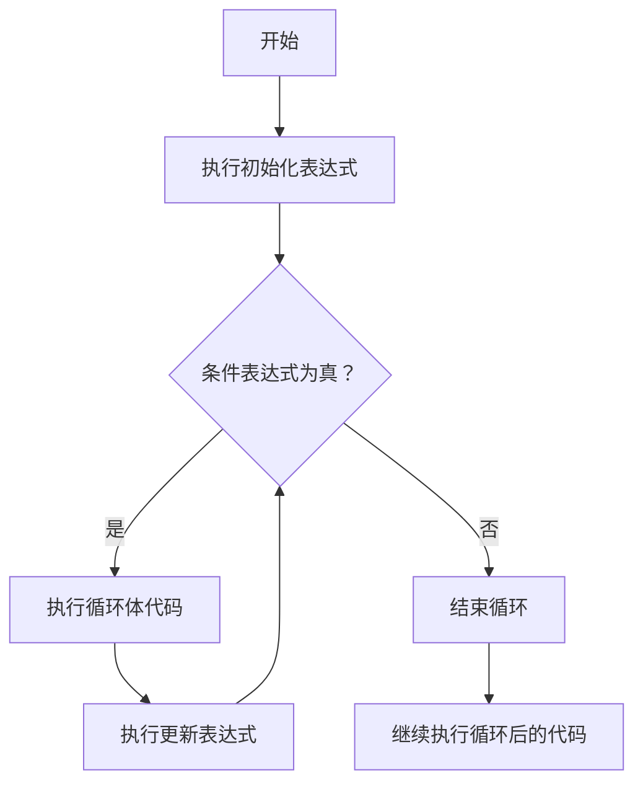

# Java For循环

## 什么是For循环？

在Java编程中，循环是一种控制流结构，它允许代码块被重复执行。而For循环是Java中最常用的循环类型之一，它为重复执行某个代码块提供了一种简洁的方式，尤其适合处理明确知道需要重复多少次的场景。

For循环提供了初始化、条件检查和迭代操作的集中管理，使得代码更加整洁且易于理解。

## 基本语法

Java的标准For循环语法如下：

```java
for (初始化表达式; 条件表达式; 更新表达式) {
    // 循环体代码
}
```

各部分解释：
- **初始化表达式**：在循环开始前执行一次，通常用于初始化循环计数器
- **条件表达式**：在每次循环迭代之前检查，如果为true则执行循环体，否则循环结束
- **更新表达式**：在每次循环体执行之后执行，通常用于更新循环计数器

### 基础示例

```java
// 打印数字1到5
for (int i = 1; i <= 5; i++) {
    System.out.println(i);
}
```

输出：
```
1
2
3
4
5
```

## For循环执行流程

让我们详细了解For循环的执行流程：



## For循环的变体

### 无限循环

```java
for (;;) {
    // 无限循环，需要通过break语句退出
    System.out.println("无限循环");
    break; // 加上这行以避免实际运行时的无限循环
}
```

### 多重初始化和更新表达式

```java
// 使用逗号分隔多个表达式
for (int i = 0, j = 10; i < j; i++, j--) {
    System.out.println("i = " + i + ", j = " + j);
}
```

输出：
```
i = 0, j = 10
i = 1, j = 9
i = 2, j = 8
i = 3, j = 7
i = 4, j = 6
```

### 省略部分表达式

For循环中的三个表达式都是可选的：

```java
int i = 1;
for (; i <= 5;) {
    System.out.println(i);
    i++;  // 在循环体内更新计数器
}
```

## 增强型For循环（For-Each循环）

Java 5引入了增强型For循环，专为遍历集合和数组设计，语法更加简洁。

```java
for (元素类型 变量名 : 集合或数组) {
    // 使用变量处理每个元素
}
```

### 数组示例

```java
int[] numbers = {1, 2, 3, 4, 5};
for (int number : numbers) {
    System.out.println(number);
}
```

### 集合示例

```java
import java.util.ArrayList;
import java.util.List;

public class ForEachExample {
    public static void main(String[] args) {
        List<String> fruits = new ArrayList<>();
        fruits.add("苹果");
        fruits.add("香蕉");
        fruits.add("橙子");
        
        // 使用增强型for循环遍历List
        for (String fruit : fruits) {
            System.out.println(fruit);
        }
    }
}
```

输出：
```
苹果
香蕉
橙子
```

:::note
增强型For循环仅适用于遍历集合或数组的场景。它不能用于执行特定次数的迭代，也不能访问当前迭代的索引。
:::

## For循环实际应用场景

### 1. 计算数组元素总和

```java
public class ArraySum {
    public static void main(String[] args) {
        int[] numbers = {5, 10, 15, 20, 25};
        int sum = 0;
        
        for (int i = 0; i < numbers.length; i++) {
            sum += numbers[i];
        }
        
        System.out.println("数组元素总和为: " + sum);
    }
}
```

输出：
```
数组元素总和为: 75
```

### 2. 生成乘法表

```java
public class MultiplicationTable {
    public static void main(String[] args) {
        System.out.println("九九乘法表:");
        
        for (int i = 1; i <= 9; i++) {
            for (int j = 1; j <= i; j++) {
                System.out.print(j + "×" + i + "=" + (i*j) + "\t");
            }
            System.out.println(); // 换行
        }
    }
}
```

输出：
```
九九乘法表:
1×1=1	
1×2=2	2×2=4	
1×3=3	2×3=6	3×3=9	
1×4=4	2×4=8	3×4=12	4×4=16	
1×5=5	2×5=10	3×5=15	4×5=20	5×5=25	
1×6=6	2×6=12	3×6=18	4×6=24	5×6=30	6×6=36	
1×7=7	2×7=14	3×7=21	4×7=28	5×7=35	6×7=42	7×7=49	
1×8=8	2×8=16	3×8=24	4×8=32	5×8=40	6×8=48	7×8=56	8×8=64	
1×9=9	2×9=18	3×9=27	4×9=36	5×9=45	6×9=54	7×9=63	8×9=72	9×9=81	
```

### 3. 查找数组中的最大值

```java
public class FindMaxValue {
    public static void main(String[] args) {
        int[] numbers = {34, 12, 78, 56, 45, 90, 23};
        int max = numbers[0];  // 假设第一个元素为最大值
        
        for (int i = 1; i < numbers.length; i++) {
            if (numbers[i] > max) {
                max = numbers[i];
            }
        }
        
        System.out.println("数组中的最大值为: " + max);
    }
}
```

输出：
```
数组中的最大值为: 90
```

## For循环与其他循环的比较

Java提供了几种不同类型的循环，每种循环在不同情况下各有优势：

| 循环类型 | 适用场景 | 特点 |
|---------|---------|-----|
| for循环 | 明确知道迭代次数 | 结构清晰，状态管理集中 |
| while循环 | 不确定迭代次数，基于条件 | 灵活性高，适合未知迭代次数 |
| do-while循环 | 至少需要执行一次的情况 | 确保至少执行一次 |
| 增强型for循环 | 遍历集合或数组 | 简洁，但不能获取索引或修改元素 |

:::tip 选择正确的循环
- 当你知道精确的迭代次数时，使用标准for循环
- 当你需要遍历集合或数组时，使用增强型for循环
- 当只有条件判断且可能完全不执行时，使用while循环
- 当循环体至少执行一次时，使用do-while循环
:::

## For循环的高级技巧

### 1. 嵌套循环

循环可以嵌套使用，用于处理多维数据结构或复杂的迭代逻辑：

```java
// 打印星形金字塔
public class StarPyramid {
    public static void main(String[] args) {
        int rows = 5;
        
        for (int i = 1; i <= rows; i++) {
            // 打印空格
            for (int j = 1; j <= rows - i; j++) {
                System.out.print(" ");
            }
            // 打印星号
            for (int k = 1; k <= 2*i-1; k++) {
                System.out.print("*");
            }
            System.out.println();
        }
    }
}
```

输出：
```
    *
   ***
  *****
 *******
*********
```

### 2. 使用break和continue控制循环流程

- **break**：立即退出当前循环
- **continue**：跳过当前迭代，进入下一次迭代

```java
public class BreakContinueDemo {
    public static void main(String[] args) {
        // 使用break找到第一个能被3整除的数
        for (int i = 1; i <= 10; i++) {
            if (i % 3 == 0) {
                System.out.println("找到第一个能被3整除的数：" + i);
                break;
            }
        }
        
        // 使用continue跳过能被2整除的数
        System.out.println("1到10中不能被2整除的数：");
        for (int i = 1; i <= 10; i++) {
            if (i % 2 == 0) {
                continue;
            }
            System.out.print(i + " ");
        }
    }
}
```

输出：
```
找到第一个能被3整除的数：3
1到10中不能被2整除的数：
1 3 5 7 9 
```

### 3. 标签与循环

Java允许为循环添加标签，与break和continue组合使用，可以控制跳出或继续哪一层循环：

```java
public class LabeledLoopDemo {
    public static void main(String[] args) {
        outerLoop:
        for (int i = 1; i <= 3; i++) {
            for (int j = 1; j <= 3; j++) {
                if (i == 2 && j == 2) {
                    System.out.println("跳出外层循环");
                    break outerLoop;
                }
                System.out.println("i = " + i + ", j = " + j);
            }
        }
    }
}
```

输出：
```
i = 1, j = 1
i = 1, j = 2
i = 1, j = 3
i = 2, j = 1
跳出外层循环
```

## 常见错误和注意事项

:::caution 常见陷阱
1. **无限循环**：如果忘记更新循环计数器或条件永远为真，会导致无限循环。

2. **出界访问**：访问数组元素时，确保索引不超过数组长度。

3. **浮点数比较**：当循环计数器是浮点数时，由于精度问题，可能无法准确达到终止条件。

4. **索引越界**：确保循环边界条件正确，特别是使用 `<=` 和 `<` 时。

5. **增强型for循环的局限性**：增强型for循环不能修改集合中的元素。
:::

## 性能考虑

1. **循环变量的作用域**：将循环变量定义在for语句内部可以限制其作用域，减少错误。

2. **循环不变量**：将不依赖循环的计算移到循环外执行。

```java
// 低效的写法
for (int i = 0; i < list.size(); i++) {
    // list.size()在每次迭代时都会被调用
    // ...
}

// 更高效的写法
int size = list.size(); // 只计算一次
for (int i = 0; i < size; i++) {
    // ...
}
```

3. **循环展开**：在某些性能关键场景，可以手动展开循环减少循环开销。

## 总结

For循环是Java编程中不可或缺的控制流结构，它提供了一种简洁、高效的方式来执行重复任务。本文介绍了：

- 标准For循环的基本语法和执行流程
- 增强型For循环(For-Each)的用法
- 各种For循环变体和应用场景
- 嵌套循环和流程控制技巧
- 常见错误和性能注意事项

掌握For循环不仅能帮助你编写更简洁的代码，还能提高程序的执行效率和可读性。在日常编程实践中，根据具体场景选择合适的循环类型至关重要。

## 练习题

为了巩固所学知识，试试以下练习：

1. 编写程序打印1到100中所有偶数。
2. 使用嵌套for循环打印10x10的乘法表。
3. 使用for循环反转一个数组。
4. 编写程序计算并打印斐波那契数列的前20个数。
5. 使用增强型for循环遍历字符串数组并统计包含特定字符的字符串数量。

## 进一步阅读

- Java官方文档中关于[控制流语句](https://docs.oracle.com/javase/tutorial/java/nutsandbolts/flow.html)的部分
- 更多Java循环结构的比较和使用场景
- Java集合框架与迭代器模式

通过实践这些概念，你将能够更有效地使用Java中的For循环来解决各种编程挑战。