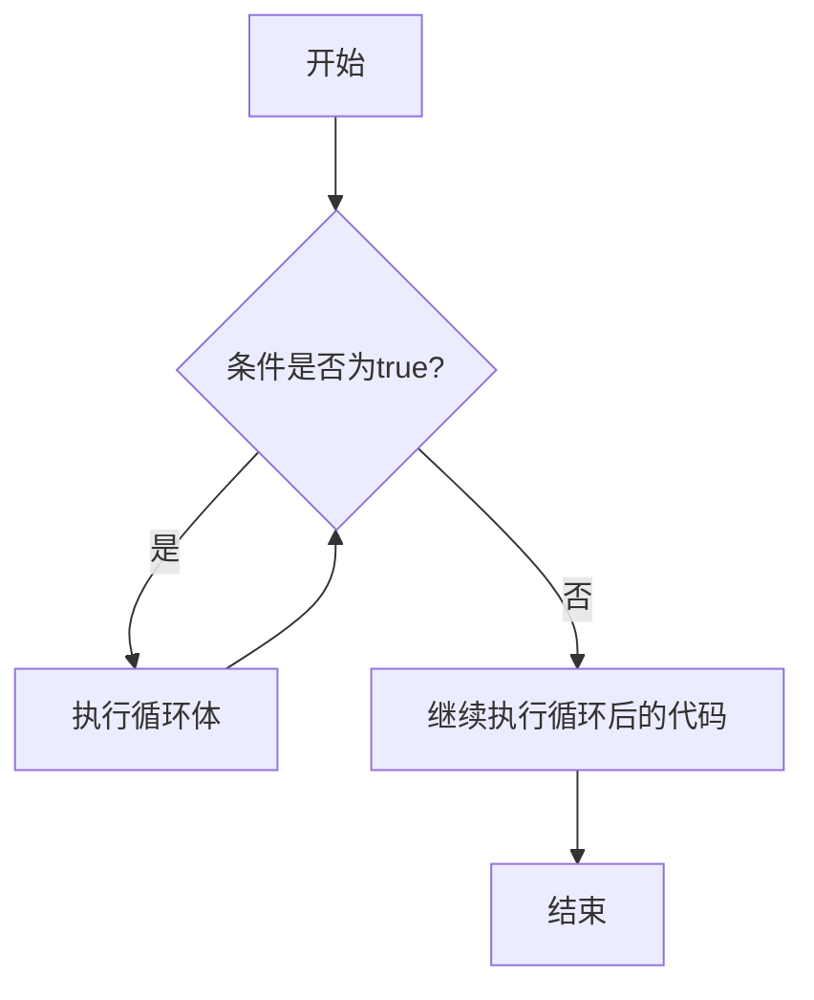
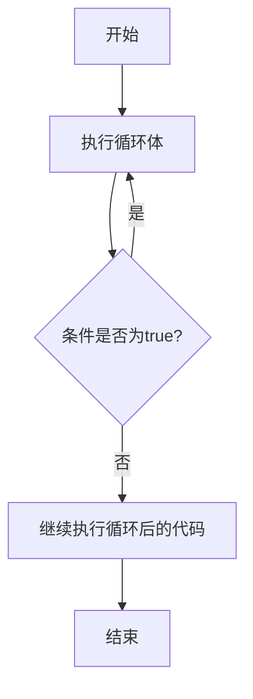

# Java While循环

在Java编程中，循环结构是最基础也是最重要的控制流之一。其中，`while`循环提供了一种简洁而强大的方式来重复执行代码块，直到特定条件不再满足。本文将全面介绍Java中的`while`循环，从基础语法到实际应用，帮助你掌握这一重要编程概念。

## 什么是While循环？

`while`循环是Java中的一种基本循环结构，它会在执行循环体之前先检查条件。只有当条件为`true`时，循环体内的代码才会执行，并且会不断重复执行，直到条件变为`false`。

### 基本语法

```java
while (条件表达式) {
    // 循环体：满足条件时重复执行的代码
}
```

### 执行流程图



## While循环的基本使用

让我们通过一些简单的例子来理解`while`循环的工作方式：

### 示例1：打印数字1到5

```java
public class WhileLoopDemo {
    public static void main(String[] args) {
        int i = 1;  // 初始化计数器
        
        while (i <= 5) {  // 条件：i小于或等于5时循环继续
            System.out.println("计数：" + i);
            i++;  // 更新计数器
        }
        
        System.out.println("循环结束");
    }
}
```

**输出：**
```
计数：1
计数：2
计数：3
计数：4
计数：5
循环结束
```

在这个例子中：
1. 我们初始化变量`i`为1
2. `while`循环检查条件`i <= 5`
3. 如果条件为`true`，执行循环体内的代码，打印计数并将`i`增加1
4. 循环继续直到`i`的值变为6，此时条件为`false`，循环终止

:::tip
确保在`while`循环中包含某种能够改变条件状态的代码（比如示例中的`i++`），否则可能会导致无限循环。
:::

## 无限循环

如果`while`循环的条件始终为`true`，就会创建无限循环。虽然这通常是要避免的，但在某些特殊场景下也可能有意为之。

```java
// 无限循环
while (true) {
    System.out.println("这是一个无限循环");
    // 通常需要一个break语句来退出循环
    if (someCondition) {
        break;  // 满足某条件时退出循环
    }
}
```

:::caution
使用无限循环时，确保有适当的退出机制，比如`break`语句，否则程序将无法正常终止。
:::

## do-while循环：While循环的变体

Java中还有一种与`while`相关的循环结构：`do-while`循环。与`while`循环不同，`do-while`循环会先执行一次循环体，然后再检查条件。

### 基本语法

```java
do {
    // 循环体：至少执行一次的代码
} while (条件表达式);
```

### 执行流程图



### 示例：至少执行一次的循环

```java
public class DoWhileDemo {
    public static void main(String[] args) {
        int i = 6;  // 注意这个值
        
        do {
            System.out.println("计数：" + i);
            i++;
        } while (i <= 5);
        
        System.out.println("循环结束，i = " + i);
    }
}
```

**输出：**
```
计数：6
循环结束，i = 7
```

尽管一开始`i`的值就大于5，不满足循环条件，但循环体仍然执行了一次，然后才检查条件并退出循环。

## while循环与for循环的比较

Java中的`for`循环和`while`循环可以实现相同的功能，但适用场景有所不同：

- 当知道循环次数或有明确的迭代需求时，`for`循环更为简洁
- 当循环继续取决于某个条件而非固定次数时，`while`循环更为适合

### 同一功能的两种实现

**使用while循环：**
```java
int i = 0;
while (i < 5) {
    System.out.println(i);
    i++;
}
```

**使用for循环：**
```java
for (int i = 0; i < 5; i++) {
    System.out.println(i);
}
```

## While循环的实际应用场景

### 1. 用户输入验证

```java
import java.util.Scanner;

public class InputValidation {
    public static void main(String[] args) {
        Scanner scanner = new Scanner(System.in);
        int number;
        
        System.out.println("请输入1到10之间的数字：");
        number = scanner.nextInt();
        
        while (number < 1 || number > 10) {
            System.out.println("输入无效！请重新输入1到10之间的数字：");
            number = scanner.nextInt();
        }
        
        System.out.println("有效输入：" + number);
        scanner.close();
    }
}
```

上例中，只要用户输入的数字不在有效范围内，循环就会继续提示用户重新输入。

### 2. 游戏循环

游戏开发中常用while循环作为主循环：

```java
boolean gameRunning = true;

while (gameRunning) {
    // 处理用户输入
    processInput();
    
    // 更新游戏状态
    updateGame();
    
    // 渲染画面
    render();
    
    // 检查游戏是否应该结束
    gameRunning = !isGameOver();
}

System.out.println("游戏结束");
```

### 3. 文件读取

当不确定文件中有多少行数据时，使用while循环读取文件：

```java
import java.io.BufferedReader;
import java.io.FileReader;
import java.io.IOException;

public class FileReading {
    public static void main(String[] args) {
        try (BufferedReader reader = new BufferedReader(new FileReader("data.txt"))) {
            String line;
            while ((line = reader.readLine()) != null) {
                System.out.println(line);
            }
        } catch (IOException e) {
            e.printStackTrace();
        }
    }
}
```

## 循环控制语句

在使用while循环时，有两个重要的控制语句可以改变循环的行为：

### 1. break语句

`break`语句用于立即退出循环，不再执行循环中的后续代码。

```java
int i = 1;
while (i <= 10) {
    System.out.println("计数：" + i);
    if (i == 5) {
        System.out.println("遇到5，提前结束循环");
        break;  // 循环在i等于5时终止
    }
    i++;
}
```

**输出：**
```
计数：1
计数：2
计数：3
计数：4
计数：5
遇到5，提前结束循环
```

### 2. continue语句

`continue`语句用于跳过当前循环的剩余部分，直接进入下一次循环。

```java
int i = 0;
while (i < 5) {
    i++;
    if (i == 3) {
        System.out.println("跳过3");
        continue;  // 跳过本次循环的剩余代码
    }
    System.out.println("计数：" + i);
}
```

**输出：**
```
计数：1
计数：2
跳过3
计数：4
计数：5
```

## 嵌套的while循环

`while`循环可以嵌套在另一个`while`循环内，创建复杂的循环结构：

```java
int i = 1;
while (i <= 3) {
    System.out.println("外层循环 i = " + i);
    
    int j = 1;
    while (j <= 2) {
        System.out.println("  内层循环 j = " + j);
        j++;
    }
    
    i++;
    System.out.println();
}
```

**输出：**
```
外层循环 i = 1
  内层循环 j = 1
  内层循环 j = 2

外层循环 i = 2
  内层循环 j = 1
  内层循环 j = 2

外层循环 i = 3
  内层循环 j = 1
  内层循环 j = 2
```

:::warning
嵌套循环会导致代码执行次数成倍增加，可能影响性能，使用时需谨慎。
:::

## 常见问题与解决方案

### 1. 无限循环

最常见的问题是无意中创建了无限循环：

```java
int i = 1;
while (i > 0) {
    System.out.println(i);
    // 忘记更新条件变量
}
```

**解决方案：** 确保循环内部有能使条件最终变为`false`的代码。

### 2. 循环条件写反

```java
// 错误：条件写反
int i = 1;
while (i > 5) {  // 应为 i <= 5
    System.out.println(i);
    i++;
}
```

**解决方案：** 仔细检查循环条件的逻辑。

### 3. 边界条件错误

```java
// 错误：边界条件不正确
int[] array = {1, 2, 3, 4, 5};
int i = 0;
while (i <= array.length) {  // 应为 i < array.length
    System.out.println(array[i]);
    i++;
}
```

**解决方案：** 确保循环条件考虑了正确的边界（如数组长度）。

## 总结

`while`循环是Java中一个强大而灵活的循环结构，特别适合那些循环次数不确定，需要根据条件判断是否继续的场景。掌握`while`循环不仅能让你编写简洁高效的代码，还能处理各种复杂的编程问题。

关键要点：

- `while`循环在执行循环体前先检查条件
- `do-while`循环至少执行一次循环体
- 确保循环内有更新条件的代码，避免无限循环
- `break`和`continue`语句可以提供更精细的循环控制
- 选择`while`还是`for`循环取决于具体应用场景

## 练习

为了巩固所学知识，尝试完成以下练习：

1. 编写一个程序，使用`while`循环计算1到100的和。
2. 使用`while`循环找出100以内所有3的倍数。
3. 编写一个猜数字游戏，电脑随机生成一个1到100之间的数字，用户通过输入进行猜测，程序给出"太大"或"太小"的提示，直到猜中为止。
4. 用`while`循环实现阶乘计算。
5. 练习嵌套`while`循环，打印出一个简单的乘法表。

:::tip
学习编程最有效的方法就是动手实践！尝试修改示例代码，观察结果的变化，这将帮助你更深入地理解while循环的工作原理。
:::