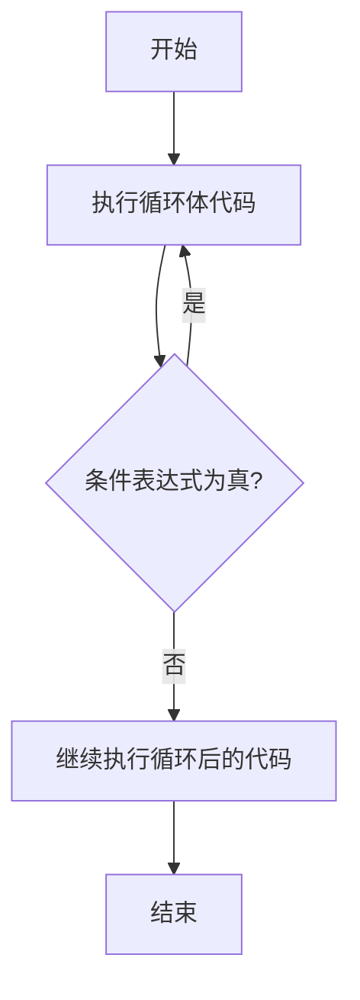

# Java Do While循环

## 什么是Do While循环？

Do While循环是Java中的一种循环控制结构，它与while循环类似，但有一个关键区别：**无论条件是否为真，do while循环至少会执行一次循环体**。这使得do while成为处理特定场景的理想选择，尤其是当你需要确保代码块至少执行一次时。

循环的基本逻辑是：先执行循环体内的代码，然后再检查条件。如果条件为真，则重复执行循环体；如果条件为假，则退出循环。

## 基本语法

Do While循环的语法结构如下：

```java
do {
    // 循环体代码
} while (条件表达式);
```

注意语法特点：
- 以`do`关键字开始
- 循环体放在花括号`{}`中
- `while`关键字和条件表达式跟在循环体后面
- 语句以分号`;`结束

## Do While循环的执行流程



## Do While循环示例

### 基本示例

下面是一个简单的do while循环示例，它将打印1到5的数字：

```java
public class DoWhileDemo {
    public static void main(String[] args) {
        int i = 1;
        do {
            System.out.println(i);
            i++;
        } while (i <= 5);
    }
}
```

**输出结果：**
```
1
2
3
4
5
```

### 至少执行一次的特性

以下示例展示了do while循环的重要特性 - 即使条件一开始就是假，循环体也会执行一次：

```java
public class DoWhileExecuteOnce {
    public static void main(String[] args) {
        int number = 10;
        
        do {
            System.out.println("这条语句会被执行一次，即使条件为假");
            System.out.println("当前number值：" + number);
        } while (number < 5);
        
        System.out.println("循环结束");
    }
}
```

**输出结果：**
```
这条语句会被执行一次，即使条件为假
当前number值：10
循环结束
```

## While与Do While的区别

:::tip
理解while循环和do while循环的区别非常重要，可以帮助你选择适合特定场景的循环结构。
:::

| 特性 | While循环 | Do While循环 |
|------|-----------|--------------|
| 条件检查时机 | 循环开始前 | 循环执行后 |
| 最少执行次数 | 0次 | 1次 |
| 适用场景 | 不确定是否需要执行循环体 | 至少需要执行一次循环体 |
| 语法结构 | `while(条件){...}` | `do{...}while(条件);` |

## 实际应用场景

### 1. 菜单驱动程序

Do While循环非常适合用于菜单驱动的程序，因为菜单至少需要显示一次：

```java
import java.util.Scanner;

public class MenuExample {
    public static void main(String[] args) {
        Scanner scanner = new Scanner(System.in);
        int choice;
        
        do {
            System.out.println("\n===== 菜单 =====");
            System.out.println("1. 显示所有记录");
            System.out.println("2. 添加新记录");
            System.out.println("3. 更新记录");
            System.out.println("4. 删除记录");
            System.out.println("0. 退出");
            System.out.print("请输入您的选择: ");
            
            choice = scanner.nextInt();
            
            // 根据用户选择执行相应操作
            switch (choice) {
                case 1:
                    System.out.println("显示所有记录...");
                    break;
                case 2:
                    System.out.println("添加新记录...");
                    break;
                case 3:
                    System.out.println("更新记录...");
                    break;
                case 4:
                    System.out.println("删除记录...");
                    break;
                case 0:
                    System.out.println("程序退出...");
                    break;
                default:
                    System.out.println("无效选择，请重试");
            }
            
        } while (choice != 0);
        
        scanner.close();
    }
}
```

### 2. 用户输入验证

当需要确保用户输入有效数据时，do while循环很有用：

```java
import java.util.Scanner;

public class InputValidation {
    public static void main(String[] args) {
        Scanner scanner = new Scanner(System.in);
        int number;
        
        do {
            System.out.print("请输入一个1到10之间的数字: ");
            number = scanner.nextInt();
            
            if (number < 1 || number > 10) {
                System.out.println("输入无效！请确保数字在1到10之间。");
            }
        } while (number < 1 || number > 10);
        
        System.out.println("谢谢！您输入的有效数字是: " + number);
        scanner.close();
    }
}
```

### 3. 游戏循环

在游戏开发中，do while可以用于主游戏循环：

```java
public class GameLoop {
    public static void main(String[] args) {
        boolean gameOver = false;
        int score = 0;
        
        // 游戏初始化
        System.out.println("游戏开始...");
        
        do {
            // 游戏逻辑
            System.out.println("游戏运行中...");
            score += 10;
            
            // 检查游戏是否结束
            if (score >= 50) {
                gameOver = true;
            }
            
            System.out.println("当前分数: " + score);
            
        } while (!gameOver);
        
        System.out.println("游戏结束！最终分数: " + score);
    }
}
```

## 注意事项和最佳实践

1. **避免无限循环**：确保循环条件最终会变为假，否则会导致无限循环。

```java
// 错误示例 - 无限循环
do {
    System.out.println("这是一个无限循环！");
} while (true);
```

要避免无限循环，请确保有一个出口条件：

```java
int count = 0;
do {
    System.out.println("循环执行次数: " + count);
    count++;
} while (count < 5);
```

2. **循环条件的位置**：记住条件检查发生在循环体执行之后。

3. **分号位置**：不要忘记在`while(条件)`后面加分号，这是一个常见错误。

:::caution
忘记在do while循环末尾加分号是一个常见的语法错误：
```java
do {
    // 代码
} while (condition) // 错误！缺少分号
```

正确写法：
```java
do {
    // 代码
} while (condition); // 正确，注意分号
```
:::

## 总结

Do While循环是Java中的一种重要循环结构，其主要特点是无论条件如何，循环体至少会执行一次。这使它特别适用于需要确保代码至少执行一次的场景，如菜单显示、用户输入验证等。

与While循环相比，Do While的条件判断发生在循环体执行之后，这是它们之间的关键区别。在选择使用哪种循环时，应考虑是否需要至少执行一次循环体。

通过本文的学习，你应该已经掌握了Do While循环的基本概念、语法、使用方法以及适用场景，这将有助于你在实际编程中更有效地使用这一控制流结构。

## 练习题

为了巩固你的理解，尝试完成以下练习：

1. 编写一个程序，使用do while循环计算1到用户输入的数字之间所有整数的和。

2. 创建一个猜数字游戏，程序随机生成一个1-100之间的数字，用户通过输入来猜测，程序提示猜大了或猜小了，直到猜对为止。使用do while循环实现。

3. 使用do while循环编写一个程序，要求用户输入一个正整数，然后打印该数字的各个数位之和。

## 进一步学习资源

- 《Java: The Complete Reference》- Herbert Schildt
- Oracle Java文档：[Java控制流语句](https://docs.oracle.com/javase/tutorial/java/nutsandbolts/flow.html)
- [Java中的循环结构比较](https://www.baeldung.com/java-loops)

Happy coding!