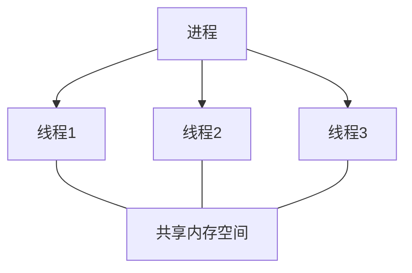
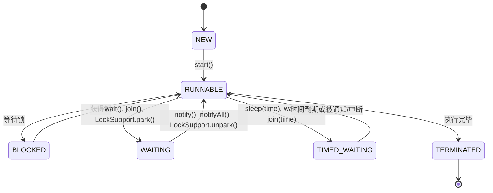

# Java 多线程概述

## 什么是多线程？

在计算机科学中，**线程**是程序执行的最小单位，而**多线程**则是指一个程序中同时运行多个线程的能力。Java作为一种支持多线程的编程语言，从诞生之日起就内置了对多线程的支持，这使得Java程序能够同时执行多个任务，大大提高了程序的执行效率和响应能力。

:::note 为什么需要多线程？
1. **提高CPU利用率**：在单线程程序中，当线程因为I/O操作或其他原因被阻塞时，CPU就会闲置；而多线程程序可以让另一个线程继续使用CPU。
2. **增强用户体验**：在图形界面应用程序中，使用多线程可以同时处理用户交互和后台任务，使应用程序更加流畅。
3. **简化复杂问题**：某些问题天然适合用多线程来解决，如生产者-消费者模型。
:::

## Java 多线程的基本概念

### 进程vs线程

理解多线程首先需要明确进程和线程的区别：

- **进程**：是操作系统分配资源的基本单位，每个进程都有独立的内存空间。
- **线程**：是CPU调度的基本单位，同一进程中的多个线程共享进程的内存空间。



### Java 线程的状态

Java中的线程主要有以下几种状态：

1. **NEW**：线程已创建，但还未启动。
2. **RUNNABLE**：线程正在JVM中执行，但可能正在等待操作系统分配资源。
3. **BLOCKED**：线程被阻塞，等待获取锁。
4. **WAITING**：线程进入等待状态，需要其他线程通知或中断。
5. **TIMED_WAITING**：线程进入计时等待状态，到达指定时间后自动返回。
6. **TERMINATED**：线程执行完毕。



## 创建Java线程的方式

在Java中，创建线程主要有以下三种方式：

### 1. 继承Thread类

这是最直接的方式，通过继承`java.lang.Thread`类并重写其`run()`方法来定义线程的行为。

```java
public class MyThread extends Thread {
    @Override
    public void run() {
        // 线程执行的代码
        for (int i = 0; i < 5; i++) {
            System.out.println("线程" + getName() + "计数: " + i);
        }
    }
    
    public static void main(String[] args) {
        // 创建线程对象
        MyThread thread1 = new MyThread();
        MyThread thread2 = new MyThread();
        
        // 启动线程
        thread1.start();
        thread2.start();
    }
}
```

输出示例（由于线程执行顺序不确定，实际输出可能不同）：

```
线程Thread-0计数: 0
线程Thread-1计数: 0
线程Thread-0计数: 1
线程Thread-1计数: 1
线程Thread-0计数: 2
线程Thread-1计数: 2
线程Thread-0计数: 3
线程Thread-1计数: 3
线程Thread-0计数: 4
线程Thread-1计数: 4
```

### 2. 实现Runnable接口

由于Java不支持多重继承，如果你的类已经继承了其他类，就不能再继承Thread类。此时，可以通过实现`java.lang.Runnable`接口来创建线程。

```java
public class MyRunnable implements Runnable {
    @Override
    public void run() {
        // 线程执行的代码
        for (int i = 0; i < 5; i++) {
            System.out.println("线程" + Thread.currentThread().getName() + "计数: " + i);
        }
    }
    
    public static void main(String[] args) {
        // 创建Runnable实例
        MyRunnable myRunnable = new MyRunnable();
        
        // 创建Thread对象，传入Runnable实例
        Thread thread1 = new Thread(myRunnable, "Thread-1");
        Thread thread2 = new Thread(myRunnable, "Thread-2");
        
        // 启动线程
        thread1.start();
        thread2.start();
    }
}
```

### 3. 实现Callable接口和使用Future

如果你需要线程执行完后返回一个结果，可以使用`java.util.concurrent.Callable`接口配合`Future`。

```java
import java.util.concurrent.*;

public class MyCallable implements Callable<Integer> {
    @Override
    public Integer call() throws Exception {
        // 计算1到100的和
        int sum = 0;
        for (int i = 1; i <= 100; i++) {
            sum += i;
        }
        return sum;
    }
    
    public static void main(String[] args) throws ExecutionException, InterruptedException {
        // 创建Callable实例
        MyCallable myCallable = new MyCallable();
        
        // 创建FutureTask
        FutureTask<Integer> futureTask = new FutureTask<>(myCallable);
        
        // 创建Thread对象
        Thread thread = new Thread(futureTask);
        
        // 启动线程
        thread.start();
        
        // 获取返回结果
        Integer result = futureTask.get();
        System.out.println("计算结果: " + result);
    }
}
```

输出：
```
计算结果: 5050
```

## 线程的基本操作

### 启动线程

使用`start()`方法启动线程。调用此方法后，线程进入就绪状态，等待CPU调度。

```java
Thread thread = new Thread(() -> {
    System.out.println("线程正在运行");
});
thread.start();  // 启动线程
```

:::caution 注意
不要直接调用线程的`run()`方法，这样做不会创建新线程，而是在当前线程中执行`run()`方法。
:::

### 线程休眠

使用`Thread.sleep(long millis)`方法可以使当前线程暂停执行指定的毫秒数。

```java
try {
    System.out.println("休眠前");
    Thread.sleep(2000);  // 休眠2秒
    System.out.println("休眠后");
} catch (InterruptedException e) {
    e.printStackTrace();
}
```

### 线程等待和通知

使用`Object`类的`wait()`、`notify()`和`notifyAll()`方法可以实现线程间的通信。

```java
class SharedResource {
    private boolean hasData = false;
    
    public synchronized void produce() throws InterruptedException {
        while (hasData) {
            wait();  // 如果已有数据，则等待消费者消费
        }
        
        // 生产数据
        hasData = true;
        System.out.println("生产者生产了数据");
        
        notify();  // 通知消费者
    }
    
    public synchronized void consume() throws InterruptedException {
        while (!hasData) {
            wait();  // 如果没有数据，则等待生产者生产
        }
        
        // 消费数据
        hasData = false;
        System.out.println("消费者消费了数据");
        
        notify();  // 通知生产者
    }
}
```

### 线程加入

使用`join()`方法可以等待另一个线程执行完毕。

```java
Thread thread1 = new Thread(() -> {
    try {
        Thread.sleep(2000);
        System.out.println("线程1执行完毕");
    } catch (InterruptedException e) {
        e.printStackTrace();
    }
});

Thread thread2 = new Thread(() -> {
    try {
        thread1.join();  // 等待线程1执行完毕
        System.out.println("线程2执行完毕");
    } catch (InterruptedException e) {
        e.printStackTrace();
    }
});

thread1.start();
thread2.start();
```

输出：
```
线程1执行完毕
线程2执行完毕
```

## 线程安全问题

当多个线程同时访问共享资源时，可能会导致数据不一致的问题，这就是线程安全问题。

### 示例：线程不安全的计数器

```java
class UnsafeCounter {
    private int count = 0;
    
    public void increment() {
        count++;  // 这不是一个原子操作
    }
    
    public int getCount() {
        return count;
    }
}

public class UnsafeCounterDemo {
    public static void main(String[] args) throws InterruptedException {
        UnsafeCounter counter = new UnsafeCounter();
        
        Thread thread1 = new Thread(() -> {
            for (int i = 0; i < 10000; i++) {
                counter.increment();
            }
        });
        
        Thread thread2 = new Thread(() -> {
            for (int i = 0; i < 10000; i++) {
                counter.increment();
            }
        });
        
        thread1.start();
        thread2.start();
        
        thread1.join();
        thread2.join();
        
        System.out.println("预期结果: 20000");
        System.out.println("实际结果: " + counter.getCount());
    }
}
```

输出（可能的结果，每次运行可能不同）：
```
预期结果: 20000
实际结果: 18456
```

这是因为`count++`操作不是原子的，它实际上包括读取、增加和写入三个步骤，当多个线程同时执行这个操作时，可能会导致结果不正确。

### 解决方法：使用synchronized

```java
class SafeCounter {
    private int count = 0;
    
    public synchronized void increment() {
        count++;
    }
    
    public synchronized int getCount() {
        return count;
    }
}
```

## 实际应用场景

### 1. 网络服务器

多线程在网络服务器中的应用非常广泛，每个客户端连接可以由一个单独的线程处理，这样服务器就能同时处理多个客户端请求。

```java
public class SimpleServer {
    public static void main(String[] args) throws IOException {
        ServerSocket serverSocket = new ServerSocket(8080);
        System.out.println("服务器启动，监听端口8080");
        
        while (true) {
            Socket clientSocket = serverSocket.accept();
            System.out.println("客户端连接成功");
            
            // 为每个客户端创建一个新线程处理请求
            new Thread(() -> {
                try {
                    handleClient(clientSocket);
                } catch (IOException e) {
                    e.printStackTrace();
                }
            }).start();
        }
    }
    
    private static void handleClient(Socket clientSocket) throws IOException {
        BufferedReader in = new BufferedReader(new InputStreamReader(clientSocket.getInputStream()));
        PrintWriter out = new PrintWriter(clientSocket.getOutputStream(), true);
        
        String line;
        while ((line = in.readLine()) != null) {
            // 处理客户端请求
            System.out.println("收到客户端消息: " + line);
            out.println("服务器回复: " + line);
        }
        
        clientSocket.close();
    }
}
```

### 2. 图形用户界面

在GUI应用程序中，通常有一个专门的线程（通常称为EDT，Event Dispatch Thread）处理用户交互，而耗时的任务则在后台线程中执行，以避免界面冻结。

```java
import javax.swing.*;
import java.awt.*;
import java.awt.event.ActionEvent;
import java.awt.event.ActionListener;

public class SimpleGUI extends JFrame {
    private JButton startButton;
    private JProgressBar progressBar;
    
    public SimpleGUI() {
        setTitle("多线程GUI示例");
        setSize(300, 150);
        setDefaultCloseOperation(JFrame.EXIT_ON_CLOSE);
        setLayout(new FlowLayout());
        
        startButton = new JButton("开始任务");
        progressBar = new JProgressBar(0, 100);
        progressBar.setStringPainted(true);
        
        startButton.addActionListener(new ActionListener() {
            @Override
            public void actionPerformed(ActionEvent e) {
                startButton.setEnabled(false);  // 禁用按钮
                
                // 创建后台线程执行耗时任务
                new Thread(() -> {
                    try {
                        for (int i = 0; i <= 100; i++) {
                            final int progress = i;
                            // 更新UI必须在EDT中执行
                            SwingUtilities.invokeLater(() -> {
                                progressBar.setValue(progress);
                            });
                            Thread.sleep(50);  // 模拟耗时操作
                        }
                        SwingUtilities.invokeLater(() -> {
                            startButton.setEnabled(true);  // 启用按钮
                            JOptionPane.showMessageDialog(SimpleGUI.this, "任务完成！");
                        });
                    } catch (InterruptedException ex) {
                        ex.printStackTrace();
                    }
                }).start();
            }
        });
        
        add(startButton);
        add(progressBar);
    }
    
    public static void main(String[] args) {
        SwingUtilities.invokeLater(() -> {
            new SimpleGUI().setVisible(true);
        });
    }
}
```

### 3. 并行计算

多线程适合用于并行计算任务，如矩阵乘法。

```java
public class MatrixMultiplier {
    public static void multiply(int[][] a, int[][] b, int[][] c) throws InterruptedException {
        int rows = a.length;
        int cols = b[0].length;
        
        Thread[] threads = new Thread[rows];
        
        for (int i = 0; i < rows; i++) {
            final int row = i;
            threads[i] = new Thread(() -> {
                for (int j = 0; j < cols; j++) {
                    c[row][j] = 0;
                    for (int k = 0; k < b.length; k++) {
                        c[row][j] += a[row][k] * b[k][j];
                    }
                }
            });
            threads[i].start();
        }
        
        // 等待所有线程完成
        for (Thread thread : threads) {
            thread.join();
        }
    }
}
```

## 总结

本文介绍了Java多线程的基本概念、线程的创建方式、生命周期以及常见操作。多线程编程是Java开发中的重要内容，掌握多线程不仅可以提高程序性能，还能解决许多实际问题。然而，多线程编程也面临着线程安全、死锁等挑战，需要开发者谨慎处理。

下面是一些进阶主题，你可以在掌握基础后继续学习：

1. 线程池（ExecutorService）
2. 并发集合（ConcurrentHashMap等）
3. 原子变量（AtomicInteger等）
4. 锁机制（ReentrantLock等）
5. 并发工具类（CountDownLatch, CyclicBarrier等）

## 练习题

1. 创建两个线程，一个线程打印数字1-10，另一个线程打印字母A-J，让它们交替打印（1A2B3C...）。
2. 实现一个线程安全的计数器类，支持增加、减少和获取当前值操作。
3. 实现生产者-消费者模型，使用wait()和notify()方法进行线程间通信。

:::tip 学习建议
多线程是一个复杂的主题，建议先掌握基础概念，然后通过实践逐步深入。在编写多线程程序时，要时刻注意线程安全问题，并进行充分的测试。
:::