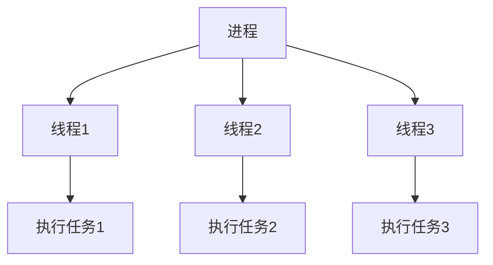

# Java 线程创建

Java作为一种支持多线程编程的语言，提供了多种创建线程的方式。了解如何正确创建和使用线程是掌握Java并发编程的第一步。本文将详细介绍Java中创建线程的各种方法，适合初学者学习。

## 什么是线程？

在深入了解线程创建方法前，我们先简单理解什么是线程。

:::note 线程定义
线程是程序执行的最小单元，一个进程可以包含多个线程。多线程允许程序同时执行多个任务，提高程序的并发性和响应速度。
:::



## Java 创建线程的方法

Java提供了多种创建线程的方法，下面我们将逐一介绍。

### 1. 继承Thread类

创建线程最直接的方式是继承`Thread`类并重写`run()`方法。

**步骤：**
1. 创建一个继承自`Thread`的类
2. 重写`run()`方法，定义线程要执行的代码
3. 创建该类的实例
4. 调用`start()`方法启动线程

**代码示例：**

```java
public class MyThread extends Thread {
    @Override
    public void run() {
        // 线程需要执行的代码
        for (int i = 0; i < 5; i++) {
            System.out.println("线程执行中: " + i);
            try {
                Thread.sleep(1000); // 休眠1秒
            } catch (InterruptedException e) {
                e.printStackTrace();
            }
        }
    }

    public static void main(String[] args) {
        // 创建线程对象
        MyThread myThread = new MyThread();
        // 启动线程
        myThread.start();
        
        // 主线程代码
        for (int i = 0; i < 5; i++) {
            System.out.println("主线程执行中: " + i);
            try {
                Thread.sleep(800);
            } catch (InterruptedException e) {
                e.printStackTrace();
            }
        }
    }
}
```

**输出示例：**
```
线程执行中: 0
主线程执行中: 0
主线程执行中: 1
线程执行中: 1
主线程执行中: 2
线程执行中: 2
主线程执行中: 3
线程执行中: 3
主线程执行中: 4
线程执行中: 4
```

:::caution 注意事项
启动线程时必须调用`start()`方法，而不是直接调用`run()`方法。调用`start()`方法才会创建新的线程并执行`run()`方法中的代码，直接调用`run()`方法只会在当前线程中执行该方法，不会创建新线程。
:::

### 2. 实现Runnable接口

由于Java不支持多重继承，如果类已经继承了其他类，就不能再继承`Thread`类了。此时可以实现`Runnable`接口来创建线程。

**步骤：**
1. 创建一个实现`Runnable`接口的类
2. 实现`run()`方法
3. 创建该类的实例
4. 将该实例作为参数传递给`Thread`类的构造函数，创建`Thread`对象
5. 调用`Thread`对象的`start()`方法

**代码示例：**

```java
public class MyRunnable implements Runnable {
    @Override
    public void run() {
        // 线程需要执行的代码
        for (int i = 0; i < 5; i++) {
            System.out.println("Runnable线程执行中: " + i);
            try {
                Thread.sleep(1000);
            } catch (InterruptedException e) {
                e.printStackTrace();
            }
        }
    }

    public static void main(String[] args) {
        // 创建Runnable实例
        MyRunnable myRunnable = new MyRunnable();
        // 将Runnable实例传入Thread构造函数
        Thread thread = new Thread(myRunnable);
        // 启动线程
        thread.start();
        
        // 主线程代码
        for (int i = 0; i < 5; i++) {
            System.out.println("主线程执行中: " + i);
            try {
                Thread.sleep(800);
            } catch (InterruptedException e) {
                e.printStackTrace();
            }
        }
    }
}
```

### 3. 使用匿名内部类

如果线程逻辑简单，可以使用匿名内部类来简化代码。

**使用Thread匿名内部类：**

```java
public class AnonymousThreadExample {
    public static void main(String[] args) {
        // 使用Thread匿名内部类
        Thread thread = new Thread() {
            @Override
            public void run() {
                for (int i = 0; i < 5; i++) {
                    System.out.println("匿名Thread线程执行中: " + i);
                    try {
                        Thread.sleep(1000);
                    } catch (InterruptedException e) {
                        e.printStackTrace();
                    }
                }
            }
        };
        thread.start();
    }
}
```

**使用Runnable匿名内部类：**

```java
public class AnonymousRunnableExample {
    public static void main(String[] args) {
        // 使用Runnable匿名内部类
        Thread thread = new Thread(new Runnable() {
            @Override
            public void run() {
                for (int i = 0; i < 5; i++) {
                    System.out.println("匿名Runnable线程执行中: " + i);
                    try {
                        Thread.sleep(1000);
                    } catch (InterruptedException e) {
                        e.printStackTrace();
                    }
                }
            }
        });
        thread.start();
    }
}
```

### 4. 使用Lambda表达式（Java 8及以上）

在Java 8及更高版本中，可以使用Lambda表达式简化`Runnable`接口的实现。

```java
public class LambdaThreadExample {
    public static void main(String[] args) {
        // 使用Lambda表达式创建线程
        Thread thread = new Thread(() -> {
            for (int i = 0; i < 5; i++) {
                System.out.println("Lambda线程执行中: " + i);
                try {
                    Thread.sleep(1000);
                } catch (InterruptedException e) {
                    e.printStackTrace();
                }
            }
        });
        thread.start();
    }
}
```

### 5. 实现Callable接口（有返回值）

如果需要线程执行完成后返回结果，可以使用`Callable`接口，配合`Future`或`FutureTask`使用。

**步骤：**
1. 创建一个实现`Callable`接口的类
2. 实现`call()`方法，该方法可以返回结果并抛出异常
3. 创建`FutureTask`对象，将`Callable`实例作为参数传入
4. 将`FutureTask`作为参数创建`Thread`对象
5. 启动线程，并通过`FutureTask.get()`获取结果

```java
import java.util.concurrent.Callable;
import java.util.concurrent.ExecutionException;
import java.util.concurrent.FutureTask;

public class CallableThreadExample {
    public static void main(String[] args) {
        // 创建Callable对象
        Callable<Integer> callable = new Callable<Integer>() {
            @Override
            public Integer call() throws Exception {
                int sum = 0;
                for (int i = 1; i <= 100; i++) {
                    sum += i;
                    System.out.println("计算中: " + i);
                    Thread.sleep(100);
                }
                return sum;
            }
        };
        
        // 创建FutureTask
        FutureTask<Integer> futureTask = new FutureTask<>(callable);
        
        // 创建线程
        Thread thread = new Thread(futureTask);
        thread.start();
        
        try {
            // 等待计算完成并获取结果
            Integer result = futureTask.get();
            System.out.println("计算结果: " + result);
        } catch (InterruptedException | ExecutionException e) {
            e.printStackTrace();
        }
    }
}
```

### 6. 使用线程池

在实际应用中，频繁创建和销毁线程会带来性能开销。线程池通过重用线程来减少这种开销，提高系统性能。Java的`Executors`类提供了多种工厂方法来创建不同类型的线程池。

```java
import java.util.concurrent.ExecutorService;
import java.util.concurrent.Executors;

public class ThreadPoolExample {
    public static void main(String[] args) {
        // 创建固定大小的线程池
        ExecutorService executor = Executors.newFixedThreadPool(3);
        
        // 提交多个任务给线程池执行
        for (int i = 0; i < 5; i++) {
            final int taskId = i;
            executor.execute(() -> {
                System.out.println("线程池中的线程ID: " + Thread.currentThread().getId() + 
                                   " 正在执行任务: " + taskId);
                try {
                    Thread.sleep(1000);
                } catch (InterruptedException e) {
                    e.printStackTrace();
                }
            });
        }
        
        // 关闭线程池
        executor.shutdown();
    }
}
```

## 线程创建方法的比较

| 创建方式 | 优点 | 缺点 |
|---------|------|------|
| 继承Thread | 直接，可以直接使用Thread类的方法 | 不能继承其他类 |
| 实现Runnable | 可以继承其他类，多个线程可共享同一个目标对象 | 不能直接使用Thread类的方法 |
| 实现Callable | 可以返回执行结果，可以抛出异常 | 使用较复杂 |
| 线程池 | 重用线程，减少创建销毁线程的开销 | 使用不当可能导致资源耗尽 |

## 实际应用场景

### 1. 网络请求

在GUI应用中，为避免网络请求阻塞主线程（UI线程），通常使用单独的线程处理网络请求。

```java
public class NetworkRequestExample {
    public static void main(String[] args) {
        // 模拟UI线程
        System.out.println("UI线程: 显示加载中...");
        
        // 创建线程处理网络请求
        Thread networkThread = new Thread(() -> {
            System.out.println("网络线程: 开始请求数据...");
            try {
                // 模拟网络延迟
                Thread.sleep(3000);
                System.out.println("网络线程: 数据请求完成");
                
                // 回到UI线程更新界面（这里简化为打印）
                System.out.println("UI线程: 更新界面显示数据");
            } catch (InterruptedException e) {
                System.out.println("网络线程: 请求被中断");
                e.printStackTrace();
            }
        });
        
        networkThread.start();
        
        // UI线程继续执行其他操作
        System.out.println("UI线程: 等待数据时可以响应其他操作...");
    }
}
```

### 2. 文件处理

处理大文件时，可以使用多线程并行处理不同部分，提高效率。

```java
public class FileProcessingExample {
    public static void main(String[] args) {
        // 模拟一个大文件，分成4部分处理
        final int PARTS = 4;
        
        for (int i = 0; i < PARTS; i++) {
            final int partIndex = i;
            Thread thread = new Thread(() -> {
                System.out.println("线程" + Thread.currentThread().getId() + 
                                   " 开始处理文件第" + (partIndex + 1) + "部分");
                try {
                    // 模拟处理时间
                    Thread.sleep(2000);
                    System.out.println("线程" + Thread.currentThread().getId() + 
                                       " 完成处理文件第" + (partIndex + 1) + "部分");
                } catch (InterruptedException e) {
                    e.printStackTrace();
                }
            });
            thread.start();
        }
    }
}
```

### 3. 后台任务

应用程序通常有需要在后台定期执行的任务，例如定期清理临时文件、检查更新等。

```java
import java.util.concurrent.Executors;
import java.util.concurrent.ScheduledExecutorService;
import java.util.concurrent.TimeUnit;

public class BackgroundTaskExample {
    public static void main(String[] args) {
        // 创建一个可以定时执行任务的线程池
        ScheduledExecutorService scheduler = Executors.newScheduledThreadPool(1);
        
        // 定义后台任务
        Runnable cleanupTask = () -> {
            System.out.println("执行清理任务: " + System.currentTimeMillis());
            // 实际清理代码...
        };
        
        // 每5秒执行一次清理任务
        scheduler.scheduleAtFixedRate(cleanupTask, 0, 5, TimeUnit.SECONDS);
        
        System.out.println("主程序继续运行，后台任务已安排...");
        
        // 主程序执行其他逻辑
        try {
            Thread.sleep(20000); // 让程序运行20秒
        } catch (InterruptedException e) {
            e.printStackTrace();
        }
        
        // 关闭调度器
        scheduler.shutdown();
    }
}
```

## 总结

本文详细介绍了Java中创建线程的多种方式：
1. 继承`Thread`类
2. 实现`Runnable`接口
3. 使用匿名内部类
4. 使用Lambda表达式（Java 8+）
5. 实现`Callable`接口（有返回值）
6. 使用线程池

每种创建方式都有其适用场景：
- 简单任务可以使用`Thread`或`Runnable`
- 需要返回值的任务使用`Callable`
- 大量短期任务适合使用线程池
- 定期执行的任务适合使用`ScheduledExecutorService`

:::tip 最佳实践
在实际开发中，推荐使用线程池而不是直接创建线程，因为线程池能够更好地管理线程资源，提高应用程序性能。同时，使用`Runnable`/`Callable`接口比继承`Thread`类更灵活。
:::

## 练习任务

1. 创建一个继承`Thread`的类，打印1到10的数字，每打印一个数字暂停500毫秒。

2. 使用`Runnable`接口创建一个线程，计算并打印斐波那契数列的前15个数。

3. 使用`Callable`接口创建线程计算1到100的和，并返回结果。

4. 创建一个包含5个线程的线程池，每个线程模拟处理一个订单，包括验证订单、处理付款和发送确认邮件等步骤。

## 进一步学习资源

1. Java官方文档 - 并发编程部分
2. 《Java并发编程实战》书籍
3. Java多线程相关的在线课程和教程

通过掌握这些线程创建方法，你将能够更好地利用Java的多线程特性，开发出高效且响应迅速的应用程序。