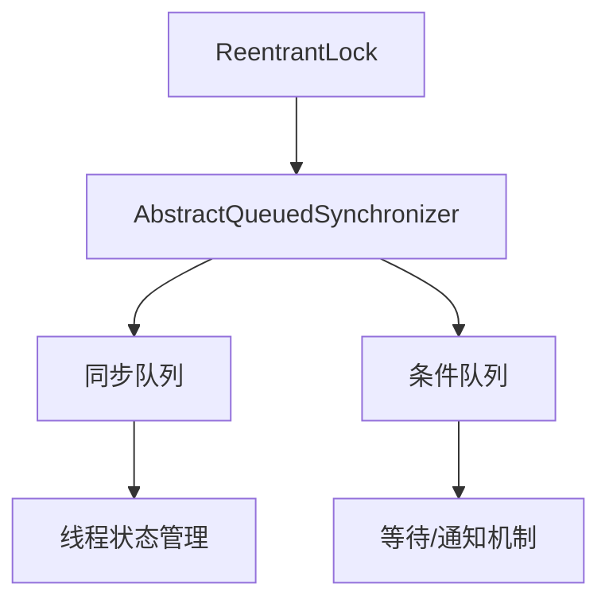

# Java ReentrantLock

## 什么是ReentrantLock？

ReentrantLock是Java 5中引入的一种可重入锁实现，它提供了与synchronized关键字类似的线程同步功能，但具有更多的灵活性和高级特性。作为`java.util.concurrent.locks`包中的核心组件，ReentrantLock允许线程以独占方式访问共享资源，同时提供了公平性、可中断等额外功能。

:::note
"可重入"意味着一个线程可以多次获取同一把锁而不会导致自身死锁。例如，如果一个线程已经持有了锁，当它再次尝试获取同一把锁时，可以成功获取。
:::

## ReentrantLock vs synchronized

ReentrantLock和synchronized都能实现线程同步，但有几个关键区别：

| 特性 | ReentrantLock | synchronized |
|-----|--------------|-------------|
| 灵活性 | 高（显式获取和释放锁） | 低（自动获取和释放锁） |
| 公平性 | 支持公平锁和非公平锁 | 只支持非公平锁 |
| 可中断性 | 支持响应中断 | 不支持 |
| 超时等待 | 支持 | 不支持 |
| 条件变量 | 支持多个条件变量 | 只有一个条件变量 |

## ReentrantLock基本用法

使用ReentrantLock的基本步骤包括：
1. 创建ReentrantLock实例
2. 获取锁（lock()）
3. 访问共享资源
4. 释放锁（unlock()）

```java
import java.util.concurrent.locks.ReentrantLock;

public class ReentrantLockDemo {
    private final ReentrantLock lock = new ReentrantLock();
    private int count = 0;
    
    public void increment() {
        lock.lock();  // 获取锁
        try {
            count++;
        } finally {
            lock.unlock();  // 释放锁
        }
    }
    
    public int getCount() {
        lock.lock();
        try {
            return count;
        } finally {
            lock.unlock();
        }
    }
    
    public static void main(String[] args) throws InterruptedException {
        ReentrantLockDemo demo = new ReentrantLockDemo();
        
        Thread t1 = new Thread(() -> {
            for (int i = 0; i < 10000; i++) {
                demo.increment();
            }
        });
        
        Thread t2 = new Thread(() -> {
            for (int i = 0; i < 10000; i++) {
                demo.increment();
            }
        });
        
        t1.start();
        t2.start();
        
        t1.join();
        t2.join();
        
        System.out.println("Final count: " + demo.getCount());
    }
}
```

**输出：**
```
Final count: 20000
```

:::caution
始终在finally块中释放锁，以确保即使出现异常，锁也会被正确释放。否则可能导致死锁。
:::

## ReentrantLock的高级特性

### 1. 公平锁

通过在构造函数中设置参数，ReentrantLock可以创建公平锁：

```java
// 默认为非公平锁
ReentrantLock unfairLock = new ReentrantLock();

// 创建公平锁
ReentrantLock fairLock = new ReentrantLock(true);
```

公平锁会按照线程请求的顺序获取锁，而非公平锁则允许"插队"。公平锁通常性能较低，但可以避免线程饥饿问题。

### 2. 可中断锁获取

ReentrantLock提供了可中断的锁获取方法：`lockInterruptibly()`

```java
public void lockWithInterruption() throws InterruptedException {
    lock.lockInterruptibly(); // 可中断的锁获取
    try {
        // 访问共享资源
    } finally {
        lock.unlock();
    }
}
```

这允许线程在等待锁时能够响应中断，适用于需要取消长时间等待的场景。

### 3. 超时锁获取

使用`tryLock()`方法可以在指定时间内尝试获取锁：

```java
public boolean lockWithTimeout() {
    try {
        // 尝试在2秒内获取锁
        if (lock.tryLock(2, TimeUnit.SECONDS)) {
            try {
                // 成功获取锁，访问共享资源
                return true;
            } finally {
                lock.unlock();
            }
        } else {
            // 未能获取锁
            return false;
        }
    } catch (InterruptedException e) {
        // 等待过程中被中断
        return false;
    }
}
```

### 4. 条件变量（Condition）

ReentrantLock可以创建多个条件变量，实现更复杂的线程协调：

```java
import java.util.concurrent.locks.Condition;
import java.util.concurrent.locks.ReentrantLock;

public class BoundedBuffer {
    private final ReentrantLock lock = new ReentrantLock();
    private final Condition notFull = lock.newCondition();
    private final Condition notEmpty = lock.newCondition();
    
    private final Object[] items = new Object[100];
    private int putIndex = 0, takeIndex = 0, count = 0;
    
    // 存入元素
    public void put(Object x) throws InterruptedException {
        lock.lock();
        try {
            // 缓冲区已满，等待notFull条件
            while (count == items.length) {
                notFull.await();
            }
            // 存入元素
            items[putIndex] = x;
            putIndex = (putIndex + 1) % items.length;
            count++;
            // 通知消费者可以取出元素
            notEmpty.signal();
        } finally {
            lock.unlock();
        }
    }
    
    // 取出元素
    public Object take() throws InterruptedException {
        lock.lock();
        try {
            // 缓冲区为空，等待notEmpty条件
            while (count == 0) {
                notEmpty.await();
            }
            // 取出元素
            Object x = items[takeIndex];
            takeIndex = (takeIndex + 1) % items.length;
            count--;
            // 通知生产者可以存入元素
            notFull.signal();
            return x;
        } finally {
            lock.unlock();
        }
    }
}
```

## ReentrantLock工作原理

ReentrantLock的内部实现依赖于AQS（AbstractQueuedSynchronizer）框架：



当线程尝试获取锁时：
1. 如果锁空闲，线程获取锁并继续执行
2. 如果锁被占用，线程进入同步队列等待
3. 锁被释放时，会从同步队列中唤醒一个线程

## 实际应用场景

### 场景1：高并发计数器

```java
public class ConcurrentCounter {
    private final ReentrantLock lock = new ReentrantLock();
    private long count = 0;
    
    public void increment() {
        lock.lock();
        try {
            count++;
        } finally {
            lock.unlock();
        }
    }
    
    public long getCount() {
        lock.lock();
        try {
            return count;
        } finally {
            lock.unlock();
        }
    }
}
```

### 场景2：资源池管理

```java
public class ResourcePool<T> {
    private final ReentrantLock lock = new ReentrantLock();
    private final Condition available = lock.newCondition();
    private final Queue<T> pool = new LinkedList<>();
    private final int maxSize;
    
    public ResourcePool(int maxSize) {
        this.maxSize = maxSize;
    }
    
    public void addResource(T resource) throws InterruptedException {
        lock.lock();
        try {
            while (pool.size() >= maxSize) {
                // 池已满，等待
                available.await();
            }
            pool.add(resource);
            available.signal(); // 唤醒等待获取资源的线程
        } finally {
            lock.unlock();
        }
    }
    
    public T getResource() throws InterruptedException {
        lock.lock();
        try {
            while (pool.isEmpty()) {
                // 池为空，等待
                available.await();
            }
            T resource = pool.poll();
            available.signal(); // 唤醒等待添加资源的线程
            return resource;
        } finally {
            lock.unlock();
        }
    }
    
    public boolean tryGetResource(long timeout, TimeUnit unit) throws InterruptedException {
        lock.lock();
        try {
            if (pool.isEmpty()) {
                // 尝试等待指定时间
                if (!available.await(timeout, unit)) {
                    return false; // 超时
                }
            }
            if (!pool.isEmpty()) {
                T resource = pool.poll();
                available.signal();
                return true;
            }
            return false;
        } finally {
            lock.unlock();
        }
    }
}
```

### 场景3：读写锁的简单实现

```java
public class SimpleReadWriteLock {
    private final ReentrantLock lock = new ReentrantLock();
    private int readers = 0;
    private boolean isWriteLocked = false;
    
    public void lockRead() {
        lock.lock();
        try {
            while (isWriteLocked) {
                // 有写锁，等待
                try {
                    lock.unlock();
                    Thread.sleep(1); // 简单实现，实际应使用条件变量
                    lock.lock();
                } catch (InterruptedException e) {
                    Thread.currentThread().interrupt();
                }
            }
            readers++;
        } finally {
            lock.unlock();
        }
    }
    
    public void unlockRead() {
        lock.lock();
        try {
            readers--;
        } finally {
            lock.unlock();
        }
    }
    
    public void lockWrite() {
        lock.lock();
        try {
            while (readers > 0 || isWriteLocked) {
                // 有读锁或写锁，等待
                try {
                    lock.unlock();
                    Thread.sleep(1); // 简单实现，实际应使用条件变量
                    lock.lock();
                } catch (InterruptedException e) {
                    Thread.currentThread().interrupt();
                }
            }
            isWriteLocked = true;
        } finally {
            lock.unlock();
        }
    }
    
    public void unlockWrite() {
        lock.lock();
        try {
            isWriteLocked = false;
        } finally {
            lock.unlock();
        }
    }
}
```

:::tip
如果需要真正的读写锁实现，应使用Java的`ReentrantReadWriteLock`类，它提供了更高效和完善的实现。
:::

## 最佳实践

1. **总是在finally块中释放锁**：确保在所有情况下都能释放锁
2. **避免在持有锁的情况下调用外部方法**：可能导致死锁或性能问题
3. **尽量缩短锁持有时间**：提高并发性能
4. **使用tryLock()处理死锁风险**：提供超时机制避免无限等待
5. **考虑使用公平锁处理线程饥饿问题**：虽然会降低性能，但可以保证公平性

## 总结

ReentrantLock是Java并发编程中的重要工具，它提供了比synchronized更灵活的锁机制，包括：

- 可重入性：允许同一线程多次获取同一把锁
- 公平性选择：支持创建公平锁和非公平锁
- 可中断性：支持响应中断的锁获取操作
- 超时机制：支持带超时的锁获取尝试
- 条件变量：支持多条件等待

掌握ReentrantLock的使用，可以帮助你在复杂的并发场景中实现更精细的线程同步控制，提高应用程序的可靠性和性能。

## 练习题

1. 使用ReentrantLock实现一个简单的计数器，支持线程安全的增加和获取操作。
2. 实现一个有界阻塞队列，使用ReentrantLock和Condition实现线程安全的入队和出队操作。
3. 修改有界阻塞队列，添加超时等待功能，使得入队和出队操作可以在指定时间内等待。
4. 比较ReentrantLock和synchronized在不同场景下的性能差异。

## 进一步学习资源

- 《Java并发编程实战》（Java Concurrency in Practice）- Brian Goetz等
- Oracle官方文档：[ReentrantLock](https://docs.oracle.com/en/java/javase/11/docs/api/java.base/java/util/concurrent/locks/ReentrantLock.html)
- Oracle官方教程：[Lock对象](https://docs.oracle.com/javase/tutorial/essential/concurrency/newlocks.html)