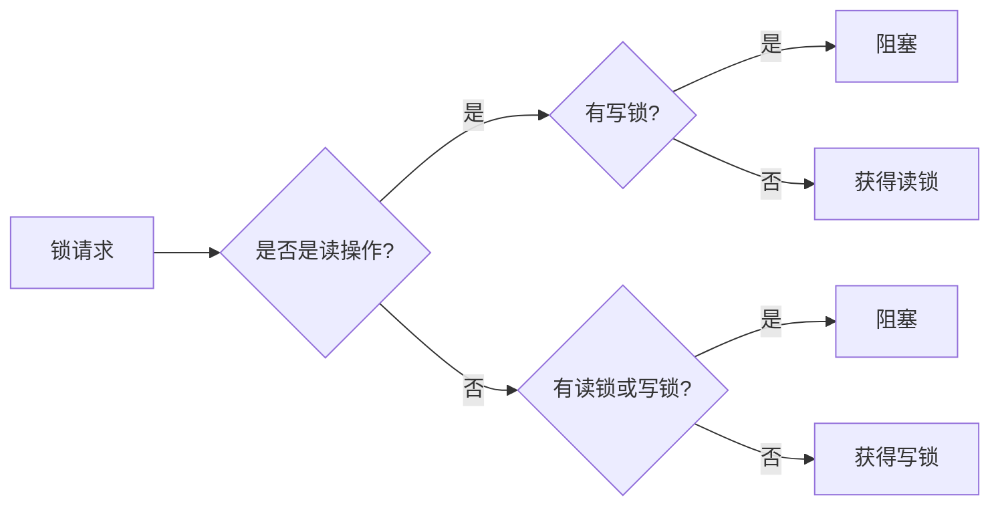

# Java ReadWriteLock

## 什么是 ReadWriteLock

ReadWriteLock 是 Java 并发工具包（java.util.concurrent.locks）中提供的一个锁接口，它维护了一对相关的锁：一个用于只读操作（读锁），一个用于写入操作（写锁）。与传统锁不同，ReadWriteLock 允许多个读线程同时访问共享资源，但写线程访问时会阻塞所有其他线程。

这种锁机制特别适用于读多写少的场景，能显著提高程序的并发性能。

:::note
在 Java 中，ReadWriteLock 是一个接口，其最常用的实现类是 ReentrantReadWriteLock。
:::

## 为什么需要 ReadWriteLock

传统的锁（如 synchronized 或 ReentrantLock）在任何时候只允许一个线程访问受保护的资源，这种互斥性在某些场景下会导致不必要的性能瓶颈。

考虑以下几种情况：
- 数据库连接池管理
- 缓存系统
- 配置信息管理

在这些场景中，读取操作通常比写入操作频繁得多。如果多个线程只是想读取共享资源而不修改它，使用传统锁会导致这些线程不必要地等待。

ReadWriteLock 通过区分读操作和写操作，解决了这个问题：
- 多个读线程可以同时获得读锁
- 写线程获得写锁时，所有其他线程（包括读线程）都会被阻塞
- 当有线程持有读锁时，写线程会被阻塞



## ReentrantReadWriteLock 的基本用法

ReentrantReadWriteLock 是 ReadWriteLock 接口的实现类，它提供了可重入的读锁和写锁。

### 基本使用步骤

1. 创建 ReentrantReadWriteLock 实例
2. 通过 readLock() 获取读锁
3. 通过 writeLock() 获取写锁
4. 在适当的位置加锁和解锁

下面是一个基本示例：

```java
import java.util.concurrent.locks.ReadWriteLock;
import java.util.concurrent.locks.ReentrantReadWriteLock;

public class ReadWriteLockDemo {
    private final ReadWriteLock lock = new ReentrantReadWriteLock();
    private String data = "初始数据";
    
    public String readData() {
        lock.readLock().lock();  // 获取读锁
        try {
            System.out.println(Thread.currentThread().getName() + " 正在读取数据...");
            // 模拟读取耗时
            Thread.sleep(1000);
            System.out.println(Thread.currentThread().getName() + " 读取完成: " + data);
            return data;
        } catch (InterruptedException e) {
            e.printStackTrace();
            return null;
        } finally {
            lock.readLock().unlock();  // 释放读锁
        }
    }
    
    public void writeData(String newData) {
        lock.writeLock().lock();  // 获取写锁
        try {
            System.out.println(Thread.currentThread().getName() + " 正在写入数据...");
            // 模拟写入耗时
            Thread.sleep(2000);
            this.data = newData;
            System.out.println(Thread.currentThread().getName() + " 写入完成: " + newData);
        } catch (InterruptedException e) {
            e.printStackTrace();
        } finally {
            lock.writeLock().unlock();  // 释放写锁
        }
    }
    
    public static void main(String[] args) {
        final ReadWriteLockDemo demo = new ReadWriteLockDemo();
        
        // 创建3个读线程
        for (int i = 0; i < 3; i++) {
            new Thread(() -> demo.readData(), "读线程-" + i).start();
        }
        
        // 创建1个写线程
        new Thread(() -> demo.writeData("新数据"), "写线程").start();
    }
}
```

**输出示例：**

```
读线程-0 正在读取数据...
读线程-1 正在读取数据...
读线程-2 正在读取数据...
读线程-0 读取完成: 初始数据
读线程-1 读取完成: 初始数据
读线程-2 读取完成: 初始数据
写线程 正在写入数据...
写线程 写入完成: 新数据
```

注意输出结果中，三个读线程几乎同时在读取数据，这说明它们同时获得了读锁。写线程则需要等待所有读线程完成后才能获得写锁。

:::caution
使用 ReadWriteLock 时，必须确保在 finally 块中释放锁，否则可能导致死锁。
:::

## ReentrantReadWriteLock 的高级特性

### 锁降级

锁降级是指持有写锁的线程在释放写锁之前获取读锁，然后再释放写锁的过程。这样做的好处是保证数据的可见性，防止在写锁释放后，其他写线程修改数据导致数据不一致。

```java
public void processData() {
    lock.writeLock().lock();  // 获取写锁
    try {
        // 修改数据
        data = "更新的数据";
        
        // 锁降级 - 在释放写锁前获取读锁
        lock.readLock().lock();
    } finally {
        lock.writeLock().unlock();  // 释放写锁，但仍持有读锁
    }
    
    try {
        // 使用读锁保护的读操作
        System.out.println("使用读锁读取数据: " + data);
    } finally {
        lock.readLock().unlock();  // 释放读锁
    }
}
```

:::warning
注意，ReentrantReadWriteLock 不支持锁升级（从读锁升级到写锁），这样做会导致死锁。
:::

### 公平性设置

ReentrantReadWriteLock 默认是非公平的，但我们可以通过构造函数参数设置为公平锁：

```java
// 创建公平的读写锁
ReadWriteLock fairLock = new ReentrantReadWriteLock(true);
```

公平锁会按照请求的顺序授予锁，但会导致性能稍有下降。

### 获取锁的条件支持

ReentrantReadWriteLock 提供了与 Condition 结合使用的能力：

```java
ReentrantReadWriteLock rwLock = new ReentrantReadWriteLock();
Condition condition = rwLock.writeLock().newCondition();

public void waitForCondition() throws InterruptedException {
    rwLock.writeLock().lock();
    try {
        while (!conditionMet) {
            condition.await();  // 等待条件
        }
        // 条件满足，执行操作
    } finally {
        rwLock.writeLock().unlock();
    }
}

public void signalCondition() {
    rwLock.writeLock().lock();
    try {
        conditionMet = true;
        condition.signalAll();  // 通知等待的线程
    } finally {
        rwLock.writeLock().unlock();
    }
}
```

## 实际应用场景：简单缓存实现

下面是一个使用 ReadWriteLock 实现的简单缓存系统，它允许多个线程同时读取缓存，但在更新缓存时需要独占访问：

```java
import java.util.HashMap;
import java.util.Map;
import java.util.concurrent.locks.ReadWriteLock;
import java.util.concurrent.locks.ReentrantReadWriteLock;

public class SimpleCache<K, V> {
    private final Map<K, V> cache = new HashMap<>();
    private final ReadWriteLock lock = new ReentrantReadWriteLock();
    
    // 从缓存获取数据
    public V get(K key) {
        lock.readLock().lock();
        try {
            System.out.println(Thread.currentThread().getName() + " 正在读取缓存: " + key);
            // 模拟读取耗时
            Thread.sleep(500);
            return cache.get(key);
        } catch (InterruptedException e) {
            return null;
        } finally {
            lock.readLock().unlock();
        }
    }
    
    // 向缓存写入数据
    public void put(K key, V value) {
        lock.writeLock().lock();
        try {
            System.out.println(Thread.currentThread().getName() + " 正在写入缓存: " + key);
            // 模拟写入耗时
            Thread.sleep(1000);
            cache.put(key, value);
        } catch (InterruptedException e) {
            e.printStackTrace();
        } finally {
            lock.writeLock().unlock();
        }
    }
    
    // 清除指定键的缓存
    public void remove(K key) {
        lock.writeLock().lock();
        try {
            System.out.println(Thread.currentThread().getName() + " 正在删除缓存: " + key);
            cache.remove(key);
        } finally {
            lock.writeLock().unlock();
        }
    }
    
    // 清空所有缓存
    public void clear() {
        lock.writeLock().lock();
        try {
            System.out.println(Thread.currentThread().getName() + " 正在清空缓存");
            cache.clear();
        } finally {
            lock.writeLock().unlock();
        }
    }
    
    public static void main(String[] args) {
        SimpleCache<String, String> cache = new SimpleCache<>();
        
        // 预填充缓存
        cache.put("key1", "value1");
        cache.put("key2", "value2");
        
        // 多个读线程同时读取
        for (int i = 0; i < 5; i++) {
            new Thread(() -> {
                System.out.println(Thread.currentThread().getName() + " 读取结果: " + cache.get("key1"));
            }, "读线程-" + i).start();
        }
        
        // 一个写线程更新缓存
        new Thread(() -> {
            cache.put("key1", "更新的value1");
            System.out.println(Thread.currentThread().getName() + " 已更新缓存");
        }, "写线程").start();
    }
}
```

**输出示例：**

```
写线程 正在写入缓存: key1
写线程 已更新缓存
读线程-0 正在读取缓存: key1
读线程-1 正在读取缓存: key1
读线程-2 正在读取缓存: key1
读线程-3 正在读取缓存: key1
读线程-4 正在读取缓存: key1
读线程-0 读取结果: 更新的value1
读线程-3 读取结果: 更新的value1
读线程-1 读取结果: 更新的value1
读线程-2 读取结果: 更新的value1
读线程-4 读取结果: 更新的value1
```

在这个例子中，缓存系统使用 ReadWriteLock 确保了：
1. 多个读操作可以同时执行，提高读取性能
2. 写操作会排斥所有其他操作，保证数据一致性
3. 写操作完成后，所有读操作都能看到最新的数据

## ReadWriteLock 与其他锁机制的比较

| 锁类型 | 优点 | 缺点 | 适用场景 |
|-------|------|------|---------|
| synchronized | 简单易用，JVM 级别优化 | 不灵活，无法中断等待 | 简单的同步需求 |
| ReentrantLock | 灵活，支持公平性、可中断等 | 需要手动解锁，稍复杂 | 需要高级特性的场景 |
| ReadWriteLock | 读写分离，提高并发性 | 实现复杂，可能产生饥饿 | 读多写少的场景 |

## 使用 ReadWriteLock 的注意事项

1. **防止死锁**：务必在 finally 块中释放锁

2. **避免长时间持有读锁**：如果长时间持有读锁，可能会导致写线程长时间等待，造成写饥饿

3. **不支持锁升级**：持有读锁时不能直接获取写锁（会导致死锁）

4. **性能考量**：在读操作非常少的情况下，ReadWriteLock 可能不如 ReentrantLock 高效

5. **线程安全问题**：ReadWriteLock 只能保证被锁保护的代码的线程安全，其他代码仍需谨慎处理

## Java 8 及以上的更优选择：StampedLock

如果你使用 Java 8 或更高版本，可以考虑使用 StampedLock，它是 ReadWriteLock 的改进版本，提供了乐观读模式，性能更高：

```java
import java.util.concurrent.locks.StampedLock;

public class StampedLockExample {
    private double x, y;
    private final StampedLock lock = new StampedLock();
    
    // 写方法
    void moveIfAtOrigin(double newX, double newY) {
        // 获取写锁
        long stamp = lock.writeLock();
        try {
            if (x == 0.0 && y == 0.0) {
                x = newX;
                y = newY;
            }
        } finally {
            // 释放写锁
            lock.unlockWrite(stamp);
        }
    }
    
    // 读方法
    double distanceFromOrigin() {
        // 乐观读
        long stamp = lock.tryOptimisticRead();
        double currentX = x;
        double currentY = y;
        
        // 检查读取期间是否有写操作
        if (!lock.validate(stamp)) {
            // 如果有写操作，升级为读锁
            stamp = lock.readLock();
            try {
                currentX = x;
                currentY = y;
            } finally {
                lock.unlockRead(stamp);
            }
        }
        
        return Math.sqrt(currentX * currentX + currentY * currentY);
    }
}
```

## 总结

ReadWriteLock 是 Java 并发工具包中的一个重要组件，通过区分读操作和写操作，它允许多个读线程同时访问共享资源，从而在读多写少的场景中显著提高程序的性能。

主要优点：
- 提高读操作的并发性
- 保证数据一致性
- 适用于读多写少的场景

使用 ReadWriteLock 时需要注意：
- 正确处理锁的获取和释放
- 防止写线程饥饿
- 避免死锁问题

在实际应用中，ReadWriteLock 广泛应用于缓存系统、配置管理、数据库连接池等场景，能有效提升系统的并发性能。

## 练习

1. 实现一个简单的文件读写器，多个线程可以同时读取文件内容，但只有一个线程能写入文件。

2. 设计一个使用 ReadWriteLock 的配置管理器，允许多个线程同时读取配置，但更新配置时需要独占访问。

3. 改进上面的缓存示例，添加过期时间和自动清理功能，并确保线程安全。

## 进阶资源

- [Java 官方文档: ReadWriteLock](https://docs.oracle.com/javase/8/docs/api/java/util/concurrent/locks/ReadWriteLock.html)
- [Java 官方文档: ReentrantReadWriteLock](https://docs.oracle.com/javase/8/docs/api/java/util/concurrent/locks/ReentrantReadWriteLock.html)
- [Java 并发编程实践](https://book.douban.com/subject/10484692/) - 经典的并发编程书籍
- [Java 并发编程的艺术](https://book.douban.com/subject/26591326/) - 深入讲解 Java 并发工具的书籍