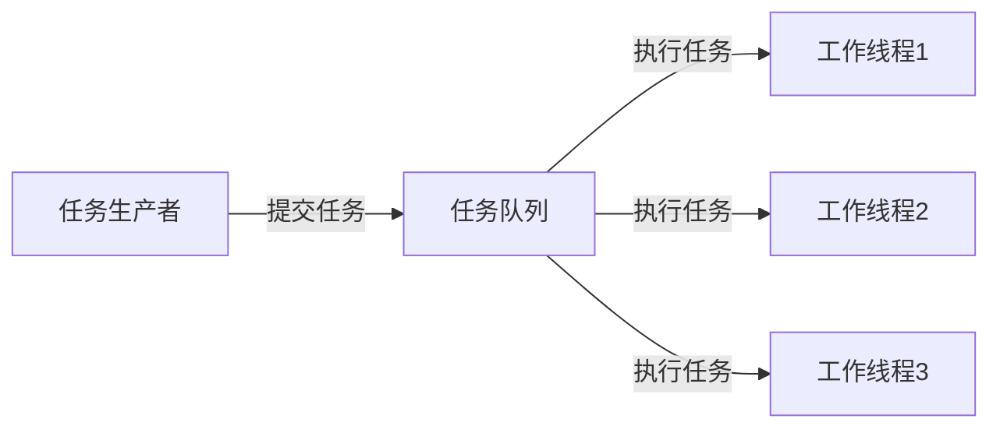

# Java 线程通信

在多线程编程中，线程之间需要相互配合工作以完成特定任务。Java提供了多种线程通信机制，使得线程能够安全且有效地交换数据和协调执行顺序。本文将介绍Java中常用的线程通信方式及其应用场景。

## 为什么需要线程通信？

当多个线程并发执行时，它们可能需要:

1. 共享数据或传递信息
2. 协调执行顺序
3. 等待某些条件满足后继续执行
4. 通知其他线程某项任务已完成

没有适当的线程通信机制，多线程程序可能出现死锁、活锁或数据不一致等问题。

## 基于wait/notify的线程通信

Java的`Object`类提供了`wait()`、`notify()`和`notifyAll()`方法，这是最基本的线程通信机制。

### wait/notify方法详解

- `wait()`: 使当前线程进入等待状态，同时释放对象锁
- `notify()`: 唤醒在该对象上等待的单个线程
- `notifyAll()`: 唤醒在该对象上等待的所有线程

:::caution
这些方法必须在同步(synchronized)代码块中调用，且必须是对被同步对象的调用。
:::

### 经典生产者-消费者示例

```java
public class ProducerConsumerExample {
    private final Object lock = new Object();
    private final int capacity = 10;
    private final Queue<Integer> queue = new LinkedList<>();
    
    public void produce() throws InterruptedException {
        int value = 0;
        while (true) {
            synchronized (lock) {
                while (queue.size() == capacity) {
                    // 队列已满，等待消费者消费
                    System.out.println("队列已满，生产者等待...");
                    lock.wait();
                }
                
                System.out.println("生产: " + value);
                queue.add(value++);
                
                // 通知消费者可以消费了
                lock.notifyAll();
                
                Thread.sleep(1000); // 为了演示效果
            }
        }
    }
    
    public void consume() throws InterruptedException {
        while (true) {
            synchronized (lock) {
                while (queue.isEmpty()) {
                    // 队列为空，等待生产者生产
                    System.out.println("队列为空，消费者等待...");
                    lock.wait();
                }
                
                int value = queue.poll();
                System.out.println("消费: " + value);
                
                // 通知生产者可以生产了
                lock.notifyAll();
                
                Thread.sleep(1500); // 为了演示效果
            }
        }
    }
    
    public static void main(String[] args) {
        ProducerConsumerExample example = new ProducerConsumerExample();
        
        Thread producerThread = new Thread(() -> {
            try {
                example.produce();
            } catch (InterruptedException e) {
                e.printStackTrace();
            }
        });
        
        Thread consumerThread = new Thread(() -> {
            try {
                example.consume();
            } catch (InterruptedException e) {
                e.printStackTrace();
            }
        });
        
        producerThread.start();
        consumerThread.start();
    }
}
```

**输出示例**:
```
生产: 0
消费: 0
生产: 1
消费: 1
生产: 2
消费: 2
...
```

## 使用阻塞队列进行线程通信

Java提供了各种阻塞队列实现，如`ArrayBlockingQueue`、`LinkedBlockingQueue`等，它们内部已经实现了线程同步和通信机制。

### 阻塞队列特点

- `put()`: 向队列中添加元素，如果队列已满则阻塞
- `take()`: 从队列中获取元素，如果队列为空则阻塞
- 无需手动编写同步代码，简化了生产者-消费者模式的实现

### 使用阻塞队列的生产者-消费者实现

```java
import java.util.concurrent.ArrayBlockingQueue;
import java.util.concurrent.BlockingQueue;

public class BlockingQueueExample {
    public static void main(String[] args) {
        // 创建容量为5的阻塞队列
        BlockingQueue<Integer> queue = new ArrayBlockingQueue<>(5);
        
        // 生产者线程
        Thread producer = new Thread(() -> {
            try {
                for (int i = 0; i < 10; i++) {
                    System.out.println("生产: " + i);
                    queue.put(i); // 如果队列已满，会阻塞
                    Thread.sleep(1000);
                }
            } catch (InterruptedException e) {
                e.printStackTrace();
            }
        });
        
        // 消费者线程
        Thread consumer = new Thread(() -> {
            try {
                for (int i = 0; i < 10; i++) {
                    int value = queue.take(); // 如果队列为空，会阻塞
                    System.out.println("消费: " + value);
                    Thread.sleep(2000);
                }
            } catch (InterruptedException e) {
                e.printStackTrace();
            }
        });
        
        producer.start();
        consumer.start();
    }
}
```

**输出示例**:
```
生产: 0
消费: 0
生产: 1
生产: 2
消费: 1
生产: 3
生产: 4
消费: 2
生产: 5
...
```

:::tip
阻塞队列是实现生产者-消费者模式最简单有效的方式，不需要手动处理线程同步问题。
:::

## 使用Condition实现线程通信

`Condition`是与`Lock`配合使用的线程通信机制，提供了比`wait/notify`更灵活的线程协调能力。

### Condition的主要方法

- `await()`: 使当前线程等待，直到收到信号或被中断
- `signal()`: 唤醒一个等待的线程
- `signalAll()`: 唤醒所有等待的线程

### 使用Condition的示例

```java
import java.util.LinkedList;
import java.util.Queue;
import java.util.concurrent.locks.Condition;
import java.util.concurrent.locks.Lock;
import java.util.concurrent.locks.ReentrantLock;

public class ConditionExample {
    private final Lock lock = new ReentrantLock();
    private final Condition notFull = lock.newCondition();  
    private final Condition notEmpty = lock.newCondition();
    
    private final Queue<Integer> queue = new LinkedList<>();
    private final int capacity = 5;
    
    public void produce() throws InterruptedException {
        int value = 0;
        while (true) {
            lock.lock();
            try {
                while (queue.size() == capacity) {
                    System.out.println("队列已满，生产者等待...");
                    notFull.await(); // 等待队列不满
                }
                
                queue.add(value);
                System.out.println("生产: " + value++);
                
                // 通知消费者队列不为空
                notEmpty.signal();
                
                Thread.sleep(1000); // 为了演示效果
            } finally {
                lock.unlock();
            }
        }
    }
    
    public void consume() throws InterruptedException {
        while (true) {
            lock.lock();
            try {
                while (queue.isEmpty()) {
                    System.out.println("队列为空，消费者等待...");
                    notEmpty.await(); // 等待队列不为空
                }
                
                int value = queue.poll();
                System.out.println("消费: " + value);
                
                // 通知生产者队列不满
                notFull.signal();
                
                Thread.sleep(2000); // 为了演示效果
            } finally {
                lock.unlock();
            }
        }
    }
    
    public static void main(String[] args) {
        ConditionExample example = new ConditionExample();
        
        new Thread(() -> {
            try {
                example.produce();
            } catch (InterruptedException e) {
                e.printStackTrace();
            }
        }).start();
        
        new Thread(() -> {
            try {
                example.consume();
            } catch (InterruptedException e) {
                e.printStackTrace();
            }
        }).start();
    }
}
```

:::note
与wait/notify相比，Condition允许更精确的线程唤醒控制。在上面的示例中，我们使用了两个条件变量，分别用于队列不满和队列不空的情况。
:::

## 使用管道进行线程通信

Java IO提供了管道输入/输出流(`PipedInputStream`/`PipedOutputStream`)，专门用于线程之间的数据传输。

```java
import java.io.*;

public class PipeExample {
    public static void main(String[] args) throws Exception {
        final PipedOutputStream output = new PipedOutputStream();
        final PipedInputStream input = new PipedInputStream(output);
        
        Thread writerThread = new Thread(() -> {
            try {
                System.out.println("写入数据: Hello from another thread!");
                output.write("Hello from another thread!".getBytes());
                output.close();
            } catch (IOException e) {
                e.printStackTrace();
            }
        });
        
        Thread readerThread = new Thread(() -> {
            try {
                byte[] buffer = new byte[100];
                int bytesRead = input.read(buffer);
                System.out.println("读取数据: " + new String(buffer, 0, bytesRead));
                input.close();
            } catch (IOException e) {
                e.printStackTrace();
            }
        });
        
        writerThread.start();
        readerThread.start();
    }
}
```

**输出**:
```
写入数据: Hello from another thread!
读取数据: Hello from another thread!
```

## 线程通信的实际应用场景

### 1. 任务调度系统



任务调度系统中，生产者线程负责生成任务并放入队列，多个消费者线程(工作线程)从队列中获取任务并执行。

### 2. 数据处理管道


在数据处理流水线中，多个线程分工协作，每个线程负责一部分工作，通过队列传递数据。

### 3. 资源池管理

在连接池、线程池等资源池实现中，需要线程通信来协调资源的获取和释放。

```java
// 简化的连接池示例
public class SimpleConnectionPool {
    private final BlockingQueue<Connection> pool;
    
    public SimpleConnectionPool(int size) {
        pool = new ArrayBlockingQueue<>(size);
        // 初始化连接
        for (int i = 0; i < size; i++) {
            pool.add(createConnection());
        }
    }
    
    public Connection getConnection() throws InterruptedException {
        // 如果没有可用连接，会阻塞等待
        return pool.take();
    }
    
    public void releaseConnection(Connection conn) throws InterruptedException {
        // 归还连接到池中
        pool.put(conn);
    }
    
    private Connection createConnection() {
        // 创建数据库连接的代码
        return new Connection() { /* 实现细节省略 */ };
    }
    
    // 简化的Connection接口
    interface Connection {
        // 连接方法...
    }
}
```

## 线程通信的最佳实践

1. **尽量使用高级API**：优先使用`BlockingQueue`、`CountDownLatch`、`CyclicBarrier`、`Semaphore`等并发工具类，而非直接使用底层的`wait`/`notify`。

2. **避免过度通信**：线程间通信会带来额外开销，设计时应减少不必要的通信。

3. **防止死锁**：确保线程通信不会导致死锁，如避免嵌套锁、使用锁超时等技术。

4. **考虑性能影响**：选择合适的通信机制，平衡灵活性和性能开销。

5. **注意通知丢失问题**：使用`while`循环检查条件，而非`if`语句，以防止虚假唤醒。

```java
// 推荐做法
synchronized (obj) {
    while (!condition) {  // 使用while循环检查条件
        obj.wait();
    }
    // 执行操作
}

// 不推荐做法
synchronized (obj) {
    if (!condition) {  // 使用if可能导致虚假唤醒问题
        obj.wait();
    }
    // 执行操作
}
```

## 总结

本文介绍了Java中主要的线程通信机制：

1. 基于`wait/notify`的线程通信
2. 使用阻塞队列进行线程通信
3. 使用`Condition`实现线程通信
4. 使用管道进行线程通信

每种机制都有其适用场景，选择合适的通信方式对于开发高效稳定的多线程应用至关重要。线程通信是Java多线程编程的核心部分，掌握这些技术可以帮助开发者构建更加复杂和高效的多线程应用。

## 练习

1. 实现一个多线程计数器，使用`wait/notify`机制实现线程交替计数。

2. 使用`BlockingQueue`实现一个简单的线程池，能够接受任务并分配给工作线程执行。

3. 设计一个使用`Condition`的缓冲区类，支持多个生产者和多个消费者，并能够处理缓冲区满/空的情况。

4. 模拟多线程下载场景：一个主线程分配下载任务，多个工作线程执行下载，完成后通知主线程，使用适当的线程通信机制。

## 扩展阅读

- Java并发编程中的更多线程协作工具：`CountDownLatch`、`CyclicBarrier`和`Semaphore`
- Java内存模型与线程通信的关系
- `CompletableFuture`在异步编程中的应用
- 分布式系统中的线程通信与协作