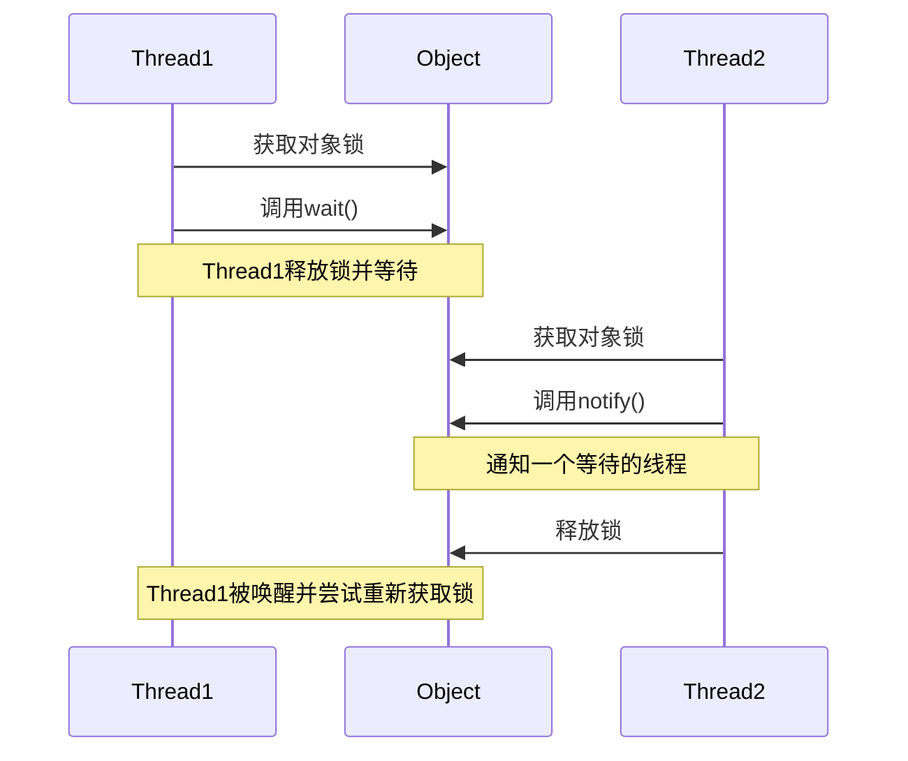

# Java notify方法

## 简介

在多线程编程中，线程之间的协作和同步是非常关键的。Java提供了一组监视器方法，允许线程之间进行通信和协调。其中，`notify()`方法是一种基本但强大的机制，用于唤醒正在等待特定对象监视器的单个线程。

在本教程中，我们将深入探讨`notify()`方法的功能、使用方式以及相关的最佳实践。

## notify()方法基础

### 方法定义

`notify()`是`java.lang.Object`类的一个方法，这意味着Java中的所有对象都可以调用它。其语法非常简单：

```java
public final void notify()
```

### 功能说明

当一个线程调用某个对象的`notify()`方法时，JVM会从在该对象上等待的线程中随机选择一个，并将其唤醒。被唤醒的线程将从`wait()`方法返回，并尝试重新获取对象的锁。

:::caution
`notify()`方法只能在同步上下文中调用，即必须在已获得对象锁的情况下调用，否则会抛出`IllegalMonitorStateException`异常。
:::

## wait()与notify()的关系

要理解`notify()`，我们必须先了解`wait()`方法：

- `wait()`：使当前线程进入等待状态，直到其他线程调用该对象的`notify()`或`notifyAll()`方法
- `notify()`：唤醒在此对象监视器上等待的单个线程

这两个方法共同构成了Java中基于对象监视器的线程通信机制。



## 基本使用示例

下面是一个简单的生产者-消费者模式示例，展示如何使用`notify()`和`wait()`方法：

```java
public class ProducerConsumerExample {
    private static final Object lock = new Object();
    private static int data = -1;
    private static boolean hasData = false;
    
    public static void main(String[] args) {
        Thread producer = new Thread(() -> {
            for (int i = 0; i < 5; i++) {
                synchronized (lock) {
                    // 如果消费者还没有取走数据，则等待
                    while (hasData) {
                        try {
                            lock.wait();
                        } catch (InterruptedException e) {
                            Thread.currentThread().interrupt();
                        }
                    }
                    
                    // 生产数据
                    data = i;
                    hasData = true;
                    System.out.println("生产者生产了数据: " + data);
                    
                    // 通知消费者可以消费数据了
                    lock.notify();
                }
                
                // 稍微暂停一下，便于观察
                try {
                    Thread.sleep(100);
                } catch (InterruptedException e) {
                    Thread.currentThread().interrupt();
                }
            }
        });
        
        Thread consumer = new Thread(() -> {
            for (int i = 0; i < 5; i++) {
                synchronized (lock) {
                    // 如果生产者还没有生产数据，则等待
                    while (!hasData) {
                        try {
                            lock.wait();
                        } catch (InterruptedException e) {
                            Thread.currentThread().interrupt();
                        }
                    }
                    
                    // 消费数据
                    System.out.println("消费者消费了数据: " + data);
                    hasData = false;
                    
                    // 通知生产者可以生产数据了
                    lock.notify();
                }
                
                // 稍微暂停一下，便于观察
                try {
                    Thread.sleep(100);
                } catch (InterruptedException e) {
                    Thread.currentThread().interrupt();
                }
            }
        });
        
        consumer.start();
        producer.start();
    }
}
```

输出结果：
```
生产者生产了数据: 0
消费者消费了数据: 0
生产者生产了数据: 1
消费者消费了数据: 1
生产者生产了数据: 2
消费者消费了数据: 2
生产者生产了数据: 3
消费者消费了数据: 3
生产者生产了数据: 4
消费者消费了数据: 4
```

## notify()方法的重要注意事项

### 1. 必须在同步块中调用

```java
Object obj = new Object();

// 错误用法 - 会抛出IllegalMonitorStateException
obj.notify();

// 正确用法
synchronized (obj) {
    obj.notify();
}
```

### 2. 只唤醒一个线程

如果多个线程都在等待同一个对象的锁，`notify()`只会随机唤醒其中一个，而不是全部。如果需要唤醒所有等待的线程，应使用`notifyAll()`方法。

### 3. 被唤醒的线程需要重新获取锁

即使线程被唤醒，也必须等待调用`notify()`的线程释放锁后才能继续执行。

### 4. 虚假唤醒问题

在多线程环境中可能会出现"虚假唤醒"现象，即线程在没有被明确通知的情况下从`wait()`状态返回。因此，推荐始终在循环中使用`wait()`：

```java
synchronized (obj) {
    while (condition) {  // 不是if，而是while循环检查条件
        obj.wait();
    }
    // 处理共享资源
}
```

## notify()与notifyAll()的区别

| 特性 | notify() | notifyAll() |
|------|---------|------------|
| 唤醒线程数量 | 随机唤醒一个等待线程 | 唤醒所有等待线程 |
| 资源消耗 | 较低 | 较高 |
| 适用场景 | 一对一通信，每个等待线程都能处理任务 | 一对多通信，或需要避免线程饥饿 |

:::tip
当不确定应该使用哪个方法时，优先选择`notifyAll()`，它更安全，可以避免潜在的死锁问题。
:::

## 实际应用场景

### 场景1：自定义消息队列

```java
public class SimpleMessageQueue {
    private final LinkedList<String> queue = new LinkedList<>();
    private final int capacity;
    
    public SimpleMessageQueue(int capacity) {
        this.capacity = capacity;
    }
    
    public void put(String message) throws InterruptedException {
        synchronized (queue) {
            while (queue.size() == capacity) {
                queue.wait();
            }
            queue.add(message);
            System.out.println("添加消息: " + message);
            
            // 唤醒可能等待获取消息的线程
            queue.notify();
        }
    }
    
    public String take() throws InterruptedException {
        synchronized (queue) {
            while (queue.isEmpty()) {
                queue.wait();
            }
            String message = queue.removeFirst();
            System.out.println("获取消息: " + message);
            
            // 唤醒可能等待添加消息的线程
            queue.notify();
            
            return message;
        }
    }
}

// 使用示例
public class MessageQueueDemo {
    public static void main(String[] args) {
        SimpleMessageQueue queue = new SimpleMessageQueue(5);
        
        Thread producer = new Thread(() -> {
            try {
                for (int i = 0; i < 10; i++) {
                    queue.put("Message-" + i);
                    Thread.sleep(100);
                }
            } catch (InterruptedException e) {
                Thread.currentThread().interrupt();
            }
        });
        
        Thread consumer = new Thread(() -> {
            try {
                for (int i = 0; i < 10; i++) {
                    String message = queue.take();
                    Thread.sleep(200);
                }
            } catch (InterruptedException e) {
                Thread.currentThread().interrupt();
            }
        });
        
        producer.start();
        consumer.start();
    }
}
```

### 场景2：资源池实现

```java
public class SimpleResourcePool<T> {
    private final List<T> resources;
    private final List<T> usedResources;
    
    public SimpleResourcePool(List<T> resources) {
        this.resources = new ArrayList<>(resources);
        this.usedResources = new ArrayList<>();
    }
    
    public T getResource() throws InterruptedException {
        synchronized (this) {
            while (resources.isEmpty()) {
                System.out.println(Thread.currentThread().getName() + " 等待资源...");
                wait();
            }
            
            T resource = resources.remove(0);
            usedResources.add(resource);
            System.out.println(Thread.currentThread().getName() + " 获取到资源: " + resource);
            
            return resource;
        }
    }
    
    public void releaseResource(T resource) {
        synchronized (this) {
            usedResources.remove(resource);
            resources.add(resource);
            System.out.println(Thread.currentThread().getName() + " 释放资源: " + resource);
            
            // 通知一个等待线程可以获取资源了
            notify();
        }
    }
}
```

## 常见问题与解决方案

### 1. 死锁问题

如果一个线程在等待另一个线程的通知，而那个线程永远不会发出通知，就会发生死锁。

**解决方案**：
- 设定等待超时：使用`wait(timeout)`而不是无限期的`wait()`
- 在适当的场景使用`notifyAll()`代替`notify()`

### 2. 信号丢失问题

如果`notify()`在`wait()`之前被调用，那么等待的线程可能永远不会被唤醒。

**解决方案**：
- 使用标志变量跟踪状态变化
- 在适当的场景使用`notifyAll()`

### 3. 虚假唤醒处理

**解决方案**：
- 总是在循环中检查等待条件
```java
synchronized (obj) {
    while (condition) {
        obj.wait();
    }
    // 处理逻辑
}
```

## 总结

`notify()`方法是Java多线程编程中用于线程通信的基本工具。它允许一个线程通知另一个等待的线程继续执行，是实现线程协作的关键机制。

重要要点：
- `notify()`必须在同步块内调用
- 它只唤醒一个等待线程，选择是随机的
- 线程被唤醒后，需要重新获取对象锁
- 对于复杂场景，考虑使用`notifyAll()`可能更安全
- 始终在循环中使用`wait()`以防虚假唤醒

虽然Java在Java 5之后引入了更高级的并发工具（如`Lock`接口和`Condition`），但理解`wait()`/`notify()`机制仍然是掌握Java并发编程的基础。

## 练习题

1. 编写一个使用`wait()`和`notify()`实现的简单计数器程序，一个线程每秒增加计数，另一个线程在计数到达特定值时输出提示并重置计数器。

2. 修改上面的生产者-消费者示例，使其支持多个生产者和多个消费者。思考应该使用`notify()`还是`notifyAll()`，为什么？

3. 实现一个简单的线程安全的有界缓冲区，使用`wait()`和`notify()`机制确保在缓冲区满时生产者等待，在缓冲区空时消费者等待。

## 进一步学习资源

- Java官方文档：[Object.notify()](https://docs.oracle.com/javase/8/docs/api/java/lang/Object.html#notify--)
- 学习Java中更现代的并发工具，如`BlockingQueue`、`CountDownLatch`和`Semaphore`
- 深入研究Java内存模型，理解线程通信的底层机制

通过掌握`wait()`、`notify()`和`notifyAll()`方法，你已经迈出了成为Java并发编程专家的重要一步！