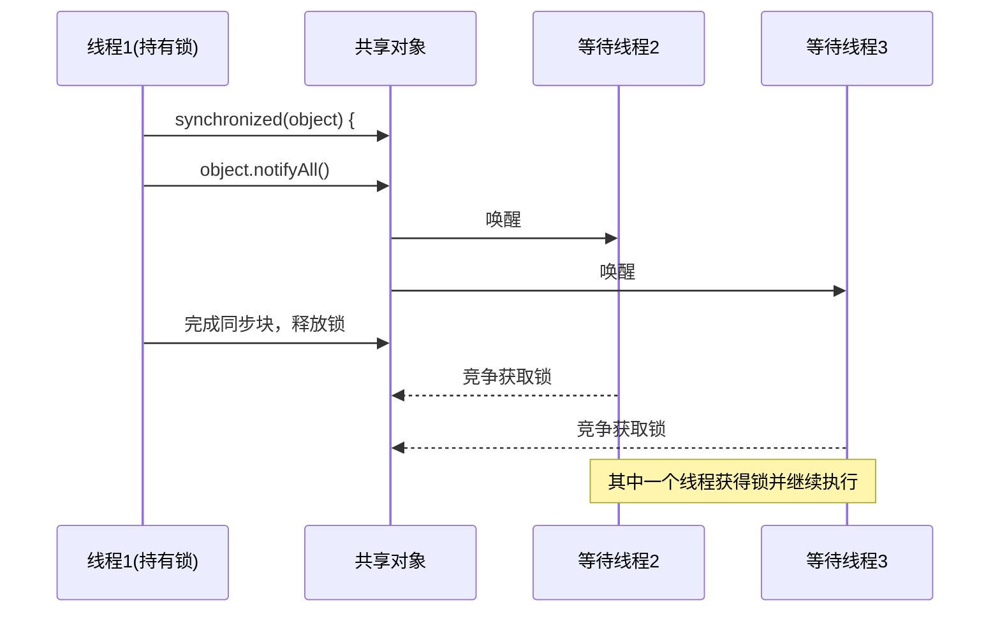

# Java notifyAll方法

## 概述

在Java多线程编程中，线程间的协作和通信至关重要。`notifyAll()`是Object类中定义的一个方法，用于唤醒在特定对象监视器上等待的所有线程。这个方法是实现线程间协调和同步的重要工具，特别是在生产者-消费者模式等多线程应用场景中。

:::note
`notifyAll()`方法必须在同步(synchronized)代码块或方法中调用，调用者必须持有被调用对象的监视器锁。
:::

## notifyAll方法的基本语法

```java
public final void notifyAll()
```

这个方法不接受任何参数，也不返回任何值。

## wait-notify机制简介

在讲解`notifyAll()`之前，我们需要先了解Java中的wait-notify机制：

1. **wait()方法**：让当前线程释放对象锁并进入等待状态
2. **notify()方法**：唤醒一个正在等待该对象监视器的线程
3. **notifyAll()方法**：唤醒所有正在等待该对象监视器的线程

这三个方法都是Object类的final方法，每个Java对象都可以作为线程间通信的工具。

## notifyAll与notify的区别

理解`notifyAll()`和`notify()`的区别非常重要：

| 特性 | notify() | notifyAll() |
|------|----------|-------------|
| 唤醒线程数量 | 随机唤醒一个等待线程 | 唤醒所有等待线程 |
| 资源竞争 | 被唤醒的线程会尝试重新获取对象锁 | 所有被唤醒的线程会竞争对象锁 |
| 适用场景 | 当确切知道只需要唤醒一个线程时 | 当有多个线程可能都需要被唤醒时 |
| 可能的问题 | 可能导致线程饥饿 | 性能开销较大 |

:::caution
使用`notify()`时，如果唤醒了"错误的"线程（即不满足继续执行条件的线程），可能导致程序死锁。
:::

## notifyAll的工作原理

下面用一个流程图来说明`notifyAll()`方法的工作原理：



## notifyAll方法的代码示例

### 基本用法示例

```java
public class NotifyAllExample {
    private final Object lock = new Object();
    private boolean dataReady = false;
    
    public void prepareData() {
        synchronized (lock) {
            System.out.println("准备数据...");
            dataReady = true;
            // 数据准备好后，通知所有等待的线程
            lock.notifyAll();
            System.out.println("已通知所有等待线程");
        }
    }
    
    public void processData(String threadName) {
        synchronized (lock) {
            System.out.println(threadName + " 获取到锁");
            while (!dataReady) {
                try {
                    System.out.println(threadName + " 等待数据...");
                    lock.wait(); // 释放锁并等待
                    System.out.println(threadName + " 被唤醒");
                } catch (InterruptedException e) {
                    Thread.currentThread().interrupt();
                }
            }
            // 处理数据
            System.out.println(threadName + " 正在处理数据");
        }
    }
    
    public static void main(String[] args) throws InterruptedException {
        NotifyAllExample example = new NotifyAllExample();
        
        // 创建三个消费者线程
        Thread consumer1 = new Thread(() -> example.processData("消费者1"));
        Thread consumer2 = new Thread(() -> example.processData("消费者2"));
        Thread consumer3 = new Thread(() -> example.processData("消费者3"));
        
        // 启动消费者线程
        consumer1.start();
        consumer2.start();
        consumer3.start();
        
        // 等待一会儿，确保消费者线程已经进入等待状态
        Thread.sleep(1000);
        
        // 生产者准备数据并通知
        example.prepareData();
    }
}
```

**输出结果类似于：**
```
消费者1 获取到锁
消费者1 等待数据...
消费者2 获取到锁
消费者2 等待数据...
消费者3 获取到锁
消费者3 等待数据...
准备数据...
已通知所有等待线程
消费者1 被唤醒
消费者1 正在处理数据
消费者3 被唤醒
消费者3 正在处理数据
消费者2 被唤醒
消费者2 正在处理数据
```

注意：输出的具体顺序可能会因系统调度而有所不同。

## 实际应用场景

### 1. 生产者-消费者模式

下面是一个使用`notifyAll()`实现的简单生产者-消费者模式：

```java
public class ProducerConsumerExample {
    private final Queue<Integer> buffer = new LinkedList<>();
    private final int BUFFER_SIZE = 5;
    private final Object lock = new Object();
    
    public void produce() throws InterruptedException {
        int value = 0;
        while (true) {
            synchronized (lock) {
                while (buffer.size() == BUFFER_SIZE) {
                    System.out.println("缓冲区已满，生产者等待...");
                    lock.wait();
                }
                
                value++;
                buffer.add(value);
                System.out.println("生产: " + value + "，缓冲区大小: " + buffer.size());
                
                // 通知所有等待的消费者
                lock.notifyAll();
            }
            
            Thread.sleep(new Random().nextInt(1000));
        }
    }
    
    public void consume() throws InterruptedException {
        while (true) {
            synchronized (lock) {
                while (buffer.isEmpty()) {
                    System.out.println("缓冲区为空，消费者等待...");
                    lock.wait();
                }
                
                int value = buffer.poll();
                System.out.println("消费: " + value + "，缓冲区大小: " + buffer.size());
                
                // 通知所有等待的生产者
                lock.notifyAll();
            }
            
            Thread.sleep(new Random().nextInt(1000));
        }
    }
    
    public static void main(String[] args) {
        ProducerConsumerExample example = new ProducerConsumerExample();
        
        new Thread(() -> {
            try {
                example.produce();
            } catch (InterruptedException e) {
                Thread.currentThread().interrupt();
            }
        }).start();
        
        new Thread(() -> {
            try {
                example.consume();
            } catch (InterruptedException e) {
                Thread.currentThread().interrupt();
            }
        }).start();
    }
}
```

### 2. 资源池实现

下面是一个简单的连接池实现，使用`notifyAll()`来管理连接资源：

```java
public class ConnectionPool {
    private final LinkedList<Connection> pool = new LinkedList<>();
    
    public ConnectionPool(int initialSize) {
        // 初始化连接池
        for (int i = 0; i < initialSize; i++) {
            pool.addLast(createConnection());
        }
    }
    
    private Connection createConnection() {
        // 模拟创建数据库连接
        return new Connection() {
            // 实现Connection接口...
            @Override
            public String toString() {
                return "Connection-" + System.identityHashCode(this);
            }
        };
    }
    
    public Connection getConnection(long timeout) throws InterruptedException {
        synchronized (pool) {
            // 支持超时获取
            if (timeout <= 0) {
                while (pool.isEmpty()) {
                    pool.wait();
                }
                return pool.removeFirst();
            } else {
                long future = System.currentTimeMillis() + timeout;
                long remaining = timeout;
                
                while (pool.isEmpty() && remaining > 0) {
                    pool.wait(remaining);
                    remaining = future - System.currentTimeMillis();
                }
                
                Connection result = null;
                if (!pool.isEmpty()) {
                    result = pool.removeFirst();
                }
                return result;
            }
        }
    }
    
    public void releaseConnection(Connection connection) {
        if (connection != null) {
            synchronized (pool) {
                pool.addLast(connection);
                // 通知所有等待的线程有新连接可用
                pool.notifyAll();
            }
        }
    }
}
```

## 使用notifyAll时的最佳实践

1. **总是在同步块中调用**：`notifyAll()`必须在synchronized块或方法中调用，否则会抛出IllegalMonitorStateException。

2. **使用while循环检查等待条件**：
   ```java
   synchronized (obj) {
       while (!condition) {
           obj.wait();
       }
       // 继续执行
   }
   ```

3. **在修改共享状态后调用notifyAll**：确保在更新可能影响等待条件的共享状态后调用`notifyAll()`。

4. **考虑使用更高级的并发工具**：在许多场景下，可以考虑使用`java.util.concurrent`包中的类，如`BlockingQueue`、`CountDownLatch`、`Semaphore`等，它们提供了更高级和更易用的同步机制。

:::tip
当不确定应该唤醒哪个线程或有多个线程可能都需要被唤醒时，使用`notifyAll()`比`notify()`更安全。
:::

## 可能的陷阱和注意事项

1. **性能问题**：`notifyAll()`会唤醒所有等待的线程，这可能导致不必要的上下文切换和锁竞争。

2. **虚假唤醒**：线程可能在没有被通知的情况下被唤醒，这就是为什么我们需要在循环中检查条件。

3. **死锁风险**：如果代码设计不当，使用wait-notify机制可能导致死锁。

4. **忘记释放锁**：如果在持有锁的情况下出现异常，确保在finally块中释放锁。

## 总结

`notifyAll()`方法是Java多线程编程中非常重要的工具，用于唤醒在对象监视器上等待的所有线程。它与`wait()`和`notify()`方法一起，构成了Java基本的线程协作机制。

主要要点：
- `notifyAll()`唤醒所有等待特定对象监视器的线程
- 必须在同步块或方法中调用
- 使用`while`循环检查等待条件，防止虚假唤醒
- 在许多情况下，`notifyAll()`比`notify()`更安全
- 对于更复杂的场景，考虑使用`java.util.concurrent`包中的高级并发工具

通过正确使用`notifyAll()`方法，可以实现更复杂的多线程协作模式，如生产者-消费者模式、读写锁等。

## 练习题

1. 编写一个程序，使用`wait()`和`notifyAll()`实现一个简单的计数器，多个线程等待计数器达到特定值后继续执行。

2. 修改生产者-消费者示例，添加多个生产者和消费者，并分析程序的行为。

3. 比较使用传统的`wait`/`notify`机制和使用`java.util.concurrent.BlockingQueue`实现生产者-消费者模式的差异。

## 延伸阅读

- [Java官方文档 - Object.notifyAll()](https://docs.oracle.com/javase/8/docs/api/java/lang/Object.html#notifyAll--)
- 《Java并发编程实战》(Java Concurrency in Practice) - Brian Goetz等
- 《Effective Java》- Joshua Bloch

通过掌握`notifyAll()`方法，你将能更好地理解和实现Java中的多线程协作机制，为构建高效、可靠的并发应用打下坚实的基础。