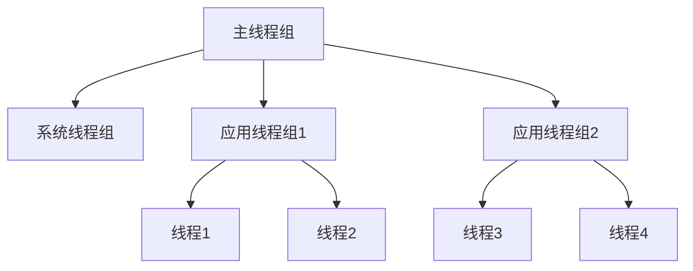

# Java 线程组

在多线程编程中，线程组（ThreadGroup）是Java提供的一种将多个线程组织在一起的机制。它允许我们以组为单位对线程进行管理，类似于文件系统中的目录结构，方便对线程进行分类和批量操作。

## 什么是线程组？

线程组代表一组线程的集合。Java允许我们创建多级线程组，形成树形结构。这种分层管理使我们能够更有效地组织和控制线程。



## 线程组的特点

- 每个线程必定属于一个线程组
- 线程组可以包含其他线程组，形成层次结构
- 子线程默认继承父线程的线程组
- 一旦线程被加入某个线程组，就无法更换到其他线程组
- 线程组提供批量管理线程的方法，如统一中断、检查状态等

## 创建和使用线程组

### 创建线程组

```java
// 创建一个新的线程组
ThreadGroup group1 = new ThreadGroup("Group1");

// 创建一个新的线程组，并指定父线程组
ThreadGroup parentGroup = new ThreadGroup("ParentGroup");
ThreadGroup childGroup = new ThreadGroup(parentGroup, "ChildGroup");
```

### 将线程加入线程组

```java
// 方法1：创建线程时指定线程组
ThreadGroup downloadGroup = new ThreadGroup("Download Group");
Thread downloadThread = new Thread(downloadGroup, () -> {
    System.out.println("Downloading files...");
    try {
        Thread.sleep(2000);
    } catch (InterruptedException e) {
        System.out.println("Download interrupted");
    }
    System.out.println("Download complete");
}, "DownloadThread");

// 方法2：使用Thread的构造函数
Thread uploadThread = new Thread(downloadGroup, new Runnable() {
    @Override
    public void run() {
        System.out.println("Uploading files...");
    }
}, "UploadThread");
```

### 启动线程组中的线程

```java
downloadThread.start();
uploadThread.start();
```

## 线程组的主要方法

### 获取线程组信息

```java
// 获取当前线程的线程组
ThreadGroup currentGroup = Thread.currentThread().getThreadGroup();
System.out.println("Current thread group: " + currentGroup.getName());

// 获取线程组中活动线程数量
int activeCount = currentGroup.activeCount();
System.out.println("Active threads: " + activeCount);

// 获取线程组中活动线程组数量
int activeGroupCount = currentGroup.activeGroupCount();
System.out.println("Active thread groups: " + activeGroupCount);

// 获取父线程组
ThreadGroup parentGroup = currentGroup.getParent();
if (parentGroup != null) {
    System.out.println("Parent group: " + parentGroup.getName());
}
```

### 枚举线程和线程组

```java
// 枚举线程组中的所有线程
ThreadGroup group = new ThreadGroup("TestGroup");
Thread t1 = new Thread(group, () -> {
    try {
        Thread.sleep(5000);
    } catch (InterruptedException e) {
        e.printStackTrace();
    }
}, "Thread1");
Thread t2 = new Thread(group, () -> {
    try {
        Thread.sleep(5000);
    } catch (InterruptedException e) {
        e.printStackTrace();
    }
}, "Thread2");

t1.start();
t2.start();

// 获取线程组中的线程
Thread[] threads = new Thread[group.activeCount()];
group.enumerate(threads);
System.out.println("线程组中的线程：");
for (Thread t : threads) {
    if (t != null) {
        System.out.println(t.getName());
    }
}

// 输出：
// 线程组中的线程：
// Thread1
// Thread2
```

### 批量操作线程

```java
ThreadGroup downloadGroup = new ThreadGroup("DownloadGroup");

// 创建5个下载线程
for (int i = 0; i < 5; i++) {
    new Thread(downloadGroup, () -> {
        try {
            System.out.println(Thread.currentThread().getName() + " started");
            Thread.sleep(3000);
            System.out.println(Thread.currentThread().getName() + " finished");
        } catch (InterruptedException e) {
            System.out.println(Thread.currentThread().getName() + " interrupted");
        }
    }, "DownloadThread-" + i).start();
}

// 等待1秒，让线程开始运行
Thread.sleep(1000);

// 中断线程组中的所有线程
System.out.println("Interrupting all threads in group");
downloadGroup.interrupt();
```

输出示例：
```
DownloadThread-0 started
DownloadThread-1 started
DownloadThread-2 started
DownloadThread-3 started
DownloadThread-4 started
Interrupting all threads in group
DownloadThread-0 interrupted
DownloadThread-1 interrupted
DownloadThread-2 interrupted
DownloadThread-3 interrupted
DownloadThread-4 interrupted
```

## 线程组的安全设置

线程组还具有安全管理功能，可以限制线程的某些操作：

```java
// 创建一个受限的线程组
ThreadGroup restrictedGroup = new ThreadGroup("Restricted") {
    @Override
    public void uncaughtException(Thread t, Throwable e) {
        System.out.println("Thread " + t.getName() + " threw exception: " + e);
        super.uncaughtException(t, e);
    }
};

// 设置最高优先级
restrictedGroup.setMaxPriority(Thread.MIN_PRIORITY);

// 创建一个线程，它会抛出异常
Thread exceptionThread = new Thread(restrictedGroup, () -> {
    System.out.println("Thread priority: " + Thread.currentThread().getPriority());
    throw new RuntimeException("Deliberate exception");
}, "ExceptionThread");

exceptionThread.start();
```

输出示例：
```
Thread priority: 1
Thread ExceptionThread threw exception: java.lang.RuntimeException: Deliberate exception
```

## 线程组的实际应用场景

### 场景1：监控应用中的不同功能模块

在一个复杂的Web应用程序中，我们可以按照功能模块划分线程组，比如用户请求处理、数据库操作、文件处理等。

```java
public class WebApplicationThreads {
    public static void main(String[] args) {
        // 创建不同功能的线程组
        ThreadGroup userRequestsGroup = new ThreadGroup("User Requests");
        ThreadGroup databaseOperationsGroup = new ThreadGroup("Database Operations");
        ThreadGroup fileProcessingGroup = new ThreadGroup("File Processing");
        
        // 创建用户请求处理线程
        for (int i = 0; i < 3; i++) {
            new Thread(userRequestsGroup, () -> {
                while (true) {
                    try {
                        System.out.println("Processing user request...");
                        Thread.sleep(2000);
                    } catch (InterruptedException e) {
                        break;
                    }
                }
            }, "UserRequestThread-" + i).start();
        }
        
        // 创建数据库操作线程
        for (int i = 0; i < 2; i++) {
            new Thread(databaseOperationsGroup, () -> {
                while (true) {
                    try {
                        System.out.println("Executing database query...");
                        Thread.sleep(3000);
                    } catch (InterruptedException e) {
                        break;
                    }
                }
            }, "DatabaseThread-" + i).start();
        }
        
        // 监控线程组活动
        new Thread(() -> {
            while (true) {
                try {
                    System.out.println("--- Thread Groups Status ---");
                    System.out.println("User Requests: " + userRequestsGroup.activeCount() + " active threads");
                    System.out.println("Database Operations: " + databaseOperationsGroup.activeCount() + " active threads");
                    System.out.println("File Processing: " + fileProcessingGroup.activeCount() + " active threads");
                    Thread.sleep(5000);
                } catch (InterruptedException e) {
                    break;
                }
            }
        }, "MonitorThread").start();
    }
}
```

### 场景2：批量中断资源密集型任务

假设我们有一个应用程序执行大量计算或I/O密集型任务，在某些条件下需要快速取消这些任务：

```java
public class ResourceIntensiveTasks {
    public static void main(String[] args) throws InterruptedException {
        ThreadGroup computationGroup = new ThreadGroup("Computation Tasks");
        
        // 启动10个计算密集型线程
        for (int i = 0; i < 10; i++) {
            new Thread(computationGroup, () -> {
                try {
                    System.out.println(Thread.currentThread().getName() + " started computation");
                    // 模拟大量计算
                    long sum = 0;
                    while (!Thread.currentThread().isInterrupted()) {
                        sum += Math.random() * 10;
                        Thread.sleep(100);  // 检查中断点
                    }
                } catch (InterruptedException e) {
                    System.out.println(Thread.currentThread().getName() + " was interrupted");
                }
            }, "ComputationThread-" + i).start();
        }
        
        // 模拟系统监测到内存不足
        Thread.sleep(3000);
        System.out.println("System low on memory! Stopping all computation tasks...");
        
        // 一次性中断整个线程组
        computationGroup.interrupt();
        
        // 等待一段时间，确认所有线程已经停止
        Thread.sleep(1000);
        System.out.println("Active computation threads: " + computationGroup.activeCount());
    }
}
```

## 线程组的优缺点

### 优点
- 提供了一种组织和管理线程的结构化方式
- 支持批量操作线程（如中断、优先级设置）
- 可以方便地检查线程状态和异常处理

### 缺点
- 功能相对有限，不支持线程池等高级特性
- 在Java现代并发框架中的重要性有所降低
- 不能动态调整线程组成员

:::caution 注意事项
虽然线程组提供了一种管理线程的方式，但在现代Java开发中，通常推荐使用ExecutorService和线程池等更高级的并发工具来管理线程。线程组主要用于那些需要组织线程层次结构或批量操作线程的特定场景。
:::

## 总结

Java线程组是一个用于组织和管理线程的机制，它提供了以下核心功能：

1. 将线程组织成树形层次结构
2. 批量操作线程（如中断、优先级设置）
3. 获取线程组状态信息
4. 处理组内线程的未捕获异常

虽然在Java现代并发编程中，线程组的使用频率有所降低，但了解它的工作原理和使用方法仍有助于我们更全面地理解Java多线程体系。

## 练习

1. 创建一个两级线程组结构，父线程组包含两个子线程组，每个子线程组各包含2个线程。然后编写代码列出整个结构。

2. 编写一个程序，创建一个线程组并添加5个线程，每个线程执行不同的计数任务。然后实现一个功能，当用户输入"stop"时，中断整个线程组的所有线程。

3. 创建一个自定义线程组，重写uncaughtException方法，使其能够记录所有未捕获的异常，并尝试重新启动抛出异常的线程。

## 进一步学习资源

- Java官方文档中的[ThreadGroup类](https://docs.oracle.com/en/java/javase/11/docs/api/java.base/java/lang/ThreadGroup.html)
- 《Java并发编程实战》- Brian Goetz等著
- 《Java多线程编程核心技术》- 高洪岩著

了解线程组后，建议继续学习Java的ExecutorService框架和线程池，这些是现代Java并发编程中更常用的工具。